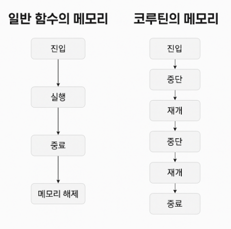

## 코루틴(Coroutine)
co-routine: 말 그대로, 협력하는 루틴 이라는 뜻이다.

## 👩🏻‍💻 루틴

우리는 일반적인 루틴을 이해하고 있다.  
아침에 일어나서 세수하고, 밥먹고, 출근하고, 일하고, 퇴근하고, 저녁먹고, 잠자고...  

직장인의 루틴이다.  (돈많은 백수 이고 싶어..)    

코드의 실행 흐름을 보면 뭔가 루틴이라고 할 수 있다.    
```kotlin

fun main() {

    println("wake up")

    goToCompany()

    println("sleep")
}

fun goToCompany() {
    val num1 = 1
    val num2 = 2
    println("오늘도 커피 ${num1 + num2} 잔 ...")
}

```

코드의 실행 관점을 보면 다음과 같다.
- wake up
- goToCompany() 함수 호출 후 오늘도 커피 3 잔 ... 을 출력
- sleep

> 흐름이 매우 훌륭하게 직관적인 것을 볼 수 있다.


그리고 메모리 관점으로 보면 다음과 같다. 
- main 함수 내에 wake up 출력
- goToCompany 이라는 함수가 호출
  - num1, num2 의 지역변수가 초기화된 이후 오늘도 커피 3잔 이 출력
- main 함수로 돌아와서 sleep 출력
- goToCompany 이 끝나면 해당 메모리에 접근이 불가 ! 

> 그리고 언젠간 GC 에 의해서 언젠가 메모리도 사라질 것이다.  
> 루틴에 진입하는 곳이 한군데 이며, 종료되면 해당 루틴의 정보가 초기화 된다.    
> 그런데 코루틴의 흐름은 다르다.

```kotlin
import kotlinx.coroutines.launch
import kotlinx.coroutines.runBlocking
import kotlinx.coroutines.yield

fun main(): Unit = runBlocking { // 👉 main 코루틴 생성 ( runBlocking )

    printWithThread("wake up")   // (1️⃣)
 
    launch {                     // (2️⃣) 새로운 코루틴 생성
        goToCompany()
    }

    yield()                      // (3️⃣) main 코루틴 중단 → 다른 코루틴에게 기회
    
    printWithThread("sleep")     // (6️⃣) 재개 후 실행
}

suspend fun goToCompany() {
    val num1 = 1                 // (4️⃣) 지역변수 초기화
    val num2 = 2                 

    yield()                      // (5️⃣) 코루틴 중단
    
    printWithThread("오늘도 커피 ${num1 + num2} 잔 ...")
}

fun printWithThread(message: String) {
    println("${Thread.currentThread().name} : $message") // (7️⃣) 
}

```

> 일반 함수처럼 코드 흐름을 글로 적으면 혼란만 가중된다.  
> 표로 보는게 제일 이해가 빠르다.

## 코루틴의 흐름

| 시점 | 실행 위치 | 메모리 상태 (코루틴, 변수 등) |
|------|-----------|------------------------------|
| (1)  | `wake up` 출력 | `main()` 스택에 문자열 리터럴만 존재 |
| (2)  | `launch` 코루틴 생성 | `goToCompany()` 코루틴 생성됨 (스케줄링됨), 별도 스택 생김 |
| (3)  | `yield()` in main |  main 코루틴이 중단(suspend) 되고, CoroutineScheduler가 다른 코루틴(launch)을 실행할 수 있는 기회를 얻음 |
| (4)  | `goToCompany()` 진입 | `num1 = 1`, `num2 = 2` 지역 변수 생성 및 값 저장 |
| (5)  | `yield()` in goToCompany | 해당 코루틴이 suspend됨, 지역 변수 상태는 유지됨 |
| (6)  | `main()` 재개 → `sleep` 출력 | main 코루틴이 재개되며 `"sleep"` 출력 후 종료로 향함 |
| (7)  | `goToCompany()` 재개 | `"오늘도 커피 3 잔..."` 출력 후 종료 |
| (끝) | 모든 코루틴 종료 | 스택 해제 및 모든 지역 변수 메모리 해제 대기 |

## 메모리 상태
| 시점  | 코루틴            | 지역 변수 (`num1`, `num2`)    | 상태              |
|-----| -------------- | ------------------------- | --------------- |
| (1) | main           | —                         | 실행 중            |
| (2) | launch 생성됨     | —                         | 대기 중            |
| (3) | main 중단        | —                         | 일시 정지           |
| (4) | goToCompany 실행 | `num1 = 1`, `num2 = 2`    | 실행 중            |
| (5) | goToCompany 중단 | `num1 = 1`, `num2 = 2` 유지 | 상태 저장 (Suspend) |
| (6) | main 재개        | —                         | 마무리             |
| (7) | goToCompany 재개 | 기존 상태 복원됨                 | 결과 출력 후 종료      |


> 🧠 코루틴은 일반 함수처럼 메모리가 “한 번에 초기화되고 버려지는” 구조가 아니다.  
> 대신 중단(suspend) 되었다가 재개(resume) 가능한 스택을 가지며, 메모리도 해당 지점까지의 상태를 "기억하고 유지" 한다.

💡 핵심 요약
- runBlocking은 메인 쓰레드에서 블로킹되며 CoroutineScope을 제공함
- launch는 별도 코루틴 생성, 독립적인 메모리(스택 프레임) 가 생김
- yield()는 현재 코루틴을 중단(suspend) 상태로 만들고 CoroutineScheduler가 다른 코루틴을 실행할 수 있도록 기회를 줌 
- suspend fun은 중단 가능한 함수이며, 중단 지점 이후 상태를 기억하고 재개 가능 
- 중단된 지점의 지역 변수 상태는 메모리상에 보존됨 (heap이나 continuation에 저장됨)

## 일반 함수와 코루틴의 메모리 관점 차이



---
