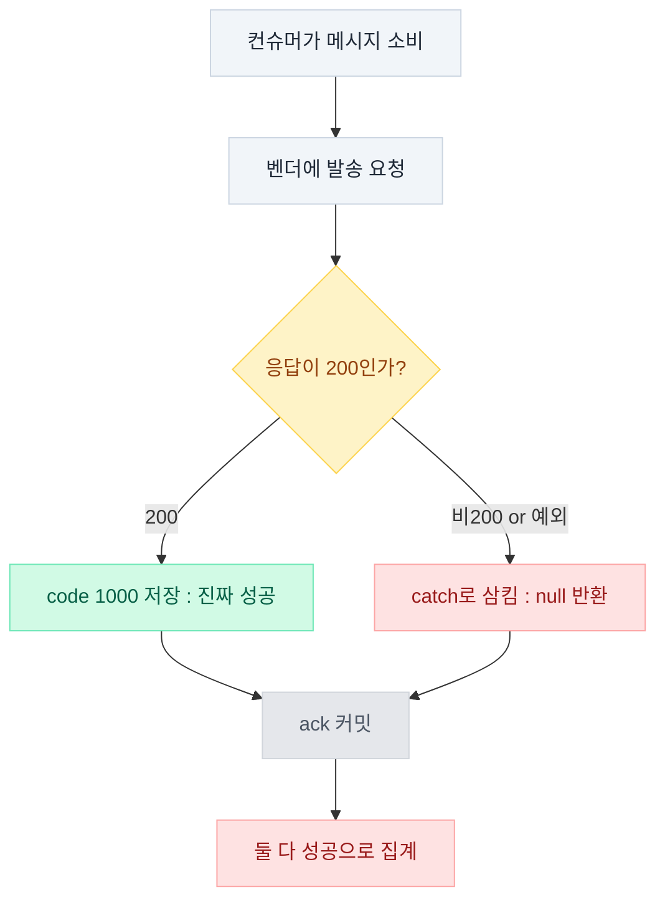

> **TL;DR**
>
> 금요일 오후, 대시보드 세 개가 전부 초록불이었습니다. 에러율 0%, P95 112ms, 컨슈머 지연 0.
> 그날 알림은 안 갔어요. 넷 중 하나가, "성공"이라고 로그에 박힌 채로.
>
> 그날 밤 그 한 건을 쫓으며 저는 초록불을 먼저 의심하는 사람이 됐습니다.  
> 지표가 언제 거짓말하는지 배운 여덟 장면을 적어요. 숫자는 전부 실제 관측치입니다.

---

<svg class="fig-defs" width="0" height="0" aria-hidden="true" focusable="false" style="position:absolute;width:0;height:0">
  <defs>
    <filter id="fx-glow" x="-60%" y="-60%" width="220%" height="220%">
      <feGaussianBlur stdDeviation="3" result="b"/>
      <feMerge><feMergeNode in="b"/><feMergeNode in="SourceGraphic"/></feMerge>
    </filter>
    <filter id="fx-soft" x="-40%" y="-40%" width="180%" height="180%">
      <feDropShadow dx="0" dy="1.5" stdDeviation="2.5" flood-color="#0f172a" flood-opacity="0.14"/>
    </filter>
  </defs>
</svg>

## 초록불 앞에서

금요일 오후 세 시. 대시보드 세 개가 전부 초록불이었습니다.  
에러율 0.00%, 지연도 평소 그대로. 저는 그걸 보고 안심했어요.  
안심한 게 실수였다는 걸 그때는 몰랐습니다.

메시지가 하나 왔습니다.

"이번 달 리포트 못 받으셨다는 학부모님이 계신데요."

한 분이시겠지. 발송 로그부터 열었습니다.  
전송 성공 634건. 숫자는 멀쩡했어요.  
"다 나갔는데요" 하고 답을 치려던 참이었습니다.

그런데 손이 멎었어요.  
성공이 634인데, 왜 못 받은 사람이 있지.

벤더 응답을 코드별로 세어 봤습니다.  
로그에 "성공"이라고 찍힌 것들 중에 응답 본문이 400인 게 섞여 있었어요.  
`{"code":2000,"description":"The to field is required"}`  
수신번호가 비었다는 뜻입니다.

180건. 그날 발송의 넷 중 하나가, "성공"이라고 로그에 박힌 채 아무 데도 가지 않았습니다.

발송 코드가 응답을 확인하기도 전에 "성공"을 먼저 찍고 있었거든요.

<figure class="metric-fig">
  
"success" log vs real deliverynoon batch · 636

  <svg viewBox="0 0 640 222" role="img" aria-label="성공 로그 634건이 실제 발송 453건과 은폐된 실패 180건으로 갈라진다" xmlns="http://www.w3.org/2000/svg">
    <defs>
      <linearGradient id="g-log" x1="0" y1="0" x2="0" y2="1"><stop offset="0" stop-color="var(--fig-baseline)"/><stop offset="1" stop-color="var(--fig-baseline)" stop-opacity="0.5"/></linearGradient>
      <linearGradient id="g-good" x1="0" y1="0" x2="0" y2="1"><stop offset="0" stop-color="var(--c-green)"/><stop offset="1" stop-color="var(--c-green)" stop-opacity="0.55"/></linearGradient>
      <linearGradient id="g-bad" x1="0" y1="0" x2="0" y2="1"><stop offset="0" stop-color="var(--c-red)"/><stop offset="1" stop-color="var(--c-red)" stop-opacity="0.6"/></linearGradient>
      <pattern id="p-hatch" width="7" height="7" patternTransform="rotate(45)" patternUnits="userSpaceOnUse">
        <rect width="7" height="7" fill="var(--c-red)"/><line x1="0" y1="0" x2="0" y2="7" stroke="var(--fig-surface)" stroke-width="2.4" opacity="0.55"/>
      </pattern>
    </defs>
    <line x1="60" y1="186" x2="584" y2="186" stroke="var(--fig-baseline)" stroke-width="1.4"/>
    <rect x="64" y="46" width="120" height="140" rx="7" fill="url(#g-log)"/>
    <path d="M184 108 C 300 108, 320 130, 452 133" fill="none" stroke="var(--c-green)" stroke-width="1.6" opacity="0.5" stroke-dasharray="4 4"/>
    <path d="M184 108 C 300 108, 320 62, 452 60" fill="none" stroke="var(--c-red)" stroke-width="1.8" stroke-dasharray="5 4">
      <animate attributeName="stroke-dashoffset" values="18;0" dur="1.1s" repeatCount="indefinite"/>
    </path>
    <rect x="452" y="186" width="120" rx="7" fill="url(#g-good)">
      <animate attributeName="height" values="0;102.6;102.6;0" keyTimes="0;0.35;0.9;1" dur="6.5s" calcMode="spline" keySplines="0.4 0 0.15 1;0 0 1 1;0.4 0 0.15 1" repeatCount="indefinite"/>
      <animate attributeName="y" values="186;83.4;83.4;186" keyTimes="0;0.35;0.9;1" dur="6.5s" calcMode="spline" keySplines="0.4 0 0.15 1;0 0 1 1;0.4 0 0.15 1" repeatCount="indefinite"/>
    </rect>
    <rect x="452" y="186" width="120" rx="7" fill="url(#p-hatch)" filter="url(#fx-glow)">
      <animate attributeName="height" values="0;40.7;40.7;0" keyTimes="0;0.55;0.9;1" dur="6.5s" calcMode="spline" keySplines="0.4 0 0.15 1;0 0 1 1;0.4 0 0.15 1" repeatCount="indefinite"/>
      <animate attributeName="y" values="186;40.7;40.7;186" keyTimes="0;0.55;0.9;1" dur="6.5s" calcMode="spline" keySplines="0.4 0 0.15 1;0 0 1 1;0.4 0 0.15 1" repeatCount="indefinite"/>
    </rect>
    <text x="124" y="122" text-anchor="middle" fill="var(--fig-ink)" font-size="26" font-weight="800" letter-spacing="-0.02em">634</text>
    <text x="124" y="142" text-anchor="middle" fill="var(--fig-muted)" font-size="10.5" letter-spacing="0.06em">LOG "SUCCESS"</text>
    <g font-size="12">
      <text x="124" y="36" text-anchor="middle" fill="var(--fig-muted)" font-weight="600" letter-spacing="0.02em">로그가 말하는 성공</text>
      <text x="512" y="36" text-anchor="middle" fill="var(--fig-muted)" font-weight="600" letter-spacing="0.02em">실제 도착</text>
      <text x="580" y="139" fill="var(--c-greenink)" font-weight="700">453 · 71%</text>
      <text x="580" y="63" fill="var(--c-redink)" font-weight="700">180 · 28% 은폐</text>
    </g>
  </svg>
  <figcaption>로그가 말하는 "성공 634" 안에서 <b>180건(28%)</b>이 갈라져 나온다. 빗금이 삼켜진 실패다. 성공 로그의 분모가 처음부터 틀렸던 셈이다.</figcaption>
</figure>

근원은 더 위에 있었어요.  
회원 서비스가 숫자 없는 전화번호를 `null`이 아니라 빈 문자열로 저장했습니다.  
아래쪽 `== null` 가드는 빈 문자열을 그냥 통과시켜요.  
번호 없는 사용자 12%가 그렇게 파이프라인을 지나, 맨 끝에서 조용히 튕겼습니다.

그날 저는 "성공"이라는 초록 글자를 다시는 곧이곧대로 믿지 않기로 했어요.

> 에러율 0%는 정상이 아닐 수 있습니다. 실패를 안 남기는 코드는 성공률을 조작하거든요.

> **포기한 것**: "성공 로그 카운트"에 대한 신뢰. 이제 성공은 `HTTP 200 + 벤더 code 1000`까지 확인해야 성공입니다. 그 전에 찍힌 로그는 전부 다시 세야 했어요.

문제는, 이게 시작일 뿐이었다는 거예요.  
성공 로그를 못 믿게 되자 나머지 계기도 하나씩 의심스러워졌습니다. 그날 밤은 길었어요.

---

## 평균이 P95보다 크면 무엇을 의심해야 할까?

다음은 지연이었어요.  
"느리다"는 신고가 며칠째 쌓여 있었습니다.  
트레이스를 하나 열었더니 건당 3초. 또 하나는 4분 30초.

거봐, 만성 지연이네. 벤더를 의심했어요.  
그런데 1주치를 집계하자 이야기가 뒤집혔습니다.

평균 148ms, P95 112ms.  
평균이 P95보다 컸어요. 이 한 줄이 전부입니다.

평균이 P95보다 크다는 건, 소수의 괴물 이상치가 평균만 들어 올렸다는 뜻이에요.  
꼬리는 얇았습니다. 대부분의 요청은 100ms 안쪽에서 멀쩡히 끝나고 있었어요.

<figure class="metric-fig">
  
latency distribution<b>1 week</b> · n=31.7k

  <svg viewBox="0 0 640 250" role="img" aria-label="지연 분포. 대부분 110ms 근처에 몰려 있고 4분 30초의 얇은 꼬리가 평균을 끌어올린다" xmlns="http://www.w3.org/2000/svg">
    <defs>
      <linearGradient id="g-dist" x1="0" y1="0" x2="0" y2="1">
        <stop offset="0" stop-color="var(--c-blue)"/><stop offset="1" stop-color="var(--c-blue)" stop-opacity="0.5"/>
      </linearGradient>
      <linearGradient id="g-dist-tail" x1="0" y1="0" x2="0" y2="1">
        <stop offset="0" stop-color="var(--c-red)"/><stop offset="1" stop-color="var(--c-red)" stop-opacity="0.55"/>
      </linearGradient>
    </defs>
    <g stroke="var(--fig-grid)" stroke-width="1">
      <line x1="44" y1="40" x2="612" y2="40"/><line x1="44" y1="92" x2="612" y2="92"/>
      <line x1="44" y1="144" x2="612" y2="144"/>
    </g>
    <line x1="44" y1="196" x2="612" y2="196" stroke="var(--fig-baseline)" stroke-width="1.4"/>
    <g fill="url(#g-dist)">
      <rect x="47"  y="196" width="30" height="0" rx="3.5"><animate attributeName="height" values="0;6"   dur="0.8s" begin="0.05s" calcMode="spline" keyTimes="0;1" keySplines="0.4 0 0.15 1" fill="freeze"/><animate attributeName="y" values="196;190" dur="0.8s" begin="0.05s" calcMode="spline" keyTimes="0;1" keySplines="0.4 0 0.15 1" fill="freeze"/></rect>
      <rect x="82"  y="196" width="30" height="0" rx="3.5"><animate attributeName="height" values="0;18"  dur="0.8s" begin="0.11s" calcMode="spline" keyTimes="0;1" keySplines="0.4 0 0.15 1" fill="freeze"/><animate attributeName="y" values="196;178" dur="0.8s" begin="0.11s" calcMode="spline" keyTimes="0;1" keySplines="0.4 0 0.15 1" fill="freeze"/></rect>
      <rect x="117" y="196" width="30" height="0" rx="3.5"><animate attributeName="height" values="0;52"  dur="0.8s" begin="0.17s" calcMode="spline" keyTimes="0;1" keySplines="0.4 0 0.15 1" fill="freeze"/><animate attributeName="y" values="196;144" dur="0.8s" begin="0.17s" calcMode="spline" keyTimes="0;1" keySplines="0.4 0 0.15 1" fill="freeze"/></rect>
      <rect x="152" y="196" width="30" height="0" rx="3.5"><animate attributeName="height" values="0;116" dur="0.8s" begin="0.23s" calcMode="spline" keyTimes="0;1" keySplines="0.4 0 0.15 1" fill="freeze"/><animate attributeName="y" values="196;80"  dur="0.8s" begin="0.23s" calcMode="spline" keyTimes="0;1" keySplines="0.4 0 0.15 1" fill="freeze"/></rect>
      <rect x="187" y="196" width="30" height="0" rx="3.5"><animate attributeName="height" values="0;172" dur="0.8s" begin="0.29s" calcMode="spline" keyTimes="0;1" keySplines="0.4 0 0.15 1" fill="freeze"/><animate attributeName="y" values="196;24"  dur="0.8s" begin="0.29s" calcMode="spline" keyTimes="0;1" keySplines="0.4 0 0.15 1" fill="freeze"/></rect>
      <rect x="222" y="196" width="30" height="0" rx="3.5"><animate attributeName="height" values="0;144" dur="0.8s" begin="0.35s" calcMode="spline" keyTimes="0;1" keySplines="0.4 0 0.15 1" fill="freeze"/><animate attributeName="y" values="196;52"  dur="0.8s" begin="0.35s" calcMode="spline" keyTimes="0;1" keySplines="0.4 0 0.15 1" fill="freeze"/></rect>
      <rect x="257" y="196" width="30" height="0" rx="3.5"><animate attributeName="height" values="0;80"  dur="0.8s" begin="0.41s" calcMode="spline" keyTimes="0;1" keySplines="0.4 0 0.15 1" fill="freeze"/><animate attributeName="y" values="196;116" dur="0.8s" begin="0.41s" calcMode="spline" keyTimes="0;1" keySplines="0.4 0 0.15 1" fill="freeze"/></rect>
      <rect x="292" y="196" width="30" height="0" rx="3.5"><animate attributeName="height" values="0;38"  dur="0.8s" begin="0.47s" calcMode="spline" keyTimes="0;1" keySplines="0.4 0 0.15 1" fill="freeze"/><animate attributeName="y" values="196;158" dur="0.8s" begin="0.47s" calcMode="spline" keyTimes="0;1" keySplines="0.4 0 0.15 1" fill="freeze"/></rect>
      <rect x="327" y="196" width="30" height="0" rx="3.5"><animate attributeName="height" values="0;16"  dur="0.8s" begin="0.53s" calcMode="spline" keyTimes="0;1" keySplines="0.4 0 0.15 1" fill="freeze"/><animate attributeName="y" values="196;180" dur="0.8s" begin="0.53s" calcMode="spline" keyTimes="0;1" keySplines="0.4 0 0.15 1" fill="freeze"/></rect>
      <rect x="362" y="196" width="30" height="0" rx="3.5"><animate attributeName="height" values="0;7"   dur="0.8s" begin="0.59s" calcMode="spline" keyTimes="0;1" keySplines="0.4 0 0.15 1" fill="freeze"/><animate attributeName="y" values="196;189" dur="0.8s" begin="0.59s" calcMode="spline" keyTimes="0;1" keySplines="0.4 0 0.15 1" fill="freeze"/></rect>
    </g>
    <g stroke="var(--fig-grid)" stroke-width="1" stroke-dasharray="2 4"><line x1="480" y1="40" x2="480" y2="196"/></g>
    <rect x="577" y="184" width="30" height="12" rx="3.5" fill="url(#g-dist-tail)" filter="url(#fx-glow)">
      <animate attributeName="opacity" values="1;0.4;1" dur="2.4s" calcMode="spline" keyTimes="0;0.5;1" keySplines="0.4 0 0.6 1;0.4 0 0.6 1" repeatCount="indefinite"/>
    </rect>
    <line x1="200" y1="30" x2="200" y2="196" stroke="var(--fig-ink2)" stroke-width="1.4" stroke-dasharray="4 4" opacity="0.7"/>
    <line x1="235" y1="30" x2="235" y2="196" stroke="var(--c-orange)" stroke-width="1.6" stroke-dasharray="5 4"/>
    <g transform="translate(139,20)"><rect width="62" height="19" rx="6" fill="var(--fig-ink2)" opacity="0.1"/><text x="31" y="13.5" text-anchor="middle" fill="var(--fig-ink2)" font-size="11" font-weight="700" letter-spacing="0.02em">P95 112ms</text></g>
    <g transform="translate(206,20)"><rect width="66" height="19" rx="6" fill="var(--c-orange)" opacity="0.16"/><text x="33" y="13.5" text-anchor="middle" fill="var(--c-orangeink)" font-size="11" font-weight="700" letter-spacing="0.02em">avg 148ms</text></g>
    <g transform="translate(536,178)"><rect width="72" height="19" rx="6" fill="var(--c-red)" opacity="0.16"/><text x="36" y="13.5" text-anchor="middle" fill="var(--c-redink)" font-size="11" font-weight="700">4m30s 꼬리</text></g>
    <g font-size="10.5" fill="var(--fig-muted)" letter-spacing="0.03em">
      <text x="47" y="214">~50ms</text>
      <text x="328" y="230" text-anchor="middle">지연 (log) →</text>
    </g>
  </svg>
  <figcaption>봉우리는 <b>~110ms</b>에 있는데, 오른쪽 끝 <b>4m30s</b> 꼬리 한 칸이 평균을 148ms까지 밀어 올린다. 평균이 P95보다 커진 이유다.</figcaption>
</figure>

트레이스 하나로 원인을 단정할 때마다 다음 데이터가 저를 정정했습니다.  
Redis라고 했다가, 푸시라고 했다가, 토큰이라고 했다가.  
저는 그 밤 내내, 눈앞의 한 건에 속고 있었어요.

순서를 뒤집었습니다.  
집계(P95)를 먼저 본다. 그다음에 이상치의 `error.message`를 끝까지 연다.

> *평균이 P95보다 크면 꼬리를 의심하라. 트레이스 한 건은 원인이 아니라 용의자일 뿐이다.*

> **포기한 것**: 꼬리를 잘라낸 깔끔한 계기판. P95 하나로는 4분 30초짜리 한 건을 못 봅니다. 그게 진짜 사고일 때도 있죠. 이상치는 여전히 사람이 열어봐야 했어요.

---

## "5시간 밀렸다"는 계산은 어디서 틀렸을까?

느림의 정체가 궁금했어요. 이번엔 봉투 뒷면에 계산을 했습니다.  
발송 대상 1.1만 건, 단일 컨슈머, 건당 1.5초. 곱하면 약 5시간.  
큐가 5시간 밀린 거네. 파티션 증설 견적을 내려던 참이었습니다.

그리고 실제 컨슈머 지연 지표를 열었어요.  
평일 최대 12초. 대기 메시지는 최대 한 건.

큐는 밀린 적이 없었습니다.  
곱셈이 그린 5시간짜리 백로그는 어디에도 없었어요.  
느림의 실체는 처리량이 아니라, 조금 전에 본 삼켜진 유실이었습니다.

<figure class="metric-fig">
  
envelope math vs measured lag11,260 msgs

  <svg viewBox="0 0 720 264" role="img" aria-label="같은 시작점에서 봉투계산은 5시간으로 치솟고 실측 지연은 12초에 붙어 있다" xmlns="http://www.w3.org/2000/svg">
    <defs>
      <linearGradient id="g-env" x1="0" y1="0" x2="0" y2="1">
        <stop offset="0" stop-color="var(--c-orange)" stop-opacity="0.32"/><stop offset="1" stop-color="var(--c-orange)" stop-opacity="0"/>
      </linearGradient>
      <linearGradient id="g-meas" x1="0" y1="0" x2="0" y2="1">
        <stop offset="0" stop-color="var(--c-blue)" stop-opacity="0.28"/><stop offset="1" stop-color="var(--c-blue)" stop-opacity="0"/>
      </linearGradient>
      <linearGradient id="g-envline" x1="0" y1="1" x2="1" y2="0">
        <stop offset="0" stop-color="var(--c-orange)" stop-opacity="0.7"/><stop offset="1" stop-color="var(--c-orange)"/>
      </linearGradient>
    </defs>
    <g stroke="var(--fig-grid)" stroke-width="1">
      <line x1="52" y1="40" x2="684" y2="40"/><line x1="52" y1="97" x2="684" y2="97"/><line x1="52" y1="154" x2="684" y2="154"/>
    </g>
    <line x1="52" y1="212" x2="684" y2="212" stroke="var(--fig-baseline)" stroke-width="1.4"/>
    <path d="M52 210 C 240 208, 430 150, 684 46 L684 212 L52 212 Z" fill="url(#g-env)">
      <animate attributeName="opacity" values="0;0.95;0.95;0" keyTimes="0;0.42;0.9;1" dur="6.5s" calcMode="spline" keySplines="0.45 0 0.15 1;0 0 1 1;0.45 0 0.15 1" repeatCount="indefinite"/>
    </path>
    <path d="M52 210 L150 209 L300 208 L360 208 L378 199 L398 208 L520 208 L684 207 L684 212 L52 212 Z" fill="url(#g-meas)">
      <animate attributeName="opacity" values="0;0.95;0.95;0" keyTimes="0;0.42;0.9;1" dur="6.5s" calcMode="spline" keySplines="0.45 0 0.15 1;0 0 1 1;0.45 0 0.15 1" repeatCount="indefinite"/>
    </path>
    <path d="M52 210 L150 209 L300 208 L360 208 L378 199 L398 208 L520 208 L684 207" fill="none" stroke="var(--c-blue)" stroke-width="2.6" stroke-linecap="round" stroke-linejoin="round" pathLength="100" stroke-dasharray="100">
      <animate attributeName="stroke-dashoffset" values="100;0;0;100" keyTimes="0;0.42;0.9;1" dur="6.5s" calcMode="spline" keySplines="0.45 0 0.15 1;0 0 1 1;0.45 0 0.15 1" repeatCount="indefinite"/>
    </path>
    <path d="M52 210 C 240 208, 430 150, 684 46" fill="none" stroke="url(#g-envline)" stroke-width="2.8" stroke-linecap="round" pathLength="100" stroke-dasharray="100">
      <animate attributeName="stroke-dashoffset" values="100;0;0;100" keyTimes="0;0.42;0.9;1" dur="6.5s" calcMode="spline" keySplines="0.45 0 0.15 1;0 0 1 1;0.45 0 0.15 1" repeatCount="indefinite"/>
    </path>
    <circle r="9" fill="var(--c-orange)" opacity="0.18">
      <animateMotion path="M52 210 C 240 208, 430 150, 684 46" keyPoints="0;1;1;0" keyTimes="0;0.42;0.9;1" dur="6.5s" calcMode="spline" keySplines="0.45 0 0.15 1;0 0 1 1;0.45 0 0.15 1" repeatCount="indefinite"/>
    </circle>
    <circle r="4.5" fill="var(--c-orange)" filter="url(#fx-glow)">
      <animateMotion path="M52 210 C 240 208, 430 150, 684 46" keyPoints="0;1;1;0" keyTimes="0;0.42;0.9;1" dur="6.5s" calcMode="spline" keySplines="0.45 0 0.15 1;0 0 1 1;0.45 0 0.15 1" repeatCount="indefinite"/>
    </circle>
    <circle cx="52" cy="211" r="4" fill="var(--fig-surface)" stroke="var(--fig-ink2)" stroke-width="1.6"/>
    <g transform="translate(556,30)"><rect width="128" height="21" rx="7" fill="var(--c-orange)" opacity="0.16"/><text x="12" y="14.5" fill="var(--c-orangeink)" font-size="12" font-weight="700">봉투계산 · 약 5시간</text></g>
    <g transform="translate(520,224)"><rect width="164" height="21" rx="7" fill="var(--c-blue)" opacity="0.16"/><text x="12" y="14.5" fill="var(--c-blueink)" font-size="12" font-weight="700">실측 lag · 12초 (대기 1건)</text></g>
    <text x="56" y="230" fill="var(--fig-muted)" font-size="10.5" letter-spacing="0.03em">발송 시작</text>
  </svg>
  <figcaption>같은 지점에서 출발한 두 선. 위는 <b>건수 x 건당시간</b>이 그린 추정, 아래는 컨슈머가 실제로 보고한 지연. 두 선의 벌어짐이 곧 잘못된 견적의 크기다.</figcaption>
</figure>

파티션 1개라 컨슈머를 늘려도 처리량이 안 오르는 건 사실이었어요.  
그런데 밀리지도 않은 큐를 증설할 이유는 없죠.

> 백로그는 계산하는 게 아니라 재는 겁니다. lag이 낮으면 "느림"은 실체가 없어요.

곱셈은 가설을 세울 때만 씁니다. 돈 쓰는 결정은 실측으로 해요.

---

## 풀 상한은 왜 파드 수를 곱해야 할까?

자정이 가까워질 무렵, DB 커넥션 알람이 울렸습니다.  
문서에는 서비스별 풀 상한을 더한 값이 430이라 적혀 있었어요. 임계는 1800.

절반도 안 쓰는데 왜 알람이 울리지.  
여기서 그날의 가장 부끄러운 실수가 나왔습니다.

430은 파드당 설정값의 단순 합이었어요.  
인스턴스가 몇 개인지를, 저는 곱하지 않고 있었습니다.

풀은 파드마다 따로 열려요.  
`파드당 max-pool x replicas`가 진짜 상한입니다.  
다시 계산하니 1220. 임계 1800의 68%. 그림이 통째로 달라졌어요.

<figure class="metric-fig">
  
connection budget · per-service × replicasthreshold <b>1,800</b>

  <svg viewBox="0 0 640 244" role="img" aria-label="서비스별 커넥션이 파드 수를 곱하며 쌓여 1220에 이르고 임계 1800과 실측 810 선이 그어진다" xmlns="http://www.w3.org/2000/svg">
    <defs>
      <linearGradient id="g4-slate" x1="0" y1="0" x2="1" y2="0"><stop offset="0" stop-color="var(--c-slate)" stop-opacity="0.6"/><stop offset="1" stop-color="var(--c-slate)"/></linearGradient>
      <linearGradient id="g4-amber" x1="0" y1="0" x2="1" y2="0"><stop offset="0" stop-color="var(--c-amber)" stop-opacity="0.65"/><stop offset="1" stop-color="var(--c-amber)"/></linearGradient>
      <linearGradient id="g4-green" x1="0" y1="0" x2="1" y2="0"><stop offset="0" stop-color="var(--c-green)" stop-opacity="0.6"/><stop offset="1" stop-color="var(--c-green)"/></linearGradient>
    </defs>
    <rect x="455" y="42" width="145" height="168" fill="var(--c-green)" opacity="0.06"/>
    <text x="527" y="36" text-anchor="middle" fill="var(--c-greenink)" font-size="10" letter-spacing="0.06em" opacity="0.9">HEADROOM</text>
    <g stroke="var(--fig-grid)" stroke-width="1" font-size="10.5" fill="var(--fig-muted)">
      <line x1="150" y1="42" x2="150" y2="210"/><text x="146" y="214" text-anchor="end">0</text>
      <line x1="262" y1="42" x2="262" y2="210"/><text x="262" y="228" text-anchor="middle">450</text>
      <line x1="375" y1="42" x2="375" y2="210"/><text x="375" y="228" text-anchor="middle">900</text>
      <line x1="487" y1="42" x2="487" y2="210"/><text x="487" y="228" text-anchor="middle">1350</text>
    </g>
    <rect x="150" y="56" width="0" height="26" rx="4" fill="url(#g4-slate)" opacity="0.55"><animate attributeName="width" values="0;107" dur="0.6s" begin="0.15s" calcMode="spline" keyTimes="0;1" keySplines="0.4 0 0.15 1" fill="freeze"/></rect>
    <rect x="150" y="96" width="0" height="26" rx="4" fill="url(#g4-slate)"><animate attributeName="width" values="0;155" dur="0.6s" begin="0.4s" calcMode="spline" keyTimes="0;1" keySplines="0.4 0 0.15 1" fill="freeze"/></rect>
    <rect x="150" y="136" width="0" height="26" rx="4" fill="url(#g4-amber)" filter="url(#fx-soft)"><animate attributeName="width" values="0;202" dur="0.6s" begin="0.65s" calcMode="spline" keyTimes="0;1" keySplines="0.4 0 0.15 1" fill="freeze"/></rect>
    <rect x="150" y="176" width="0" height="26" rx="4" fill="url(#g4-green)" filter="url(#fx-soft)"><animate attributeName="width" values="0;305" dur="0.8s" begin="0.9s" calcMode="spline" keyTimes="0;1" keySplines="0.4 0 0.15 1" fill="freeze"/></rect>
    <line x1="600" y1="40" x2="600" y2="210" stroke="var(--c-red)" stroke-width="2.2" stroke-dasharray="6 4">
      <animate attributeName="opacity" values="1;0.45;1" dur="2.6s" calcMode="spline" keyTimes="0;0.5;1" keySplines="0.4 0 0.6 1;0.4 0 0.6 1" repeatCount="indefinite"/>
    </line>
    <g transform="translate(560,214)"><rect width="60" height="19" rx="6" fill="var(--c-red)" opacity="0.16"/><text x="30" y="13.5" text-anchor="middle" fill="var(--c-redink)" font-size="11" font-weight="700">임계 1,800</text></g>
    <g font-size="12">
      <text x="146" y="73"  fill="var(--fig-muted)" text-anchor="end">순진한 합</text>
      <g transform="translate(263,60)"><rect width="76" height="18" rx="6" fill="var(--c-red)" opacity="0.14"/><text x="9" y="13" fill="var(--c-redink)" font-size="11" font-weight="700">430 ✗ 틀림</text></g>
      <text x="146" y="113" fill="var(--fig-muted)" text-anchor="end">유휴 바닥</text><text x="313" y="113" fill="var(--fig-ink2)" font-weight="700">620 · 상시 점유</text>
      <text x="146" y="153" fill="var(--fig-muted)" text-anchor="end">실측</text><text x="360" y="153" fill="var(--c-amberink)" font-weight="700">810 · 45%</text>
      <text x="146" y="193" fill="var(--fig-muted)" text-anchor="end">실제 상한</text><text x="463" y="193" fill="var(--c-greenink)" font-weight="700">1,220 · 파드 x 풀</text>
    </g>
  </svg>
  <figcaption>파드당 설정값만 더한 <b>430</b>은 실제 인스턴스가 받는 압박을 3배 가까이 낮잡는다. 파드 수를 곱한 <b>1,220</b>이 실제 상한이고, 임계 1,800까지는 아직 여유가 있다.</figcaption>
</figure>

계산이 맞아떨어지고 나서야 두 번째 사실이 보였어요.  
바닥선(min-idle 합) 620을 먼저 계산해 두면, 관측치를 볼 때 기준이 생깁니다.

트래픽이 0인데 관측치가 620보다 한참 낮다면, 서버가 아니라 *모니터 정의*를 의심할 차례입니다.

실제로 그 대시보드는 한동안 "45"를 개수로 오독하게 만들었어요.  
알고 보니 45는 개수가 아니라 45%였습니다.  
상태 화면엔 `a / 1800 * 100` 수식이 숨어 있었죠.

관측치 810은 바닥 620 + 활성 190. 계산과 관측이 맞아떨어졌습니다.

> 임계 분모(1800)는 상수로 박지 말고 메트릭으로 잡아라. 인스턴스 스펙이 바뀌면 계기가 조용히 어긋난다.

> **포기한 것**: "파드당 설정값"만 걸어둔 편한 대시보드. 게다가 1시간 평균 윈도우가 30분짜리 폭증을 평균으로 삼켰습니다. 짧은 스파이크는 알람도 못 울리고 지나갔어요.

---

## 실패가 매시 51분에만 난다면?

새벽 두 시. 이건 그날 밤 가장 오래 저를 붙잡은 로그였어요.  
토큰 생성 실패가 드문드문 찍혀 있었습니다. 하루 한두 건.  
무시해도 될 잡음처럼 보였어요.

그런데 발생 시각만 뽑아 세로로 늘어놓는 순간, 소름이 돋았습니다.  
15일치 30건이 전부 매시 51분경.

애플리케이션 버그는 이렇게 깔끔한 분(minute) 클러스터를 못 만들어요.  
매시 정각처럼 도는 무언가가 연결을 끊고 있다는 뜻입니다.  
공용 egress, NAT, 벤더 앞단 로드밸런서 같은 것.

결정타는 초 단위에 있었어요.  
발생 초가 매일 약 1.08초씩 밀렸습니다.  
51분 33.0초에서 시작해 13일 뒤엔 51분 47.2초였어요.

<figure class="metric-fig">
  
token reset failures · 15 days30 events

  <svg viewBox="0 0 640 288" role="img" aria-label="15일 동안 실패 점이 매시 51분 세로선에 정확히 모이고 날마다 초 단위로 오른쪽으로 드리프트한다" xmlns="http://www.w3.org/2000/svg">
    <defs>
      <linearGradient id="g5-band" x1="0" y1="0" x2="1" y2="0">
        <stop offset="0" stop-color="var(--c-violet)" stop-opacity="0"/><stop offset="0.5" stop-color="var(--c-violet)" stop-opacity="0.12"/><stop offset="1" stop-color="var(--c-violet)" stop-opacity="0"/>
      </linearGradient>
    </defs>
    <rect x="200" y="44" width="270" height="192" fill="url(#g5-band)"/>
    <g stroke="var(--fig-grid)" stroke-width="1" font-size="10.5" fill="var(--fig-muted)">
      <line x1="158" y1="44" x2="158" y2="236"/><text x="158" y="254" text-anchor="middle">51:30</text>
      <line x1="264" y1="44" x2="264" y2="236"/><text x="264" y="254" text-anchor="middle">51:36</text>
      <line x1="370" y1="44" x2="370" y2="236"/><text x="370" y="254" text-anchor="middle">51:42</text>
      <line x1="476" y1="44" x2="476" y2="236"/><text x="476" y="254" text-anchor="middle">51:48</text>
      <line x1="582" y1="44" x2="582" y2="236"/><text x="582" y="254" text-anchor="middle">51:54</text>
    </g>
    <path d="M211 236 L463 44" fill="none" stroke="var(--c-violet)" stroke-width="1.6" stroke-dasharray="5 5">
      <animate attributeName="opacity" values="0;0;0.85" keyTimes="0;0.62;1" dur="5s" fill="freeze"/>
    </path>
    <g fill="var(--c-red)" filter="url(#fx-glow)">
      <circle cx="211" cy="236" r="0"><animate attributeName="r" values="0;6;5" dur="0.5s" begin="0.3s" calcMode="spline" keyTimes="0;0.6;1" keySplines="0.3 0 0.2 1;0.4 0 0.4 1" fill="freeze"/></circle>
      <circle cx="229" cy="222" r="0"><animate attributeName="r" values="0;6;5" dur="0.5s" begin="0.53s" calcMode="spline" keyTimes="0;0.6;1" keySplines="0.3 0 0.2 1;0.4 0 0.4 1" fill="freeze"/></circle>
      <circle cx="247" cy="208" r="0"><animate attributeName="r" values="0;6;5" dur="0.5s" begin="0.76s" calcMode="spline" keyTimes="0;0.6;1" keySplines="0.3 0 0.2 1;0.4 0 0.4 1" fill="freeze"/></circle>
      <circle cx="265" cy="194" r="0"><animate attributeName="r" values="0;6;5" dur="0.5s" begin="0.99s" calcMode="spline" keyTimes="0;0.6;1" keySplines="0.3 0 0.2 1;0.4 0 0.4 1" fill="freeze"/></circle>
      <circle cx="283" cy="180" r="0"><animate attributeName="r" values="0;6;5" dur="0.5s" begin="1.22s" calcMode="spline" keyTimes="0;0.6;1" keySplines="0.3 0 0.2 1;0.4 0 0.4 1" fill="freeze"/></circle>
      <circle cx="301" cy="166" r="0"><animate attributeName="r" values="0;6;5" dur="0.5s" begin="1.45s" calcMode="spline" keyTimes="0;0.6;1" keySplines="0.3 0 0.2 1;0.4 0 0.4 1" fill="freeze"/></circle>
      <circle cx="319" cy="152" r="0"><animate attributeName="r" values="0;6;5" dur="0.5s" begin="1.68s" calcMode="spline" keyTimes="0;0.6;1" keySplines="0.3 0 0.2 1;0.4 0 0.4 1" fill="freeze"/></circle>
      <circle cx="337" cy="138" r="0"><animate attributeName="r" values="0;6;5" dur="0.5s" begin="1.91s" calcMode="spline" keyTimes="0;0.6;1" keySplines="0.3 0 0.2 1;0.4 0 0.4 1" fill="freeze"/></circle>
      <circle cx="355" cy="124" r="0"><animate attributeName="r" values="0;6;5" dur="0.5s" begin="2.14s" calcMode="spline" keyTimes="0;0.6;1" keySplines="0.3 0 0.2 1;0.4 0 0.4 1" fill="freeze"/></circle>
      <circle cx="373" cy="110" r="0"><animate attributeName="r" values="0;6;5" dur="0.5s" begin="2.37s" calcMode="spline" keyTimes="0;0.6;1" keySplines="0.3 0 0.2 1;0.4 0 0.4 1" fill="freeze"/></circle>
      <circle cx="391" cy="96"  r="0"><animate attributeName="r" values="0;6;5" dur="0.5s" begin="2.6s"  calcMode="spline" keyTimes="0;0.6;1" keySplines="0.3 0 0.2 1;0.4 0 0.4 1" fill="freeze"/></circle>
      <circle cx="409" cy="82"  r="0"><animate attributeName="r" values="0;6;5" dur="0.5s" begin="2.83s" calcMode="spline" keyTimes="0;0.6;1" keySplines="0.3 0 0.2 1;0.4 0 0.4 1" fill="freeze"/></circle>
      <circle cx="427" cy="68"  r="0"><animate attributeName="r" values="0;6;5" dur="0.5s" begin="3.06s" calcMode="spline" keyTimes="0;0.6;1" keySplines="0.3 0 0.2 1;0.4 0 0.4 1" fill="freeze"/></circle>
      <circle cx="445" cy="54"  r="0"><animate attributeName="r" values="0;6;5" dur="0.5s" begin="3.29s" calcMode="spline" keyTimes="0;0.6;1" keySplines="0.3 0 0.2 1;0.4 0 0.4 1" fill="freeze"/></circle>
      <circle cx="463" cy="44"  r="0"><animate attributeName="r" values="0;6;5" dur="0.5s" begin="3.52s" calcMode="spline" keyTimes="0;0.6;1" keySplines="0.3 0 0.2 1;0.4 0 0.4 1" fill="freeze"/></circle>
    </g>
    <g transform="translate(240,26)"><rect width="192" height="21" rx="7" fill="var(--c-violet)" opacity="0.14"/><text x="96" y="14.5" text-anchor="middle" fill="var(--c-violetink)" font-size="12" font-weight="700">모든 실패가 :51에 내려앉는다</text></g>
    <g font-size="11">
      <text x="150" y="240" fill="var(--fig-muted)" text-anchor="end">day 1</text>
      <text x="150" y="52"  fill="var(--fig-muted)" text-anchor="end">day 15</text>
      <g transform="translate(474,88)"><rect width="98" height="19" rx="6" fill="var(--c-violet)" opacity="0.16"/><text x="49" y="13.5" text-anchor="middle" fill="var(--c-violetink)" font-weight="700">+1.08초 / day</text></g>
    </g>
  </svg>
  <figcaption>가로축은 분:초, 세로축은 날짜. 점이 전부 <b>:51</b> 세로선에 붙는다. 아래에서 위로 매일 <b>~1.08초</b>씩 오른쪽으로 흐르는 이 드리프트가 <b>NTP 미동기화</b>의 지문이다.</figcaption>
</figure>

시계가 맞는 장비라면 매일 같은 초에 리셋이 일어나요.  
매일 1초씩 밀린다는 건, 그 장비의 시계가 표준시에서 천천히 미끄러지고 있다는 뜻입니다.  
NTP가 안 맞는 장비의 지문이죠.

파드를 다른 노드로 옮겨도 패턴은 그대로였어요.  
범인은 우리 코드 바깥, 손이 안 닿는 곳에 있었습니다.  
장애의 절반은 이렇게, 내가 고칠 수 없는 자리에서 옵니다.

> *실패 로그의 "발생 시각 분포"가 원인 계층을 가리킨다. 특정 분에 몰리면 코드가 아니라 주기적 인프라를 의심하라.*

---

## 배치가 40초에 끝났는데 왜 2시간이 걸렸을까?

그 밤엔 10시 배치가 어떻게 도는지도 재현해 봤어요.  
배치 여러 종이 동시에 깨어나 이벤트를 쏟아냅니다.  
"10시에 배치가 몰린다"는 말은 맞았습니다. 다만 저는 두 개의 시간을 하나로 뭉쳐 보고 있었어요.  
*적재*와 *소진*.

발행(적재)은 40초 만에 끝났어요.  
문제는 소진이었습니다. 파티션 1개, 건당 450ms.  
전부 비우는 데 2시간 3분이 걸렸어요.

완료 시각을 정하는 건 발행 속도가 아니라 컨슈머의 소진 속도였습니다.  
소진 곡선의 기울기가 꺾이는 자리마다, 토픽이 하나씩 죽어 나갔어요.

- 초반 3토픽 병렬: 분당 약 390건
- 하나가 끝나며: 분당 약 260건
- 마지막 월간 토픽 단독: 분당 약 128건

이 마지막 구간이 84분을 홀로 잡아먹었습니다.

<figure class="metric-fig">
  
drain throughput · msgs / min1 partition

  <svg viewBox="0 0 680 258" role="img" aria-label="소진 처리량이 병렬 구간 분당 390에서 하나가 끝나며 260으로 마지막 단일 토픽에서 128로 떨어진다" xmlns="http://www.w3.org/2000/svg">
    <defs>
      <linearGradient id="g6-area" x1="0" y1="0" x2="0" y2="1">
        <stop offset="0" stop-color="var(--c-blue)" stop-opacity="0.3"/><stop offset="1" stop-color="var(--c-blue)" stop-opacity="0"/>
      </linearGradient>
    </defs>
    <rect x="360" y="30" width="284" height="170" fill="var(--c-orange)" opacity="0.06"/>
    <text x="502" y="24" text-anchor="middle" fill="var(--c-orangeink)" font-size="10" letter-spacing="0.06em" opacity="0.85">BOTTLENECK · 84min</text>
    <g stroke="var(--fig-grid)" stroke-width="1" font-size="10.5" fill="var(--fig-muted)">
      <line x1="52" y1="200" x2="644" y2="200"/><text x="46" y="204" text-anchor="end">0</text>
      <line x1="52" y1="146" x2="644" y2="146"/><text x="46" y="150" text-anchor="end">128</text>
      <line x1="52" y1="90"  x2="644" y2="90"/><text x="46" y="94"  text-anchor="end">262</text>
      <line x1="52" y1="37"  x2="644" y2="37"/><text x="46" y="41"  text-anchor="end">390</text>
    </g>
    <path d="M52 37 L230 37 L230 90 L360 90 L360 146 L644 146 L644 200 L52 200 Z" fill="url(#g6-area)">
      <animate attributeName="opacity" values="0;1;1;0" keyTimes="0;0.45;0.9;1" dur="7s" calcMode="spline" keySplines="0.45 0 0.15 1;0 0 1 1;0.45 0 0.15 1" repeatCount="indefinite"/>
    </path>
    <path d="M52 37 L230 37 L230 90 L360 90 L360 146 L644 146" fill="none" stroke="var(--c-blue)" stroke-width="2.8" stroke-linejoin="round" stroke-linecap="round" pathLength="100" stroke-dasharray="100">
      <animate attributeName="stroke-dashoffset" values="100;0;0;100" keyTimes="0;0.45;0.9;1" dur="7s" calcMode="spline" keySplines="0.45 0 0.15 1;0 0 1 1;0.45 0 0.15 1" repeatCount="indefinite"/>
    </path>
    <circle r="8" fill="var(--c-blue)" opacity="0.16">
      <animateMotion path="M52 37 L230 37 L230 90 L360 90 L360 146 L644 146" keyPoints="0;1;1;0" keyTimes="0;0.45;0.9;1" dur="7s" calcMode="spline" keySplines="0.45 0 0.15 1;0 0 1 1;0.45 0 0.15 1" repeatCount="indefinite"/>
    </circle>
    <circle r="4.5" fill="var(--c-blue)" filter="url(#fx-glow)">
      <animateMotion path="M52 37 L230 37 L230 90 L360 90 L360 146 L644 146" keyPoints="0;1;1;0" keyTimes="0;0.45;0.9;1" dur="7s" calcMode="spline" keySplines="0.45 0 0.15 1;0 0 1 1;0.45 0 0.15 1" repeatCount="indefinite"/>
    </circle>
    <g transform="translate(72,12)"><rect width="150" height="20" rx="6" fill="var(--c-green)" opacity="0.14"/><text x="10" y="14" fill="var(--c-greenink)" font-size="11.5" font-weight="700">3토픽 병렬 · ~390/분</text></g>
    <g transform="translate(250,66)"><rect width="82" height="19" rx="6" fill="var(--fig-ink2)" opacity="0.1"/><text x="41" y="13.5" text-anchor="middle" fill="var(--fig-ink2)" font-size="11.5" font-weight="700">~260/분</text></g>
    <g transform="translate(388,120)"><rect width="190" height="20" rx="6" fill="var(--c-orange)" opacity="0.16"/><text x="10" y="14" fill="var(--c-orangeink)" font-size="11.5" font-weight="700">월간 단독 · ~128/분</text></g>
    <g font-size="10.5" fill="var(--fig-muted)" letter-spacing="0.03em">
      <text x="52" y="224">적재 40초</text>
      <text x="644" y="224" text-anchor="end">소진 2시간 03분</text>
    </g>
  </svg>
  <figcaption>곡선이 꺾이는 두 지점은 토픽이 하나씩 소진을 끝낸 순간이다. 마지막 월간 토픽 단독 구간(128/분)이 84분을 끌며 전체 완료 시각을 결정했다.</figcaption>
</figure>

곡선을 이렇게 나눠 보면 파티션 증설 판단이 선명해져요.  
기준은 "실측 꼬리가 요구 시각을 넘는가"입니다.

산술로는 토픽당 상한이 유지되는 것처럼 보여도 공유 자원 경합 탓에 실측이 30분씩 더 늦었어요.  
여기서도 계산보다 곡선이 정직했습니다.

> 적재 시간과 소진 시간을 분리해 재라. 완료 시각은 언제나 느린 쪽이 정한다.

---

## 캐시가 DB보다 2,700배 느리면?

의존성 지도를 열었다가 눈을 의심했어요.  
캐시 P95 5.68초. 같은 구간 DB P95는 2.12ms.

캐시가 DB보다 2,700배 느렸습니다.  
캐시는 DB보다 빠르라고 있는 건데요. 정상 기준선은 0.2ms짜리 조회예요.

<figure class="metric-fig">
  
p95 latency · same cache clusterlog scale

  <svg viewBox="0 0 640 216" role="img" aria-label="로그 스케일 막대. 알림 서비스의 캐시 P95 5.68초가 DB 2.12ms와 다른 서비스의 캐시 1.44ms를 압도한다" xmlns="http://www.w3.org/2000/svg">
    <defs>
      <linearGradient id="g7-red" x1="0" y1="0" x2="1" y2="0"><stop offset="0" stop-color="var(--c-red)" stop-opacity="0.6"/><stop offset="1" stop-color="var(--c-red)"/></linearGradient>
      <linearGradient id="g7-blue" x1="0" y1="0" x2="1" y2="0"><stop offset="0" stop-color="var(--c-blue)" stop-opacity="0.6"/><stop offset="1" stop-color="var(--c-blue)"/></linearGradient>
      <linearGradient id="g7-green" x1="0" y1="0" x2="1" y2="0"><stop offset="0" stop-color="var(--c-green)" stop-opacity="0.6"/><stop offset="1" stop-color="var(--c-green)"/></linearGradient>
    </defs>
    <g stroke="var(--fig-grid)" stroke-width="1" font-size="10.5" fill="var(--fig-muted)">
      <line x1="182" y1="32" x2="182" y2="178"/><text x="182" y="194" text-anchor="middle">1ms</text>
      <line x1="289" y1="32" x2="289" y2="178"/><text x="289" y="194" text-anchor="middle">10ms</text>
      <line x1="396" y1="32" x2="396" y2="178"/><text x="396" y="194" text-anchor="middle">100ms</text>
      <line x1="503" y1="32" x2="503" y2="178"/><text x="503" y="194" text-anchor="middle">1s</text>
    </g>
    <line x1="150" y1="32" x2="150" y2="178" stroke="var(--fig-baseline)" stroke-width="1.4"/>
    <g font-size="12">
      <text x="142" y="61"  fill="var(--fig-ink2)" text-anchor="end" font-weight="600">알림 캐시 p95</text>
      <text x="142" y="109" fill="var(--fig-ink2)" text-anchor="end" font-weight="600">타 서비스 캐시</text>
      <text x="142" y="157" fill="var(--fig-ink2)" text-anchor="end" font-weight="600">DB p95</text>
    </g>
    <rect x="150" y="46" width="0" height="30" rx="5" fill="url(#g7-red)" filter="url(#fx-soft)"><animate attributeName="width" values="0;434" dur="1.2s" begin="0.2s" calcMode="spline" keyTimes="0;1" keySplines="0.35 0 0.1 1" fill="freeze"/></rect>
    <rect x="574" y="46" width="10" height="30" rx="0" fill="var(--c-red)" opacity="0"><animate attributeName="opacity" values="0;0.9;0.3;0.9" keyTimes="0;0.34;0.67;1" dur="2.4s" begin="1.4s" repeatCount="indefinite"/></rect>
    <rect x="150" y="94" width="0" height="30" rx="5" fill="url(#g7-blue)"><animate attributeName="width" values="0;49"  dur="0.7s" begin="0.55s" calcMode="spline" keyTimes="0;1" keySplines="0.35 0 0.1 1" fill="freeze"/></rect>
    <rect x="150" y="142" width="0" height="30" rx="5" fill="url(#g7-green)"><animate attributeName="width" values="0;67" dur="0.7s" begin="0.85s" calcMode="spline" keyTimes="0;1" keySplines="0.35 0 0.1 1" fill="freeze"/></rect>
    <g font-weight="700" font-size="12">
      <text x="590" y="65"  fill="var(--c-redink)" text-anchor="end">5.68s</text>
      <text x="209" y="113" fill="var(--c-blueink)">1.44ms</text>
      <text x="227" y="161" fill="var(--c-greenink)">2.12ms</text>
    </g>
    <g transform="translate(474,14)"><rect width="126" height="21" rx="7" fill="var(--c-red)" opacity="0.16"/><text x="63" y="14.5" text-anchor="middle" fill="var(--c-redink)" font-size="12" font-weight="700">~2,700x 느림</text></g>
  </svg>
  <figcaption>같은 클러스터인데 <b>한 서비스만</b> 5.68초. 병목이 서버라면 셋 다 느려야 한다. 범인은 서버가 아니라 이 서비스의 공유 커넥션에 쌓인 줄이었다.</figcaption>
</figure>

캐시 서버가 죽은 게 아니었어요.  
같은 캐시를 쓰는 다른 서비스의 P95는 1.44ms로 멀쩡했습니다.

한 서비스만 느리다면, 병목은 서버가 아니라 그 서비스의 *클라이언트 측 큐잉*이에요.  
단일 공유 커넥션에 명령이 줄을 서고 있었습니다.

명령 종류를 까 보니 답이 나왔어요.  
3시간마다 도는 전체 재동기화가 `DEL`과 `HMSET`으로 트래픽의 90%를 차지했습니다.  
실사용 읽기가 아니라, 안전망이 스스로 쏘아 대는 폭격이었어요.

스케줄러가 3시간마다 전 사용자를 지우고 다시 넣고 있었습니다.  
그 재동기화가 수십만 명령을 공유 커넥션에 밀어 넣는 동안, 실제 발송 경로의 읽기는 뒤에 줄을 섰어요.  
그리고 그 주기 중 하나가 하필 정오, 매일 정오에 나가는 학습 알림 발송과 정면충돌했습니다.

> 캐시 P95가 DB P95보다 느리면 서버가 아니라 클라이언트 큐잉을 의심하라. 같은 클러스터 타 서비스 P95가 리트머스다.

> **포기한 것**: "캐시니까 빠르다"는 가정. 파이프라이닝 없는 건별 왕복과 3시간 전량 재적재는, 캐시를 초당 수백 명령짜리 부하 발생기로 만들고 있었어요.

---

## 정오 배치가 왜 밤 11시에 실행됐을까?

정오에 나가야 할 학습 알림이 그날은 밤에 도착했습니다.  
로그를 보니 같은 잡이 서로 다른 파드에서 두 번 실행되고 있었어요.

스케줄이 틀린 게 아니었습니다. 분산 락이 먼저 풀린 거였어요.

락 유지 시간은 `lockAtMostFor = 15분`.  
그런데 실제 실행 시간은 주간 리포트 기준 11시간 53분이었습니다.

락이 15분 뒤 강제로 풀리면, 락 없이 도는 잡 뒤로 다른 파드가 같은 잡을 물고 들어와요.  
중복 실행은 시간문제였습니다.

| 지표 | 값 | 뜻 |
|------|-----|-----|
| lockAtMostFor | 15분 | 파드 사망 대비 강제 만료 |
| 실측 실행 시간 | 11시간 53분 | 락의 47배 |
| 쿼리 수 | 71,438개 | N+1. hang이 아니라 slow |
| 벌크로 고친 뒤 | 약 1분 | 쿼리 130회 |

느린 이유는 멈춤(hang)이 아니라 느림(slow)이었어요.  
둘을 가른 건 쿼리 카운트였습니다.

대상 6만 행을 훑으며 행마다 5종의 쿼리를 더 날렸어요.  
71,438개 쿼리를 도느라 바빴을 뿐, 어디에도 멈춰 있지 않았습니다.

실행 시간이 대상 건수에 선형으로 비례하면 그건 N+1입니다.  
회원이 늘수록 락 초과는 저절로 커져요.

> 락 유지 시간과 실측 실행 시간을 대조하라. 락을 늘리는 건 응급처치다. 실행 시간 자체를 줄여야 중복 발송도 사라진다.

---

## 트레이드오프 전체 정리

| 지표를 읽은 법 | 얻은 것 | 포기한 것 |
|------|---------|----------|
| 성공을 HTTP 200 + code 1000으로 재정의 | 은폐된 28% 유실 노출 | 과거 성공 로그 전량 재집계 비용 |
| P95를 먼저, 이상치는 나중 | 꼬리에 안 속음 | 4분 30초 한 건은 사람이 열어봐야 함 |
| 백로그를 곱셈 아닌 lag으로 판단 | 근거 없는 파티션 증설 취소 | 실측 지표 없으면 판단 불가 |
| 풀 상한을 파드 수로 곱함 | 실제 상한 1220 확보 | 편한 파드당 대시보드 폐기 |
| 관측치 어긋나면 모니터 정의부터 | 45를 45%로 정정 | 상태 화면만으로는 못 봄 |
| 실패의 시각 분포로 계층 판별 | 51분 리셋을 인프라로 특정 | 우리가 손댈 수 없는 원인 |
| 적재와 소진을 분리 측정 | 병목 토픽(월간) 특정 | 소진 속도는 파티션에 갇힘 |
| 캐시 P95를 타 서비스와 대조 | 자기 폭격 재동기화 발견 | 안전망 재설계 필요 |
| 락을 실측 실행 시간과 대조 | 중복 발송 원인 규명 | 실행 시간 자체를 줄여야 함 |

---

## 그날 이후, 나는

날이 밝을 때쯤 저는 여덟 개의 계기를 다시 배운 상태였어요.  
그리고 하나를 깨달았습니다. 그날 밤 내내 저는 같은 실수를 반복하고 있었어요.  
계기를 보자마자 범인을 지목했거든요. Redis라고, 벤더라고, 파티션 부족이라고.  
그때마다 다음 데이터가 저를 정정했습니다.

지표를 읽는다는 건, 계기가 언제 거짓말하는지를 아는 일이었어요.

예전의 저는 대시보드가 초록불이면 안심했습니다.  
지금의 저는 초록불을 먼저 의심해요. "성공"이라는 글자를 보면, 분모부터 되묻습니다.

아직 못 푼 것도 남았어요.  
삼켜진 실패를 이력으로 남기지 못하면, 다음에도 성공률은 실제보다 좋아 보일 겁니다.  
관측성을 세우는 일과 그 위에서 구조를 고치는 일은 다른 숙제예요. 이번 글은 앞쪽 이야기입니다.

측정이 먼저입니다. 진단은 그다음.  
계기가 언제 거짓말하는지를 알아야, 비로소 지표가 읽혀요.

> **"초록불이었는데."**

그날 그 한마디를 두 번 다시 하지 않으려고, 저는 "성공"의 정의부터 다시 썼습니다.
