# 문득 java 21 이 등장하면서 virtual Thread 가 hot 한 지금..
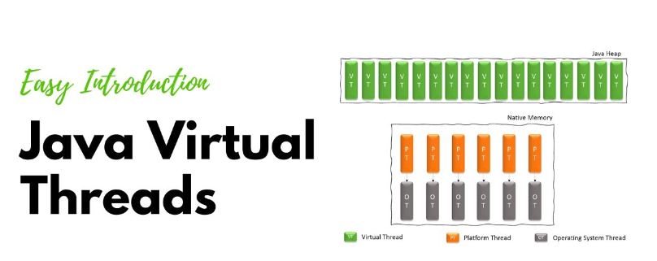
### 한물 간다는 webFlux 를 공부하는게 맞을까 ...?
> 아니다... 왜 사라지는지 확실하게 짚고 넘어가는 게 맞다...

### cpu Bound 와 IO Bound 에 대해서 알아보자
- 단순 cpu 를 쓴다 라고 끝나는게 아니라, 다수의 데이터에 대한 집계 혹은 암호화 등 cpu 계산 능력에 따라 성능이 좌지우지 되는 능력을 말한다.

### 아래 그림을 보자
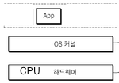

위 그림을 보면 `application 영역`, `커널 영역`, `하드웨어 영역` 을 계층화 하여 추상화로 나타낸 그림이다. <br/> 
여기서 동시간에 하나의 명령어를 처리할 수 있는 CPU core 가 한개 있다고 가정해보자 <br/>

application 은 실행되는 프로세스라고 보면 된다. <br/>
이때 물리적인 cpu core 에 명령을 내린다고 가정해보자 <br/>

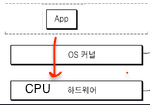

그리고 어플리케이션이 N 개가 더 추가되어 단일 CPU 코어 1 에 각각의 작업을 동작시켰다고 가정해보자. <br/>

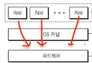

이떄 CPU 코어에서는 동시에 실행한 것처럼 보일수 있다 <br/>

> 그럼 동시에 `병렬` 로 처리한걸까 ? 


그렇지 않다. 동시간대 하나의 명령만 처리 할 수 있기 때문에, 타임 슬라이스를 아주 잘게 나눠서 잘라보면 <br/>
실제로 어플리케이션 1 번과 2 ... N 번이 번갈아 가면서 실행하게 된다. <br/>

이렇게 번갈아 가면서 실행하는 과정을 OS 에서는 Context Switching 이라고 한다.
> 실행관점에서 문맥을 바꾸었다. 라는 의미다.

이러한 컨텍스트 스위칭 (ContextSwitching) 작업들은 CPU Bound 어플리케이션 에서 성능 저하를 가져오게 되는데 <br/>

그림으로 보면 아래와 같다.

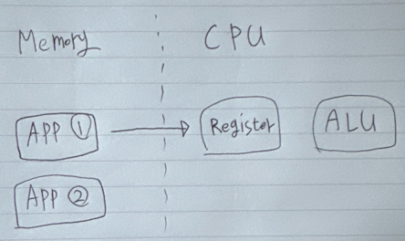

어플리케이션이 실행되어 메모리에 로드되고 프로세스로 동작하게 될텐데. <br/>
CPU 로 스케줄링 되어 실행될때, 기계어 실행을 위해 필요한 데이터들을 cpu Register 로 미리 가져오게 된다. <br/>

그리고 ALU 를 통해 실제 계산을 진행하게 되는데 Register 에는 기존에 어떤 명령까지 진행했는지를 함께 저장 해 놓고 <br/>
필요에 의해 캐시를 해놓기 때문에, 동일한 프로세스의 일을 꾸준히 하면 할 수록 성능적으로 더 효과 적이다.


컨텍스트 스위칭은 위 그림과 같이 어플리케이션 2번을 실행시키기 위해 Register 정보를 초기화 하는 과정부터 시작한다. <br/>
정확히는 어플리케이션 1 번이 실행했던 기존 실행 정보들을 메모리에 별도 저장 해 놓고, 2 번 어플리케이션 데이터 정보를 가져와서 다시 Register 적재를 한 뒤 명령어들을 실행하게 된다. <br/>
하나의 CPU 에서 다수의 프로세스들이 번갈아 가면서 cpu 작업들을 진행해야 하기 때문에 성능상 오버헤드가 발생한다고 할 수 있다. <br/>

### 그럼 여기서 문제...
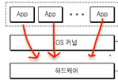

위 어플리케이션 들을 어떻게 실행시키는게 가장 빠를까 
> 하나씩 순차적으로 실행하는게 가장 빠르다 ( 너무 당연한가 ? ) <br/>
> 컨텍스트 스위칭 이라는 오버헤드가 있기 때문 <br/>

### 어떻게 하면 CPU Bound 상황을 효과적으로 만질 수 있을까 ?
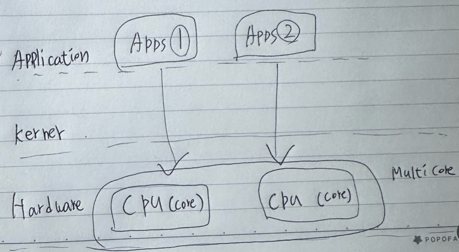

흔히 말할 수 있는 정략은 위와 같이 병렬 처리 되어야 효과적이다. <br/>
동 시간대 각각의 명령어를 동 시간대에 처리할 수 있기 때문이다. <br/>

## I/O Bound 란
입출력 장치의 중점적인 작업들을 말한다. <br/>
대표적인 작업들은 키보드와 같은 사용자 입력, 디스크 파일 복사, 네트워크를 통한 데이터를 주고받는 행위들을 모두 I/O 작업이라고 한다.
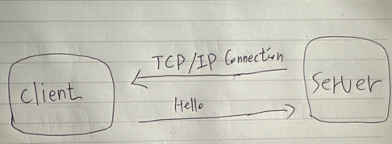

위 그림과 같이 client 와 server 는 연결이 되어있는 상태이고, Hello 라는 문자열을 네트워크를 통해 전송한다고 가정해보자. <br/>

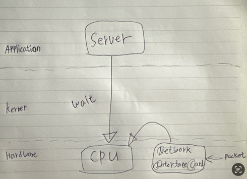

NIC ( Network Interface Card ) 장치 는 네트워크 패킷을 주고 받는 역할을 맡고 있다. <br/>
Client 가 전달한 Hello 패킷을 Nic 장치를 통해 전달받고, 커널에서 네트워크 프로토콜을 진행하게 되는데 <br/> 
서버 application 입장에선, Kerner 에서 패킷을 전달받기 전까지 ```대기``` 를 하게 된다. <br/>
Nic 장치 로 부터 패킷을 받고 커널 까지의 과정 또한 CPU 사용이 필요한 영역이긴 한데, <br/>
application 관점에서는 패킷을 수신 완료까지 를 대기하기 때문에, CPU 를 중점적으로 사용하지 않는 상태라고 볼 수 있다. <br/>
만약 패킷이 오지 않았다 라고 가정한다면, 해당 서버의 프로세스는 계속해서 대기를 하게 되는것이다. <br/>

## Web Application 서버 관점에서 어떠한 I/O 들이 있을까
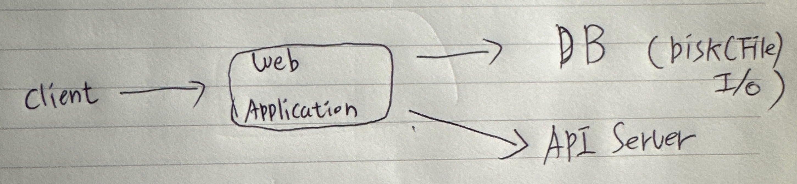

그림으로 보면 클라이언트로 부터 전달 받는 http 프로토콜을 처리하는것도 web Application 에서는 network I/O 이고, <br/> 
Web Application 에서 비즈니스 로직 이후 DB 에 쿼리하는 영역도 I/O 이다. <br/>
또한 DB 시스템에서 데이터를 조회하고, 삭제하고, 저장하는것도 I/O 라고 볼 수 있고, <br/>
Web Application 에서 외부 API 서버 요청 에 대한 것도 네트워크 I/O 가 발생하게 된다 <br/>

> 하나의 웹 서비스 에서도 I/O 작업이 여기저기 산재되어 있는데, 반드시 인지하고 있어야 할 개념이다.

## 만약 클라이언트로 부터 많은 요청이 들어오게 된다면, 어떻게 해야할까
전통적인 해결 방법은 webApplication Thread 갯수를 늘리는 것이다.
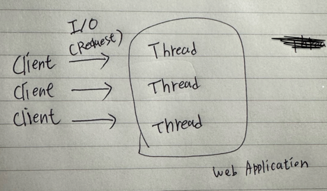

Thread Per Request 혹은 Thread for Connection 이러고도 하는데, 이는 <br/>
하나의 요청에 하나의 Thread 가 필요하다는 의미이다. <br/>

예를들어 굉장히 많은 Thread 가 실행된다고 가정한다면, <br/>
성능 관점에서 CPU 컨텍스트 스위칭을 고려해야 하는데, 이런 컨텍스트 스위칭 오버헤드를 감수하더라도 I/O 요청을 최대한 처리할 수 있도록 하는 전략이라고 볼 수 있다. <br/>

만약에 하나에 Thread 가 하나의 연결을 처리하고 있는 순간 다른 추가 요청이 있게 되면, <br/>
대기를 하는게 아니라 또다른 Thread 를 처리하게 된다. <br/>

만약 대량의 요청을 처리하기 위해 요청 수 만큼 Thread 갯수를 늘리게 되면 결국 OOM 이 나버리게 된다.<br/>
만약 10만의 요청을 동시처리하고 싶다고 가정한다면, `(10 만 * 스레드 크기 )` == `메모리 용량` 이 되버린다.<br/>
거기에 하드웨어 최대 메모리까지 사용하게 되면 시스템이 아예 동작하지 못할수도 있다.<br/>

커널에는 OOM 이라는 안전장치가 존재한다. ( 주요 프로세스를 Kill 해서 시스템 다운을 예방하는 역할 )<br/>

반면 사용이 완료된 Thread 를 삭제하는것도 문제다. <br/>
새로 들어오는 요청에 의해 다시 만들어야 되니까 ..<br/>
결국 쓰레드를 관리해야 하는것이 성능 관점에서 손해이다. <br/>

이떄문에 Thread Pool 이 해결 방안으로 볼 수 있겠다. <br/>

> 가용 가능한 다수의 쓰레드를 미리 만들어 놓고, <br/>
> 요청이 들어오면 미리 만들어 놓은 쓰레드를 활용하고 사용이 다 했으면 해당 쓰레드를 다시 쓰레드 풀 에 반납하는 전략을 말한다. <br/>


