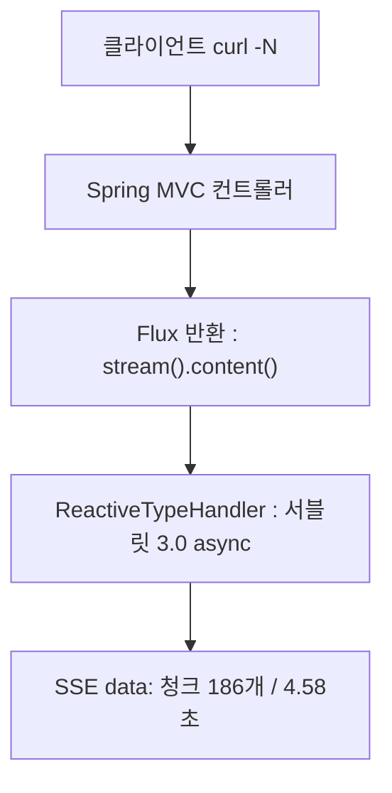

> **TL;DR**
>
> 이번 라운드에서 모델 고르기와 파라미터 튜닝은 중요하지 않았다. Ollama qwen2.5, temperature 0.3 고정.
>
> 실제로 갈랐던 기준은 호출 방식과 응답 형식의 짝이다. `.call()` 에는 JSON, `.stream()` 에는 자연어. 이 짝이 어긋나면 HTTP 500 이 나거나 스트리밍이 의미를 잃는다.
>
> 이 구조에서는 시스템 프롬프트의 형식 지시 한 줄이 `.entity()` 파싱을 지킨다. `CallAdvisor` 가 순수 LLM 왕복만 잰다.

---

1편에서 Spring AI 가 무엇인지 훑었다. 이번에는 도메인을 하나 잡았다. 배달 상담이다.
고객 문의를 받아 카테고리와 긴급도로 분류하는 트리아지 엔드포인트 `/api/v1/support` 부터 시작한다.
모든 수치는 로컬 Ollama `qwen2.5:latest` (4.7GB), temperature 0.3 에서 직접 두드린 값이다.

<style>
.agent-fig,.fig-defs{
  --fig-surface:#ffffff;--fig-ink:#0f172a;--fig-ink2:#334155;--fig-muted:#94a3b8;--fig-hair:#e6eaf1;
  --c-green:#16a34a;--c-greenink:#15803d;--c-red:#ef4444;--c-redink:#b91c1c;
  --c-blue:#2f6fed;--c-blueink:#1d4ed8;--c-amber:#d97706;--c-amberink:#b45309;
}
@media (prefers-color-scheme: dark){
  .agent-fig,.fig-defs{
    --fig-surface:#121317;--fig-ink:#f2f5fa;--fig-ink2:#cbd5e1;--fig-muted:#697588;--fig-hair:#252a33;
    --c-green:#34d399;--c-greenink:#6ee7b7;--c-red:#f87171;--c-redink:#fca5a5;
    --c-blue:#5b9bff;--c-blueink:#93c5fd;--c-amber:#fbbf24;--c-amberink:#fcd34d;
  }
}
.agent-fig{margin:2.4em 0;border:1px solid var(--fig-hair);border-radius:18px;background:var(--fig-surface);
  padding:18px 20px 10px;overflow:hidden;box-shadow:0 1px 2px rgba(2,6,23,.05),0 14px 40px rgba(2,6,23,.09)}
@media (prefers-color-scheme: dark){.agent-fig{box-shadow:0 1px 2px rgba(0,0,0,.4),0 18px 46px rgba(0,0,0,.5)}}
.agent-fig svg{width:100%;height:auto;display:block;max-width:100%}
.agent-fig svg text{font-family:ui-monospace,"SF Mono","JetBrains Mono",Menlo,monospace}
.agent-fig .cap-head{display:flex;justify-content:space-between;align-items:baseline;gap:14px;margin-bottom:6px}
.agent-fig .cap-tag{font-size:11px;letter-spacing:.14em;text-transform:uppercase;color:var(--fig-muted);
  font-family:ui-monospace,SFMono-Regular,Menlo,monospace}
.agent-fig figcaption{font-size:13.5px;color:var(--fig-muted);line-height:1.6;padding:12px 2px 6px;
  font-family:ui-monospace,SFMono-Regular,Menlo,monospace}
.agent-fig figcaption b{color:var(--fig-ink2);font-weight:600}
@media (prefers-reduced-motion: reduce){.agent-fig svg animate,.agent-fig svg animateMotion{display:none}}
</style>

<svg class="fig-defs" width="0" height="0" aria-hidden="true" focusable="false" style="position:absolute;width:0;height:0">
  <defs>
    <filter id="fx-glow" x="-60%" y="-60%" width="220%" height="220%">
      <feGaussianBlur stdDeviation="3" result="b"/>
      <feMerge><feMergeNode in="b"/><feMergeNode in="SourceGraphic"/></feMerge>
    </filter>
  </defs>
</svg>

## LLM 호출은 DB 쿼리와 시간 단위가 다르다

트리아지 5건을 연달아 호출한 첫 실측이 이렇다.

```text
LLM call elapsedMs=9736 promptTokens=1154 completionTokens=96  totalTokens=1250
LLM call elapsedMs=3909 promptTokens=1155 completionTokens=126 totalTokens=1281
LLM call elapsedMs=3737 promptTokens=1149 completionTokens=118 totalTokens=1267
LLM call elapsedMs=3803 promptTokens=1159 completionTokens=121 totalTokens=1280
LLM call elapsedMs=2938 promptTokens=1157 completionTokens=84  totalTokens=1241
```

워밍업 호출은 26164ms 였고 이후에도 한 건에 3~10초다.
DB 쿼리는 밀리초, 외부 REST 는 백 밀리초 단위인데 LLM 은 초 단위다. 같은 동기 블로킹 호출이라도 시간의 자릿수가 두세 자리 다르다.

`.call()` 은 그 시간 내내 서블릿 스레드 하나를 물고 있다. 톰캣 기본 스레드 200개 기준으로 동시 상담 200건이면 스레드 풀이 바닥난다는 계산이 나온다.
다만 이건 계산이지 관측이 아니다. 부하를 걸어 고갈 장면을 직접 본 건 아니라서 이 라운드에서는 "이론상 위험"으로만 적어 둔다.

호출 객체는 요청마다 만들지 않는다. 시스템 프롬프트가 같은 컨트롤러에서는 생성자에서 한 번만 빌드한다.

```java
// com.baedal.support.SupportController
public SupportController(ChatClient.Builder builder) {
    this.chatClient = builder
            .defaultSystem(BaedalPrompt.SYSTEM_PROMPT)
            .build();
}
```

`builder.build()` 가 요청당 1회가 아니라 애플리케이션 생애 1회임을 테스트로 고정했다. 요청마다 프롬프트가 바뀌는 PromptLab 컨트롤러만 예외다.

> 호출 비용의 자릿수가 바뀌면 같은 동기 코드도 다른 설계가 된다.

> **포기한 것**: 스레드 풀 고갈의 실측. 액추에이터 지표와 부하 도구 없이 넘어갔다. 고갈은 여전히 계산 위의 시나리오로 남아 있다.

## 형식 지시 한 줄은 왜 200과 500을 가르나

프롬프트 두 벌을 같은 입력으로 3회씩 돌리는 비교 엔드포인트를 만들었다. 총 18회 호출 중 1건이 HTTP 500 으로 떨어졌다.

죽은 조합은 정해져 있었다. 한 줄짜리 SIMPLE 프롬프트("당신은 친절한 한국 배달 고객 상담사입니다") 에 "어제 시킨 거 먹고 토했어요" 입력.
전체 시스템 프롬프트 ENRICHED 로는 같은 입력이 3회 모두 200 이었다.

인과는 이렇다. 응답은 `.call().entity(SupportResponse.class)` 로 받는다. `BeanOutputConverter` 가 모델 출력에서 JSON 을 뽑아 record 로 변환한다.
SIMPLE 프롬프트에는 "JSON 외 다른 텍스트는 출력하지 않습니다" 라는 형식 지시가 없다. 모델이 자유 자연어로 답하면 변환기는 JSON 을 찾지 못하고 예외가 500 으로 터진다.

<figure class="agent-fig">
  <div class="cap-head"><span class="cap-tag">prompt line vs http status</span><span class="cap-tag">.entity() path</span></div>
  <svg viewBox="0 0 720 230" role="img" aria-label="같은 입력이 형식 지시가 있는 프롬프트에서는 JSON 을 거쳐 200, 없는 프롬프트에서는 자연어가 파서에 걸려 500 으로 갈라진다" xmlns="http://www.w3.org/2000/svg">
    <rect x="16" y="83" width="120" height="64" rx="12" fill="var(--c-blue)" opacity="0.10"/>
    <rect x="16" y="83" width="120" height="64" rx="12" fill="none" stroke="var(--c-blue)" stroke-opacity="0.4"/>
    <text x="76" y="110" text-anchor="middle" font-size="12" fill="var(--fig-ink)">같은 입력</text>
    <text x="76" y="128" text-anchor="middle" font-size="11" fill="var(--fig-muted)">"먹고 토했어요"</text>
    <path d="M136 100 C 190 70, 210 62, 252 62" fill="none" stroke="var(--fig-hair)" stroke-width="1.6"/>
    <path d="M136 130 C 190 160, 210 168, 252 168" fill="none" stroke="var(--fig-hair)" stroke-width="1.6"/>
    <g>
      <rect x="252" y="34" width="180" height="56" rx="12" fill="var(--c-green)" opacity="0.08"/>
      <rect x="252" y="34" width="180" height="56" rx="12" fill="none" stroke="var(--c-green)" stroke-opacity="0.4"/>
      <text x="342" y="57" text-anchor="middle" font-size="12" fill="var(--fig-ink)">형식 지시 있음</text>
      <text x="342" y="75" text-anchor="middle" font-size="10.5" fill="var(--fig-muted)">"JSON 외 출력 금지"</text>
    </g>
    <g>
      <rect x="252" y="140" width="180" height="56" rx="12" fill="var(--c-red)" opacity="0.07"/>
      <rect x="252" y="140" width="180" height="56" rx="12" fill="none" stroke="var(--c-red)" stroke-opacity="0.35"/>
      <text x="342" y="163" text-anchor="middle" font-size="12" fill="var(--fig-ink)">형식 지시 없음</text>
      <text x="342" y="181" text-anchor="middle" font-size="10.5" fill="var(--fig-muted)">자유 자연어 응답</text>
    </g>
    <path d="M432 62 L500 62" fill="none" stroke="var(--fig-hair)" stroke-width="1.6"/>
    <path d="M432 168 L500 168" fill="none" stroke="var(--fig-hair)" stroke-width="1.6"/>
    <g>
      <rect x="500" y="34" width="200" height="56" rx="12" fill="var(--c-green)" opacity="0.12"/>
      <rect x="500" y="34" width="200" height="56" rx="12" fill="none" stroke="var(--c-green)" stroke-opacity="0.5"/>
      <text x="600" y="57" text-anchor="middle" font-size="13" font-weight="700" fill="var(--c-greenink)">200 SupportResponse</text>
      <text x="600" y="75" text-anchor="middle" font-size="10.5" fill="var(--fig-muted)">entity() 변환 성공</text>
    </g>
    <g>
      <rect x="500" y="140" width="200" height="56" rx="12" fill="var(--c-red)" opacity="0.12"/>
      <rect x="500" y="140" width="200" height="56" rx="12" fill="none" stroke="var(--c-red)" stroke-width="1.4">
        <animate attributeName="stroke-opacity" values="1;0.3;1" dur="2.4s" repeatCount="indefinite"/>
      </rect>
      <text x="600" y="163" text-anchor="middle" font-size="13" font-weight="700" fill="var(--c-redink)">500 Internal Error</text>
      <text x="600" y="181" text-anchor="middle" font-size="10.5" fill="var(--fig-muted)">JSON 추출 실패</text>
    </g>
    <circle r="4.5" fill="var(--c-green)" filter="url(#fx-glow)">
      <animateMotion path="M136 100 C 190 70, 210 62, 252 62 L432 62 L600 62" dur="5.6s" repeatCount="indefinite"/>
      <animate attributeName="opacity" values="0;1;1;0" keyTimes="0;0.08;0.9;1" dur="5.6s" repeatCount="indefinite"/>
    </circle>
    <circle r="4.5" fill="var(--c-red)" filter="url(#fx-glow)">
      <animateMotion path="M136 130 C 190 160, 210 168, 252 168 L432 168 L470 168" dur="5.6s" repeatCount="indefinite"/>
      <animate attributeName="opacity" values="0;1;1;0" keyTimes="0;0.08;0.62;0.7" dur="5.6s" repeatCount="indefinite"/>
    </circle>
  </svg>
  <figcaption>18회 중 유일한 500. 아래 레인의 점은 파서 앞에서 소멸한다. <b>형식 지시 한 줄</b>이 문체 지시가 아니라 엔드포인트 안정성 가드였다.</figcaption>
</figure>

프롬프트의 그 한 줄은 파서의 일부다. 프롬프트와 `BeanOutputConverter` 는 한 몸으로 배포된다. 한쪽만 고치면 런타임에서 갈라진다.

> 구조화 응답에서 형식 지시는 파서의 일부다. 프롬프트 수정은 코드 수정과 같은 무게로 리뷰한다.

## consistency 1.0 은 무엇을 보장하지 않나

프롬프트 비교의 지표로 categoryConsistency 를 만들었다. 같은 입력을 3회 돌려 가장 많이 나온 카테고리의 비율이다.

"음식에 머리카락이 나왔어요" 입력의 결과가 지표의 함정을 그대로 보여 줬다.

| 프롬프트 | category 분포 | urgency | consistency |
|---|---|---|---|
| SIMPLE | QUALITY 3 | HIGH 3 | 1.0 |
| ENRICHED | QUALITY 1, SAFETY 2 | CRITICAL 3 | 0.67 |

숫자만 보면 SIMPLE 이 이긴다. 그런데 SIMPLE 의 1.0 은 카테고리 정의 자체가 없어서 모델이 자기 사전 분포로 수렴한 결과다.
이물질 신고를 식품안전 트랙으로 올릴지 품질 트랙으로 처리할지는 상담 조직의 SOP 문제인데, 그 기준 없이 나온 안정성이 1.0 으로 찍힌다.

```java
// categoryConsistency = maxCategoryCount / totalRuns
long maxCat = catCounts.values().stream().mapToLong(Long::longValue).max().orElse(0);
return new PromptLabResult(results.size(), catCounts, urgCounts,
        results.isEmpty() ? 0 : (double) maxCat / results.size());
```

이 지표는 흔들림만 잰다. 정답을 모른다. 잘못된 분류가 안정적으로 반복돼도 1.0 이다.

> 정답 라벨이 없는 일관성 지표는 틀린 답의 안정성도 1.0 으로 읽는다.

> **포기한 것**: 사람이 라벨링한 골든 셋 20건. 이게 없어서 정밀도 대신 흔들림만 쟀다. "잘못된 정답의 1.0" 을 지표로는 못 걸러낸다. temperature 를 0 으로 내리는 실험도 접었다. consistency 가 올라도 프롬프트 덕인지 샘플링이 좁아진 덕인지 구분이 안 되기 때문이다.

## JSON 을 스트리밍하면 무엇이 남나

블로킹의 답으로 스트리밍을 붙였다. 코드는 세 줄이다.

```java
@PostMapping(produces = MediaType.TEXT_EVENT_STREAM_VALUE)
public Flux<String> chatStream(@Valid @RequestBody ChatRequest req) {
    return chatClient.prompt()
            .user(req.message())
            .stream()
            .content();
}
```

`Flux<String>` 을 반환해도 WebFlux 전환이 아니다. Spring MVC 위에서 `ReactiveTypeHandler` 가 서블릿 3.0 async 로 처리한다.
`produces = text/event-stream` 을 명시해야 Jackson 이 Flux 를 배열로 통째 직렬화하지 않고 청크마다 `data:` 로 흘린다.



실측에서 4.58초 동안 186개 청크가 흘렀다. 그런데 트리아지용 시스템 프롬프트를 그대로 쓴 탓에 내용이 JSON 이었다.

```text
data:{
data:summary
data:고
data:객
data:님
```

부분 JSON 은 클라이언트가 쓸 수 없다. 다 모아야 파싱이 된다. 그러면 사용성은 `.call()` 과 같아진다. 남는 건 첫 글자가 빨리 온다는 것뿐이다.

> 호출 방식은 응답 형식과 짝으로 정한다. JSON 이면 `.call()`, 자연어면 `.stream()`.

## 측정 코드는 왜 컨트롤러 밖으로 나갔나

지연과 토큰을 재려고 컨트롤러에 `log.info` 를 박으면 두 가지가 무너진다. 컨트롤러마다 복붙이 생긴다. 측정 구간에는 `.entity()` 변환 시간이 섞인다.

측정을 `CallAdvisor` 로 분리하면 `chain.nextCall(request)` 앞뒤를 잡아 순수 LLM 왕복만 잰다.

```java
@Override public int getOrder() { return 100; }  // 체인 바깥쪽

@Override
public ChatClientResponse adviseCall(ChatClientRequest request, CallAdvisorChain chain) {
    long startNanos = System.nanoTime();
    ChatClientResponse response = chain.nextCall(request);
    logSuccess(elapsedMs(startNanos), response);
    return response;
}
```

토큰 메타데이터가 null 이면 로그에 `promptTokens=null` 그대로 남긴다. 0 으로 채우면 진짜 0 과 구분되지 않는다.

이 측정이 붙고 나서야 보인 것이 있다. promptTokens 가 5건 모두 1149~1159 로 거의 같다. 시스템 프롬프트가 약 1130 토큰을 매 호출마다 깔고 있다는 뜻이다.
그리고 응답 필드 두 개가 무너져 있었다. "근거가 부족하면 LOW" 라고 지시한 confidenceLevel 은 5건 전부 MEDIUM 이었다. "모르면 null 허용" 이던 estimatedResolutionMinutes 는 5건 전부 null 이었다.
주문번호가 명시된 문의도, 단서가 거의 없는 문의도 같은 MEDIUM 이다. 지시가 있다고 모델이 따르는 게 아니다.

> 응답 스키마에 필드를 늘리는 건 공짜가 아니다. 그 필드가 실제 분포를 만드는지는 실측이 정한다.

## 이 라운드가 남긴 불변식

- 프롬프트와 파서는 한 몸이다. 형식 지시 한 줄이 빠지자 18회 중 1건이 500 으로 갈라졌다.
- 일관성 지표는 정답을 모른다. 머리카락 입력의 SIMPLE 1.0 이 반례다.
- 호출 방식은 응답 형식의 함수다. JSON 스트리밍 186 청크는 TTFT 말고 아무것도 남기지 않았다.
- 측정은 호출 체인 안에 둔다. 컨트롤러 측정은 변환 시간이 섞인 다른 숫자를 잰다.

## 아직 해결하지 않은 범위

TTFT 는 재지 못했다. `CallAdvisor` 는 `.call()` 전용이라 스트리밍 경로는 측정 사각지대다.
Advisor 의 실패 로그는 정상 경로만 두드려서 한 번도 발화하지 않았다. Ollama 를 끄고 검증하는 일이 남아 있다.
매 호출 1130 토큰짜리 시스템 프롬프트의 상시 비용도 그대로다.

가장 큰 질문은 경계다. 지금 모델은 분류만 한다. 다음 라운드에서 주문 데이터를 만질 능력을 주면, 판단과 실행의 경계는 어디에 그어야 하나.
3편은 Tool Calling 이다.
