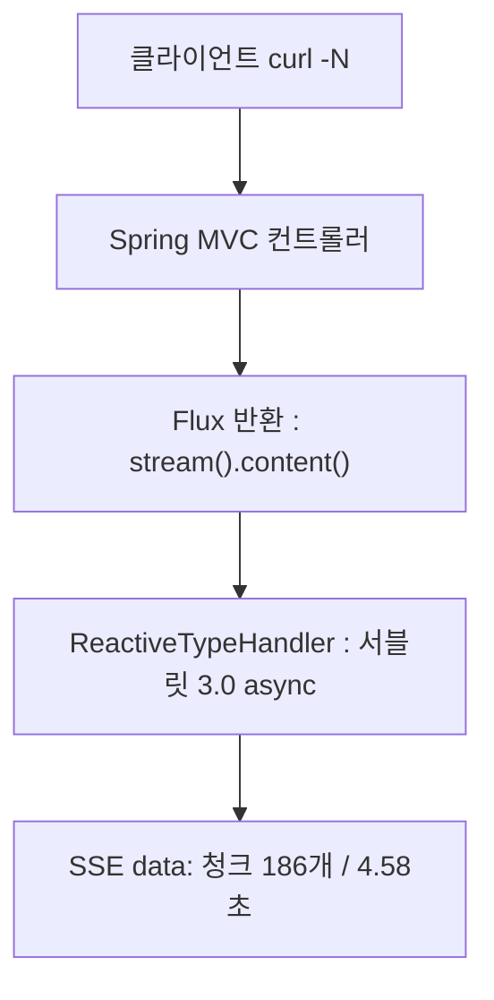

LLM을 서비스에 붙이는 일은 신입 상담사를 채용하는 일과 비슷하다. 면접(데모)에서는 못 하는 말이 없는데, 실제로 창구에 앉혀보기 전까지는 어디서 사고를 칠지 알 수 없다. 그래서 붙여보고, 재보고, 사고 친 기록을 남기는 수밖에 없다.

1편에서 "Toy Project 딱대"라고 호기롭게 적어놓고 한참을 미뤘다. 그러다 6주짜리 Spring AI 에이전트 과정(루퍼스 부트캠프)을 만나면서 도망갈 곳이 없어졌고, 배달 상담 에이전트를 만들며 매주 직접 재본 기록이 쌓였다. 이 시리즈는 그 기록이다.

2편은 모든 것의 시작인 `.call()` 한 줄에서 출발한다. 첫 주에 만든 것은 고객 문의를 받아 카테고리와 긴급도를 JSON으로 분류하는 트리아지 엔드포인트 하나였는데, 이 소박한 API에서만 네 번 넘어졌다. 첫 호출이 10초 걸렸고, 프롬프트에서 한 줄을 뺐더니 500이 터졌고, 스트리밍을 붙였더니 JSON이 한 글자씩 흘러나왔고, 정성 들여 만든 응답 필드는 전부 같은 값만 뱉었다.

실측 환경을 먼저 적어둔다. 로컬 Ollama `qwen2.5:latest`(4.7GB), temperature 0.3. 이 글의 모든 수치는 이 환경에서 curl로 직접 두드린 값이므로 수치 자체보다는 경향으로 읽는 것이 좋다.

<style>
.agent-fig,.fig-defs{
  --fig-surface:#ffffff;--fig-ink:#0f172a;--fig-ink2:#334155;--fig-muted:#94a3b8;--fig-hair:#e6eaf1;
  --c-green:#16a34a;--c-greenink:#15803d;--c-red:#ef4444;--c-redink:#b91c1c;
  --c-blue:#2f6fed;--c-blueink:#1d4ed8;--c-amber:#d97706;--c-amberink:#b45309;
}
@media (prefers-color-scheme: dark){
  .agent-fig,.fig-defs{
    --fig-surface:#121317;--fig-ink:#f2f5fa;--fig-ink2:#cbd5e1;--fig-muted:#697588;--fig-hair:#252a33;
    --c-green:#34d399;--c-greenink:#6ee7b7;--c-red:#f87171;--c-redink:#fca5a5;
    --c-blue:#5b9bff;--c-blueink:#93c5fd;--c-amber:#fbbf24;--c-amberink:#fcd34d;
  }
}
.agent-fig{margin:2.4em 0;border:1px solid var(--fig-hair);border-radius:18px;background:var(--fig-surface);
  padding:18px 20px 10px;overflow:hidden;box-shadow:0 1px 2px rgba(2,6,23,.05),0 14px 40px rgba(2,6,23,.09)}
@media (prefers-color-scheme: dark){.agent-fig{box-shadow:0 1px 2px rgba(0,0,0,.4),0 18px 46px rgba(0,0,0,.5)}}
.agent-fig svg{width:100%;height:auto;display:block;max-width:100%}
.agent-fig svg text{font-family:ui-monospace,"SF Mono","JetBrains Mono",Menlo,monospace}
.agent-fig .cap-head{display:flex;justify-content:space-between;align-items:baseline;gap:14px;margin-bottom:6px}
.agent-fig .cap-tag{font-size:11px;letter-spacing:.14em;text-transform:uppercase;color:var(--fig-muted);
  font-family:ui-monospace,SFMono-Regular,Menlo,monospace}
.agent-fig figcaption{font-size:13.5px;color:var(--fig-muted);line-height:1.6;padding:12px 2px 6px;
  font-family:ui-monospace,SFMono-Regular,Menlo,monospace}
.agent-fig figcaption b{color:var(--fig-ink2);font-weight:600}
@media (prefers-reduced-motion: reduce){.agent-fig svg animate,.agent-fig svg animateMotion{display:none}}
</style>

<svg class="fig-defs" width="0" height="0" aria-hidden="true" focusable="false" style="position:absolute;width:0;height:0">
  <defs>
    <filter id="fx-glow" x="-60%" y="-60%" width="220%" height="220%">
      <feGaussianBlur stdDeviation="3" result="b"/>
      <feMerge><feMergeNode in="b"/><feMergeNode in="SourceGraphic"/></feMerge>
    </filter>
  </defs>
</svg>

## 초 단위로 움직이는 호출

서버 개발자가 다루는 시간에는 대략의 눈금이 있다. DB 쿼리는 밀리초, 외부 REST API는 수십에서 수백 밀리초. 코드를 짤 때 의식하지 않아도 몸이 이 눈금을 기억하고 있다.

LLM 호출은 이 눈금 바깥에 있다. 트리아지 5건을 연달아 호출한 첫 실측을 보자.

```text
LLM call elapsedMs=9736 promptTokens=1154 completionTokens=96  totalTokens=1250
LLM call elapsedMs=3909 promptTokens=1155 completionTokens=126 totalTokens=1281
LLM call elapsedMs=3737 promptTokens=1149 completionTokens=118 totalTokens=1267
LLM call elapsedMs=3803 promptTokens=1159 completionTokens=121 totalTokens=1280
LLM call elapsedMs=2938 promptTokens=1157 completionTokens=84  totalTokens=1241
```

한 건에 3~10초. 모델을 처음 깨우는 워밍업 호출은 26초였다. 처음엔 뭘 잘못 만든 줄 알았는데, 이게 로컬 7B 모델의 평상시 속도다. 같은 "동기 호출"이라는 이름을 쓰지만 DB 쿼리와는 시간의 자릿수가 두세 칸 다르다.

문제는 `.call()`이 그 시간 내내 서블릿 스레드 하나를 붙잡고 있다는 점이다. 은행에 비유하면 창구 직원이 손님 한 명의 전화 상담을 10초씩 붙들고 있는 셈이다. 톰캣의 기본 창구는 200개이므로, 동시 상담이 200건을 넘는 순간 새 손님은 줄만 서게 된다는 계산이 나온다. 다만 이것은 계산이지 관측이 아니다. 실제로 부하를 걸어 고갈되는 장면을 본 것은 아니어서, 이번 라운드에서는 "이론상 위험"으로만 적어두었다.

호출 객체를 다루는 방식은 처음부터 정해두는 게 좋다. 시스템 프롬프트가 고정된 컨트롤러라면 ChatClient는 생성자에서 한 번만 빌드한다.

```java
// com.baedal.support.SupportController
public SupportController(ChatClient.Builder builder) {
    this.chatClient = builder
            .defaultSystem(BaedalPrompt.SYSTEM_PROMPT)
            .build();
}
```

요청마다 `builder.build()`를 다시 부르는 코드는 AI에게 예시를 뽑아달라고 하면 자주 나오는 패턴인데, 빌드가 애플리케이션 생애에 1회인지 요청당 1회인지는 테스트로 박아두었다. 요청마다 프롬프트가 바뀌는 실험용 컨트롤러 하나만 예외다.

## 프롬프트 한 줄이 API를 무너뜨리는 순간

프롬프트를 얼마나 정성 들여 써야 하는지 감을 잡고 싶었다. 그래서 같은 입력을 두 가지 프롬프트로 3회씩 돌려 분류가 얼마나 흔들리는지 보는 비교용 엔드포인트를 만들었다. 한쪽은 카테고리 정의와 금지 규칙까지 담은 전체 프롬프트(ENRICHED), 다른 한쪽은 "당신은 친절한 한국 배달 고객 상담사입니다" 한 줄(SIMPLE)이다.

총 18회 호출 중 1건이 HTTP 500으로 죽었다. 죽은 조합은 정해져 있었다. SIMPLE 프롬프트에 "어제 시킨 거 먹고 토했어요" 입력. 같은 입력이 ENRICHED에서는 3회 모두 200이었다.

범인을 쫓다가 처음 세운 가설부터 틀렸다는 걸 알았다. 응답은 `.call().entity(SupportResponse.class)`로 받는다. 그런데 `.entity()`를 쓰면 Spring AI의 `BeanOutputConverter`가 응답 스키마에서 뽑은 JSON 형식 지시를 프롬프트에 자동으로 덧붙인다. 즉 SIMPLE에도 형식 지시가 아예 없던 게 아니다. 자동으로 붙는 지시 하나는 이미 있었다. ENRICHED에만 더 있던 것은 "JSON 외 다른 텍스트는 출력하지 않습니다"라는 명시적 보강 한 줄이다.

관측된 사실은 이렇다. 자동 지시만 있던 SIMPLE은 그 입력에서 3회 중 1회 자연어로 새어 나가 `BeanOutputConverter`가 JSON 추출에 실패했고 500이 났다. 자동 지시에 명시 보강까지 얹은 ENRICHED는 3회 모두 JSON을 지켰다. 다만 깨진 건 18회 전체에서 딱 1회다. 이 표본으로 "명시 한 줄이 500을 막는다"고 인과를 단정할 수는 없다. 말할 수 있는 데까지만 적으면, 형식 지시를 자동에만 맡기면 작은 페르소나 프롬프트에서도 파서가 깨질 수 있고 명시 보강이 그 확률을 낮추는 것으로 보인다. 아래 그림이 그 갈림길이다.

<figure class="agent-fig">
  <div class="cap-head"><span class="cap-tag">prompt line vs http status</span><span class="cap-tag">.entity() path</span></div>
  <svg viewBox="0 0 720 230" role="img" aria-label="같은 입력이 형식 지시가 있는 프롬프트에서는 JSON 을 거쳐 200, 없는 프롬프트에서는 자연어가 파서에 걸려 500 으로 갈라진다" xmlns="http://www.w3.org/2000/svg">
    <rect x="16" y="83" width="120" height="64" rx="12" fill="var(--c-blue)" opacity="0.10"/>
    <rect x="16" y="83" width="120" height="64" rx="12" fill="none" stroke="var(--c-blue)" stroke-opacity="0.4"/>
    <text x="76" y="110" text-anchor="middle" font-size="12" fill="var(--fig-ink)">같은 입력</text>
    <text x="76" y="128" text-anchor="middle" font-size="11" fill="var(--fig-muted)">"먹고 토했어요"</text>
    <path d="M136 100 C 190 70, 210 62, 252 62" fill="none" stroke="var(--fig-hair)" stroke-width="1.6"/>
    <path d="M136 130 C 190 160, 210 168, 252 168" fill="none" stroke="var(--fig-hair)" stroke-width="1.6"/>
    <g>
      <rect x="252" y="34" width="180" height="56" rx="12" fill="var(--c-green)" opacity="0.08"/>
      <rect x="252" y="34" width="180" height="56" rx="12" fill="none" stroke="var(--c-green)" stroke-opacity="0.4"/>
      <text x="342" y="57" text-anchor="middle" font-size="12" fill="var(--fig-ink)">자동 지시 + 명시 보강</text>
      <text x="342" y="75" text-anchor="middle" font-size="10.5" fill="var(--fig-muted)">"JSON 외 출력 금지" 한 줄</text>
    </g>
    <g>
      <rect x="252" y="140" width="180" height="56" rx="12" fill="var(--c-red)" opacity="0.07"/>
      <rect x="252" y="140" width="180" height="56" rx="12" fill="none" stroke="var(--c-red)" stroke-opacity="0.35"/>
      <text x="342" y="163" text-anchor="middle" font-size="12" fill="var(--fig-ink)">자동 지시만 (보강 없음)</text>
      <text x="342" y="181" text-anchor="middle" font-size="10.5" fill="var(--fig-muted)">자연어로 샌 1회</text>
    </g>
    <path d="M432 62 L500 62" fill="none" stroke="var(--fig-hair)" stroke-width="1.6"/>
    <path d="M432 168 L500 168" fill="none" stroke="var(--fig-hair)" stroke-width="1.6"/>
    <g>
      <rect x="500" y="34" width="200" height="56" rx="12" fill="var(--c-green)" opacity="0.12"/>
      <rect x="500" y="34" width="200" height="56" rx="12" fill="none" stroke="var(--c-green)" stroke-opacity="0.5"/>
      <text x="600" y="57" text-anchor="middle" font-size="13" font-weight="700" fill="var(--c-greenink)">200 SupportResponse</text>
      <text x="600" y="75" text-anchor="middle" font-size="10.5" fill="var(--fig-muted)">entity() 변환 성공</text>
    </g>
    <g>
      <rect x="500" y="140" width="200" height="56" rx="12" fill="var(--c-red)" opacity="0.12"/>
      <rect x="500" y="140" width="200" height="56" rx="12" fill="none" stroke="var(--c-red)" stroke-width="1.4">
        <animate attributeName="stroke-opacity" values="1;0.3;1" dur="2.4s" repeatCount="indefinite"/>
      </rect>
      <text x="600" y="163" text-anchor="middle" font-size="13" font-weight="700" fill="var(--c-redink)">500 Internal Error</text>
      <text x="600" y="181" text-anchor="middle" font-size="10.5" fill="var(--fig-muted)">JSON 추출 실패</text>
    </g>
    <circle r="4.5" fill="var(--c-green)" filter="url(#fx-glow)">
      <animateMotion path="M136 100 C 190 70, 210 62, 252 62 L432 62 L600 62" dur="5.6s" repeatCount="indefinite"/>
      <animate attributeName="opacity" values="0;1;1;0" keyTimes="0;0.08;0.9;1" dur="5.6s" repeatCount="indefinite"/>
    </circle>
    <circle r="4.5" fill="var(--c-red)" filter="url(#fx-glow)">
      <animateMotion path="M136 130 C 190 160, 210 168, 252 168 L432 168 L470 168" dur="5.6s" repeatCount="indefinite"/>
      <animate attributeName="opacity" values="0;1;1;0" keyTimes="0;0.08;0.62;0.7" dur="5.6s" repeatCount="indefinite"/>
    </circle>
  </svg>
  <figcaption>둘 다 <b>자동 형식 지시</b>는 있었다. 차이는 명시 보강 한 줄뿐이고, 18회 중 깨진 1회가 아래 레인이다. 인과 단정이 아니라 상관 관측이다.</figcaption>
</figure>

여기서 프롬프트를 보는 눈이 하나 바뀐다. 형식 지시는 자동으로 붙지만, 그 자동 지시를 모델이 지킬지는 보강 문구와 페르소나 프롬프트에 따라 흔들린다. 프롬프트와 `BeanOutputConverter`가 한 몸으로 배포된다는 사실은 그대로다. 프롬프트만 고쳐도 컴파일러는 아무 말이 없지만 런타임이 500으로 알려준다. 프롬프트 수정을 코드 수정과 같은 무게로 리뷰해야 하는 이유다.

## 일관성 1.0이라는 함정

프롬프트 비교에는 지표가 필요했다. 그래서 같은 입력 3회 중 가장 많이 나온 카테고리의 비율을 재는 categoryConsistency를 만들었다.

```java
// categoryConsistency = maxCategoryCount / totalRuns
long maxCat = catCounts.values().stream().mapToLong(Long::longValue).max().orElse(0);
return new PromptLabResult(results.size(), catCounts, urgCounts,
        results.isEmpty() ? 0 : (double) maxCat / results.size());
```

"음식에 머리카락이 나왔어요"라는 입력의 결과가 재미있다.

| 프롬프트 | category 분포 | urgency | consistency |
|---|---|---|---|
| SIMPLE | QUALITY 3 | HIGH 3 | 1.0 |
| ENRICHED | QUALITY 1, SAFETY 2 | CRITICAL 3 | 0.67 |

숫자만 보면 한 줄짜리 SIMPLE의 완승이다. 1.0 대 0.67. "프롬프트 정성 들여 쓸 필요 없는 거 아닌가?"라는 생각이 들 수 있다. 실제로 잠깐 그랬다.

하지만 SIMPLE의 1.0은 좀 이상한 1.0이다. 이물질 신고를 식품안전 트랙으로 올릴지 품질 트랙으로 처리할지는 상담 조직의 업무 기준(SOP)이 정하는 문제인데, SIMPLE에는 그 기준 자체가 없다. 기준이 없으니 모델은 자기가 학습한 사전 지식으로 수렴했고, 그 수렴이 안정적이었을 뿐이다. 시험 범위를 안 알려줬더니 학생이 자기 마음대로 정한 답을 세 번 똑같이 적어냈고, 채점 기준이 "답이 매번 같은가"뿐이라 만점을 받은 상황이다.

일관성 지표는 흔들림만 잰다. 정답은 모른다. 틀린 분류가 안정적으로 반복되어도 1.0이 나온다. 이 함정을 피하려면 사람이 라벨링한 골든 셋이 필요한데, 이번 라운드에는 그것이 없어서 정밀도 대신 흔들림만 쟀다. temperature를 0으로 내리는 실험도 일부러 하지 않았다. consistency가 올라도 프롬프트가 좋아진 것인지 샘플링이 좁아진 것인지 구분할 수 없기 때문이다.

## JSON을 한 글자씩 흘려보내면 생기는 일

10초 블로킹의 다음 수순은 자연스럽게 스트리밍이다. 코드는 허무할 만큼 짧다.

```java
@PostMapping(produces = MediaType.TEXT_EVENT_STREAM_VALUE)
public Flux<String> chatStream(@Valid @RequestBody ChatRequest req) {
    return chatClient.prompt()
            .user(req.message())
            .stream()
            .content();
}
```

`Flux<String>`을 반환한다고 해서 WebFlux로 갈아타는 것은 아니다. Spring MVC 위에서 `ReactiveTypeHandler`가 서블릿 3.0 async로 처리해준다. 대신 `produces = text/event-stream`을 명시해야 한다. 빼먹으면 Jackson이 Flux를 기다렸다가 배열 하나로 통째 직렬화해버려서, 스트리밍을 붙이고도 스트리밍이 아니게 된다.



`curl -N`으로 두드리니 4.58초 동안 186개의 청크가 흘러나왔다. 여기까지는 성공이다. 문제는 내용물이었다. 트리아지용 시스템 프롬프트를 그대로 물려놓은 탓에, 흘러나오는 것이 JSON이었다.

```text
data:{
data:summary
data:고
data:객
data:님
```

JSON이 한 글자씩 도착하는 광경은 잠깐 웃기고 나서 곤란해진다. 부분 JSON은 클라이언트가 쓸 수 없다. 결국 클라이언트는 청크를 다 모아서 파싱해야 하고, 그러면 체감상 `.call()`과 똑같아진다. 얻은 것은 첫 글자가 빨리 도착한다는 사실 하나뿐이다.

정리하면 호출 방식과 응답 형식은 짝이다. 구조화된 JSON이 필요하면 `.call()`, 사람이 읽는 자연어면 `.stream()`. 짝을 어기면 500이 나거나(형식 지시 없는 `.call()`), 스트리밍이 무의미해진다(JSON 강제 `.stream()`). 스트리밍 경로에는 자연어 전용 프롬프트를 따로 둬야 한다는 숙제가 여기서 생겼다.

## 측정은 컨트롤러 밖에서

지연과 토큰을 재고 싶을 때 가장 쉬운 방법은 컨트롤러에 `log.info`를 박는 것이다. 하지만 그러면 컨트롤러마다 측정 코드가 복붙되고, 측정 구간에 `.entity()` 변환 시간까지 섞인다. 재고 싶은 것은 순수 LLM 왕복인데 말이다.

Spring AI에는 이 용도로 `CallAdvisor`라는 자리가 있다. `chain.nextCall(request)` 앞뒤를 잡으면 왕복만 정확히 잰다. Spring AOP의 `@Around`와 결이 같다.

```java
@Override public int getOrder() { return 100; }  // 스타터 주석: 큰 값일수록 바깥쪽

@Override
public ChatClientResponse adviseCall(ChatClientRequest request, CallAdvisorChain chain) {
    long startNanos = System.nanoTime();
    ChatClientResponse response = chain.nextCall(request);
    logSuccess(elapsedMs(startNanos), response);
    return response;
}
```

`getOrder()`를 100으로 둔 건 스타터 코드 주석이 "큰 값이면 체인 바깥쪽에서 측정한다"고 안내했기 때문이다. 실제로 100이 정말 바깥인지는 Advisor 둘을 끼워 실행 순서를 로그로 찍어봐야 확인되는데, 이번 주는 거기까진 안 갔다. 그래서 지금은 주석을 신뢰한 값이다.

토큰 메타데이터가 null이면 로그에 `promptTokens=null`을 그대로 남긴다. 0으로 채우면 진짜 0과 구분할 수 없기 때문이다.

측정이 붙고 나서야 보이는 것들이 있었다. 우선 promptTokens가 5건 모두 1149~1159로 거의 같았다. 상담 문의 길이와 거의 무관하게 매 호출 1150토큰 안팎이 고정으로 깔린다는 뜻이다. 다만 이 고정분을 전부 시스템 프롬프트 몫으로 볼 수는 없다. `.entity()`가 붙이는 `SupportResponse` 스키마(필드 7개, enum 3개)도 매 호출 프롬프트에 함께 실리기 때문이다. 시스템 프롬프트만 따로 토큰화하거나 `.content()`와 비교해보기 전까지, 확실한 건 "고정 오버헤드가 1150토큰쯤 된다"까지다.

그리고 정성 들여 설계한 응답 필드 두 개가 조용히 무너져 있었다. "근거가 부족하면 LOW로 낮춘다"고 지시한 confidenceLevel은 5건 전부 MEDIUM이었다. 주문번호까지 명시된 문의도 MEDIUM, 단서가 거의 없는 문의도 MEDIUM. "모르면 null을 허용한다"던 estimatedResolutionMinutes는 5건 전부 null이었다. 지시를 넣으면 모델이 따를 것이라고 생각했지만, 적어도 이 모델에서 이 두 필드는 지시만으로 움직이지 않았다. 스키마에 필드를 추가하는 것은 공짜지만, 그 필드가 의미 있는 값을 갖는지는 실측만이 알려준다.

## 다음 이야기

첫 주는 예상보다 많이 넘어진 주였다. LLM 호출이 초 단위라는 것, `.entity()`가 형식 지시를 자동으로 붙이지만 작은 프롬프트에선 그게 깨질 수도 있다는 것까지는 그래도 납득이 갔다. 뜻밖은 두 가지였다. 정답 라벨이 없으니 일관성 1.0이 틀린 분류에도 찍혔고, JSON을 스트리밍했더니 첫 글자만 빨라진 채 결국 `.call()`과 같아졌다.

못 간 곳도 있다. 스트리밍 경로의 TTFT(첫 토큰까지의 시간)는 `CallAdvisor`가 `.call()` 전용이라 재지 못했다. Advisor의 실패 로그는 정상 경로만 돌린 탓에 한 번도 발화하지 않았다. 매 호출 1150토큰쯤 되는 고정 오버헤드가 시스템 프롬프트와 응답 스키마로 각각 얼마씩 나뉘는지도 아직 안 재봤다.

정작 지금 이 봇은 분류만 할 뿐 아무것도 실행하지 못한다. 다음 주는 모델에게 주문 데이터를 만질 손을 달아주는 Tool Calling이다. 손을 달아주자마자 봇이 거짓말을 시작했는데, 그 얘기는 3편에서 한다.
