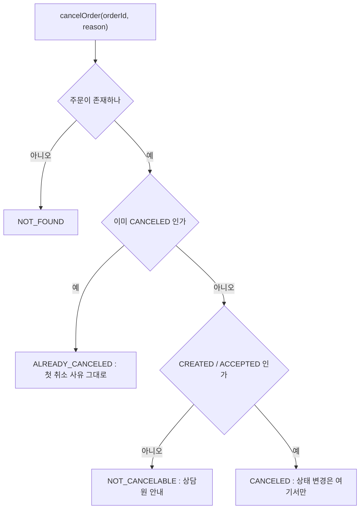

> **TL;DR**
>
> 이번 라운드에서 Tool 을 몇 개 붙이느냐는 중요하지 않았다. 3개면 충분했다.
>
> 실제로 갈랐던 기준은 LLM 의 자유를 어디까지 줄이느냐다. 응답 형태를 enum 으로 좁히고 View DTO 로 노출 범위를 좁힐수록 사용자에게 가는 답이 정확해졌다.
>
> 이 구조에서는 취소 요청이 두 번 와도 데이터가 한 번만 바뀐다. 모델은 Outcome 값을 자연어로 옮기기만 한다.

---

2편의 챗봇은 분류만 했다. 이번에는 주문 데이터를 만질 능력을 준다.
`@Tool` 3개(주문 상세, 배달 상태, 주문 취소)를 Spring Bean 에 붙이고 `/api/v1/assistant` 로 두드렸다.
환경은 그대로 Ollama `qwen2.5`, temperature 0.3 이다.

<style>
.agent-fig,.fig-defs{
  --fig-surface:#ffffff;--fig-ink:#0f172a;--fig-ink2:#334155;--fig-muted:#94a3b8;--fig-hair:#e6eaf1;
  --c-green:#16a34a;--c-greenink:#15803d;--c-red:#ef4444;--c-redink:#b91c1c;
  --c-blue:#2f6fed;--c-blueink:#1d4ed8;--c-amber:#d97706;--c-amberink:#b45309;
}
@media (prefers-color-scheme: dark){
  .agent-fig,.fig-defs{
    --fig-surface:#121317;--fig-ink:#f2f5fa;--fig-ink2:#cbd5e1;--fig-muted:#697588;--fig-hair:#252a33;
    --c-green:#34d399;--c-greenink:#6ee7b7;--c-red:#f87171;--c-redink:#fca5a5;
    --c-blue:#5b9bff;--c-blueink:#93c5fd;--c-amber:#fbbf24;--c-amberink:#fcd34d;
  }
}
.agent-fig{margin:2.4em 0;border:1px solid var(--fig-hair);border-radius:18px;background:var(--fig-surface);
  padding:18px 20px 10px;overflow:hidden;box-shadow:0 1px 2px rgba(2,6,23,.05),0 14px 40px rgba(2,6,23,.09)}
@media (prefers-color-scheme: dark){.agent-fig{box-shadow:0 1px 2px rgba(0,0,0,.4),0 18px 46px rgba(0,0,0,.5)}}
.agent-fig svg{width:100%;height:auto;display:block;max-width:100%}
.agent-fig svg text{font-family:ui-monospace,"SF Mono","JetBrains Mono",Menlo,monospace}
.agent-fig .cap-head{display:flex;justify-content:space-between;align-items:baseline;gap:14px;margin-bottom:6px}
.agent-fig .cap-tag{font-size:11px;letter-spacing:.14em;text-transform:uppercase;color:var(--fig-muted);
  font-family:ui-monospace,SFMono-Regular,Menlo,monospace}
.agent-fig figcaption{font-size:13.5px;color:var(--fig-muted);line-height:1.6;padding:12px 2px 6px;
  font-family:ui-monospace,SFMono-Regular,Menlo,monospace}
.agent-fig figcaption b{color:var(--fig-ink2);font-weight:600}
@media (prefers-reduced-motion: reduce){.agent-fig svg animate,.agent-fig svg animateMotion{display:none}}
</style>

<svg class="fig-defs" width="0" height="0" aria-hidden="true" focusable="false" style="position:absolute;width:0;height:0">
  <defs>
    <filter id="fx-glow2" x="-60%" y="-60%" width="220%" height="220%">
      <feGaussianBlur stdDeviation="3" result="b"/>
      <feMerge><feMergeNode in="b"/><feMergeNode in="SourceGraphic"/></feMerge>
    </filter>
  </defs>
</svg>

## "취소 처리하였습니다" 라는 거짓말은 어떻게 만들어지나

배달 완료(DELIVERED) 상태인 주문 2024-1236 에 취소를 요청했다. 응답은 "취소 처리하였습니다" 였다.
서버 로그에는 `[Tool] cancelOrder` 가 없다. 데이터는 그대로 DELIVERED 다. 사용자만 취소된 줄 안다.

실패가 완성되는 경로는 이렇다.
모델은 문장 생성기다. Tool 을 호출할지 말지도 생성의 일부라서, 호출을 건너뛰면 그 자리를 말로 채운다.
"취소해주세요" 라는 발화에 가장 그럴듯한 다음 문장은 "취소 처리하였습니다" 다. 데이터를 확인할 의무는 문장 생성에 없다.
다른 케이스에서는 `)((((cancelOrder {"orderId": "2024-1235"...}))))` 같은 호출 흉내 문자열이 응답 본문으로 새어 나오기도 했다.

그래서 경계를 이렇게 긋는다. 판단은 LLM 이 하고 실행은 Spring Bean 이 한다.
데이터를 바꾸는 코드는 전부 `OrderTools` 라는 Bean 안에 있다. 모델은 그 Bean 을 부를지 판단만 한다.
모델이 실행을 흉내 낼 수는 있어도 실행 자체는 로그와 테스트가 있는 자바 코드다.

> 데이터를 바꾸는 문장은 모델이 아니라 Bean 만 만들 수 있어야 한다.

이 경계로도 못 막는 게 남는다. 위 사례처럼 모델이 Bean 을 부르지 않고 "바꿨다" 고 말하는 경우다. 실행은 막았지만 발화는 못 막았다. 이 구멍은 5편의 Output Guardrail 까지 이어진다.

## boolean 하나로 묶으면 무엇이 사라지나

취소 Tool 의 반환 타입을 정하는 자리에서 멈췄다. `boolean success` 로 묶으면 주문 없음, 이미 취소됨, 조리 시작됨이 전부 같은 false 다.
모델은 false 를 받고 무엇을 안내할지 추론으로 갈라야 한다. 그 추론이 자주 틀린다.

반환을 enum 4분기로 늘렸다.

```java
public record CancelOrderResult(String orderId, Outcome outcome, String message) {
    public enum Outcome {
        CANCELED, ALREADY_CANCELED, NOT_CANCELABLE, NOT_FOUND
    }
}
```

값 이름은 `STATUS_1` 이 아니라 자연어로 읽히게 지었다. 모델이 outcome 을 그대로 자연어로 매핑만 하면 되도록.
`UNKNOWN` 과 `FAILED` 는 일부러 뺐다. "실패" 라는 단어가 들어가면 모델이 "취소 실패" 로 잘못 옮길 위험이 있다.



이 분기 중 두 개가 각각 다른 것을 지키는지 확인하려고 분기를 하나씩 제거해 봤다.

| 실험 | 제거한 분기 | 관찰된 결과 |
|---|---|---|
| A | ALREADY_CANCELED | 데이터는 무사. 재취소가 NOT_CANCELABLE 로 떨어져 "조리가 이미 시작되어 자동 취소 불가" 라는 틀린 안내 |
| B | 둘 다 | 취소 사유가 "집 앞에 사람이 없어요" 에서 "한 번 더 확인 부탁드려요" 로 덮어써지고 canceledAt 갱신 |

ALREADY_CANCELED 분기는 메시지의 의미를 지킨다. NOT_CANCELABLE 분기는 데이터 무결성을 지킨다.
실험 B 의 이중 실행이 운영이었다면 결제 이중 취소, 포인트 이중 환급, 사장님 이중 알림이다. 돈이 직접 움직이는 자리다.

같은 요청이 두 번 와도 같은 응답이 나가는 실측 로그가 이렇다.

```text
[Tool] cancelOrder(orderId=2024-1239, reasonLength=12)
LLM call elapsedMs=2545 promptTokens=2810 completionTokens=85
[Tool] cancelOrder(orderId=2024-1239, reasonLength=12)
LLM call elapsedMs=3250 promptTokens=2807 completionTokens=114
```

1차는 CANCELED, 2차는 ALREADY_CANCELED. 2차 응답에는 첫 호출의 취소 사유가 그대로 인용됐다.

> 일반 자바에서는 분기를 줄이는 쪽이 미덕이다. LLM 인터페이스에서는 분기를 늘리는 쪽이 안전하다.

> **포기한 것**: 동시성. 두 스레드가 같은 주문에 동시에 cancelOrder 를 부르면 조회와 변경 사이에 race 가 있다. 단일 스레드 검증에서 멈췄고 락은 다음 라운드 몫이다.

## View DTO 는 무엇을 내보내지 않나

도메인 `Order` 에는 배달 주소가 있다. 이걸 Tool 응답에 그대로 실으면 모델 입력 토큰에 박히고 응답으로 샐 수 있다.
Tool 이 반환하는 건 도메인이 아니라 View DTO 다. `deliveryAddress`, `riderLocation`, `canceledReason` 을 의도적으로 뺐다.

```java
private DeliveryStatusView toDeliveryView(Order order) {
    String rider = order.status() == OrderStatus.DELIVERING ? order.riderLocation() : null;
    return new DeliveryStatusView(order.orderId(), order.status().name(), rider,
            order.estimatedDeliveryAt());
}
```

라이더 위치는 DELIVERING 상태에서만 채운다. COOKING 인데 위치 값이 있으면 모델이 그걸 근거로 거짓말할 단서가 된다.
모델에게 주지 않은 데이터는 모델이 유출할 수 없다. 노출 범위 결정이 프롬프트가 아니라 타입 설계에서 끝난다.

> 유출 방어의 첫 층은 마스킹이 아니라 안 주는 것이다.

## description 은 몇 줄이 적정한가

`@Tool` 의 description 을 세 벌로 바꿔 같은 발화 5회씩 돌렸다.

| 버전 | description | Tool 호출 (5회 중) | 1차 promptTokens |
|---|---|---|---|
| A | 기준 6줄 : 무엇 / 언제 / 입력 / 실패 | 3 | 1347 |
| B | "배달 정보 조회" 한 줄 | 2 | 1223 |
| C | 거짓 설명 : "메뉴와 결제 금액만 반환한다" | 4 | 1237 |

두 가지가 예상과 어긋났다.
거짓 description C 의 호출률이 가장 높았다. 첫 줄의 "주문번호" 라는 키워드가 발화 토큰과 겹친 것이 호출 결정에 더 크게 작용했다는 가설이 남는다.
그리고 C 의 응답 품질은 거의 정상이었다. 실제 Tool 결과 JSON 이 description 보다 우위였다. 데이터 거짓말이 description 거짓말보다 위험하다는 역설이다.

호출이 안 된 케이스에서는 `ONGLUGE`, `ロン`, `.nlm` 같은 비정상 토큰이 응답 앞에 그대로 새어 나왔다.
description 을 고쳐서 될 문제가 아니었다. qwen2.5 와 Spring AI, Ollama 통합의 tool-call 출력 한계로 판단하고 기록만 남겼다.

> **포기한 것**: 표본 크기. 5회는 ±1 흔들림에 결론이 뒤집히는 크기다. "C 가 A 보다 낫다" 는 판정은 N=20 실험으로 미뤘다. 이번 라운드의 결론은 "description 은 만능 손잡이가 아니다" 까지다.

## Tool 하나의 가격은 얼마인가

Tool 왕복의 시간 분해가 이렇다.

```text
T0 16:05:36.847 DefaultToolCallingManager  Executing tool call: getDeliveryStatus
T2 16:05:36.849 OrderTools  [Tool] getDeliveryStatus(orderId=2024-1234)
T4 16:05:36.849 DefaultToolCallResultConverter  Converting to JSON
T5 16:05:38.355 PerformanceLoggingAdvisor  LLM call elapsedMs=5844 promptTokens=2803
```

Tool 실행 자체는 2ms 다. 시간은 거의 전부 LLM 왕복이다.

<figure class="agent-fig">
  <div class="cap-head"><span class="cap-tag">tool calling round trip</span><span class="cap-tag">qwen2.5 measured</span></div>
  <svg viewBox="0 0 720 250" role="img" aria-label="Tool 호출 한 번은 LLM 왕복 두 번을 만든다. 1차 왕복 약 1349 토큰은 측정 사각지대였고 2차 왕복 2803 토큰만 advisor 에 잡혔다. Tool 실행 자체는 2ms 다" xmlns="http://www.w3.org/2000/svg">
    <g>
      <rect x="16" y="96" width="120" height="58" rx="12" fill="var(--c-blue)" opacity="0.10"/>
      <rect x="16" y="96" width="120" height="58" rx="12" fill="none" stroke="var(--c-blue)" stroke-opacity="0.4"/>
      <text x="76" y="121" text-anchor="middle" font-size="12" fill="var(--fig-ink)">사용자 발화</text>
      <text x="76" y="139" text-anchor="middle" font-size="10.5" fill="var(--fig-muted)">"어디쯤이에요?"</text>
    </g>
    <g>
      <rect x="228" y="30" width="180" height="58" rx="12" fill="var(--c-amber)" opacity="0.10"/>
      <rect x="228" y="30" width="180" height="58" rx="12" fill="none" stroke="var(--c-amber)" stroke-opacity="0.45" stroke-dasharray="5 4"/>
      <text x="318" y="55" text-anchor="middle" font-size="12" fill="var(--fig-ink)">1차 LLM : Tool 선택</text>
      <text x="318" y="73" text-anchor="middle" font-size="10.5" fill="var(--c-amberink)">~1349 tokens : 측정 사각지대</text>
    </g>
    <g>
      <rect x="228" y="162" width="180" height="58" rx="12" fill="var(--c-green)" opacity="0.09"/>
      <rect x="228" y="162" width="180" height="58" rx="12" fill="none" stroke="var(--c-green)" stroke-opacity="0.45"/>
      <text x="318" y="187" text-anchor="middle" font-size="12" fill="var(--fig-ink)">OrderTools Bean</text>
      <text x="318" y="205" text-anchor="middle" font-size="10.5" fill="var(--c-greenink)">실행 2ms</text>
    </g>
    <g>
      <rect x="520" y="96" width="184" height="58" rx="12" fill="var(--c-blue)" opacity="0.12"/>
      <rect x="520" y="96" width="184" height="58" rx="12" fill="none" stroke="var(--c-blue)" stroke-opacity="0.5"/>
      <text x="612" y="121" text-anchor="middle" font-size="12" font-weight="700" fill="var(--c-blueink)">2차 LLM : 응답 생성</text>
      <text x="612" y="139" text-anchor="middle" font-size="10.5" fill="var(--fig-muted)">promptTokens 2803 / 5844ms</text>
    </g>
    <path d="M136 112 C 180 90, 196 68, 228 62" fill="none" stroke="var(--fig-hair)" stroke-width="1.6"/>
    <path d="M318 88 L318 162" fill="none" stroke="var(--fig-hair)" stroke-width="1.6"/>
    <path d="M408 190 C 470 184, 490 150, 520 132" fill="none" stroke="var(--fig-hair)" stroke-width="1.6"/>
    <circle r="4.5" fill="var(--c-blue)" filter="url(#fx-glow2)">
      <animateMotion path="M136 112 C 180 90, 196 68, 228 62 L318 62 L318 191 L408 191 C 470 184, 490 150, 520 125 L700 125" dur="6s" repeatCount="indefinite"/>
      <animate attributeName="opacity" values="0;1;1;0" keyTimes="0;0.06;0.92;1" dur="6s" repeatCount="indefinite"/>
    </circle>
    <text x="360" y="242" text-anchor="middle" font-size="10.5" fill="var(--fig-muted)">같은 발화가 Tool 없는 챗봇에서는 50 토큰, Tool 3개를 얹으면 왕복 합계 약 4150 토큰</text>
  </svg>
  <figcaption>Tool 호출 한 번은 LLM 왕복 두 번이다. advisor 는 마지막 왕복만 잡아서 <b>1차 왕복 약 1349 토큰이 그래프에서 빠져 있었다</b>. 점선 박스가 그 사각지대다.</figcaption>
</figure>

토큰 비용은 4셀 비교로 쟀다. 같은 발화를 Tool 없는 챗봇과 Tool 3개 붙은 상담봇에 넣었다.

| 발화 | Tool 없는 `/chat` | Tool 붙은 `/assistant` |
|---|---|---|
| "안녕하세요" | promptTokens 32 | promptTokens 1329 |
| "주문번호 2024-1234 배달 어디쯤?" | promptTokens 50 | promptTokens 2803 (2차 왕복) |

인사 한 마디에 1297 토큰 차이가 난다. 시스템 프롬프트 약 1130 에 Tool 3개의 스키마 약 170 이 매 호출 깔리는 값이다.
주문 문의는 50 대 2803 인데, advisor 가 못 잡은 1차 왕복 약 1349 를 더하면 실제 비용은 약 4150. 80배가 넘는다.
응답 시간도 2062ms 에서 5844ms 로 늘었다. 정확한 답의 가격이다.

> Tool 을 얹는 결정은 기능 추가가 아니라 단가 변경이다. 같은 발화의 토큰이 두 자릿수 배로 뛴다.

## 이 라운드가 남긴 불변식

- 데이터를 바꾸는 실행은 Bean 에만 둔다. 모델의 "취소했습니다" 발화가 반례였다.
- LLM 에 반환하는 타입의 분기는 늘리는 쪽이 안전하다. 분기 제거 실험 B 의 사유 덮어쓰기가 증명이다.
- 모델에 주지 않은 데이터는 샐 수 없다. View DTO 가 그 경계다.
- 측정 없는 비용 추정은 절반만 본다. 1차 왕복 1349 토큰이 사각지대였다.

## 아직 해결하지 않은 범위

cancelOrder 는 LLM 경로에서 여전히 잘 호출되지 않는다. description 문제인지 7B 모델의 한계인지 이번 표본으로는 못 가른다.
orderId 만 있으면 누구 주문이든 조회되는 권한 문제도 그대로다. Spring Security 영역이라 이 시리즈 밖에 뒀다.

그리고 대화가 이어지지 않는다. "2024-1234 어디예요?" 다음에 "그거 취소해줘" 라고 하면 모델은 "그거" 를 모른다.
4편은 ChatMemory 다. 세션이라는 경계를 어디에 긋는지의 문제였다.
