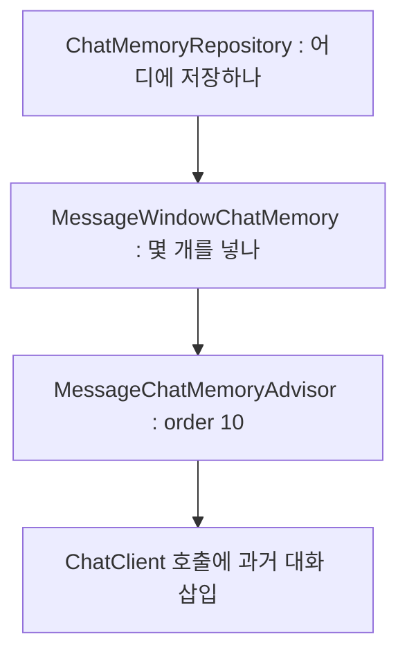

> **TL;DR**
>
> 이번 라운드에서 저장소를 무엇으로 하느냐는 뒤의 문제였다. H2 든 PostgreSQL 이든 층이 나뉘어 있으면 갈아 끼우면 된다.
>
> 실제로 갈랐던 기준은 두 개의 경계다. 세션의 경계(`X-Session-Id`)와 기억의 창 크기(`MAX_MESSAGES`). 창이 2면 6턴째에 대화가 무너지고, 창이 무한이면 비용의 상한이 사라진다.
>
> 이 구조에서는 저장소 교체, 창 크기 조정, 체인 배선이 서로를 건드리지 않고 각각 바뀐다.

---

3편의 끝에 남긴 문장이 있다. "2024-1234 어디예요?" 다음에 "그거 취소해줘" 라고 하면 모델은 "그거" 를 모른다.
LLM 은 상태가 없다. 매 호출이 첫 대화다. 기억은 모델 밖에서 서버가 만들어 넣어야 한다.
이번 라운드는 그 기억을 어디에, 얼마나, 누구 것으로 저장하는지의 문제였다.

<style>
.agent-fig,.fig-defs{
  --fig-surface:#ffffff;--fig-ink:#0f172a;--fig-ink2:#334155;--fig-muted:#94a3b8;--fig-hair:#e6eaf1;
  --c-green:#16a34a;--c-greenink:#15803d;--c-red:#ef4444;--c-redink:#b91c1c;
  --c-blue:#2f6fed;--c-blueink:#1d4ed8;--c-amber:#d97706;--c-amberink:#b45309;
}
@media (prefers-color-scheme: dark){
  .agent-fig,.fig-defs{
    --fig-surface:#121317;--fig-ink:#f2f5fa;--fig-ink2:#cbd5e1;--fig-muted:#697588;--fig-hair:#252a33;
    --c-green:#34d399;--c-greenink:#6ee7b7;--c-red:#f87171;--c-redink:#fca5a5;
    --c-blue:#5b9bff;--c-blueink:#93c5fd;--c-amber:#fbbf24;--c-amberink:#fcd34d;
  }
}
.agent-fig{margin:2.4em 0;border:1px solid var(--fig-hair);border-radius:18px;background:var(--fig-surface);
  padding:18px 20px 10px;overflow:hidden;box-shadow:0 1px 2px rgba(2,6,23,.05),0 14px 40px rgba(2,6,23,.09)}
@media (prefers-color-scheme: dark){.agent-fig{box-shadow:0 1px 2px rgba(0,0,0,.4),0 18px 46px rgba(0,0,0,.5)}}
.agent-fig svg{width:100%;height:auto;display:block;max-width:100%}
.agent-fig svg text{font-family:ui-monospace,"SF Mono","JetBrains Mono",Menlo,monospace}
.agent-fig .cap-head{display:flex;justify-content:space-between;align-items:baseline;gap:14px;margin-bottom:6px}
.agent-fig .cap-tag{font-size:11px;letter-spacing:.14em;text-transform:uppercase;color:var(--fig-muted);
  font-family:ui-monospace,SFMono-Regular,Menlo,monospace}
.agent-fig figcaption{font-size:13.5px;color:var(--fig-muted);line-height:1.6;padding:12px 2px 6px;
  font-family:ui-monospace,SFMono-Regular,Menlo,monospace}
.agent-fig figcaption b{color:var(--fig-ink2);font-weight:600}
@media (prefers-reduced-motion: reduce){.agent-fig svg animate,.agent-fig svg animateMotion{display:none}}
</style>

## 기억은 왜 한 덩어리가 아니라 세 층인가

AI 에게 예시 코드를 뽑아 보면 대개 `InMemoryChatMemory` 하나를 Bean 으로 등록하고 요청마다 `builder.defaultAdvisors(...).build()` 를 다시 부른다.
그 코드도 돌아간다. 문제는 실험이 안 된다는 것이다. 저장소를 JDBC 로 바꾸는 실험과 창 크기를 조정하는 실험이 한 덩어리에 묶여 서로를 오염시킨다.

기억은 서로 다른 세 가지 질문의 합성이다. 어디에 저장하나(영속성), 몇 개를 프롬프트에 넣나(크기 정책), 호출에 어떻게 끼워 넣나(어댑터).
세 질문은 각각 다른 층이 답한다.

```java
@Bean @Profile("!jdbc")
ChatMemoryRepository chatMemoryRepository() {
    return new InMemoryChatMemoryRepository();          // 층 1 : 영속성
}
@Bean
ChatMemory chatMemory(ChatMemoryRepository repository,
        @Value("${baedal.chat-memory.max-messages:20}") int maxMessages) {
    return MessageWindowChatMemory.builder()            // 층 2 : 크기 정책
            .chatMemoryRepository(repository)
            .maxMessages(maxMessages).build();
}
@Bean
MessageChatMemoryAdvisor messageChatMemoryAdvisor(ChatMemory chatMemory) {
    return MessageChatMemoryAdvisor.builder(chatMemory) // 층 3 : 어댑터
            .order(10).build();
}
```



이 배선에서 저장소는 profile 로, 창 크기는 설정 값으로, 체인 위치는 order 로 각각 바뀐다.
뒤에 나오는 창 크기 실험과 JDBC 전환 실험은 이 분리가 있어서 서로 독립으로 돌 수 있었다.

> 실험할 수 없는 구조는 튜닝도 할 수 없는 구조다.

## 세션 헤더가 없으면 누구의 기억에 쌓이나

처음에는 `X-Session-Id` 헤더가 없으면 Spring AI 기본값 `default` 로 흘리게 뒀다.
그 경로의 끝을 그려 보면 이렇다. 구버전 클라이언트 셋이 헤더 없이 접속한다. 세 사용자의 대화가 전부 `default` 세션 하나에 쌓인다.
A 의 주문번호가 B 의 "그거" 로 풀린다. 남의 주문이 취소될 수 있는 경로다.

헤더를 필수로 바꿨다. 누락 요청은 기억에 닿기 전에 400 으로 끊긴다.

```java
@PostMapping
public String ask(@Valid @RequestBody ChatRequest req,
                  @RequestHeader("X-Session-Id") String sessionId) {
    return chatClient.prompt()
            .user(req.message())
            .advisors(a -> a.param(ChatMemory.CONVERSATION_ID, sessionId))
            .call().content();
}
```

ChatClient 는 생성자에서 한 번만 빌드하고 요청 시점에는 conversationId 만 바꾼다. 같은 클라이언트 객체가 요청마다 다른 세션을 태운다.
세션 A 와 B 가 섞이지 않는 것은 테스트로 고정했다.

> **포기한 것**: 구버전 클라이언트 호환. 헤더 없는 요청을 받아 주는 편의를 버리고 세션 오염 차단을 택했다. 편의는 게이트웨이에서 헤더를 채워 복구할 수 있지만 오염된 기억은 복구가 안 된다.

## 창 크기 2는 왜 6턴째에 무너졌나

기억을 몇 개까지 프롬프트에 넣을지, `MAX_MESSAGES` 를 2 / 20 / 100000 으로 바꿔 같은 10턴 시나리오를 돌렸다.

| 실험 | MAX_MESSAGES | 평균 입력 토큰 | 평균 응답 시간 | 지시 대명사 해결 |
|---|---|---|---|---|
| A | 20 | 2133.5 | 2711.4ms | 6/10 |
| B | 2 | 1853.5 | 2849.8ms | 2/10 |
| C | 100000 | 2126.8 | 2706.4ms | 8/10 |

B(창 2)가 무너지는 지점은 정확했다. 창 2는 마지막 USER/ASSISTANT 한 쌍만 남긴다.
6턴 "그럼 1235는 취소되죠?" 에서 `1235` 를 `2024-1235` 로 복원하지 못했다. 그 주문번호는 이미 창 밖이다.
10턴 "지금까지 요약해줘" 는 직전 질문 하나만 요약했다. 모델이 요약을 못한 게 아니다. 요약할 재료가 프롬프트에 없었다.

<figure class="agent-fig">
  <div class="cap-head"><span class="cap-tag">message window · turn 6</span><span class="cap-tag">MAX_MESSAGES 20 vs 2</span></div>
  <svg viewBox="0 0 720 300" role="img" aria-label="6턴 질문이 1턴의 주문번호를 참조한다. 창 20에서는 1턴이 창 안에 있어 복원되고 창 2에서는 창 밖이라 참조가 끊긴다" xmlns="http://www.w3.org/2000/svg">
    <text x="20" y="30" font-size="12" font-weight="700" fill="var(--fig-ink2)">MAX_MESSAGES = 20</text>
    <g>
      <rect x="20" y="44" width="560" height="56" rx="10" fill="var(--c-green)" opacity="0.06"/>
      <rect x="20" y="44" width="560" height="56" rx="10" fill="none" stroke="var(--c-green)" stroke-opacity="0.45" stroke-dasharray="6 4"/>
      <text x="590" y="76" font-size="10.5" fill="var(--c-greenink)">창 안</text>
    </g>
    <g font-size="10.5" text-anchor="middle">
      <rect x="36" y="56" width="84" height="32" rx="7" fill="var(--c-blue)" opacity="0.16"/>
      <text x="78" y="76" fill="var(--fig-ink)">턴1 : 2024-1235</text>
      <rect x="132" y="56" width="60" height="32" rx="7" fill="var(--fig-muted)" opacity="0.12"/>
      <text x="162" y="76" fill="var(--fig-muted)">턴2~3</text>
      <rect x="204" y="56" width="60" height="32" rx="7" fill="var(--fig-muted)" opacity="0.12"/>
      <text x="234" y="76" fill="var(--fig-muted)">턴4~5</text>
      <rect x="276" y="56" width="120" height="32" rx="7" fill="var(--c-amber)" opacity="0.16"/>
      <text x="336" y="76" fill="var(--fig-ink)">턴6 : "1235는?"</text>
    </g>
    <path d="M336 56 C 300 20, 130 20, 82 52" fill="none" stroke="var(--c-green)" stroke-width="1.8" stroke-opacity="0.7"/>
    <circle r="4" fill="var(--c-green)" filter="url(#fx-glow3)">
      <animateMotion path="M336 56 C 300 20, 130 20, 82 52" dur="3s" repeatCount="indefinite"/>
      <animate attributeName="opacity" values="0;1;1;0" keyTimes="0;0.15;0.85;1" dur="3s" repeatCount="indefinite"/>
    </circle>
    <text x="614" y="94" font-size="10.5" fill="var(--c-greenink)">복원 성공</text>
    <text x="20" y="160" font-size="12" font-weight="700" fill="var(--fig-ink2)">MAX_MESSAGES = 2</text>
    <g>
      <rect x="256" y="174" width="140" height="56" rx="10" fill="var(--c-red)" opacity="0.05"/>
      <rect x="256" y="174" width="140" height="56" rx="10" fill="none" stroke="var(--c-red)" stroke-opacity="0.4" stroke-dasharray="6 4"/>
      <text x="406" y="206" font-size="10.5" fill="var(--c-redink)">창 안 : 마지막 한 쌍</text>
    </g>
    <g font-size="10.5" text-anchor="middle">
      <rect x="36" y="186" width="84" height="32" rx="7" fill="var(--c-blue)" opacity="0.05"/>
      <text x="78" y="206" fill="var(--fig-muted)" opacity="0.55">턴1 : 소실</text>
      <rect x="132" y="186" width="60" height="32" rx="7" fill="var(--fig-muted)" opacity="0.05"/>
      <text x="162" y="206" fill="var(--fig-muted)" opacity="0.45">턴2~5</text>
      <rect x="276" y="186" width="100" height="32" rx="7" fill="var(--c-amber)" opacity="0.16"/>
      <text x="326" y="206" fill="var(--fig-ink)">턴6 : "1235는?"</text>
    </g>
    <path d="M326 186 C 290 150, 130 150, 82 182" fill="none" stroke="var(--c-red)" stroke-width="1.6" stroke-opacity="0.55" stroke-dasharray="4 4"/>
    <circle r="4" fill="var(--c-red)" filter="url(#fx-glow3)">
      <animateMotion path="M326 186 C 290 150, 190 150, 165 162" dur="3s" repeatCount="indefinite"/>
      <animate attributeName="opacity" values="0;1;1;0" keyTimes="0;0.15;0.7;0.85" dur="3s" repeatCount="indefinite"/>
    </circle>
    <text x="150" y="146" font-size="10.5" fill="var(--c-redink)">참조가 창 밖에서 끊긴다</text>
    <text x="360" y="272" text-anchor="middle" font-size="10.5" fill="var(--fig-muted)">같은 모델, 같은 질문. 다른 것은 프롬프트에 실려 간 과거의 양뿐이다.</text>
  </svg>
  <figcaption>창 2의 실패는 모델의 실패가 아니다. <b>참조 대상이 프롬프트에 없었다.</b> 지시 대명사 해결 2/10 과 8/10 의 차이는 전부 여기서 나왔다.</figcaption>
</figure>

<svg class="fig-defs" width="0" height="0" aria-hidden="true" focusable="false" style="position:absolute;width:0;height:0">
  <defs>
    <filter id="fx-glow3" x="-60%" y="-60%" width="220%" height="220%">
      <feGaussianBlur stdDeviation="3" result="b"/>
      <feMerge><feMergeNode in="b"/><feMergeNode in="SourceGraphic"/></feMerge>
    </filter>
  </defs>
</svg>

반대쪽 극단도 결론이 나지 않았다. 창 20 과 무제한(100000)의 입력 토큰 차이가 2133.5 대 2126.8 로 거의 없다.
10턴이면 메시지가 정확히 20개라 창 20 도 절단선에 걸리지 않았기 때문이다.
무제한의 비용 위험은 30턴을 넘겨야 드러난다. 데이터가 약해서 "무제한은 위험하다" 는 결론은 유보로 남겼다.

> 창 크기의 실패 모드는 양쪽에 있다. 작으면 대화가 끊기고 크면 비용의 상한이 사라진다. 어느 쪽이든 지표는 지시 대명사 해결률이다.

## 재시작하면 대화는 남는가

InMemory 기억은 JVM 과 함께 사라진다. JDBC 로 바꾸는 실험에서 첫 실패가 나왔다.
Spring AI 1.0.0 jar 에 `schema-h2.sql` 이 없다. PostgreSQL, SQL Server, MariaDB 용은 있는데 H2 용만 없다.
H2 를 `MODE=PostgreSQL` 로 띄우고 `platform: postgresql` 로 PostgreSQL 스키마를 빌려 기동했다.

| 저장소 | 재시작 후 기억 | 확인 방법 |
|---|---|---|
| InMemory | 소실 | JVM 종료와 함께 저장소 자체가 없어짐 |
| `jdbc:h2:mem` | 소실 | 재시작 뒤 세션 조회가 `[]` |
| `jdbc:h2:file` | 유지 | 재시작 뒤 같은 세션 메시지 그대로 |

JDBC 라는 글자가 영속을 보장하지 않는다. DB 가 메모리면 똑같이 사라진다. 영속의 경계는 드라이버가 아니라 데이터가 실제로 놓이는 곳이다.

그리고 파일에 남는 순간 성격이 바뀐다. 기억 테이블은 고객 대화 원문, 곧 개인정보 저장소다.
백업, TTL, 암호화, 상담원 조회 권한이 전부 따라온다. 운영 저장소로 H2 대신 PostgreSQL 을 고른 이유도 이 관리 항목들 때문이다.

> **포기한 것**: 운영 수준의 기억 정책. TTL 도 암호화도 이번 라운드에는 없다. "저장된다" 와 "저장해도 된다" 사이의 거리를 다음 라운드의 숙제로 남겼다.

## 응답이 맞았다고 Tool 을 다시 부른 건 아니다

지시 대명사 턴이 정답을 맞혀도 로그에 `getDeliveryStatus` 재호출이 없는 경우가 있었다.
모델은 직전 assistant 답변에 남아 있던 도착 시간을 재사용했다. 최신 데이터를 조회한 게 아니라 과거 답을 복사한 것이다.

배달 상태는 흐르는 데이터다. 5분 전의 "20분 후 도착" 을 복사한 답은 지금 시점에는 틀린 답일 수 있다.
advisor 의 토큰 로그만으로는 두 경우가 구분되지 않았다. "답이 맞았는가" 와 "근거가 신선한가" 는 다른 지표다.

> 기억은 지시어를 풀라고 있는 것이지 조회를 대신하라고 있는 게 아니다. 그런데 모델은 그 둘을 구분하지 않는다.

## 이 라운드가 남긴 불변식

- 기억은 영속성, 크기 정책, 어댑터의 세 층이다. 창 크기 실험과 JDBC 실험이 독립으로 돈 것이 이 분리의 증명이다.
- 세션 기본값은 오염 경로다. 헤더 누락을 400 으로 끊는 쪽이 남의 기억에 쌓이는 쪽보다 싸다.
- 창 밖의 참조는 모델이 복구할 수 없다. 창 2의 6턴 실패가 반례다.
- JDBC 는 영속의 동의어가 아니다. `jdbc:h2:mem` 의 빈 배열이 반례다.

## 아직 해결하지 않은 범위

Memory advisor 가 모델에 넘긴 최종 프롬프트 전문은 아직 못 봤다. "어떤 문자열이 실제로 삽입됐다" 를 말할 수 없는 상태다.
창 20 과 무제한이 갈라지는 턴 수도 미확인이다. 30턴 실험이 남아 있다.

기억이 지시어를 풀어 줘도 근거는 여전히 모델의 일반 지식이거나 과거 답의 복사다.
"비 오는 날 배달 지연 보상 되나요?" 같은 질문에는 회사 정책 문서가 필요하다.
5편은 RAG 다. 정책 902 토큰을 프롬프트에 실어 주고도 모델이 안 쓰는 장면부터 시작한다.
