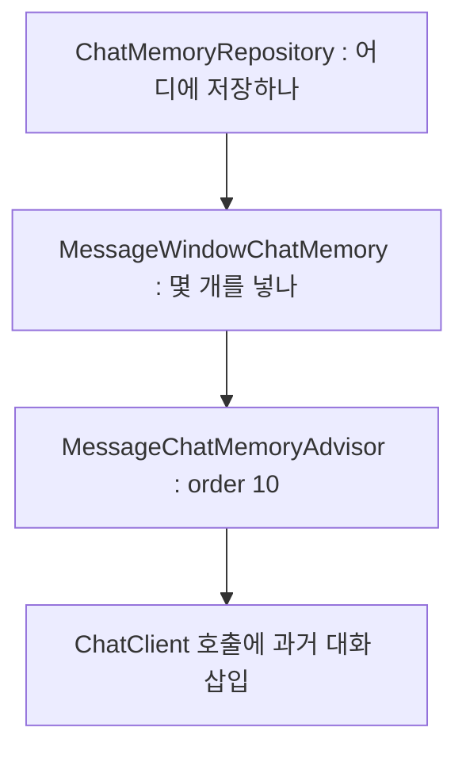

LLM에게는 어제가 없다. 방금 전도 없다. 매 호출이 첫 대화다. 우리가 챗봇과 "대화"를 이어간다고 느끼는 것은 모델이 기억해서가 아니라, 서버가 매번 지난 대화를 통째로 프롬프트에 붙여 보내기 때문이다. 기억은 모델의 능력이 아니라 서버의 부지런함이다.

3편 끝에서 확인했듯 "2024-1234 어디예요?" 다음에 "그거 취소해줘"라고 하면 봇은 "그거"를 모른다. 이번 주는 그 부지런함을 설계하는 라운드다. 대화를 어디에 저장할지(저장소), 몇 개나 프롬프트에 실을지(창 크기), 누구의 대화로 묶을지(세션). 이 세 가지를 각각 실험할 수 있는 구조로 조립하고, 창 크기 2, 20, 무제한을 10턴 시나리오로 직접 비교했다.

환경은 지금까지와 같다. Ollama `qwen2.5`, temperature 0.3.

<style>
.agent-fig,.fig-defs{
  --fig-surface:#ffffff;--fig-ink:#0f172a;--fig-ink2:#334155;--fig-muted:#94a3b8;--fig-hair:#e6eaf1;
  --c-green:#16a34a;--c-greenink:#15803d;--c-red:#ef4444;--c-redink:#b91c1c;
  --c-blue:#2f6fed;--c-blueink:#1d4ed8;--c-amber:#d97706;--c-amberink:#b45309;
}
@media (prefers-color-scheme: dark){
  .agent-fig,.fig-defs{
    --fig-surface:#121317;--fig-ink:#f2f5fa;--fig-ink2:#cbd5e1;--fig-muted:#697588;--fig-hair:#252a33;
    --c-green:#34d399;--c-greenink:#6ee7b7;--c-red:#f87171;--c-redink:#fca5a5;
    --c-blue:#5b9bff;--c-blueink:#93c5fd;--c-amber:#fbbf24;--c-amberink:#fcd34d;
  }
}
.agent-fig{margin:2.4em 0;border:1px solid var(--fig-hair);border-radius:18px;background:var(--fig-surface);
  padding:18px 20px 10px;overflow:hidden;box-shadow:0 1px 2px rgba(2,6,23,.05),0 14px 40px rgba(2,6,23,.09)}
@media (prefers-color-scheme: dark){.agent-fig{box-shadow:0 1px 2px rgba(0,0,0,.4),0 18px 46px rgba(0,0,0,.5)}}
.agent-fig svg{width:100%;height:auto;display:block;max-width:100%}
.agent-fig svg text{font-family:ui-monospace,"SF Mono","JetBrains Mono",Menlo,monospace}
.agent-fig .cap-head{display:flex;justify-content:space-between;align-items:baseline;gap:14px;margin-bottom:6px}
.agent-fig .cap-tag{font-size:11px;letter-spacing:.14em;text-transform:uppercase;color:var(--fig-muted);
  font-family:ui-monospace,SFMono-Regular,Menlo,monospace}
.agent-fig figcaption{font-size:13.5px;color:var(--fig-muted);line-height:1.6;padding:12px 2px 6px;
  font-family:ui-monospace,SFMono-Regular,Menlo,monospace}
.agent-fig figcaption b{color:var(--fig-ink2);font-weight:600}
@media (prefers-reduced-motion: reduce){.agent-fig svg animate,.agent-fig svg animateMotion{display:none}}
</style>

## 기억을 세 층으로 쪼개는 이유

AI에게 ChatMemory 예시 코드를 뽑아달라고 하면 대개 `InMemoryChatMemory` 하나를 Bean으로 등록하고 끝낸다. 그 코드도 돌아간다. 문제는 나중에 온다. 저장소를 JDBC로 바꾸는 실험과 창 크기를 조절하는 실험이 한 덩어리에 묶여 있어서, 하나를 건드리면 다른 하나가 같이 흔들린다.

곰곰이 보면 "기억"은 서로 다른 세 가지 질문의 합이다. 어디에 저장하나. 몇 개를 프롬프트에 넣나. 호출에 어떻게 끼워 넣나. Spring AI는 이 세 질문에 각각 레이어를 하나씩 두고 있다.

```java
@Bean @Profile("!jdbc")
ChatMemoryRepository chatMemoryRepository() {
    return new InMemoryChatMemoryRepository();          // 층 1 : 어디에 저장하나
}
@Bean
ChatMemory chatMemory(ChatMemoryRepository repository,
        @Value("${baedal.chat-memory.max-messages:20}") int maxMessages) {
    return MessageWindowChatMemory.builder()            // 층 2 : 몇 개를 넣나
            .chatMemoryRepository(repository)
            .maxMessages(maxMessages).build();
}
@Bean
MessageChatMemoryAdvisor messageChatMemoryAdvisor(ChatMemory chatMemory) {
    return MessageChatMemoryAdvisor.builder(chatMemory) // 층 3 : 어떻게 끼우나
            .order(10).build();
}
```



여기서 `order(10)`은 토큰을 재는 로깅 advisor(order 100)보다 먼저 실행돼, 과거 대화를 프롬프트에 끼워 넣기 위한 값이다. 이렇게 갈라두면 저장소는 profile로, 창 크기는 설정 값으로, 체인 위치는 order로 각각 독립해서 바뀐다. 이 글 뒤에 나오는 창 크기 실험과 JDBC 전환 실험이 서로를 건드리지 않고 돌 수 있었던 것은 순전히 이 분리 덕이다. 실험할 수 없는 구조는 튜닝할 수도 없는 구조다.

## 세션 헤더가 없으면 누구의 기억에 쌓이나

기억을 만들었으면 다음 질문은 "누구의 기억인가"다. 고객 A의 대화와 고객 B의 대화는 갈라져야 한다. 이 프로젝트에서는 `X-Session-Id` 헤더가 그 경계다.

처음에는 헤더가 없으면 Spring AI의 기본값인 `default` 세션으로 흘리도록 두었다. 관대해 보이는 이 기본값의 끝을 그려보면 좀 무섭다. 구버전 클라이언트 셋이 헤더 없이 접속하면 세 사용자의 대화가 전부 `default`라는 한 세션에 쌓인다. A가 말한 주문번호가 B의 "그거"로 풀린다. 남의 주문이 취소될 수 있는 경로다.

그래서 헤더를 필수로 바꿨다. 헤더가 없는 요청은 기억에 닿기 전에 400으로 끊긴다.

```java
@PostMapping
public String ask(@Valid @RequestBody ChatRequest req,
                  @RequestHeader("X-Session-Id") String sessionId) {
    return chatClient.prompt()
            .user(req.message())
            .advisors(a -> a.param(ChatMemory.CONVERSATION_ID, sessionId))
            .call().content();
}
```

ChatClient는 생성자에서 한 번만 빌드하고, 요청 시점에는 conversationId만 갈아 끼운다. 같은 클라이언트 객체가 요청마다 다른 세션을 태우는 구조다. 세션 A와 B가 섞이지 않는 것은 테스트로 고정해두었다. 구버전 클라이언트 호환이라는 편의를 버린 셈인데, 편의는 게이트웨이에서 헤더를 채워주면 복구할 수 있지만 오염된 기억은 복구할 방법이 없다.

## 창 크기 2는 6턴째에 무너진다

기억을 몇 개까지 실어 보낼지는 `MAX_MESSAGES`가 정한다. 이 값을 2, 20, 100000(거의 무제한)으로 바꿔가며 같은 10턴 시나리오를 돌렸다. 결과부터 보자. 표의 "지시 대명사 해결"은 봇의 정답률이 아니라, 맥락을 잃지 않고 "그거"나 "1235"를 옳은 대상에 연결한 턴 수다.

| 실험 | MAX_MESSAGES | 평균 입력 토큰 | 평균 응답 시간 | 지시 대명사 해결 |
|---|---|---|---|---|
| A | 20 | 2133.5 | 2711.4ms | 6/10 |
| B | 2 | 1853.5 | 2849.8ms | 2/10 |
| C | 100000 | 2126.8 | 2706.4ms | 8/10 |

창 2(실험 B)가 무너지는 지점은 정확히 예측 가능했다. 창 2는 마지막 USER/ASSISTANT 한 쌍만 남긴다. 6턴째 "그럼 1235는 취소되죠?"에서 `1235`를 `2024-1235`로 복원하지 못했다. 그 주문번호가 처음 등장한 3턴이 이미 창 밖으로 밀려났기 때문이다. 10턴째 "지금까지 요약해줘"에는 직전 질문 하나만 요약해서 내놓았다. 모델이 요약을 못 한 것이 아니다. 요약할 재료가 프롬프트에 실리지 않았을 뿐이다. 아래 그림이 그 순간이다.

<figure class="agent-fig">
  <div class="cap-head"><span class="cap-tag">message window · turn 6</span><span class="cap-tag">MAX_MESSAGES 20 vs 2</span></div>
  <svg viewBox="0 0 720 300" role="img" aria-label="6턴 질문이 1턴의 주문번호를 참조한다. 창 20에서는 1턴이 창 안에 있어 복원되고 창 2에서는 창 밖이라 참조가 끊긴다" xmlns="http://www.w3.org/2000/svg">
    <text x="20" y="30" font-size="12" font-weight="700" fill="var(--fig-ink2)">MAX_MESSAGES = 20</text>
    <g>
      <rect x="20" y="44" width="560" height="56" rx="10" fill="var(--c-green)" opacity="0.06"/>
      <rect x="20" y="44" width="560" height="56" rx="10" fill="none" stroke="var(--c-green)" stroke-opacity="0.45" stroke-dasharray="6 4"/>
      <text x="590" y="76" font-size="10.5" fill="var(--c-greenink)">창 안</text>
    </g>
    <g font-size="10.5" text-anchor="middle">
      <rect x="36" y="56" width="84" height="32" rx="7" fill="var(--c-blue)" opacity="0.16"/>
      <text x="78" y="76" fill="var(--fig-ink)">턴3 : 2024-1235</text>
      <rect x="132" y="56" width="60" height="32" rx="7" fill="var(--fig-muted)" opacity="0.12"/>
      <text x="162" y="76" fill="var(--fig-muted)">턴1·2</text>
      <rect x="204" y="56" width="60" height="32" rx="7" fill="var(--fig-muted)" opacity="0.12"/>
      <text x="234" y="76" fill="var(--fig-muted)">턴4·5</text>
      <rect x="276" y="56" width="120" height="32" rx="7" fill="var(--c-amber)" opacity="0.16"/>
      <text x="336" y="76" fill="var(--fig-ink)">턴6 : "1235는?"</text>
    </g>
    <path d="M336 56 C 300 20, 130 20, 82 52" fill="none" stroke="var(--c-green)" stroke-width="1.8" stroke-opacity="0.7"/>
    <circle r="4" fill="var(--c-green)" filter="url(#fx-glow3)">
      <animateMotion path="M336 56 C 300 20, 130 20, 82 52" dur="3s" repeatCount="indefinite"/>
      <animate attributeName="opacity" values="0;1;1;0" keyTimes="0;0.15;0.85;1" dur="3s" repeatCount="indefinite"/>
    </circle>
    <text x="614" y="94" font-size="10.5" fill="var(--c-greenink)">복원 성공</text>
    <text x="20" y="160" font-size="12" font-weight="700" fill="var(--fig-ink2)">MAX_MESSAGES = 2</text>
    <g>
      <rect x="256" y="174" width="140" height="56" rx="10" fill="var(--c-red)" opacity="0.05"/>
      <rect x="256" y="174" width="140" height="56" rx="10" fill="none" stroke="var(--c-red)" stroke-opacity="0.4" stroke-dasharray="6 4"/>
      <text x="406" y="206" font-size="10.5" fill="var(--c-redink)">창 안 : 마지막 한 쌍</text>
    </g>
    <g font-size="10.5" text-anchor="middle">
      <rect x="36" y="186" width="84" height="32" rx="7" fill="var(--c-blue)" opacity="0.05"/>
      <text x="78" y="206" fill="var(--fig-muted)" opacity="0.55">턴3 : 소실</text>
      <rect x="132" y="186" width="60" height="32" rx="7" fill="var(--fig-muted)" opacity="0.05"/>
      <text x="162" y="206" fill="var(--fig-muted)" opacity="0.45">턴1~5 소실</text>
      <rect x="276" y="186" width="100" height="32" rx="7" fill="var(--c-amber)" opacity="0.16"/>
      <text x="326" y="206" fill="var(--fig-ink)">턴6 : "1235는?"</text>
    </g>
    <path d="M326 186 C 290 150, 130 150, 82 182" fill="none" stroke="var(--c-red)" stroke-width="1.6" stroke-opacity="0.55" stroke-dasharray="4 4"/>
    <circle r="4" fill="var(--c-red)" filter="url(#fx-glow3)">
      <animateMotion path="M326 186 C 290 150, 190 150, 165 162" dur="3s" repeatCount="indefinite"/>
      <animate attributeName="opacity" values="0;1;1;0" keyTimes="0;0.15;0.7;0.85" dur="3s" repeatCount="indefinite"/>
    </circle>
    <text x="150" y="146" font-size="10.5" fill="var(--c-redink)">참조가 창 밖에서 끊긴다</text>
    <text x="360" y="272" text-anchor="middle" font-size="10.5" fill="var(--fig-muted)">같은 모델, 같은 질문. 다른 것은 프롬프트에 실려 간 과거의 양뿐이다.</text>
  </svg>
  <figcaption>창 2의 실패는 모델의 실패가 아니다. <b>참조 대상이 프롬프트에 없었다.</b> 지시 대명사 해결 2/10 과 8/10 의 차이는 전부 여기서 나왔다.</figcaption>
</figure>

<svg class="fig-defs" width="0" height="0" aria-hidden="true" focusable="false" style="position:absolute;width:0;height:0">
  <defs>
    <filter id="fx-glow3" x="-60%" y="-60%" width="220%" height="220%">
      <feGaussianBlur stdDeviation="3" result="b"/>
      <feMerge><feMergeNode in="b"/><feMergeNode in="SourceGraphic"/></feMerge>
    </filter>
  </defs>
</svg>

그렇다면 반대쪽 극단, 무제한은 어떨까. 표에서 창 20과 무제한의 입력 토큰이 2133.5 대 2126.8로 거의 같다는 점이 눈에 걸릴 것이다. 이유는 시시하다. 10턴이면 메시지가 정확히 20개라서 창 20도 아직 한 번도 잘라내지 않았기 때문이다. 무제한의 비용 문제는 30턴을 넘겨야 드러날 텐데 거기까지는 실험하지 못했다. 그래서 "무제한은 위험하다"는 문장은 이번 라운드에서는 결론이 아니라 추정으로 남겨둔다.

창 크기의 실패 모드는 양쪽에 있다. 작으면 대화가 끊기고, 크면 비용의 상한이 사라진다. 그리고 어느 쪽으로 기울었는지 알려주는 지표는 응답의 유창함이 아니라 지시 대명사 해결률이었다.

## JDBC라는 글자는 영속을 보장하지 않는다

InMemory 기억은 JVM과 함께 사라진다. 서버를 재배포하면 상담 중이던 고객의 맥락이 통째로 날아간다는 뜻이다. 그래서 JDBC 저장소로 바꿔보는 실험을 했는데, 시작부터 넘어졌다.

Spring AI 1.0.0 jar에는 `schema-h2.sql`이 없다. PostgreSQL, SQL Server, HSQLDB, MariaDB용 스키마는 들어 있는데 H2용만 없다. 결국 H2를 `MODE=PostgreSQL`로 띄우고 `platform: postgresql`로 PostgreSQL 스키마를 빌려서 기동했다. 그리고 재시작 실험의 결과가 이렇다.

| 저장소 | 재시작 후 기억 | 확인 방법 |
|---|---|---|
| InMemory | 소실 | JVM 종료와 함께 저장소 자체가 사라짐 |
| `jdbc:h2:mem` | 소실 | 재시작 뒤 세션 조회가 `[]` |
| `jdbc:h2:file` | 유지 | 재시작 뒤 같은 세션 메시지 그대로 |

두 번째 줄이 이번 실험의 소득이다. JDBC 드라이버를 쓰고 있어도 DB가 메모리 모드면 기억은 똑같이 사라진다. 영속을 정하는 것은 접속 방식이 아니라 데이터가 실제로 놓이는 곳이다.

그리고 파일에 남는 순간 성격이 바뀐다는 점도 적어둬야 한다. 기억 테이블의 내용물은 고객 대화 원문, 곧 개인정보다. 백업, 보존 기간(TTL), 암호화, 상담원 조회 권한 같은 관리 항목이 전부 따라온다. "저장된다"와 "저장해도 된다" 사이에는 거리가 있고, 그 거리는 다음 라운드의 숙제로 남겼다. 운영 저장소로 H2가 아니라 PostgreSQL을 고른 것도 이 관리 항목들 때문이다.

## 답이 맞았다고 Tool을 다시 부른 것은 아니다

마지막으로, 이번 주에 발견한 가장 미묘한 함정을 소개한다. 지시 대명사 턴이 정답을 맞혔는데도 로그에 `getDeliveryStatus` 재호출이 없는 경우가 있었다. 모델은 Tool을 다시 부른 것이 아니라, 직전 assistant 답변에 남아 있던 도착 시간을 재사용했다.

배달 상태는 흐르는 데이터다. 5분 전의 "20분 후 도착"을 복사한 답은 지금 시점에는 틀린 답일 수 있다. 그런데 겉으로 보이는 응답만으로는 "다시 조회한 답"과 "과거를 복사한 답"이 구분되지 않고, advisor의 토큰 로그로도 구분되지 않았다. 기억은 지시어를 풀라고 둔 것인데 모델은 기억을 조회의 대체재로도 써버린다. "답이 맞았는가"와 "근거가 신선한가"는 다른 질문이라는 것을 여기서 배웠다.

## 다음 이야기

이번 주에 손에 남은 건 두 장면이다. 창 2가 6턴째에 "1235"를 놓친 순간, 그리고 `jdbc:h2:mem`이 재시작과 함께 세션을 통째로 날린 순간. 둘 다 실패가 모델이나 드라이버 이름이 아니라 다른 데 있었다. 창 밖으로 밀려난 참조는 모델이 복구할 방법이 없었고, 데이터가 실제로 어디 놓였는지가 영속을 정했다. 세션을 어떻게 나눌지도 마찬가지여서, 헤더 누락을 400으로 끊는 쪽이 남의 기억에 쌓이는 쪽보다 쌌다.

못 본 것도 있다. Memory advisor가 모델에게 넘긴 최종 프롬프트 전문은 아직 확인하지 못했다. 창 20과 무제한이 갈라지는 턴 수도 30턴 이상을 돌려봐야 안다.

그리고 기억이 지시어를 풀어줘도 대답의 근거는 여전히 모델의 일반 지식이거나 과거 답변의 복사다. "비 오는 날 배달 지연 보상 되나요?" 같은 질문에는 회사 정책 문서가 필요하다. 5편은 그 정책을 검색해 프롬프트에 실어주는 RAG다. 정책 902토큰을 실어줬는데 모델이 안 쓰는 장면부터 시작한다.
