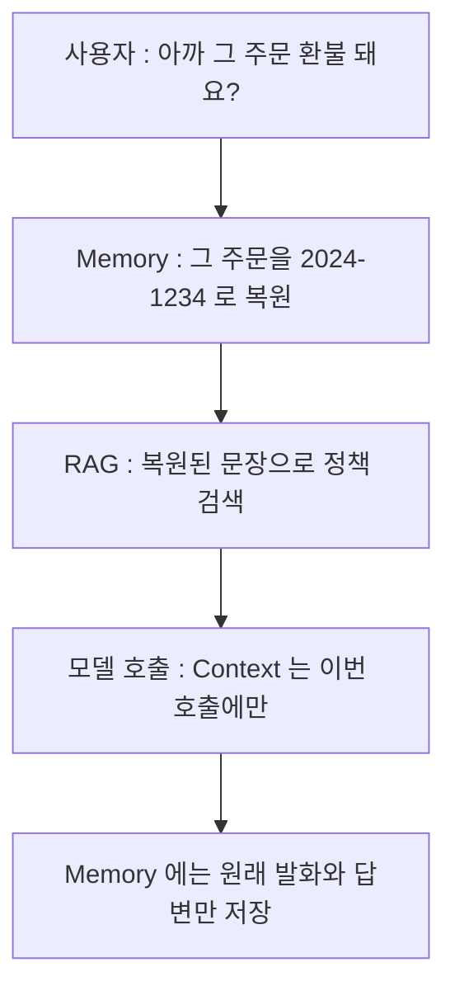

> **TL;DR**
>
> 이번 라운드에서 RAG 를 켜는 일은 중요하지 않았다. `QuestionAnswerAdvisor` 빌더 한 줄이면 켜진다.
>
> 실제로 갈랐던 기준은 세 개의 경계값이다. 청크 크기가 숫자와 조건을 한 조각에 묶는지, 임계값이 무관 문서를 거르는지, Advisor 순서가 Context 를 일회성으로 유지하는지.
>
> 이 구조에서는 검색이 비어도 상담원 연결로 빠지고, 정책 원문이 대화 이력으로 굳지 않는다. 다만 Context 를 실어 줘도 모델이 쓰는 것까지는 보장되지 않는다. 그 간극이 이번 라운드의 기록이다.

---

4편의 기억은 지시어를 풀었다. 근거는 여전히 모델의 일반 지식이다.
"비 오는 날 배달 지연이면 보상 받나요?" 에 답하려면 회사 정책이 필요하다.
배달 정책 문서 7건을 PgVector 에 넣고 검색 결과를 프롬프트에 얹었다. 임베딩은 Ollama `qwen3-embedding:0.6b`(1024차원), 생성은 그대로 `qwen2.5` 다.

<style>
.agent-fig,.fig-defs{
  --fig-surface:#ffffff;--fig-ink:#0f172a;--fig-ink2:#334155;--fig-muted:#94a3b8;--fig-hair:#e6eaf1;
  --c-green:#16a34a;--c-greenink:#15803d;--c-red:#ef4444;--c-redink:#b91c1c;
  --c-blue:#2f6fed;--c-blueink:#1d4ed8;--c-amber:#d97706;--c-amberink:#b45309;
}
@media (prefers-color-scheme: dark){
  .agent-fig,.fig-defs{
    --fig-surface:#121317;--fig-ink:#f2f5fa;--fig-ink2:#cbd5e1;--fig-muted:#697588;--fig-hair:#252a33;
    --c-green:#34d399;--c-greenink:#6ee7b7;--c-red:#f87171;--c-redink:#fca5a5;
    --c-blue:#5b9bff;--c-blueink:#93c5fd;--c-amber:#fbbf24;--c-amberink:#fcd34d;
  }
}
.agent-fig{margin:2.4em 0;border:1px solid var(--fig-hair);border-radius:18px;background:var(--fig-surface);
  padding:18px 20px 10px;overflow:hidden;box-shadow:0 1px 2px rgba(2,6,23,.05),0 14px 40px rgba(2,6,23,.09)}
@media (prefers-color-scheme: dark){.agent-fig{box-shadow:0 1px 2px rgba(0,0,0,.4),0 18px 46px rgba(0,0,0,.5)}}
.agent-fig svg{width:100%;height:auto;display:block;max-width:100%}
.agent-fig svg text{font-family:ui-monospace,"SF Mono","JetBrains Mono",Menlo,monospace}
.agent-fig .cap-head{display:flex;justify-content:space-between;align-items:baseline;gap:14px;margin-bottom:6px}
.agent-fig .cap-tag{font-size:11px;letter-spacing:.14em;text-transform:uppercase;color:var(--fig-muted);
  font-family:ui-monospace,SFMono-Regular,Menlo,monospace}
.agent-fig figcaption{font-size:13.5px;color:var(--fig-muted);line-height:1.6;padding:12px 2px 6px;
  font-family:ui-monospace,SFMono-Regular,Menlo,monospace}
.agent-fig figcaption b{color:var(--fig-ink2);font-weight:600}
@media (prefers-reduced-motion: reduce){.agent-fig svg animate,.agent-fig svg animateMotion{display:none}}
</style>

## 청크 100은 왜 숫자를 잃어버렸나

적재는 조용히 끝났다. 최초 기동에서 신규 7건, 청크는 문서당 1개, `vector_store` row 7.
재기동에서는 스킵 7건에 row 그대로 7. 중복 적재는 `faqId` 필터로 막힌다.

청크 크기를 세 벌로 바꿔 같은 질문 세트를 돌렸다.

| 실험 | chunkSize / min | vector_store row | 평균 입력 토큰 |
|---|---|---|---|
| A | 800 / 350 | 7 | 약 2381 |
| B | 100 / 40 | 49 | 약 1977 |
| C | 2000 / 800 | 7 | 약 2381 |

B 에서 "비 오는 날" 질문의 답이 뭉개졌다. "기상 특보 발효 여부와 실제 지연 시간을 확인해야 합니다."
키워드는 살았는데 숫자가 죽었다. 정책 원문의 "예상 시간 + 30분", "60분 이상" 이 답에서 사라졌다.

경로를 따라가면 이렇다. 100 토큰 단위로 자르니 숫자가 박힌 문장과 그 숫자의 조건을 설명하는 문장이 다른 청크로 흩어졌다.
Top-K 4건이 숫자 없는 조각들로 채워졌고, 모델은 받은 조각 안에서 최선을 다했다. 검색은 성공했고 답은 무너졌다.

반대 증거도 같은 실험에 있다. B 의 다른 질문(취소 정책)은 오히려 A 보다 정확하게 인용됐다. 작게 쪼갠 덕에 CREATED/ACCEPTED 조각과 더 가깝게 매칭됐다.
그리고 C(2000) 는 실험 자체가 성립하지 않았다. 정책 문서가 전부 2000 토큰 미만이라 800 과 같은 1청크다.

기본값을 800 / 350 으로 되돌렸다. 이 문서들은 "## 접수 시한" 처럼 조항 단위로 이미 끊겨 있어서 한 조항이 한 청크에 들어간다.

```java
@Bean
public TokenTextSplitter tokenTextSplitter() {
    return new TokenTextSplitter(
            800,    // chunkSize
            350,    // minChunkSizeChars : 이보다 작으면 앞 청크에 병합
            5,      // minChunkLengthToEmbed
            10_000, // maxNumChunks
            true    // keepSeparator
    );
}
```

> 청크 경계가 의미 경계와 어긋나면 검색은 성공하고 답만 틀린다. 숫자와 그 숫자의 조건은 한 조각에 있어야 한다.

> **포기한 것**: "이 도메인의 최적 청크가 800" 이라는 결론. B 의 취소 질문이 더 잘된 게 일반성인지 우연인지는 반복 실행이 필요하고 거기까지는 가지 않았다. 이번에 확정한 건 "100 은 이 문서들의 숫자를 흩어 놓는다" 하나다.

## Top-K 4 와 임계값 0.5 는 무엇의 절충인가

검색 파라미터는 두 값으로 좁혔다.

```java
private static final int TOP_K = 4;
private static final double SIMILARITY_THRESHOLD = 0.5;

@Bean
public QuestionAnswerAdvisor questionAnswerAdvisor(VectorStore vectorStore) {
    return QuestionAnswerAdvisor.builder(vectorStore)
            .searchRequest(SearchRequest.builder()
                    .topK(TOP_K)
                    .similarityThreshold(SIMILARITY_THRESHOLD)
                    .build())
            .order(20)   // memory(10) 뒤, performance(100) 앞
            .build();
}
```

Top-K 1 은 "환불 + 지연" 복합 질문에서 한쪽 정책을 통째로 놓친다. 10 은 문서가 7건뿐인데 무관 문서까지 긁어 입력 토큰만 부풀린다.
임계값 0.3 은 도메인 밖 질문에 무관 정책을 근거로 붙여 주고, 0.8 은 맞는 정책도 잘라 Context 를 비운다.

다만 0.5 가 맞다는 증명은 이번 라운드에 없다. 같은 설정으로 1단계에서 인용됐던 질문이 2단계 재실행에서 Fallback 으로 빠졌다.
temperature 0.3 의 비결정성에 유사도가 임계값 언저리에서 출렁인 결과로 추정만 남았다.
취소 정책 질문의 Fallback 도 원인이 갈리지 않았다. 임계값에 걸려 Context 가 비었는지, "결제 후 바로" 라는 구어를 상태 용어로 매핑 못 해 모델이 발을 뺐는지 raw 로그만으로는 못 가른다.

> 경계값 근처의 실패는 재현이 안 된다. 유사도 점수 분포를 직접 찍기 전까지 임계값 튜닝은 추측이다.

## Advisor 순서를 뒤집으면 무엇이 굳나

이번 라운드에서 가장 강렬한 실측은 순서 실험이었다. 정상 순서는 memory(10) 다음 rag(20) 이다.



이걸 rag(5) 다음 memory(10) 으로 뒤집고 한 턴을 돌렸다. 응답은 비슷했다. 로그가 달랐다.
RAG 가 만든 증강 프롬프트, 곧 정책 원문 수백 토큰이 박힌 문자열이 사용자 발화로 ChatMemory 에 저장됐다.

<figure class="agent-fig">
  <div class="cap-head"><span class="cap-tag">advisor order flip</span><span class="cap-tag">rag(5) before memory(10)</span></div>
  <svg viewBox="0 0 720 250" role="img" aria-label="정상 순서에서 RAG Context 는 모델 호출에만 쓰이고 사라진다. 순서를 뒤집으면 정책 원문이 Memory 에 사용자 발화로 저장돼 다음 턴부터 계속 실려 간다" xmlns="http://www.w3.org/2000/svg">
    <text x="20" y="28" font-size="12" font-weight="700" fill="var(--fig-ink2)">memory(10) → rag(20) : Context 는 흘러가고</text>
    <g font-size="11" text-anchor="middle">
      <rect x="20" y="40" width="130" height="40" rx="9" fill="var(--c-blue)" opacity="0.12"/>
      <text x="85" y="64" fill="var(--fig-ink)">사용자 발화</text>
      <rect x="220" y="40" width="150" height="40" rx="9" fill="var(--c-amber)" opacity="0.12"/>
      <text x="295" y="64" fill="var(--fig-ink)">+ 정책 Context</text>
      <rect x="440" y="40" width="110" height="40" rx="9" fill="var(--fig-muted)" opacity="0.12"/>
      <text x="495" y="64" fill="var(--fig-ink)">모델 호출</text>
      <rect x="590" y="40" width="112" height="40" rx="9" fill="var(--c-green)" opacity="0.12"/>
      <rect x="590" y="40" width="112" height="40" rx="9" fill="none" stroke="var(--c-green)" stroke-opacity="0.45"/>
      <text x="646" y="58" fill="var(--fig-ink)">Memory</text>
      <text x="646" y="73" fill="var(--c-greenink)" font-size="9.5">발화와 답변만</text>
    </g>
    <circle r="4" fill="var(--c-amber)" filter="url(#fx-glow4)">
      <animateMotion path="M150 60 L440 60 L550 60" dur="3.4s" repeatCount="indefinite"/>
      <animate attributeName="opacity" values="0;1;1;0" keyTimes="0;0.1;0.8;0.95" dur="3.4s" repeatCount="indefinite"/>
    </circle>
    <text x="20" y="128" font-size="12" font-weight="700" fill="var(--fig-ink2)">rag(5) → memory(10) : Context 가 이력으로 굳는다</text>
    <g font-size="11" text-anchor="middle">
      <rect x="20" y="140" width="130" height="40" rx="9" fill="var(--c-blue)" opacity="0.12"/>
      <text x="85" y="164" fill="var(--fig-ink)">사용자 발화</text>
      <rect x="220" y="140" width="150" height="40" rx="9" fill="var(--c-amber)" opacity="0.12"/>
      <text x="295" y="164" fill="var(--fig-ink)">+ 정책 Context</text>
      <rect x="440" y="140" width="262" height="72" rx="9" fill="var(--c-red)" opacity="0.08"/>
      <rect x="440" y="140" width="262" height="72" rx="9" fill="none" stroke="var(--c-red)" stroke-width="1.4">
        <animate attributeName="stroke-opacity" values="1;0.35;1" dur="2.6s" repeatCount="indefinite"/>
      </rect>
      <text x="571" y="160" fill="var(--fig-ink)">Memory</text>
      <text x="571" y="178" fill="var(--c-redink)" font-size="9.5">"사용자 발화" = 정책 원문 수백 토큰</text>
      <text x="571" y="196" fill="var(--c-redink)" font-size="9.5">다음 턴부터 매번 다시 실려 감</text>
    </g>
    <circle r="4" fill="var(--c-red)" filter="url(#fx-glow4)">
      <animateMotion path="M150 160 L370 160 L470 160" dur="3.4s" repeatCount="indefinite"/>
      <animate attributeName="opacity" values="0;1;1;1" keyTimes="0;0.1;0.85;1" dur="3.4s" repeatCount="indefinite"/>
    </circle>
    <text x="360" y="238" text-anchor="middle" font-size="10.5" fill="var(--fig-muted)">응답은 두 순서가 비슷했다. 손해는 이번 답이 아니라 다음 턴부터의 누적이다.</text>
  </svg>
  <figcaption>순서를 뒤집은 손해는 즉시 보이지 않는다. 일회성이어야 할 Context 가 <b>영구 이력으로 굳어</b> 대화가 길어질수록 쌓인다. 위 레인의 점은 사라지고 아래 레인의 점은 Memory 안에 남는다.</figcaption>
  </figure>

<svg class="fig-defs" width="0" height="0" aria-hidden="true" focusable="false" style="position:absolute;width:0;height:0">
  <defs>
    <filter id="fx-glow4" x="-60%" y="-60%" width="220%" height="220%">
      <feGaussianBlur stdDeviation="3" result="b"/>
      <feMerge><feMergeNode in="b"/><feMergeNode in="SourceGraphic"/></feMerge>
    </filter>
  </defs>
</svg>

순서의 근거는 두 방향이다.
Memory 가 먼저여야 "아까 그 주문" 이 주문번호로 복원된 문장으로 검색이 돈다. 뒤집으면 RAG 는 지시어 문장 자체를 임베딩해 아무 환불 정책이나 긁는다.
그리고 RAG 가 Memory 보다 안쪽이어야 증강 프롬프트가 저장 경로에 들어가지 않는다.

> Advisor 의 order 는 스타일이 아니라 데이터 수명 결정이다. 어떤 문자열이 이력으로 굳고 어떤 문자열이 한 호출로 끝나는지를 숫자 하나가 정한다.

## 902 토큰을 내고도 왜 Fallback 인가

RAG 의 가격표는 정확하게 나왔다. 같은 첫 턴 질문을 세 가지 체인으로 돌렸다.

| 조건 | 체인 | promptTokens | 응답 |
|---|---|---|---|
| (a) | performance | 1688 | Fallback |
| (b) | memory, performance | 1688 | Fallback |
| (c) | memory, rag, performance | 2590 | Fallback |

(c) 와 (a) 의 차이 902 토큰이 RAG 가 실어 준 정책 원문의 분량이다. 첫 턴이라 Memory 는 토큰을 더하지 않았다.

값은 명확한데 결과가 문제다. 환불 정책 902 토큰을 분명히 실었는데 응답은 "확인이 필요합니다" 였다.
Context 를 넣는 것과 모델이 그 Context 를 쓰는 것은 별개다. 토큰은 이미 냈고 답은 오지 않았다.

그래서 안전망은 두 겹이다. 검색 단계의 임계값이 한 겹, 시스템 프롬프트의 인용 규칙이 한 겹.

```text
[정책 인용 규칙]
- 환불, 취소, 배달 지연 보상, 쿠폰 관련 질문은 제공된 Context 를 근거로만 답합니다.
- Context 에서 답을 찾을 수 없으면 추측하지 않고:
  "해당 내용은 확인이 필요합니다. 상담원 연결로 도와드리겠습니다."
- 정책 인용 시 원문의 수치 조건("24시간 이내", "예상 시간 + 30분")을 그대로 사용합니다.
```

이 규칙을 지우고 "오늘 점심 뭐 먹을까요?" 를 넣으면 상담봇이 점심 메뉴를 추천한다. 임계값만으로는 범위 이탈이 안 막힌다.
검색이 비어도 모델은 일반 지식으로 친절하게 답하기 때문이다.

> RAG 는 정확도를 사는 장치가 아니라 근거를 실어 주는 장치다. 근거를 쓸지는 여전히 모델이 정하고, 안 써도 토큰 청구서는 온다.

> **포기한 것**: 정상 순서에서 모델에 들어간 최종 프롬프트 전문. 기본 로깅이 Context 를 안 찍어서, 순서 뒤집기 실험 때 Memory 로 새어 나온 오염 JSON 을 증거로 재사용했다. `SimpleLoggerAdvisor` 정식 부착은 다음으로 미뤘다.

## 이 라운드가 남긴 불변식

- 숫자와 그 숫자의 조건은 한 청크에 있어야 한다. 청크 100 의 "30분 소실" 이 반례다.
- Advisor 순서는 데이터 수명이다. 뒤집힌 순서의 Memory 오염 JSON 이 증명이다.
- Context 주입은 사용을 보장하지 않는다. 902 토큰의 Fallback 이 반례다.
- 환각 방어는 검색 임계값과 프롬프트 규칙의 두 겹이어야 한다. 규칙 제거 후의 점심 메뉴 추천이 반례다.

## 아직 해결하지 않은 범위

`alreadyLoaded` 는 faqId 만 본다. 같은 id 로 본문을 고치면 스킵된다. 해시 기반 재적재는 숙제로 남았다.
datasource 를 붙이는 순간 JDBC ChatMemory 자동 구성이 깨어나 Bean 이 충돌했다. 프로파일로 갈라 뒀지만 Memory 와 벡터를 한 PostgreSQL 에 통합하는 문제는 미해결이다.

그리고 순서 실험이 남긴 경고가 하나 더 있다. Memory 에 개인정보가 섞이면 그대로 임베딩 쿼리로 흘러간다.
"사장님 전화번호 알려줘" 같은 금지 질문은 검색까지 갈 것도 없이 입구에서 잘라야 한다.
6편은 Guardrail 이다. 방어를 한 겹으로 두면 어디가 새는지부터 기록한다.
