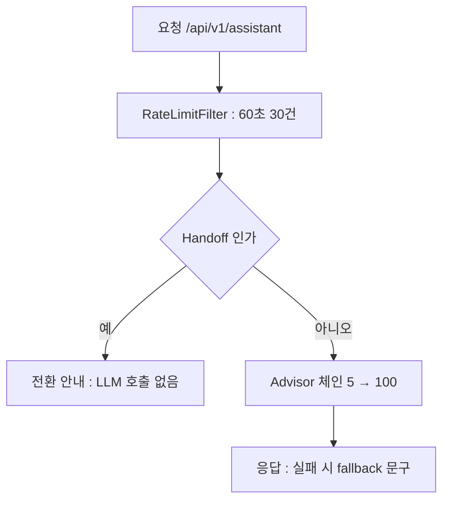

"AI 에이전트"라는 말에는 마법의 냄새가 난다. 알아서 판단하고 알아서 처리하는 무언가. 하지만 배달 주문 상담을 받는 에이전트 하나를 여섯 주 동안 직접 만들어보니 남은 인상은 마법과는 거리가 멀다. 에이전트는 순서가 정해진 체인이다. 어떤 요청이 어느 고리에서 잘리고, 어느 고리에서 저장되고, 어느 고리에서 측정되는지가 전부 숫자로 적혀 있는.

마지막 라운드에서는 새 AI 기능을 하나도 추가하지 않았다. 대신 2편부터 6편까지 만든 조각들(ChatClient, Tool, Memory, RAG, Guardrail, Handoff)을 한 체인으로 정렬하고, 그 위에 지표, 헬스체크, rate limit, graceful shutdown을 얹었다. "동작한다"와 "운영 가능하다" 사이의 거리를 재는 라운드였고, 그 거리를 재던 10턴 통합 테스트가 새 취약점 하나와 함께, 3편의 오래된 문제가 아직 살아 있다는 사실을 다시 확인시켜 줬다.

<style>
.agent-fig,.fig-defs{
  --fig-surface:#ffffff;--fig-ink:#0f172a;--fig-ink2:#334155;--fig-muted:#94a3b8;--fig-hair:#e6eaf1;
  --c-green:#16a34a;--c-greenink:#15803d;--c-red:#ef4444;--c-redink:#b91c1c;
  --c-blue:#2f6fed;--c-blueink:#1d4ed8;--c-amber:#d97706;--c-amberink:#b45309;
  --c-violet:#7c3aed;--c-violetink:#6d28d9;
}
@media (prefers-color-scheme: dark){
  .agent-fig,.fig-defs{
    --fig-surface:#121317;--fig-ink:#f2f5fa;--fig-ink2:#cbd5e1;--fig-muted:#697588;--fig-hair:#252a33;
    --c-green:#34d399;--c-greenink:#6ee7b7;--c-red:#f87171;--c-redink:#fca5a5;
    --c-blue:#5b9bff;--c-blueink:#93c5fd;--c-amber:#fbbf24;--c-amberink:#fcd34d;
    --c-violet:#a78bfa;--c-violetink:#c4b5fd;
  }
}
.agent-fig{margin:2.4em 0;border:1px solid var(--fig-hair);border-radius:18px;background:var(--fig-surface);
  padding:18px 20px 10px;overflow:hidden;box-shadow:0 1px 2px rgba(2,6,23,.05),0 14px 40px rgba(2,6,23,.09)}
@media (prefers-color-scheme: dark){.agent-fig{box-shadow:0 1px 2px rgba(0,0,0,.4),0 18px 46px rgba(0,0,0,.5)}}
.agent-fig svg{width:100%;height:auto;display:block;max-width:100%}
.agent-fig svg text{font-family:ui-monospace,"SF Mono","JetBrains Mono",Menlo,monospace}
.agent-fig .cap-head{display:flex;justify-content:space-between;align-items:baseline;gap:14px;margin-bottom:6px}
.agent-fig .cap-tag{font-size:11px;letter-spacing:.14em;text-transform:uppercase;color:var(--fig-muted);
  font-family:ui-monospace,SFMono-Regular,Menlo,monospace}
.agent-fig figcaption{font-size:13.5px;color:var(--fig-muted);line-height:1.6;padding:12px 2px 6px;
  font-family:ui-monospace,SFMono-Regular,Menlo,monospace}
.agent-fig figcaption b{color:var(--fig-ink2);font-weight:600}
@media (prefers-reduced-motion: reduce){.agent-fig svg animate,.agent-fig svg animateMotion{display:none}}
</style>

<svg class="fig-defs" width="0" height="0" aria-hidden="true" focusable="false" style="position:absolute;width:0;height:0">
  <defs>
    <filter id="fx-glow6" x="-60%" y="-60%" width="220%" height="220%">
      <feGaussianBlur stdDeviation="3" result="b"/>
      <feMerge><feMergeNode in="b"/><feMergeNode in="SourceGraphic"/></feMerge>
    </filter>
  </defs>
</svg>

## 숫자 다섯 개로 압축된 여섯 주

체인의 최종 형태는 빌더 한 줄이다.

```java
this.chatClient = builder
    .defaultSystem(AssistantPrompt.SYSTEM_PROMPT)
    .defaultAdvisors(inputGuardrail, memoryAdvisor, ragAdvisor,
                     outputGuardrail, performanceAdvisor)   // 5, 10, 20, 50, 100
    .defaultTools(orderTools)
    .build();
```

order 5, 10, 20, 50, 100. 이 다섯 숫자가 이 시리즈의 요약본이나 다름없다. 숫자마다 지난 라운드에서 직접 겪은 사고가 하나씩 붙어 있기 때문이다.

| order | 층 | 그렇게 정해진 사연 |
|---|---|---|
| 5 | InputGuardrail | 공격 발화가 Memory에 저장되기 전에 잘라야 오염이 없다 (6편) |
| 10 | Memory | "그 주문" 지시어를 RAG 검색 전에 풀어야 한다 (4편, 5편) |
| 20 | RAG | 순서를 뒤집었더니 정책 원문이 대화 이력으로 굳었다 (5편) |
| 50 | OutputGuardrail | 유출과 민감정보는 모델 응답을 받은 뒤에만 가공할 수 있다 (6편) |
| 100 | Performance | 마스킹 전 원본 기준으로 토큰을 재야 비용이 정확하다 (6편) |

아래 그림에서 파란 점 하나가 요청 한 건이다. 다섯 고리를 통과하는 순서가 곧 지난 다섯 라운드의 결론이다.

<figure class="agent-fig">
  <div class="cap-head"><span class="cap-tag">one request · five orders</span><span class="cap-tag">5 → 10 → 20 → 50 → 100</span></div>
  <svg viewBox="0 0 720 270" role="img" aria-label="요청 한 건이 InputGuardrail, Memory, RAG 를 지나 모델과 Tool 을 왕복하고 OutputGuardrail 과 Performance 를 거쳐 응답이 된다. 공격 요청은 첫 층에서 소멸한다" xmlns="http://www.w3.org/2000/svg">
    <g font-size="11" text-anchor="middle">
      <rect x="16" y="40" width="150" height="54" rx="10" fill="var(--c-amber)" opacity="0.12"/>
      <rect x="16" y="40" width="150" height="54" rx="10" fill="none" stroke="var(--c-amber)" stroke-opacity="0.5"/>
      <text x="91" y="62" fill="var(--fig-ink)">Input Guardrail</text>
      <text x="91" y="79" fill="var(--fig-muted)" font-size="9.5">order 5 : 차단은 여기서</text>
      <rect x="222" y="40" width="150" height="54" rx="10" fill="var(--c-violet)" opacity="0.12"/>
      <text x="297" y="62" fill="var(--fig-ink)">Memory</text>
      <text x="297" y="79" fill="var(--fig-muted)" font-size="9.5">order 10 : 지시어 복원</text>
      <rect x="428" y="40" width="150" height="54" rx="10" fill="var(--c-blue)" opacity="0.12"/>
      <text x="503" y="62" fill="var(--fig-ink)">RAG</text>
      <text x="503" y="79" fill="var(--fig-muted)" font-size="9.5">order 20 : 일회성 Context</text>
      <rect x="428" y="150" width="150" height="54" rx="10" fill="var(--fig-muted)" opacity="0.12"/>
      <text x="503" y="172" fill="var(--fig-ink)">모델 + Tool</text>
      <text x="503" y="189" fill="var(--fig-muted)" font-size="9.5">판단은 LLM, 실행은 Bean</text>
      <rect x="222" y="150" width="150" height="54" rx="10" fill="var(--c-green)" opacity="0.12"/>
      <text x="297" y="172" fill="var(--fig-ink)">Output Guardrail</text>
      <text x="297" y="189" fill="var(--fig-muted)" font-size="9.5">order 50 : 유출과 마스킹</text>
      <rect x="16" y="150" width="150" height="54" rx="10" fill="var(--c-blue)" opacity="0.09"/>
      <text x="91" y="172" fill="var(--fig-ink)">Performance</text>
      <text x="91" y="189" fill="var(--fig-muted)" font-size="9.5">order 100 : 원본 기준 측정</text>
    </g>
    <path d="M166 67 L222 67" stroke="var(--fig-hair)" stroke-width="1.6"/>
    <path d="M372 67 L428 67" stroke="var(--fig-hair)" stroke-width="1.6"/>
    <path d="M503 94 L503 150" stroke="var(--fig-hair)" stroke-width="1.6"/>
    <path d="M428 177 L372 177" stroke="var(--fig-hair)" stroke-width="1.6"/>
    <path d="M222 177 L166 177" stroke="var(--fig-hair)" stroke-width="1.6"/>
    <circle r="4.5" fill="var(--c-blue)" filter="url(#fx-glow6)">
      <animateMotion path="M20 67 L91 67 L297 67 L503 67 L503 177 L297 177 L91 177 L20 177" dur="7s" repeatCount="indefinite"/>
      <animate attributeName="opacity" values="0;1;1;0" keyTimes="0;0.05;0.93;1" dur="7s" repeatCount="indefinite"/>
    </circle>
    <circle r="4.5" fill="var(--c-red)" filter="url(#fx-glow6)">
      <animateMotion path="M20 90 C 40 96, 60 92, 80 84" dur="7s" repeatCount="indefinite"/>
      <animate attributeName="opacity" values="0;1;0;0" keyTimes="0;0.06;0.13;1" dur="7s" repeatCount="indefinite"/>
    </circle>
    <text x="91" y="118" text-anchor="middle" font-size="10" fill="var(--c-redink)">인젝션은 첫 층에서 소멸</text>
    <text x="360" y="248" text-anchor="middle" font-size="10.5" fill="var(--fig-muted)">어느 층에서 잘리고, 저장되고, 측정되는지가 order 값으로 읽힌다.</text>
  </svg>
  <figcaption>Memory, RAG, Guardrail 을 별도 파이프라인이 아니라 <b>한 체인에 둔 이유</b>가 이 그림이다. 흩어지면 어떤 데이터가 언제 대화 이력으로 굳는지 한 장에서 읽을 수 없다.</figcaption>
</figure>

체인 밖에 있는 것은 둘뿐이다. Handoff는 상담원 전환이 모델의 답변 품질 문제가 아니라 시스템 정책이라서, 컨트롤러에서 토큰을 쓰기 전에 끊는다. Tool의 실패는 예외가 아니라 결과 객체로 돌아온다. `NOT_CANCELABLE`은 장애가 아니라 도메인의 정상 답변이기 때문이다. 3편의 Outcome 설계가 그대로 살아남았다.

## 세어지지 않는 방어는 없는 방어다

6편 끝에서 차단과 전환 횟수를 로그를 눈으로 세고 있다고 고백했는데, 이번 주에 그 빚을 갚았다. 차단, 전환, fallback, Tool 호출, LLM 지연, 토큰이 전부 Micrometer 카운터가 됐다.

프롬프트 인젝션 한 건을 넣고 Prometheus 엔드포인트를 열어보면 이렇게 보인다.

```text
baedal_agent_guardrail_block_total{kind="input",reason="PROMPT_INJECTION"} 1.0
baedal_agent_request_total 1.0
baedal_agent_llm_latency_seconds_count 0
```

차단 1건, LLM 호출 0건. "막았다"는 주장이 로그 속 문장이 아니라 쿼리 가능한 숫자가 됐다. 10턴을 돌린 뒤의 누적은 이렇다.

```json
{"name":"baedal.agent.llm.latency","measurements":[
  {"statistic":"COUNT","value":7.0},{"statistic":"TOTAL_TIME","value":42.891},{"statistic":"MAX","value":10.099}]}
{"name":"baedal.agent.handoff","measurements":[{"statistic":"COUNT","value":2.0}],
 "availableTags":[{"tag":"reason","values":["HIGH_EMOTION","EXPLICIT_REQUEST"]}]}
```

10턴 중 LLM 호출은 7건이었다는 것, 나머지 3건은 차단이나 전환으로 모델 앞에서 끝났다는 것이 지표만으로 읽힌다. 토큰 카운터에는 방어 조건을 하나 달았다. null과 0은 세지 않는다. 잘못 기록된 0이 평균을 오염시키는 것보다 빠지는 쪽이 낫다.

```java
public void tokens(String type, Integer count) {
    if (count == null || count <= 0) { return; }
    Counter.builder("baedal.agent.tokens")
        .tag("type", type)
        .register(registry)
        .increment(count);
}
```

헬스체크에는 Ollama를 컴포넌트로 올렸다.

```json
{"status":"UP","components":{"db":{"status":"UP"},"ollama":{"status":"UP","details":{"responseLength":693}}}}
```

다만 이 UP에도 측정 경계가 있다. `/api/tags`를 두드리는 구조라 서버 프로세스의 생존만 본다. 모델만 내려간 상태는 UP으로 보인다. 계기가 무엇을 재고 무엇을 못 재는지는 계기를 만들 때 같이 적어둬야 한다.

## 10턴 테스트가 찾아준 마지막 구멍

세션 하나로 인사부터 상담원 전환까지 10턴을 이어서 돌렸다. 요청 하나가 지나는 전체 경로는 이렇다.



10턴 전부 HTTP 200이었고 스택트레이스는 한 번도 응답에 나오지 않았다. Tool 호출, RAG 정책 응답, 인젝션 차단, 감정 전환이 각각 한 번 이상 관찰됐다. 성공 확인이 목적이었다면 여기서 박수 치고 끝났을 것이다. 하지만 통합 테스트의 진짜 소득은 통과 도장이 아니라, 새 취약점 하나와 3편의 문제가 체인을 다 갖춘 뒤에도 살아 있다는 확인이었다.

하나는 6번 턴이다. "사장님 번호 010-1234-5678 맞나요?"라는 질문에 모델이 `123-456-7890` 같은 임의의 고객센터 번호를 만들어 답했다. 우리 마스커는 휴대폰 접두(010) 중심이라 이 형식은 걸러지지 않는다. 그동안 "있는 번호를 가리는" 방어만 생각했는데, "없는 번호를 지어내는" 유출은 마스킹의 반대 방향에서 오는 문제였다. Round 6의 새 취약점으로 기록됐다.

다른 하나는 5번 턴이다. "그럼 그 주문 취소해주세요"에서 `cancelOrder` 호출이 관찰되지 않았다. 모델은 이전 응답 텍스트로 답을 이어갔다. 3편에서 처음 만난 문제가 체인을 다 갖춘 뒤에도 그대로 남아 있다는 확인이다. "Tool 성공률"이 아니라 "호출됐어야 할 턴에 호출됐는가"를 재는 지표가 필요하다는 숙제가 여기서 나온다.

## 31번째 요청은 429

모델 호출은 한 건에 수천 토큰, 수 초짜리 자원이다. 무제한으로 열어두면 트래픽 사고보다 비용 사고가 먼저 온다. 그래서 IP당 60초에 30건으로 제한하는 서블릿 필터를 가장 앞에 세웠다.

```java
static final long WINDOW_MILLIS = 60_000L;
static final int MAX_REQUESTS_PER_WINDOW = 30;

@Override
protected boolean shouldNotFilter(HttpServletRequest request) {
    return !request.getRequestURI().startsWith("/api/");   // /api/ 만 제한
}
```

같은 IP로 31회를 두드리면 31번째가 429로 끊긴다.

```text
HTTP/1.1 429
{"error":"RATE_LIMITED"}
```

경로를 `/api/`로 좁힌 데는 작은 실패담이 있다. 처음에 모든 요청을 셌더니 `/actuator/metrics`를 확인하는 것조차 제한에 걸릴 수 있었다. 장애가 난 순간에 계기판부터 잠기는 구조인 셈이다. 방어는 고객 트래픽에만 걸고, 관찰 경로는 밖에 둔다.

이 rate limit 구현이 교육용이라는 점은 분명히 해둔다. 단일 인스턴스 메모리 기반이라 스케일 아웃하면 인스턴스마다 카운터가 찢어지고, IP별 기록을 청소하는 정책도 없다. 운영이라면 Redis 기반 Bucket4j나 Gateway RateLimiter로 바꾸는 것이 맞다. 이번 구현의 목적은 429가 서는 위치를 확인하는 것까지다. 종료 쪽도 정리했다. `server.shutdown=graceful`에 30초 유예. 수 초짜리 LLM 응답이 배포 순간에 목이 잘리지 않게 하는 최소 장치다.

## 그래서, 때워도 되나유?

여섯 라운드가 남긴 문장들을 한 줄씩 모으면 이렇다.

- 형식 지시는 `.entity()`가 자동으로 붙이지만, 작은 프롬프트에선 모델이 그걸 안 지켜 파서가 깨질 수 있다 (2편, SIMPLE에서 깨진 500 한 건)
- 판단은 LLM, 실행은 Spring Bean (3편, 봇이 취소 안 하고 취소했다고 말한 일)
- 기억의 품질은 모델이 아니라 세션과 창 크기가 정한다 (4편, 창 2가 6턴째 "1235"를 놓친 일)
- Advisor 순서는 데이터의 수명을 정한다 (5편, 순서를 뒤집자 정책 원문이 대화 이력으로 굳은 일)
- 방어는 서로의 미스를 전제로 겹친다 (6편, 입력에서 샌 유출을 출력 가드가 뒤늦게 회수한 일)
- 막았다는 주장이 로그 문장이 아니라 쿼리 가능한 숫자가 됐다 (7편, 카운터와 429)

1편의 질문으로 돌아가면, 절반은 "된다"이고 절반은 "때워지지 않는다"이다. 배선은 때워진다. ChatClient, Advisor, Tool, VectorStore는 Spring 개발자의 손에 익은 방식 그대로 잡힌다. Python 없이 여기까지 오는 데 아무 지장이 없었다. 하지만 경계값들은 때워지지 않았다. 창 크기, 청크 크기, 유사도 임계값, order, rate limit 임계치. 전부 이 도메인에서 직접 재서 정한 값이고, 프레임워크는 그 답을 모른다. 다른 도메인이라면 다른 값이 나올 것이다.

남은 숙제도 명확하다. 프롬프트를 고쳤을 때 그것이 전진인지 후퇴인지 자동으로 판정하는 장치(Evals)가 없고, Tool이 늘어나면 한 Bean에 붙이는 방식의 다음 단계로 MCP 같은 표준이 필요해지고, LLM 지연은 Timer의 summary가 아니라 histogram으로 p95를 봐야 한다.

여기까지가 배달 상담 에이전트 6주의 기록이다. 다음 실험이 정해지면 이 시리즈 뒤에 이어 붙인다.
