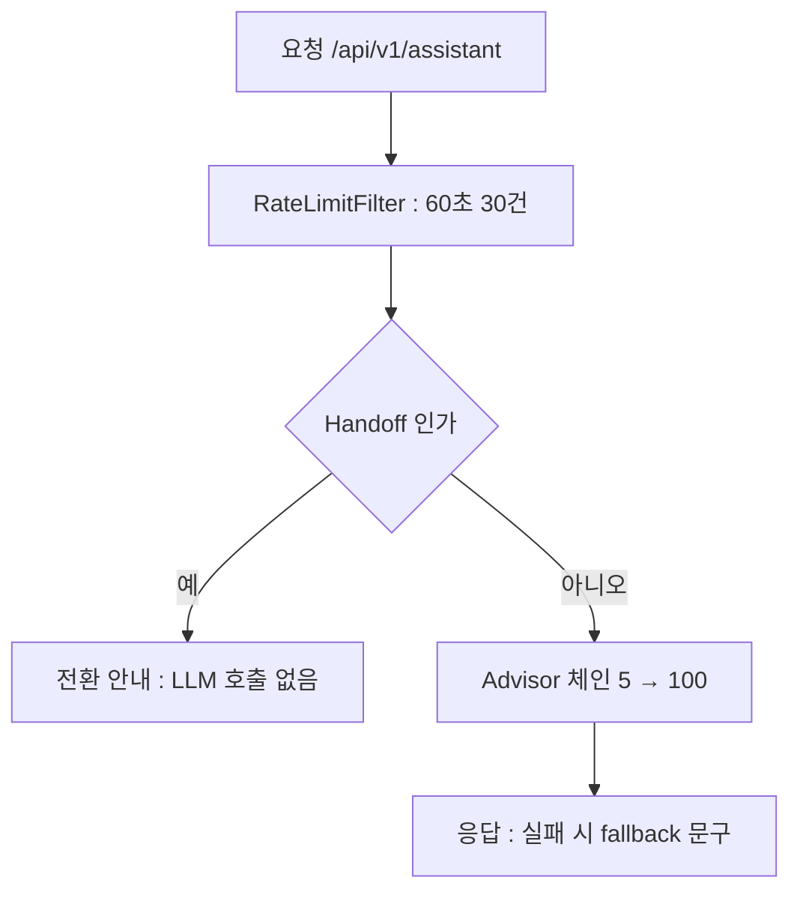

> **TL;DR**
>
> 마지막 라운드에서 새 AI 기능은 없다. 추가한 건 지표, 헬스체크, rate limit, graceful shutdown 뿐이다.
>
> 실제로 중요했던 기준은 order 다섯 개의 정렬이다. 5, 10, 20, 50, 100. 지난 라운드들이 각자 증명한 순서 원칙이 숫자 다섯 개로 한 장에 모인다.
>
> 이 구조에서는 요청 한 건이 어느 층에서 잘리고 어느 층에서 저장되고 어느 층에서 측정되는지가 코드 한 줄에서 읽힌다. 그리고 10턴 E2E 가 그 체인의 남은 구멍 하나를 새로 찾아냈다.

---

2편부터 6편까지 만든 조각들이 있다. ChatClient, Tool, Memory, RAG, Guardrail, Handoff.
이번 라운드는 조각을 늘리지 않고 묶는다. "동작한다" 와 "운영 가능하다" 사이의 거리를 재는 라운드다.

<style>
.agent-fig,.fig-defs{
  --fig-surface:#ffffff;--fig-ink:#0f172a;--fig-ink2:#334155;--fig-muted:#94a3b8;--fig-hair:#e6eaf1;
  --c-green:#16a34a;--c-greenink:#15803d;--c-red:#ef4444;--c-redink:#b91c1c;
  --c-blue:#2f6fed;--c-blueink:#1d4ed8;--c-amber:#d97706;--c-amberink:#b45309;
  --c-violet:#7c3aed;--c-violetink:#6d28d9;
}
@media (prefers-color-scheme: dark){
  .agent-fig,.fig-defs{
    --fig-surface:#121317;--fig-ink:#f2f5fa;--fig-ink2:#cbd5e1;--fig-muted:#697588;--fig-hair:#252a33;
    --c-green:#34d399;--c-greenink:#6ee7b7;--c-red:#f87171;--c-redink:#fca5a5;
    --c-blue:#5b9bff;--c-blueink:#93c5fd;--c-amber:#fbbf24;--c-amberink:#fcd34d;
    --c-violet:#a78bfa;--c-violetink:#c4b5fd;
  }
}
.agent-fig{margin:2.4em 0;border:1px solid var(--fig-hair);border-radius:18px;background:var(--fig-surface);
  padding:18px 20px 10px;overflow:hidden;box-shadow:0 1px 2px rgba(2,6,23,.05),0 14px 40px rgba(2,6,23,.09)}
@media (prefers-color-scheme: dark){.agent-fig{box-shadow:0 1px 2px rgba(0,0,0,.4),0 18px 46px rgba(0,0,0,.5)}}
.agent-fig svg{width:100%;height:auto;display:block;max-width:100%}
.agent-fig svg text{font-family:ui-monospace,"SF Mono","JetBrains Mono",Menlo,monospace}
.agent-fig .cap-head{display:flex;justify-content:space-between;align-items:baseline;gap:14px;margin-bottom:6px}
.agent-fig .cap-tag{font-size:11px;letter-spacing:.14em;text-transform:uppercase;color:var(--fig-muted);
  font-family:ui-monospace,SFMono-Regular,Menlo,monospace}
.agent-fig figcaption{font-size:13.5px;color:var(--fig-muted);line-height:1.6;padding:12px 2px 6px;
  font-family:ui-monospace,SFMono-Regular,Menlo,monospace}
.agent-fig figcaption b{color:var(--fig-ink2);font-weight:600}
@media (prefers-reduced-motion: reduce){.agent-fig svg animate,.agent-fig svg animateMotion{display:none}}
</style>

<svg class="fig-defs" width="0" height="0" aria-hidden="true" focusable="false" style="position:absolute;width:0;height:0">
  <defs>
    <filter id="fx-glow6" x="-60%" y="-60%" width="220%" height="220%">
      <feGaussianBlur stdDeviation="3" result="b"/>
      <feMerge><feMergeNode in="b"/><feMergeNode in="SourceGraphic"/></feMerge>
    </filter>
  </defs>
</svg>

## order 다섯 개는 어떻게 정해졌나

체인의 최종 형태는 빌더 한 줄이다.

```java
this.chatClient = builder
    .defaultSystem(AssistantPrompt.SYSTEM_PROMPT)
    .defaultAdvisors(inputGuardrail, memoryAdvisor, ragAdvisor,
                     outputGuardrail, performanceAdvisor)   // 5, 10, 20, 50, 100
    .defaultTools(orderTools)
    .build();
```

숫자마다 지난 라운드의 실측이 하나씩 붙어 있다.

| order | 층 | 근거가 된 실측 |
|---|---|---|
| 5 | InputGuardrail | 공격 발화가 Memory 에 저장되기 전에 잘라야 오염이 없다 (6편) |
| 10 | Memory | "그 주문" 지시어를 RAG 검색 전에 풀어야 한다 (4편, 5편) |
| 20 | RAG | 순서를 뒤집으면 정책 원문이 이력으로 굳는다 (5편) |
| 50 | OutputGuardrail | 유출과 민감정보는 모델 응답 뒤에서만 가공할 수 있다 (6편) |
| 100 | Performance | 마스킹 전 원본 기준으로 토큰을 재야 비용이 정확하다 (6편) |

<figure class="agent-fig">
  <div class="cap-head"><span class="cap-tag">one request · five orders</span><span class="cap-tag">5 → 10 → 20 → 50 → 100</span></div>
  <svg viewBox="0 0 720 270" role="img" aria-label="요청 한 건이 InputGuardrail, Memory, RAG 를 지나 모델과 Tool 을 왕복하고 OutputGuardrail 과 Performance 를 거쳐 응답이 된다. 공격 요청은 첫 층에서 소멸한다" xmlns="http://www.w3.org/2000/svg">
    <g font-size="11" text-anchor="middle">
      <rect x="16" y="40" width="150" height="54" rx="10" fill="var(--c-amber)" opacity="0.12"/>
      <rect x="16" y="40" width="150" height="54" rx="10" fill="none" stroke="var(--c-amber)" stroke-opacity="0.5"/>
      <text x="91" y="62" fill="var(--fig-ink)">Input Guardrail</text>
      <text x="91" y="79" fill="var(--fig-muted)" font-size="9.5">order 5 : 차단은 여기서</text>
      <rect x="222" y="40" width="150" height="54" rx="10" fill="var(--c-violet)" opacity="0.12"/>
      <text x="297" y="62" fill="var(--fig-ink)">Memory</text>
      <text x="297" y="79" fill="var(--fig-muted)" font-size="9.5">order 10 : 지시어 복원</text>
      <rect x="428" y="40" width="150" height="54" rx="10" fill="var(--c-blue)" opacity="0.12"/>
      <text x="503" y="62" fill="var(--fig-ink)">RAG</text>
      <text x="503" y="79" fill="var(--fig-muted)" font-size="9.5">order 20 : 일회성 Context</text>
      <rect x="428" y="150" width="150" height="54" rx="10" fill="var(--fig-muted)" opacity="0.12"/>
      <text x="503" y="172" fill="var(--fig-ink)">모델 + Tool</text>
      <text x="503" y="189" fill="var(--fig-muted)" font-size="9.5">판단은 LLM, 실행은 Bean</text>
      <rect x="222" y="150" width="150" height="54" rx="10" fill="var(--c-green)" opacity="0.12"/>
      <text x="297" y="172" fill="var(--fig-ink)">Output Guardrail</text>
      <text x="297" y="189" fill="var(--fig-muted)" font-size="9.5">order 50 : 유출과 마스킹</text>
      <rect x="16" y="150" width="150" height="54" rx="10" fill="var(--c-blue)" opacity="0.09"/>
      <text x="91" y="172" fill="var(--fig-ink)">Performance</text>
      <text x="91" y="189" fill="var(--fig-muted)" font-size="9.5">order 100 : 원본 기준 측정</text>
    </g>
    <path d="M166 67 L222 67" stroke="var(--fig-hair)" stroke-width="1.6"/>
    <path d="M372 67 L428 67" stroke="var(--fig-hair)" stroke-width="1.6"/>
    <path d="M503 94 L503 150" stroke="var(--fig-hair)" stroke-width="1.6"/>
    <path d="M428 177 L372 177" stroke="var(--fig-hair)" stroke-width="1.6"/>
    <path d="M222 177 L166 177" stroke="var(--fig-hair)" stroke-width="1.6"/>
    <circle r="4.5" fill="var(--c-blue)" filter="url(#fx-glow6)">
      <animateMotion path="M20 67 L91 67 L297 67 L503 67 L503 177 L297 177 L91 177 L20 177" dur="7s" repeatCount="indefinite"/>
      <animate attributeName="opacity" values="0;1;1;0" keyTimes="0;0.05;0.93;1" dur="7s" repeatCount="indefinite"/>
    </circle>
    <circle r="4.5" fill="var(--c-red)" filter="url(#fx-glow6)">
      <animateMotion path="M20 90 C 40 96, 60 92, 80 84" dur="7s" repeatCount="indefinite"/>
      <animate attributeName="opacity" values="0;1;0;0" keyTimes="0;0.06;0.13;1" dur="7s" repeatCount="indefinite"/>
    </circle>
    <text x="91" y="118" text-anchor="middle" font-size="10" fill="var(--c-redink)">인젝션은 첫 층에서 소멸</text>
    <text x="360" y="248" text-anchor="middle" font-size="10.5" fill="var(--fig-muted)">어느 층에서 잘리고, 저장되고, 측정되는지가 order 값으로 읽힌다.</text>
  </svg>
  <figcaption>파란 점 하나가 요청 한 건이다. 다섯 층을 지나는 순서가 곧 지난 다섯 라운드의 결론이다. <b>Memory, RAG, Guardrail 을 한 체인에 둔 이유</b>도 이 그림 때문이다. 파이프라인이 흩어지면 어떤 데이터가 언제 굳는지 한 장에서 읽을 수 없다.</figcaption>
</figure>

Handoff 만 체인 밖이다. 상담원 전환은 모델의 답변 품질 문제가 아니라 시스템 정책이라서 컨트롤러에서 토큰을 쓰기 전에 끊는다.
Tool 은 예외 대신 결과 객체를 돌려준다. `NOT_CANCELABLE` 은 장애가 아니라 도메인 결과이기 때문이다. 3편의 Outcome 설계가 그대로 살아 있다.

> 에이전트는 마법이 아니라 체인이다. 설계 판단은 결국 order 값 다섯 개로 압축된다.

## 지표가 없으면 방어는 존재하지 않는다

6편의 마지막 문장을 코드로 갚았다. 차단, 전환, fallback, Tool 호출, LLM 지연, 토큰이 전부 Micrometer 카운터가 됐다.

프롬프트 인젝션 한 건을 넣고 확인한 결과다.

```text
baedal_agent_guardrail_block_total{kind="input",reason="PROMPT_INJECTION"} 1.0
baedal_agent_request_total 1.0
baedal_agent_llm_latency_seconds_count 0
```

차단 1건, LLM 호출 0건. "막았다" 는 주장이 로그 문장이 아니라 쿼리 가능한 숫자가 됐다.
10턴을 돌린 뒤에는 이렇게 쌓였다.

```json
{"name":"baedal.agent.llm.latency","measurements":[
  {"statistic":"COUNT","value":7.0},{"statistic":"TOTAL_TIME","value":42.891},{"statistic":"MAX","value":10.099}]}
{"name":"baedal.agent.handoff","measurements":[{"statistic":"COUNT","value":2.0}],
 "availableTags":[{"tag":"reason","values":["HIGH_EMOTION","EXPLICIT_REQUEST"]}]}
```

토큰 카운터에는 방어 조건이 하나 붙어 있다.

```java
public void tokens(String type, Integer count) {
    if (count == null || count <= 0) { return; }   // null 과 0 은 세지 않는다
    Counter.builder("baedal.agent.tokens")
        .tag("type", type)
        .register(registry)
        .increment(count);
}
```

헬스체크는 Ollama 를 `/actuator/health` 의 컴포넌트로 올렸다.

```json
{"status":"UP","components":{"db":{"status":"UP"},"ollama":{"status":"UP","details":{"responseLength":693}}}}
```

다만 이 UP 은 서버 프로세스의 생존이다. `/api/tags` 를 두드리는 구조라 모델만 내려간 상태는 UP 으로 보인다. 헬스체크에도 측정 경계가 있다.

> 세어지지 않는 방어는 운영에서 존재하지 않는 것과 같다. 지표의 이름과 태그가 곧 그날 장애 회의의 어휘가 된다.

## 10턴 E2E 는 무엇을 새로 찾아냈나

세션 하나로 인사부터 상담원 전환까지 10턴을 이었다. 요청 흐름은 이렇게 정리된다.



10턴 전부 HTTP 200 이었고 스택트레이스는 한 번도 응답에 나오지 않았다. Tool 호출, RAG 정책 응답, 인젝션 차단, 감정 전환이 각각 한 번 이상 관찰됐다.
성공 확인이 목적이었으면 여기서 끝이다. 실제 소득은 실패 두 개다.

6번 턴 "사장님 번호 010-1234-5678 맞나요?" 에 모델이 `123-456-7890` 같은 임의의 고객센터 번호를 만들어 답했다.
마스커는 휴대폰 접두(010) 중심이라 이 형식은 걸리지 않는다. 존재하지 않는 번호를 지어내는 유출은 마스킹의 반대 방향 문제다. 새 취약점으로 기록됐다.

5번 턴 "그럼 그 주문 취소해주세요" 에서는 `cancelOrder` 호출이 관찰되지 않았다. 모델은 이전 응답 텍스트로 답을 이어갔다.
3편의 미해결 문제가 체인을 다 갖춘 뒤에도 그대로 남아 있다는 확인이다. "Tool 성공률" 이 아니라 "호출돼야 할 턴에 호출됐는가" 를 재는 지표가 필요하다.

> E2E 의 산출물은 통과 도장이 아니라 갱신된 취약점 목록이다. 10턴이 남긴 건 200 열 개가 아니라 구멍 두 개다.

## 31번째 요청은 왜 429 인가

모델 호출은 한 건에 수천 토큰, 수 초짜리 자원이다. 무제한으로 열어 두면 비용 사고가 트래픽 사고보다 먼저 온다.
IP 당 60초에 30건으로 제한하는 서블릿 필터를 앞에 세웠다.

```java
static final long WINDOW_MILLIS = 60_000L;
static final int MAX_REQUESTS_PER_WINDOW = 30;

@Override
protected boolean shouldNotFilter(HttpServletRequest request) {
    return !request.getRequestURI().startsWith("/api/");   // /api/ 만 제한
}
```

같은 IP 로 31회를 두드리면 31번째가 이렇게 끊긴다.

```text
HTTP/1.1 429
{"error":"RATE_LIMITED"}
```

경로를 `/api/` 로 좁힌 데는 실패 경험이 있다. 처음에 모든 요청을 셌더니 `/actuator/metrics` 확인 자체가 제한에 걸릴 수 있었다.
관찰 트래픽이 방어에 걸리면 장애 순간에 계기부터 잃는다. 방어는 고객 트래픽에만, 관찰 경로는 밖에.

종료도 정리했다. `server.shutdown=graceful` 에 30초 유예. 수 초짜리 LLM 응답이 배포 순간에 잘려 나가지 않게 하는 최소 장치다.

> **포기한 것**: 분산 rate limit. 이 필터는 단일 인스턴스 메모리 기반이라 스케일 아웃하면 카운터가 인스턴스마다 찢어진다. IP 별 기록 청소 정책도 없다. 운영이라면 Redis 기반 Bucket4j 나 Gateway RateLimiter 로 바꾸는 게 맞고, 이번 구현은 429 가 서는 위치를 확인하는 교육용이다.

> **포기한 것**: 실장애 재현. Ollama 프로세스 kill 과 PgVector 컨테이너 stop 은 재현 명령과 단위 테스트만 준비하고 실행하지 않았다. 로컬의 다른 실험에 영향이 가는 조작이라 단독 환경으로 미뤘다. RAG 는 여전히 Advisor 체인 중간이라 검색 실패가 어떤 형태로 전파되는지 직접 본 적이 없다.

## 여섯 라운드가 남긴 불변식

- 프롬프트와 파서는 한 몸이다 (2편, SIMPLE 500).
- 데이터를 바꾸는 실행은 Bean 에만 둔다 (3편, 취소 거짓말).
- 세션과 창 크기가 기억의 품질을 정한다. 모델이 아니라 (4편, 창 2의 6턴 붕괴).
- Advisor order 는 데이터 수명 결정이다 (5편, Memory 오염).
- 방어는 서로의 미스를 전제로 겹친다 (6편, 475 토큰 유출을 출력이 회수).
- 세어지지 않는 동작은 운영에 없는 동작이다 (7편, 카운터와 429).

1편의 질문으로 돌아간다. Spring AI 로 때워도 되나.
배선은 때워진다. ChatClient, Advisor, Tool, VectorStore 는 Spring 개발자의 손에 그대로 잡힌다.
때워지지 않는 것은 경계값들이다. 창 크기, 청크 크기, 임계값, order, 임계치. 전부 이 도메인의 실측이 정했고 프레임워크는 그 답을 모른다.

## 아직 해결하지 않은 범위

프롬프트를 고쳤을 때 그게 나아진 건지 퇴보한 건지 자동으로 재는 장치(Evals)가 없다. Tool 이 호출돼야 할 턴의 판정부터가 수작업이다.
Tool 이 늘어나면 한 Bean 에 붙이는 방식의 다음 단계로 MCP 같은 외부 표준이 필요해진다.
LLM 지연은 Timer 라 Prometheus 에 summary 로만 나온다. p95 를 안정적으로 보려면 histogram bucket 전환이 남아 있다.

여기까지가 배달 상담 에이전트 6주의 기록이다. 다음 실험이 정해지면 이 시리즈 뒤에 붙는다.
