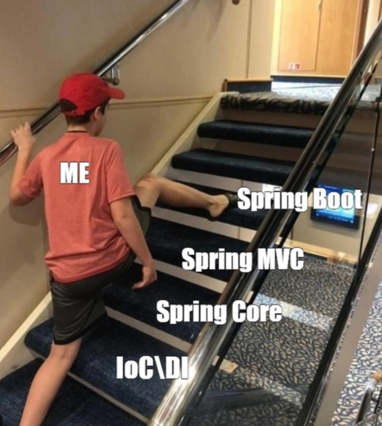
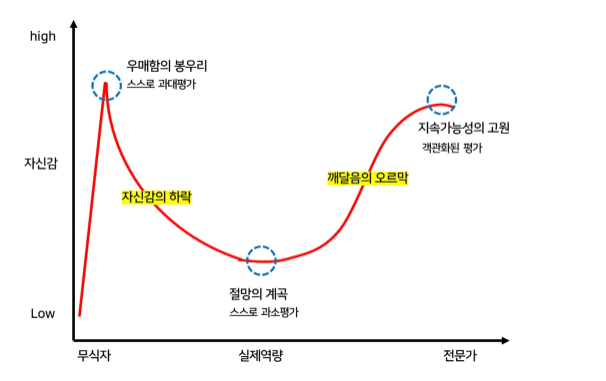
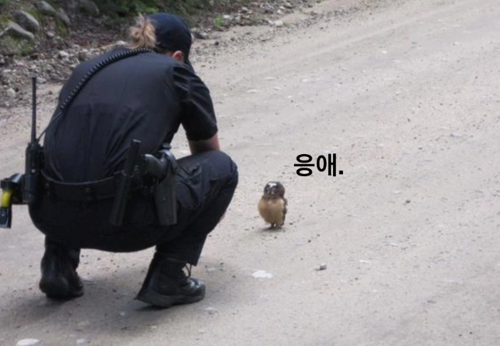
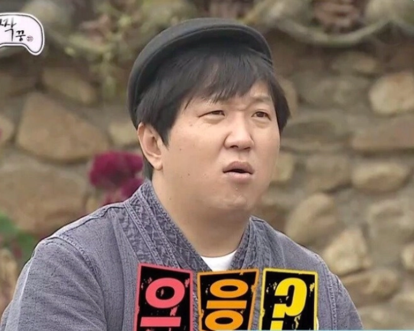

국비 지원 학원에서 웹개발을 배우기 시작했을 때, 나는 백엔드 개발자가 되고 싶었음.
But. 현실은 달랐다.   

어찌 하고싶은 일만 할 수 있을까..

첫 직장에서 얼떨결에 맡은 업무는 프론트엔드였고,   
그렇게 **몇 년을 프론트엔드 개발자로 살았다.**

그런 삶을 적응한 채 나는 프론트엔드에 사랑을 느끼고 있었다. 

> 새로 이직한 회사에서 첫 프로젝트를 맡기 전까지는.

### 불안한 냄새

입사할 무렵 신규 간편결제 수단으로 네이버페이를 붙여야 하는 일이 있었다.  
그때 나는 "에~이 ~ 결제수단 하나 추가하는 데 얼마나 걸리겠음ㅋ" 정도로 생각했다.  

다른 개발자들도 크게 다르지 않았던 걸로 기억한다. ( 진짜로 )

회의실에 끌려가신 팀장님께서 어두운 표정으로 긴급 회의를 하자고 하실때 부터 알았다.   

> ㅈ됐음을.

제기랄. 기능이 추가될 코드를 열어보고 나서야 다들 표정이 왜 어두웠는지 알았다. "얼마나 걸리겠어"는 착각이었다. 볼륨이 너무 컸다.

WBS 일정표를 보는 눈빛에 sorm (소름) 이 끼쳤다. "이 모든 걸 어떻게 해내라는 거야?" 한 개발자가 한숨을 내쉬었다.
"새 기능을 넣으려면 기존 시스템에 미칠 영향도 다 훑어야 해." 다른 개발자가 걱정스럽게 덧붙였다.

눈치게임 오져버리는 회의는 끝이나면서,  

결제 리뉴얼 프로젝트와 TF 팀 을 꾸려야 한다고 결론이 지어졌고.  

> TF 팀에 내가 납치 되었다.

### 뒤 (Back-end) 가 없는 팀

꾸려진 TF 팀에서 첫 미팅을 했다. 임시 팀장님이 말했다.

"자, 일 나누기 전에 포지션부터 정해보죠!"

그 "말" 과 함께 팀 전원이 얼어붙었다.   

납치된 인간들이 전부 프론트엔드로 개발자였기 때문이다.

정적을 깨려고 내가 먼저 운을 뗐다.

**나**: "저희 아무래도 백엔드 지원이 필요한데, 다른 팀에서 받으면 안 될까요?"

**임시 팀장님**: "다른 팀 지원은 어려워요. TF 내부에서 정해야 합니다."

좀처럼 의견이 좁혀질 기미가 안보여서, 다음 미팅까지 포지션을 정하기로 하고 숨막히는 미팅이 종료되었다. 

### 나대지 말껄

서버 개발자를 뽑아야 하니 눈치싸움이 시작됐다. 내가 사다리 타기로 정하자고 제안했다.
다행히 모두가 게임으로 정하는 데 동의했다.

그런데 앗차...  **게임을 제안한 사람이 당첨되는 게 국룰**이라는 걸 잊고 있었다.
.  
.  
.   
.  
.   
.   
.  
.  
.  
.  
.  
.  
.  
.  
.  
.  
.  
충격적이게도 나는 그날부터 서버 개발자가 되었다.

### 오징어게임

살면서 내 선택으로 삶이 바뀐 경험 TOP 3에 드는 전환점 이였다.  

이제 달리는 수밖에 없었다. 매일 기초 강의를 듣고, TF에서 1인분을 하려고 버티는 생존의 연속이었다.
살려고 주먹구구식으로, 때로는 무식하게, 때로는 오래 걸리더라도 의도를 정확히 담으려고 애쓰면서 익숙지 않은 백엔드 언어의 장벽을 넘나들었다.

그렇게 몇달이 지나고, 어느덧 오픈 일정이 코앞으로 다가왔다.   

나는 할당된 일을 쳐내려고 계왕권 100 배를 얼마나 써댔는지 모르겠다.

그렇게 1년을 무리했다. 번아웃이 올 법도 했는데, 프로젝트를 성공적으로 오픈하면서 감격스럽게 마무리했다.
정말 놀랍게도 오픈 당일 TF가 마주한 장애 대응 건은 0에 수렴했다.

> 형들 누나들 고생 했어 아이싯뗴루 ...!

### 능력에 대한 자각

프로젝트의 성공은 오만함을 키웠다.   

더닝 크루거 효과로 내 능력을 과대평가하는 순간도 왔다.

어느날 코드리뷰를 지적 사항이 나에게 절망의 계곡을 선사했다.  

> "아니 내가 이걸 모른다고?"

당연했다. 계단으로 치면 한 번에 네 칸씩 오르는 느낌이랄까.    
어거지로 티 안나게 올라가지긴 한 모양이다.  

그러다 실력을 객관적으로 보게 되면서 내면의 목소리가 바뀌기 시작했다.

"설마 내가 바보인가..?"

더닝 크루거 그래프에서 내 상태는 우매함의 봉우리를 넘어 끝없는 하락장이었다. 주식으로 비유하면 '지하철이 있는 느낌'.
보통 이 구간에서 자신감이 떨어지는데, 나는 "매일"을 하락 속에서 살았다.

가장 큰 이유는 말을 잘 못해서였다.

살면서 말을 못 해본 적이 없었다. 개발자를 하기 전에 나는 유명 신발가게 판매왕이었다.
판매왕이 된 이유는 팔 제품을 정말 잘 알았기 때문이다. 이 신발의 기능이 우리 몸에 어떤 도움을 주는지 생동감 있게 설명할 수 있었다. 그래서 고객들이 나를 믿고 합리적인 소비를 했다고 생각한다.

다시 개발자로 돌아오면, 나는 내가 짠 비즈니스를 남에게 설명하지 못했다. 두괄식으로 정리도 안 됐다.
당황해서 같은 말을 반복하거나, 묻지도 않은 포인트에서 답을 했다. 잘못된 노력을 하고 있다는 느낌이 들었다.

이윽고 깨달았다.

> "젠장. 내가 기여한 제품을 내가 잘 모르는구나."

### 잘못된 노력의 방향

개발자는 현실의 비즈니스를 코드로 풀어낸다. 그 과정에서 막히는 곳을 만나면 학습하고, 코드를 더 써서 넘어간다.

내가 한 노력은 반대였다. 하고 싶은 공부를 제멋대로 고르고, 당장 풀어야 할 비즈니스와 먼 주제를 파고들었다.
노력을 안 했다고 하기도 애매한, 가성비 없는 노력이었다.

백엔드를 공부하다 보면 디자인 패턴을 만난다. 쉽게 말하면 방법론이다.
공부 순서에 정답은 없다. 하지만 이런 두 사람이라면 어떨까.

비즈니스 흐름을 고민한 끝에 디자인 패턴을 보고 문제를 푼 A 개발자.
패턴을 먼저 공부하고 그걸 적용할 곳을 찾아 눈에 불을 켠 B 개발자.

안타깝지만 B의 미래는 시니어에게 혼나거나, 혼자 좌절하고 있을 것이다.
적용한 패턴이 독이 되고, 그 독 때문에 이도 저도 못 하는 상황에서 먼 산을 바라보는 선례를 여럿 봤다.

내 경우는 SAGA 패턴이었다. 적용하고 싶어 안달이 났고, 그걸 다룬 강의를 보고 뛸 듯이 기뻤다.
그리고 그 강의를 소화하려고 한참을 방황했다.

C를 이해하려면 A와 B가 필요한데, 내 경험치는 너무 초라했다.
결국 A와 B를 완벽히 이해하지 못한 채로 완강만 목표 삼아 표독스러운 얼굴로 강행군했다.

그사이 TF 팀원들은 현실에서 풀어야 할 비즈니스를 고민하고 있었다.
나는 혜성처럼 나타나 어려운 문제를 해결사처럼 처리하는 상상을 하며, 독극물을 마시는 줄도 모르고 벌겋게 충혈된 눈으로 매일을 살았다.

우여곡절 끝에 완강하고 나니 현자타임이 밀려왔다. 그때 스친 문장이 있다.

> "와 진짜 가성비 없다.."

현실성 없는 공부는 나를 나락으로 떨어뜨린 계기가 됐다. 그리고 나는 탓할 대상을 찾아 합리화를 시작했는데, 이게 MBTI까지 간다.

### 잘못된 집착

내 MBTI는 ENFP다.
자랑스러운 N(직관) 성향으로, 많은 N들처럼 지식의 연결고리를 전부 탐구하는 데 열정을 가진 종족이다.

문제는 학습에서 **방향을 잘못 잡으면**, 원하는 지식에 닿기도 전에 뇌절한다는 것이다. 살짝 피곤한 타입.

생각이 꼬리를 무는 게 나쁜 건 아니다. 하지만 결국 나를 꺾이게 만든다는 사실은 고칠 부분이었다.
그전까지 나는 *"꺾여도 계속하는 마음"* 이 **만능 영양제**인 줄 알았다.

그래서 이따금 S(감각)로 접근해 보기로 했다.
당장 필요한 게 무엇인지 구분하고, 나머지는 '장바구니'에 담아뒀다가 필요할 때 꺼내는 쪽으로 생각을 바꿨다.

**지식을 제때 쓰지 못하면, 오래 걸려 습득한 지식도 결국 낭비한 시간으로 치부하게 된다.**

개발자로서 내 진짜 능력은 기술과 도메인을 이해한 위에서 문제를 짚어내고 '적절한' 해법을 아는 데 있다.
책이나 강의를 쇼핑하듯 사 모으는 것보다, 매일의 고민에서 얻은 경험이 더 크게 작용한다는 걸 깨달았다.

물론 꼬리를 무는 궁금증과 끈기, 그걸 받쳐줄 무한한 정신력만 있다면 깊이도 얻고 조각난 지식까지 전부 연결돼 전문가가 되겠지.
다만 그 지식에 닿기도 전에..

> **"아마도 늙을 것이다"**

그래서 나는 당장 필요한 지식까지만 알기로 했다. 나머지는 마음 한켠에 장바구니처럼 담아두고, 생각날 때마다 꺼내 먹는 방향으로.
( ~~국비 교육 때는 게시판만 잘해도 먹고산다고 했었잖아~~ )

결국 단전에 "경험"과 "고민"이 쌓여 코어를 이루지 못하면, 하락 곡선 뒤의 절망 계곡이 1년일지 3년일지 모른다.
그 터널의 길이를 정하는 건 아쉽게도 본인 몫이다.

### 눈물나는 조금의 성장

나는 내가 뭘 모르는지, 어떤 질문이 스스로를 작게 만드는지 원인을 찾기 시작했다.
사내 시니어분들과 동료들에게 계속 묻고 피드백을 받으면서 개발적 주관의 완성도를 올렸다.
거기서 그치지 않고 작은 부트캠프와 인터넷 강의도 들었다.

어제보다 +1 더 똑똑해지자는 생각으로 하루하루를 보내던 중, 사내 중소 규모 프로젝트를 혼자 끝내고 다시 팀을 옮기게 됐다.

인수인계를 하면서 내 의도가 담긴 비즈니스 로직과 개발 결과를 설명했다. 그때 뜻밖의 피드백을 받았다.

> "이제는 등을 맡겨도 되겠어. 잘 성장했네."

TF 때부터 함께한 시니어분의 말이었다. 그 순간 흑백이던 세상에 색이 채워지는 느낌을 받았다.
짧은 회고였지만 그날 퇴근길은 깃털처럼 가벼웠다.

절망의 계곡은 누구에게나 온다. 다만 그 깊이와 길이는 스스로 정한다.
업을 즐기고, 배우고, 어제보다 조금 나은 개발자가 되려는 노력을 멈추지 않으면 어느새 웃고 있는 나를 발견하게 된다.

깨달음의 오르막을 걷는 나를 기대하며 정진하자.