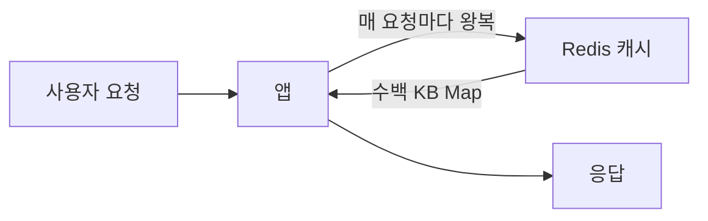
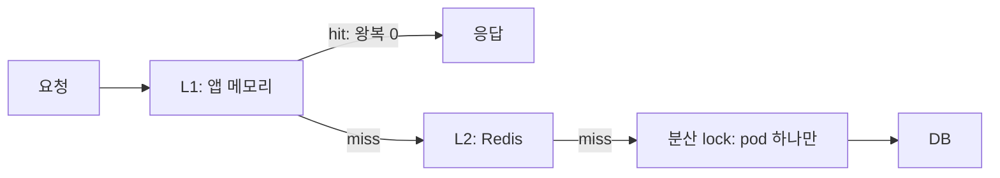

> **TL;DR**
>
> 캐시 hit률 99.9%. 대시보드에서 이보다 안심되는 숫자는 드물다. 그런데 그 캐시가 우리 서비스에서 가장 꾸준한 지연의 범인이었다.
> hit률은 "캐시에 있었는가"만 대답한다. "그 캐시가 어디에 있는가"는 대답하지 않는다. 네트워크 건너편에 있는 캐시는 hit이어도 왕복 비용을 매번 청구한다.
>
> 결국 L1(앱 메모리) + L2(Redis) 2단으로 갔고 99% 요청이 0ms로 떨어졌다.
> 다만 이 패턴은 아무 데이터에나 쓰면 "방금 바꿨는데 왜 안 바뀌나요"라는 다른 사고로 돌아온다. 마지막 절이 그 얘기다.

---

## hit인데 느리다니, 누가 거짓말을 하고 있을까

상황부터 그려보자.

우리 서비스에는 사용자 요청마다 읽는 마스터 데이터가 있다. 연도별 기준값 표 같은 것인데, 1년에 한 번 갱신되고 크기는 수백 KB다. 요청이 들어오면 앱이 Redis에서 그 연도의 Map 전체를 받아 객체로 바꾸고, 키 하나를 꺼내 응답한다. TTL 24시간에 갱신은 연 1회. hit률이 100%에 가까울 수밖에 없는 조건이다.



그런데 P95 응답시간이 조금씩 밀리기 시작했다. 그라파나를 열어 보면 hit이 들어온 요청에도 4~6ms가 꾸준히 깔려 있다.

hit률은 정상이라고 말한다. 응답시간은 느리다고 말한다. 누가 거짓말을 하고 있을까.

둘 다 진실을 말하고 있다. 문제는 hit이라는 단어에 대한 우리의 기대다. hit률은 "캐시에 데이터가 있었는가"까지만 보장한다. 우리는 거기에 "그러니까 공짜였다"를 멋대로 얹어 읽는다. 캐시가 네트워크 건너편에 있으면 그 기대는 배신당한다.

## 옆집 냉장고 문제

Redis 캐시는 비유하자면 옆집 냉장고다.

마트(DB)에 가는 것보다는 훨씬 가깝다. 하지만 물을 한 잔 마실 때마다 슬리퍼를 신고 옆집에 다녀와야 한다. 옆집에 물이 항상 있다는 사실(hit률 100%)과, 다녀오는 데 걸리는 시간은 별개의 문제다.

응답 한 건의 시간을 실제로 분해해 보면 이렇다.

- Redis 왕복 시간(RTT): 같은 AZ(데이터센터 구역) 안에서도 0.3~1ms
- 수백 KB Map을 받아오는 데: 1~수 ms
- Map을 객체로 변환(`readValue`)하는 데: 1~5ms
- 변환된 Map에서 키 하나 꺼내는 데: 수 마이크로초

정작 필요한 마지막 단계는 마이크로초 단위다. 나머지는 전부 "옆집에 다녀오는" 비용이다.

<style>
.metric-fig{--fig-surface:#ffffff;--fig-ink:#0f172a;--fig-ink2:#334155;--fig-muted:#94a3b8;--fig-hair:#e6eaf1;--fig-baseline:#d0d7e2;--c-green:#16a34a;--c-greenink:#15803d;--c-red:#ef4444;--c-redink:#b91c1c;--c-blue:#2f6fed;--c-blueink:#1d4ed8;--c-amber:#d97706;--c-amberink:#b45309;margin:2.4em 0;border:1px solid var(--fig-hair);border-radius:18px;background:var(--fig-surface);padding:18px 20px 10px;overflow:hidden;box-shadow:0 1px 2px rgba(2,6,23,.05),0 14px 40px rgba(2,6,23,.09)}
.metric-fig svg{width:100%;height:auto;display:block;max-width:100%}
.metric-fig svg text{font-family:ui-monospace,"SF Mono","JetBrains Mono",Menlo,monospace}
.metric-fig figcaption{font-size:13.5px;color:var(--fig-muted);line-height:1.6;padding:12px 2px 6px;font-family:ui-monospace,SFMono-Regular,Menlo,monospace}
.metric-fig figcaption b{color:var(--fig-ink2);font-weight:600}
@media (prefers-reduced-motion: reduce){.metric-fig svg animate,.metric-fig svg animateMotion{display:none}}
</style>

<figure class="metric-fig">
  <svg viewBox="0 0 660 244" role="img" aria-label="같은 요청이 위에서는 매번 Redis까지 왕복해 4~6ms를 내고 아래에서는 L1에서 0ms에 끝난다" xmlns="http://www.w3.org/2000/svg">
    <text x="24" y="30" font-size="12" fill="var(--fig-muted)" font-weight="600">지금: 물 한 잔에 옆집까지</text>
    <rect x="24" y="44" width="120" height="52" rx="10" fill="none" stroke="var(--c-blue)" stroke-opacity="0.5"/>
    <text x="84" y="74" font-size="13" fill="var(--fig-ink)" text-anchor="middle" font-weight="700">앱</text>
    <rect x="516" y="44" width="120" height="52" rx="10" fill="none" stroke="var(--c-red)" stroke-opacity="0.5"/>
    <text x="576" y="74" font-size="13" fill="var(--fig-ink)" text-anchor="middle" font-weight="700">Redis</text>
    <line x1="150" y1="70" x2="510" y2="70" stroke="var(--fig-baseline)" stroke-dasharray="4 5"/>
    <circle r="6" fill="var(--c-red)">
      <animateMotion path="M152 70 L508 70" keyPoints="0;1;1;0;0" keyTimes="0;0.4;0.5;0.9;1" calcMode="linear" dur="2.8s" repeatCount="indefinite"/>
    </circle>
    <text x="330" y="58" font-size="11" fill="var(--c-redink)" text-anchor="middle" font-weight="700">+4~6ms
      <animate attributeName="opacity" values="0;0;1;0" keyTimes="0;0.84;0.92;1" dur="2.8s" repeatCount="indefinite"/>
    </text>
    <text x="24" y="148" font-size="12" fill="var(--fig-muted)" font-weight="600">L1 이후: 냉장고가 방 안에</text>
    <rect x="24" y="162" width="120" height="60" rx="10" fill="none" stroke="var(--c-green)" stroke-opacity="0.6"/>
    <text x="84" y="184" font-size="13" fill="var(--fig-ink)" text-anchor="middle" font-weight="700">앱</text>
    <rect x="44" y="194" width="80" height="18" rx="5" fill="var(--c-green)" opacity="0.16"/>
    <text x="84" y="207" font-size="10" fill="var(--c-greenink)" text-anchor="middle" font-weight="700">L1</text>
    <circle cx="84" cy="203" r="0" fill="var(--c-green)" opacity="0.55">
      <animate attributeName="r" values="0;9;9;0;0" keyTimes="0;0.08;0.16;0.24;1" dur="2.8s" repeatCount="indefinite"/>
    </circle>
    <text x="160" y="206" font-size="11" fill="var(--c-greenink)" font-weight="700">0ms
      <animate attributeName="opacity" values="0;1;1;0;0" keyTimes="0;0.1;0.2;0.3;1" dur="2.8s" repeatCount="indefinite"/>
    </text>
  </svg>
  <figcaption>같은 요청 한 건. 위는 매번 네트워크를 건너며 <b>4~6ms</b>를 내고, 아래는 프로세스 안에서 <b>0ms</b>에 끝난다. hit률은 두 경우 모두 100%다.</figcaption>
</figure>

이게 얼마나 쌓이는지 계산해 보자. 왕복이 1ms라고 치고 초당 100건이 들어오면, 아무 일도 안 해도 매초 100ms를 길에 뿌리는 셈이다. 트래픽이 두 배가 되면 이 낭비도 정확히 두 배가 된다. 연 1회 바뀌는 데이터를 위해서.

## 첫 번째 가설: 짐을 줄이면 되지 않을까

처음 떠올린 답은 그럴듯했다. "Map을 통째로 들고 오니까 느리지. Redis Hash로 키별로 쪼개서 1개만 받아오면 되잖아?"

자료를 찾고 키 마이그레이션 비용까지 계산하다가, latency 분해표를 다시 보고 손이 멈췄다.

```text
RTT       0.3 ~ 1 ms     ← Hash로 쪼개도 그대로
Payload   1 ~ 수 ms       ← Hash로 쪼개면 작아짐
Parse     1 ~ 5 ms       ← Hash로 쪼개면 거의 0
```

Hash 분리는 들고 오는 짐의 무게를 줄인다. 하지만 옆집에 다녀오는 발걸음 자체는 한 걸음도 줄지 않는다. 문제의 몸통이 RTT라면, 짐을 아무리 가볍게 싸도 답이 아니다.

첫 가설은 여기서 폐기됐다.

> **포기한 것**: L2 payload를 줄이는 작업. 대신 질문을 바꿨다. "어떻게 가볍게 다녀올까"가 아니라 "왜 매번 다녀와야 하지?"

## 두 번째 가설: 그냥 집에 두면 되지 않을까

그렇다면 답은 명백해 보인다. 연 1회 갱신에 수백 KB짜리 데이터라면, Caffeine으로 앱 메모리에 두면 끝이다. 왕복 0, 파싱 0.

성능 숫자만 보면 완벽하다. 그래서 더 위험했다. 이 가설은 배포하는 날 깨진다.

새 버전을 배포하면 pod(앱 인스턴스) 여러 대가 짧은 시간에 한꺼번에 새로 뜬다. 그 순간 모든 pod의 메모리는 텅 비어 있다. 첫 요청이 들어오는 순간, 빈손인 pod들이 전부 동시에 마트(DB)로 달려간다.

이게 stampede다. 같은 데이터를 가져오는 쿼리가 pod 수만큼 한꺼번에 DB로 몰려가고, DB 부하가 평소의 N배로 튀고, DB 알람이 울린다. Redis를 빼는 순간 배포할 때마다 이 장면이 반복된다.

두 번째 가설도 폐기. 그런데 이번 폐기는 수확이 있었다. 두 가설이 각각 절반씩 맞았다는 것.

- Hash 분리가 놓친 것: 빠른 길은 프로세스 안에 있어야 한다.
- Caffeine 단독이 놓친 것: 프로세스가 사라지는 순간을 지켜줄 안전망이 필요하다.

## 빠른 길과 안전망: L1 + L2

그래서 두 개를 겹쳤다. L1(앱 메모리)이 빠른 길, L2(Redis)가 안전망.



- 평소엔 L1에서 즉답한다. 왕복 0, 파싱 0. 99% 요청이 이 길로 지나간다.
- 새 pod이 뜨거나 L1 TTL이 만료되면 L2에 한 번 다녀온다. 배포 직후에도 DB가 아니라 Redis까지만 간다.
- L2마저 비어 있으면 그때만 DB로 간다. 단, 아무나 가지 않는다.

```kotlin
override fun findByYearAndKey(year: Int, key: String): Result<Record, ReadError> {
    val map = l1.get(year)                // Caffeine LoadingCache.get()
    return map[key]
        ?.let { Result.Ok(it) }
        ?: Result.Err(ReadError.NotFound("year=$year, key=$key"))
}
```

## 마트에는 대표 한 명만 보낸다

L1과 L2가 둘 다 비는 순간이 있다. 새 배포 직후의 첫 요청. 여기서 pod들이 전부 DB로 달려가면 Caffeine 단독안에서 봤던 stampede가 그대로 재현된다.

그래서 Redis 분산 lock으로 대표를 뽑는다. lock을 잡은 pod 한 대만 DB에 다녀와서 L2를 채우고, 나머지는 그 pod이 장 봐 오기를 잠깐 기다렸다가 L2를 읽는다.

```kotlin
val acquired = redis.opsForValue()
    .setIfAbsent(lockKey, podId, Duration.ofSeconds(10)) ?: false

if (acquired) {
    return try {
        val rows = delegate.findAllByYear(year)
        if (rows.isNotEmpty()) cacheToL2(year, rows)
        Result.Ok(rows)
    } finally {
        redis.execute(RELEASE_LOCK, listOf(lockKey), podId)  // Lua compare-and-del
    }
}

// lock을 못 잡은 pod은 L2를 잠깐 polling
repeat(5) {
    Thread.sleep(50)
    readL2(year)?.let { return Result.Ok(it.values.toList()) }
}
```

여기에 함정이 하나 숨어 있었다. 처음엔 lock 해제를 `redis.del(key)` 한 줄로 짰다. 내가 잡은 lock을 내가 지운다, 뭐가 문제인가 싶었다.

staging에서 lock TTL을 일부러 1초로 줄여 놓고 돌려보니 문제가 보였다. DB 조회가 lock TTL보다 오래 걸리면 lock이 자동 만료되고, 그 사이 다른 pod이 새 lock을 잡는다. 뒤늦게 조회를 끝낸 원래 pod이 `del`을 부르면 남이 잡고 있는 lock을 지워버린다. 대표를 한 명만 보내려고 만든 문이 다시 활짝 열린다.

"내 lock인지 확인한다"와 "지운다"는 두 동작이고, 두 동작 사이에는 누구든 끼어들 수 있다. Lua script로 `if get(key) == myPodId then del`을 한 번에 묶어야 안전하다.

## 방송은 못 들은 사람이 있게 마련이다

남은 문제는 갱신이다. L1 TTL이 1분이니 평소엔 1분 안에 자연히 맞춰진다. 그런데 운영자가 마스터 데이터의 오타를 정정한 직후라면? 이 데이터는 연 1회 갱신이라, 잘못 들어간 값은 고치기 전까지 1년 내내 사용자에게 나간다. 1분도 아깝다.

그래서 Redis Pub/Sub으로 정정 신호를 방송한다. 운영 화면에서 저장을 누르면 `PUBLISH "{year}"`가 나가고, 각 pod이 방송을 듣고 L1에서 그 연도를 지운다.

```kotlin
override fun onMessage(message: Message, pattern: ByteArray?) {
    val body = String(message.body)
    when {
        body == "ALL" -> l1.invalidateAll()
        body.toIntOrNull() != null -> l1.invalidate(body.toInt())
        else -> log.warn("invalid invalidation body={}", body)
    }
}
```

문제는 Pub/Sub이 확성기 방송과 같다는 점이다. 방송하는 순간 자리를 비운 사람은 영영 못 듣는다. listener가 잠깐 재연결하는 사이에 나간 메시지는 그 pod에 닿지 않는다.

그래서 안전망을 두 겹으로 깔았다.

첫째, L1 TTL 1분. 방송을 못 들어도 1분 뒤엔 어차피 다시 물어본다.
둘째, 재연결한 listener는 자리 비운 사이의 방송을 놓쳤을 수 있으니, 돌아오자마자 보수적으로 `invalidateAll()`을 부른다.

> **포기한 것**: 완전한 즉시 정합. 정정 방송이 나가는 바로 그 순간 재연결 중이던 pod은 최대 1분 동안 옛 값을 노출한다. 이 1분을 감수할 수 있는 데이터라야 이 설계가 성립한다.

## 이 패턴을 들고 가기 전에 던질 질문 두 개

여기까지 읽고 "우리 서비스 reader에도 붙여야지"라는 생각이 들었다면, 잠깐 멈추고 두 가지를 물어보자.

1. 이 데이터의 갱신 주기가 긴가? 분 단위 stale을 허용할 수 있는가?
2. 사용자 본인의 행동과 인과가 없는가? "내가 방금 바꿨는데 안 보임"이 성립하지 않는 데이터인가?

둘 중 하나라도 아니오라면 L1 캐시는 성능 개선이 아니라 UX 사고 제조기가 된다.

사용자가 닉네임을 바꿨다고 해보자. 다른 pod의 L1에는 1분 동안 옛 닉네임이 남는다. 외부 서비스를 방금 연동한 사용자의 화면에는 1분 동안 "미연동"이 뜬다. 컴플레인의 문장은 정해져 있다. "방금 바꿨는데 왜 안 바뀌나요."

| Reader | 적용 | 이유 |
|---|---|---|
| 마스터 데이터 (이번 reader) | OK | 연 1회 갱신, 사용자 액션 인과 없음 |
| `UserProfileReader` | X | 사용자가 직접 수정. 컴플레인 직격 |
| `ExternalLinkConnectionReader` | X | "방금 연동했는데 미연동" 사고 직격 |

몇 ms를 줄이려다 정합성 사고를 만드는 패턴이라, 성능 표보다 이 적용 조건 표가 먼저다.

## 얻은 것과 버린 것

| 결정 | 얻은 것 | 포기한 것 |
|---|---|---|
| L1 + L2 2단 | 99% 요청 0ms 응답 | 메시지 손실 시 최대 1분 stale |
| L2 키 스키마 그대로 유지 | 마이그레이션 0, rollback 한 줄 | L2 hit path 추가 튜닝 |
| 분산 lock + Lua compare-and-del | DB stampede가 배포당 1회로 수렴 | lock TTL 넘는 호출까지 고려할 것 |
| L1 TTL 1분 + Pub/Sub | 즉시 정합 + 메시지 손실 안전망 | 1분 stale 구간이 도메인에 따라 위험 |

아직 정하지 못한 것도 남아 있다. `maximumSize(4)`는 측정값이 아니라 "당년+전년+이전년+여유"라는 직관이고, eviction 메트릭이 쌓이면 다시 볼 자리다. L2 Hash 분리는 L1이 99%를 흡수하는 지금은 이득이 작아 접어뒀다. circuit breaker 임계는 Resilience4j 기본값 그대로다.

돌이켜보면 이 사건의 교훈은 캐시 튜닝 기법이 아니다. 대시보드의 hit률이 초록색일 때, 그 숫자가 무엇까지 보장하고 무엇을 보장하지 않는지를 한 번 의심해보는 것. 설계 메모에는 "L1 + L2 + Pub/Sub" 한 줄이었지만, 실제 코드에는 lock 해제 경쟁, 재연결 가드, stampede 보호, TTL 안전망까지 들어가야 했다. 한 줄을 빼면 운영에서 한 시즌 안에 부딪히는 것들이다.

다음에 캐시 지표를 볼 일이 있다면 hit률 옆에 질문 하나를 같이 놓아 보자. 이 캐시는 지금 어디에 살고 있는가.
