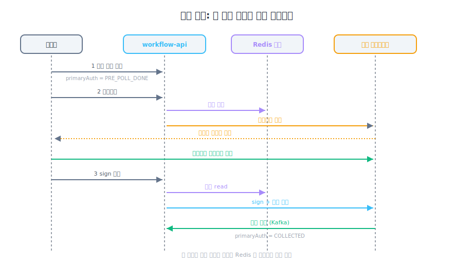

> **TL;DR**
>
> 운영 알림 채널에 두 종류의 메시지가 같은 시간대에 떨어지고 있었다.
> 처음엔 결함 두 개가 따로 있는 줄 알았다.
> 시간순 트레이스를 그려보다가 깨달았다 — **하나의 뿌리에서 갈라진 같은 결함.**
>
> 이 글이 진짜로 짚으려는 건 따로 있다.
> **enum set으로 상태머신을 표현하는 방식이 누락 위험을 안고 있다는 점.**
> 한 줄 핫픽스로 막았지만, 같은 패턴이 다음 status 추가 때 또 일어난다.

---

## 이 글에서 가장 먼저 짚어둘 것 — 같은 종류 결함이 또 일어나는 이유

핫픽스 자체는 enum 한 줄 추가다. 코드 한 줄로 막힌다.
근데 **같은 종류 결함이 또 일어날 수 있는 구조적 이유**가 따로 있다.

```kotlin
// 위험 패턴
private val AUTH_IN_PROGRESS_STATUSES = setOf(...)
fun isAuthInProgress(): Boolean = this in AUTH_IN_PROGRESS_STATUSES
```

이 set에 새 status를 추가해야 한다는 사실을 **컴파일러가 강제하지 않는다.**
다음에 누군가 새 status를 추가하면, 같은 종류 누락이 또 일어난다.

이 글의 본질은 그 점이다. 핫픽스는 표면. 구조는 sealed class + when-exhaustive로 가야 한다.

---

## 1. 문제 — 두 알림이 다른 메시지로 떨어졌다

같은 시간대에 두 종류 알림이 올라오고 있었다.

| 시점 | 알림 | 거절 위치 |
|---|---|---|
| 어제 저녁 | `errorCode: INVALID_SESSION` (수집 실패) | 비동기 — 외부 데이터 소스 |
| 오늘 오전 | `[ERROR] 인증 처리 실패입니다. 다시 시도하세요` (11회) | 동기 — sign API 호출 단계 |

처음엔 별개의 두 결함인 줄 알았다.
"하나는 외부 데이터 소스 거절, 하나는 우리쪽 sign 단계 5xx" 라고 트래킹 나누려고 했음.

근데 코드를 따라가다 보니 같은 그림이 보였다.
**외부 인증 세션이 한 워크플로우에 두 벌 만들어져서 서로 덮어쓰기.** 거절 시점만 다를 뿐.

---

## 2. 정상 흐름 — 한 번만 흘러갈 때만 안전



각 단계의 결과를 Redis 한 자리(`authSessionKey(workflowCode)`, TTL 120m)에 저장하고, 다음 단계가 그걸 꺼내 쓴다.

**핵심 가정: 단방향, 한 번만.**
어떤 단계든 두 번 트리거되는 순간 두 번째 호출의 세션이 첫 번째를 Redis에서 덮어쓴다.

---

## 3. 처음 든 가설이 절반만 답이었던 이유

### 시도 1 — "인증요청 두 번 클릭"이 전부 아닐까?

dedup 가드는 있었다.

```kotlin
// AuthRequestService.kt
if (workflow.primaryAuth?.isAuthInProgress() == true) {
    return AuthResponse(result = true, skipped = true)
}
```

근데 `isAuthInProgress()` 정의가 이렇게 돼 있었다.

```kotlin
private val AUTH_IN_PROGRESS_STATUSES =
    setOf(COLLECTION_REQUESTED, COLLECTING, COLLECTED)
//        ▲ AUTH_REQUESTED 가 없음
```

1차 인증요청 직후 status가 `AUTH_REQUESTED` 인데 set에 없으니까 dedup 통과.
2차 클릭에서 외부 호출이 또 나가고 세션이 덮어쓰여진다.

처음엔 **이 한 줄 누락이 모든 알림의 원인**이라고 생각했다.
enum set에 `AUTH_REQUESTED` 추가하면 끝일 줄.

### 시도 1을 의심하게 된 시점 — 시간순 트레이스

확신을 흔든 건 한 사용자의 시간순 로그였다.
"인증요청을 두 번 누른 적이 없는 사용자"가 같은 알림을 만들고 있었다.

| 시각 | 행동 | DB | Redis |
|---|---|---|---|
| T+0 | 사전 설문 ① | `PRE_POLL_DONE` | — |
| T+45s | 인증요청 ① | `AUTH_REQUESTED` | 세션₁ |
| T+1m30s | 사전 설문 ② (답변 수정) | **`PRE_POLL_DONE` 으로 reset** | 세션₁ 그대로 |
| T+1m55s | 인증요청 ② | `AUTH_REQUESTED` | **세션₂가 ₁ 덮어쓰기** |

dedup 가드가 작동하려면 `primaryAuth`가 `AUTH_REQUESTED` 이상이어야 하는데, 사전 설문 재제출이 그걸 `PRE_POLL_DONE`으로 되돌려버린다.

`WorkflowChanger.savePoll`을 다시 봤다.

```kotlin
// 이미 존재하는 워크플로우에도 무조건 덮어쓰기
fromDb.workflowStatus = WorkflowStatus.PRE_POLL_DONE
fromDb.primaryAuth = WorkflowAuthStatus.PRE_POLL_DONE   // ← 인증 진행 중이어도 reset
fromDb.secondaryAuth = ...
```

이게 **별개의 결함**이었다.

시나리오 A(인증요청 두 번 클릭)는 dedup이 작동하기 직전 상태에서의 race.
시나리오 B(사전 설문 재제출)는 dedup의 전제 자체를 깨는 reset.
B는 A보다 더 광범위하다.

→ enum 한 줄 추가만으론 부족. `savePoll` 가드까지 같이.

### 시도 2 — 그럼 둘 다 막으면 끝?

옵션 B로 가드 추가:

```kotlin
val authInProgress = (fromDb.primaryAuth?.isAuthInProgress() == true) ||
                     (fromDb.secondaryAuth?.isAuthInProgress() == true)

if (!authInProgress) {
    fromDb.workflowStatus = WorkflowStatus.PRE_POLL_DONE
    fromDb.primaryAuth = WorkflowAuthStatus.PRE_POLL_DONE
    fromDb.secondaryAuth = ...
}
// 답변 필드는 status와 무관하게 항상 갱신
fromDb.answerField1 = ...
```

이걸로 A와 B 둘 다 차단된다.

**여기서 잃는 것:**
사용자가 *진짜로* 답변을 수정해야 하는 케이스에서 status가 인증 단계에 머물러 있고 답변만 갱신되는 형태가 된다.
답변 변경이 인증 분기 조건에 영향을 주는지 — 예를 들어 `hiredLast5Years` 같은 답변이 부수 채널 인증 필요 여부를 결정한다면 — 이 가드가 잠재 위험을 만든다.

운영 데이터상 사전 설문 재제출이 진짜 수정 케이스는 드물고 대부분 화면 재호출/실수라 합의했지만, 이게 **공짜는 아니다.**

---

## 4. 결과 — 한 줄 + 한 가드

| 옵션 | 무엇 | 막는 자리 |
|---|---|---|
| A (필수) | enum set에 `AUTH_REQUESTED` 추가 | 시나리오 A |
| B (권장) | `savePoll` 가드 | 시나리오 A + B |
| C (장기) | 외부 인증 idempotency 계약 | 결함이 발현돼도 외부에서 흡수 |

부수 채널(2차 인증) enum도 같은 한 줄 추가.

자동 retry는 막혀 있었다.

```kotlin
val COLLECT_RETRY_EXCLUDE_ERROR = listOf("SERVICE_UNAVAILABLE", "INVALID_SESSION")
fun needRetry(errorCode: String?): Boolean = !COLLECT_RETRY_EXCLUDE_ERROR.contains(errorCode)
```

`INVALID_SESSION`이 retry 제외 대상(외부 API 부하 보호 목적). 결함으로 이 에러가 발생한 사용자는 **자동으론 영영 못 빠져나옴.**
운영자가 수동 reset하거나 사용자가 외부 세션 TTL(~120m) 만료까지 기다려야 한다.

이 정책 자체도 별도 검토 항목.

---

## 5. 본질 — enum set 으로는 누락이 막히지 않는다

이번 핫픽스는 두 줄.

```kotlin
private val AUTH_IN_PROGRESS_STATUSES =
    setOf(AUTH_REQUESTED, COLLECTION_REQUESTED, COLLECTING, COLLECTED)
```

근데 이 set에 새 status가 추가될 때 같이 넣어야 한다는 사실을 **컴파일러가 알려주지 않는다.**
다음에 누군가 status를 추가하면 같은 종류 누락이 또 일어난다.

근본 답:

```kotlin
fun isAuthInProgress(): Boolean = when (this) {
    AUTH_REQUESTED, COLLECTION_REQUESTED, COLLECTING, COLLECTED -> true
    PRE_POLL_DONE, NOT_NEEDED, COLLECT_FAIL -> false
    // 새 status 추가 시 컴파일 에러로 강제됨
}
```

`when (exhaustive)` 또는 `sealed class`.
새 status를 추가하면 컴파일러가 "이 조건도 처리해야 한다"고 막아준다.

---

## 안 푼 것 / 애매했던 결정들

- **옵션 B 가드의 잠재 위험** — 답변 변경이 인증 분기 조건에 영향 주는 케이스가 있는지 전수 검증 못 함. 코드 리뷰 받았지만 솔직히 100% 자신은 없다
- **`INVALID_SESSION` retry 제외 정책** — 영구 실패 사용자를 만든다는 부작용. 운영에서 수동 reset 안 하면 사용자가 두 시간 기다려야 함
- **외부 idempotency 옵션 C** — 외부 팀과 계약 협의 필요. 일정 잡혀있지 않음
- **enum → sealed class 전환** — 영향 범위가 넓어서 단독 PR. 핫픽스 머지 후 별도 작업

---

## 메모

PR 올리기 전에 알림 카운트가 안 줄어드는 패턴이 따로 보였다.
"한 사용자가 같은 결함을 여러 번 발생시키는" 패턴.
이건 [후속편](../why3/)에 따로 정리. 코드 결함이 사용자 메시지를 통해 증폭되는 구조였다.

처음 시간순 트레이스를 그릴 때 한 줄에 30분 걸렸다.
"이 사용자가 인증요청을 두 번 안 눌렀는데 왜 세션이 두 벌이지?"
이 의문이 시나리오 B를 발견하게 한 자리.
첫 가설을 의심한 게 컴파일러를 의심하는 것보다 먼저 와야 했다.
