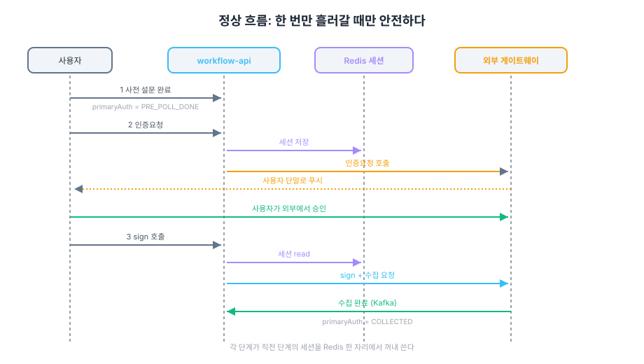

> **TL;DR**
>
> 운영 알림 채널에 서로 다른 두 종류의 에러가 같은 시간대에 떨어졌다. 결함이 두 개처럼 보였지만 하나였다. 외부 인증 세션이 한 워크플로우에 두 벌 만들어져 서로 덮어쓰고 있었고, 거절이 어느 단계에서 나느냐에 따라 다른 알림으로 보였을 뿐이다.
>
> 핫픽스는 enum 한 줄이었다. 그런데 이 사건에서 남는 건 그 한 줄이 아니라, 알림 이름이 아닌 사용자 한 명의 시간순 로그를 따라갔을 때만 진짜 그림이 보였다는 사실이다.

---

## 알림이 두 개면 결함도 두 개일까

운영 알림 채널에 두 종류 메시지가 같은 시간대에 올라오고 있었다.

| 시점 | 알림 | 거절 위치 |
|---|---|---|
| 어제 저녁 | `errorCode: INVALID_SESSION` (수집 실패) | 비동기, 외부 데이터 소스 |
| 오늘 오전 | `[ERROR] 인증 처리 실패입니다. 다시 시도하세요` (11회) | 동기, sign API 호출 단계 |

둘을 따로 보면 처리하기 쉽다. 하나는 외부 데이터 소스의 거절이니 외부 쪽 문제로 트래킹하고, 하나는 우리 쪽 sign 단계 5xx니 우리 코드를 파면 된다. 담당 범위도, 로그를 보는 위치도, 의심할 코드도 깔끔하게 갈라진다.

그런데 이렇게 나누는 순간 놓치는 질문이 있다. 두 알림이 왜 하필 같은 시간대에 떨어질까?

결론부터 말하면 결함은 하나였다. 두 개로 보였을 뿐이다.

## 좌석 하나에 탑승권이 두 장 나가면

먼저 이 시스템의 그림을 그려두자. 사용자는 단방향 워크플로우 하나를 밟는다. 사전 설문을 내고, 외부 기관 인증을 요청하고, 인증되면 외부에서 데이터가 수집되고, 마지막에 서명(sign)으로 끝난다. 진행 상태는 DB의 status enum이 들고 있고, 외부 인증 세션은 Redis 한 자리(`authSessionKey(workflowCode)`, TTL 120분)에 저장된다. 다음 단계는 그 세션을 꺼내 쓴다.



이 구조의 전제는 "단방향, 한 번만"이다. Redis key가 워크플로우당 하나라서, 어떤 이유로든 인증이 두 번 트리거되면 두 번째 세션이 첫 번째를 덮어쓴다.

비행기 좌석에 비유하면 이렇다. 좌석 하나에 탑승권이 두 장 발권된 상황이다. 항공사(외부 기관)는 나중에 발권된 탑승권만 유효하다고 본다. 먼저 발권된 탑승권으로 이미 탑승 수속을 진행 중이던 승객은 어느 관문에선가 반드시 걸린다. 그 관문이 수하물 검사(비동기 수집)면 `INVALID_SESSION` 알림이 되고, 탑승구(동기 sign 호출)면 5xx 알림이 된다.

<style>
.metric-fig{--fig-surface:#ffffff;--fig-ink:#0f172a;--fig-ink2:#334155;--fig-muted:#94a3b8;--fig-hair:#e6eaf1;--fig-baseline:#d0d7e2;--c-green:#16a34a;--c-greenink:#15803d;--c-red:#ef4444;--c-redink:#b91c1c;--c-blue:#2f6fed;--c-blueink:#1d4ed8;--c-amber:#d97706;--c-amberink:#b45309;margin:2.4em 0;border:1px solid var(--fig-hair);border-radius:18px;background:var(--fig-surface);padding:18px 20px 10px;overflow:hidden;box-shadow:0 1px 2px rgba(2,6,23,.05),0 14px 40px rgba(2,6,23,.09)}
.metric-fig svg{width:100%;height:auto;display:block;max-width:100%}
.metric-fig svg text{font-family:ui-monospace,"SF Mono","JetBrains Mono",Menlo,monospace}
.metric-fig figcaption{font-size:13.5px;color:var(--fig-muted);line-height:1.6;padding:12px 2px 6px;font-family:ui-monospace,SFMono-Regular,Menlo,monospace}
.metric-fig figcaption b{color:var(--fig-ink2);font-weight:600}
@media (prefers-reduced-motion: reduce){.metric-fig svg animate,.metric-fig svg animateMotion{display:none}}
</style>

<figure class="metric-fig">
  <svg viewBox="0 0 660 214" role="img" aria-label="세션 2가 세션 1을 덮어쓰고, 세션 1로 진행 중이던 요청이 외부 관문에서 INVALID_SESSION으로 거절된다" xmlns="http://www.w3.org/2000/svg">
    <text x="70" y="76" font-size="11" fill="var(--fig-muted)">인증 트리거 1회차</text>
    <text x="70" y="118" font-size="11" fill="var(--fig-muted)">인증 트리거 2회차</text>
    <line x1="196" y1="72" x2="248" y2="76" stroke="var(--fig-baseline)"/>
    <line x1="196" y1="114" x2="248" y2="112" stroke="var(--fig-baseline)"/>
    <rect x="252" y="50" width="150" height="88" rx="10" fill="none" stroke="var(--fig-baseline)"/>
    <text x="327" y="40" font-size="11" fill="var(--fig-muted)" text-anchor="middle">Redis 한 자리 (좌석)</text>
    <rect x="268" y="62" width="118" height="26" rx="6" fill="var(--c-green)">
      <animate attributeName="opacity" values="0;0;0.9;0.9;0.18;0.18;0" keyTimes="0;0.04;0.08;0.30;0.34;0.97;1" dur="8s" repeatCount="indefinite"/>
    </rect>
    <text x="327" y="79" font-size="11" fill="#ffffff" text-anchor="middle" font-weight="700">세션 1
      <animate attributeName="opacity" values="0;0;1;1;0.35;0.35;0" keyTimes="0;0.04;0.08;0.30;0.34;0.97;1" dur="8s" repeatCount="indefinite"/>
    </text>
    <line x1="268" y1="75" x2="386" y2="75" stroke="var(--c-red)" stroke-width="2">
      <animate attributeName="opacity" values="0;0;1;1;0" keyTimes="0;0.32;0.36;0.97;1" dur="8s" repeatCount="indefinite"/>
    </line>
    <rect x="268" y="100" width="118" height="26" rx="6" fill="var(--c-amber)">
      <animate attributeName="opacity" values="0;0;0.95;0.95;0" keyTimes="0;0.28;0.32;0.97;1" dur="8s" repeatCount="indefinite"/>
    </rect>
    <text x="327" y="117" font-size="11" fill="#ffffff" text-anchor="middle" font-weight="700">세션 2
      <animate attributeName="opacity" values="0;0;1;1;0" keyTimes="0;0.28;0.32;0.97;1" dur="8s" repeatCount="indefinite"/>
    </text>
    <rect x="520" y="50" width="116" height="88" rx="10" fill="none" stroke="var(--fig-baseline)"/>
    <text x="578" y="98" font-size="12" fill="var(--fig-ink)" text-anchor="middle" font-weight="700">외부 관문</text>
    <line x1="406" y1="160" x2="516" y2="160" stroke="var(--fig-baseline)" stroke-dasharray="3 4"/>
    <text x="300" y="164" font-size="10.5" fill="var(--fig-muted)">세션 1로 진행 중이던 작업</text>
    <circle r="6" fill="var(--c-green)">
      <animateMotion path="M410 160 L512 160" keyPoints="0;0;1;1" keyTimes="0;0.44;0.58;1" calcMode="linear" dur="8s" repeatCount="indefinite"/>
      <animate attributeName="opacity" values="0;0;1;1;0;0" keyTimes="0;0.43;0.46;0.58;0.62;1" dur="8s" repeatCount="indefinite"/>
    </circle>
    <g stroke="var(--c-red)" stroke-width="3" stroke-linecap="round">
      <line x1="560" y1="152" x2="596" y2="182"/>
      <line x1="596" y1="152" x2="560" y2="182"/>
      <animate attributeName="opacity" values="0;0;1;1;0" keyTimes="0;0.58;0.62;0.94;1" dur="8s" repeatCount="indefinite"/>
    </g>
    <text x="578" y="204" font-size="10.5" fill="var(--c-redink)" text-anchor="middle" font-weight="700">INVALID_SESSION
      <animate attributeName="opacity" values="0;0;1;1;0" keyTimes="0;0.58;0.62;0.94;1" dur="8s" repeatCount="indefinite"/>
    </text>
  </svg>
  <figcaption>좌석은 하나, 탑승권은 두 장. <b>세션 2</b>가 자리를 차지하는 순간 <b>세션 1</b>은 무효가 되고, 세션 1로 진행 중이던 작업은 어느 관문에선가 반드시 거절된다.</figcaption>
</figure>

결함은 "세션이 두 벌 생긴다" 하나다. 알림이 두 종류인 건 거절당하는 관문이 두 군데라서다. 그렇다면 남는 질문은 하나로 좁혀진다. 인증은 왜 두 번 트리거되는가?

입구가 두 개 있었다.

## 가드는 있었다, 명단에 이름이 빠졌을 뿐

첫 번째 입구부터 보자. 사실 중복 인증요청을 막는 가드는 있었다. 그래서 의심이 늦었다.

```kotlin
// AuthRequestService.kt
if (workflow.primaryAuth?.isAuthInProgress() == true) {
    return AuthResponse(result = true, skipped = true)
}
```

인증이 "진행 중"이면 두 번째 요청을 건너뛴다. 문 앞에 경비원이 서 있는 셈이다. 문제는 경비원이 들고 있는 명단이다.

```kotlin
private val AUTH_IN_PROGRESS_STATUSES =
    setOf(COLLECTION_REQUESTED, COLLECTING, COLLECTED)
//        ▲ AUTH_REQUESTED 가 없음
```

인증요청 직후의 status는 `AUTH_REQUESTED`다. 그런데 이 값이 "진행 중" 명단에 없다. 그러니 인증요청 직후에 들어온 두 번째 클릭은 경비원 앞을 그냥 통과한다. 외부 호출이 또 나가고, 세션이 덮어쓰인다.

여기까지만 보면 결론은 간단하다. 명단에 `AUTH_REQUESTED` 한 줄을 추가하면 끝. 실제로 처음엔 그렇게 생각했다.

## 두 번 누르지 않은 사용자

확신을 흔든 건 한 사용자의 시간순 로그였다. 인증요청을 한 번만 누른 사용자가 같은 알림을 만들고 있었다.

| 시각 | 행동 | DB | Redis |
|---|---|---|---|
| T+0 | 사전 설문 1 | `PRE_POLL_DONE` | (없음) |
| T+45s | 인증요청 1 | `AUTH_REQUESTED` | 세션 1 |
| T+1m30s | 사전 설문 2 (답변 수정) | `PRE_POLL_DONE` 으로 reset | 세션 1 그대로 |
| T+1m55s | 인증요청 2 | `AUTH_REQUESTED` | **세션 2가 1을 덮어씀** |

범인은 사전 설문 저장 로직이었다.

```kotlin
// 이미 존재하는 워크플로우에도 상태를 덮어쓰기
fromDb.workflowStatus = WorkflowStatus.PRE_POLL_DONE
fromDb.primaryAuth = WorkflowAuthStatus.PRE_POLL_DONE   // 인증 진행 중이어도 reset
```

설문을 다시 제출하면 인증 status까지 통째로 과거로 되돌린다. status가 `PRE_POLL_DONE`으로 돌아간 순간 dedup 가드의 전제가 사라진다. 시스템 입장에서 이 사용자의 두 번째 인증요청은 두 번째가 아니라 첫 번째다.

경비원 비유로 돌아가면, 경비원은 명단을 성실하게 확인하고 있었다. 그런데 다른 직원이 돌아다니면서 명단에서 이름을 지우고 있었던 것이다. 가드가 있어도 다른 경로가 상태를 과거로 되돌리면 가드는 없는 것과 같다.

정리하면 입구는 두 개였다.

- 입구 A: 인증요청 연타. 명단에 `AUTH_REQUESTED`가 빠져서 통과된다.
- 입구 B: 사전 설문 재제출. 명단 자체를 리셋해서 통과된다.

그리고 B가 A보다 넓다. 연타는 안 하는 사용자가 많지만, 설문 화면으로 돌아가는 건 누구나 한다. 여기서 핫픽스의 모양이 바뀌었다.

## 두 개의 입구를 닫는 법

입구 A는 명단에 한 줄 추가하면 닫힌다. 입구 B는 저장 로직 쪽에 가드가 들어갔다. 인증이 진행 중이면 설문 답변은 저장하되, 인증 status는 뒤로 돌리지 않는다.

```kotlin
val authInProgress = (fromDb.primaryAuth?.isAuthInProgress() == true) ||
                     (fromDb.secondaryAuth?.isAuthInProgress() == true)

if (!authInProgress) {
    fromDb.workflowStatus = WorkflowStatus.PRE_POLL_DONE
    fromDb.primaryAuth = WorkflowAuthStatus.PRE_POLL_DONE
}
// 답변 필드는 status와 무관하게 항상 갱신
fromDb.answerField1 = ...
```

공짜는 아니다. 인증 진행 중에 사용자가 정말로 답변을 고치려던 케이스에서는, 답변만 바뀌고 status는 인증 단계에 머문다. 만약 그 답변이 부수 채널 인증의 필요 여부를 결정하는 값이라면 인증 분기를 다시 계산하지 못하는 잠재 위험이 남는다. 운영 데이터를 보면 인증 중 재제출은 대부분 화면 재호출이라 감수했지만, 전수 검증은 못 했다. 이건 솔직하게 미결로 남는다.

## 빠져나올 수 없는 방

이 결함에는 정책 하나가 겹쳐서 상황을 더 나쁘게 만들었다.

```kotlin
val COLLECT_RETRY_EXCLUDE_ERROR = listOf("SERVICE_UNAVAILABLE", "INVALID_SESSION")
fun needRetry(errorCode: String?): Boolean = !COLLECT_RETRY_EXCLUDE_ERROR.contains(errorCode)
```

`INVALID_SESSION`은 자동 retry 제외 대상이다. 정책 자체는 합리적이다. 세션이 유효하지 않은데 같은 요청을 반복하면 외부 API에 부하만 준다. 정상 상황에서는 맞는 판단이다.

그런데 이 결함과 조합되면 이야기가 달라진다. 세션 덮어쓰기로 `INVALID_SESSION`을 받은 사용자는 자동으로는 영영 빠져나오지 못한다. 운영자가 수동으로 reset해주거나, 외부 세션 TTL 120분이 만료될 때까지 기다리는 길뿐이다. 방은 잠겼고, 열쇠는 두 시간 뒤에 온다.

정책 하나하나는 옳았다. 문제는 조합이었다. 보호하려고 만든 정책이 결함과 만나면 감금 장치가 된다.

## 컴파일러에게 기억을 맡기기

핫픽스는 결국 두 줄이었다. 그런데 수정이 작다는 게 오히려 불편했다. 작은 수정은 리뷰에서 안심을 만들지만, 같은 종류의 누락이 다시 생기는 걸 막아주진 않는다.

```kotlin
private val AUTH_IN_PROGRESS_STATUSES =
    setOf(AUTH_REQUESTED, COLLECTION_REQUESTED, COLLECTING, COLLECTED)
```

다음에 누군가 새 status를 추가하면, 이 set에도 같이 넣어야 한다는 걸 누가 기억할까? 컴파일러는 모른다. set에서 빠진 값은 그냥 false가 될 뿐 어떤 경고도 없다. 사람의 기억에 맡겨진 목록은 언젠가 다시 구멍이 난다.

그래서 장기적으로는 exhaustive when으로 간다.

```kotlin
fun isAuthInProgress(): Boolean = when (this) {
    AUTH_REQUESTED, COLLECTION_REQUESTED, COLLECTING, COLLECTED -> true
    PRE_POLL_DONE, NOT_NEEDED, COLLECT_FAIL -> false
    // 새 status 추가 시 컴파일 에러로 강제됨
}
```

새 status가 추가되면 컴파일러가 "이 값은 진행 중인가 아닌가"를 묻는다. 기억해야 할 일이 컴파일 에러로 바뀐다. 사람이 기억할 일을 줄이는 것, 이게 이 핫픽스에서 enum 한 줄보다 오래 남는 부분이다.

## 마치며

이 사건을 처음 봤을 때와 끝났을 때, 달라진 건 보는 단위였다. 처음엔 알림 종류별로 봤다. 그러면 결함이 두 개로 보인다. 사용자 한 명의 시간순 로그로 바꿔 보자 결함이 하나로 접혔고, 두 번 누르지 않은 사용자의 존재까지 드러났다. 시간순 트레이스 한 줄 그리는 데 30분이 걸렸는데, 그 30분이 이 사건에서 가장 값어치 있는 시간이었다.

다음에 서로 다른 알림이 같은 시간대에 떨어지면, 알림 이름별로 나눠 담기 전에 사용자 한 명을 골라 시간순으로 따라가 보자. 결함의 진짜 개수는 알림 개수가 아니라 그 한 줄이 알려준다.

그런데 이 핫픽스를 머지한 뒤에도 알림 카운트가 0으로 내려가지 않았다. 코드는 막았는데 알림은 계속 떴다. 그 이야기는 [다음 편](../why3/)에서 이어진다. 범인은 코드가 아니라 화면의 문장 한 줄이었다.
