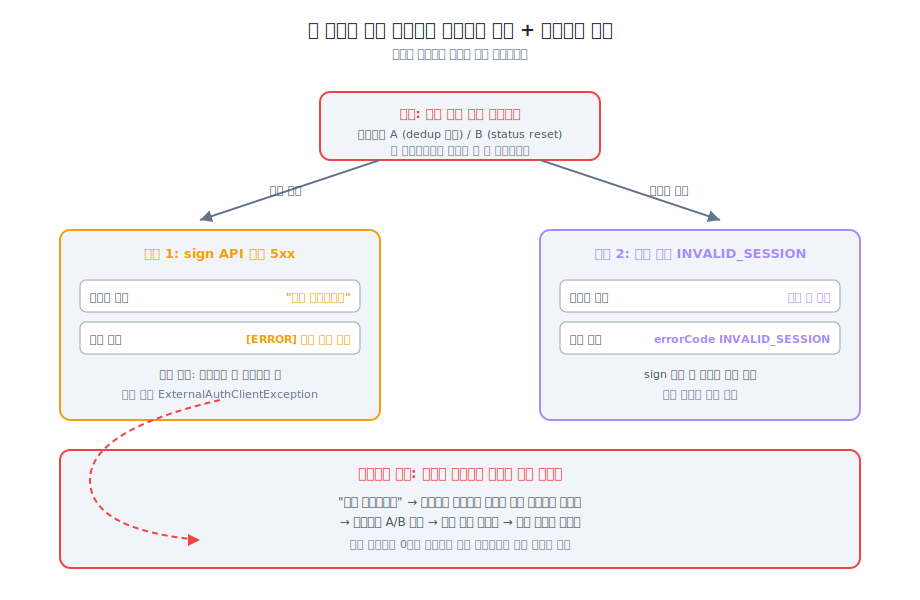

> **TL;DR**
>
> 핫픽스 머지 후에도 운영 알림 카운트가 0으로 안 떨어졌습니다.  
> 처음엔 핫픽스 배포가 늦어진 거라고 봤어요.  
> 근데 트레이스 따라가 보니 다른 그림이었습니다.
>
> **코드 결함이 사용자 메시지를 통해 자기 자신을 다시 트리거하는 루프**가 돌고 있었어요.
> 한 사용자가 같은 결함을 두세 번 발생시키고 있었습니다.
>
> 픽스 자리는 코드뿐 아니라 사용자 메시지에도 있다는 게, 글이 짚는 자리입니다.

---

## 알림이 0으로 수렴하지 않았어요

[본 글](../why2/)에서 핫픽스를 머지한 뒤, 알림 카운트 추이가 이랬습니다.

```text
09:56 → 4건
10:34 → 1건
11:08 → 3건
12:45 → 2건
13:51 → 4건
```

같은 결함이면 머지 후 시간이 가면서 0으로 수렴해야 정상이에요.  
근데 산발적으로 계속 떴습니다.

---

## "핫픽스가 아직 다 안 깔린 거 아닐까?"

처음엔 배포 지연을 의심했어요.  
3개 서버에 같은 enum 변경이 들어가는데, rolling update 중이면 일부 인스턴스가 옛 버전이라 알림이 산발적으로 떨어질 수 있으니까요.

배포 상태 확인. 다 끝나 있었습니다.

---

## "다른 결함이 또 있나?"

같은 결함의 다른 트리거가 있는지 코드를 다시 훑었습니다.  
없었어요. 시나리오 A·B가 다였고 둘 다 옵션 B로 막혀 있었습니다.

근데 알림은 계속 떴어요.

---

## 같은 사용자가 알림을 여러 번 만들고 있었습니다

운영 알림 로그에서 사용자별로 묶어봤습니다.

```text
사용자 X: 09:56, 10:34, 11:08  (3건)
사용자 Y: 12:45, 13:51         (2건)
```

다른 결함이 아니었어요.  
**한 사용자가 같은 결함을 여러 번 발생시키고 있었습니다.**

여기서 메시지가 보였어요.

```kotlin
class ExternalAuthClientException(
    message: String = "인증 처리 실패입니다. 다시 시도하세요"
) : ...
```

사용자는 메시지 읽고 그대로 따라합니다.  
인증요청 다시 누르거나, 사전 설문 다시 제출하거나.  
그 행동이 결함의 트리거 조건을 다시 만듭니다.

| 사용자 행동 | 재현 시나리오 | 결과 |
|---|---|---|
| 인증요청 다시 클릭 | A 재현 | 세션 덮어쓰기 또 발생 |
| 사전 설문 다시 제출 | B 재현 | 세션 덮어쓰기 또 발생 |

같은 결함이 또 발현되고, 같은 메시지가 또 노출되고, 사용자가 또 따라합니다.  
한 사용자가 같은 알림을 두세 번 만들고 있었어요.

> *알림이 안 수렴하는 이유는 결함이 안 막혀서가 아니라, 막힌 결함이 사용자를 통해 다시 트리거되고 있어서였습니다.*

---

## 같은 뿌리에서 두 알림이 갈라지는 자리

세션 덮어쓰기 이후 거절 시점에 따라 알림이 두 갈래로 보입니다.



| 분기 | 거절 시점 | 사용자 노출 | 운영자 알림 |
|---|---|---|---|
| 동기 5xx | sign API 호출 단계 | "인증 처리 실패입니다. 다시 시도하세요" | `[ERROR] 인증 처리 실패입니다…` |
| 비동기 거절 | sign 통과 후 수집 단계 | 즉시 안 보임. 수집 결과 후 안내 | `errorCode: INVALID_SESSION` |

동기 5xx 분기가 자가증식 루프의 진입점이에요.  
사용자가 즉시 화면에서 메시지를 보고, 즉시 다시 클릭합니다.

비동기 거절 분기는 사용자가 즉시 행동을 못 하니, 자가증식 루프가 약합니다.

---

## 픽스 자리가 두 군데였어요

[본 글](../why2/)의 옵션 A·B·C는 결함 자체를 막는 자리입니다.  
이 글은 결함이 발현됐을 때 증폭 경로를 막는 자리를 짚어요.

옵션 D, 사용자 메시지 분기.

```kotlin
when {
    isRecentRetry(workflowCode, withinSeconds = 30) -> {
        "잠시 후 다시 시도해 주세요. 이전 인증이 처리 중입니다."
    }
    else -> {
        "인증 처리 실패입니다. 다시 시도하세요."
    }
}
```

같은 워크플로우에서 짧은 시간 안에 재시도가 들어오면 다른 가이드로 분기시켰습니다.

| 옵션 | 막는 자리 |
|---|---|
| A · B | 결함의 발현 자리 (코드) |
| C | 외부에서 흡수 (계약) |
| D | 결함의 증폭 자리 (사용자 메시지) |

> **포기한 것**: 옵션 D는 결함 자체를 못 막습니다. A·B가 빠지면 첫 번째 발현은 그대로 일어나요. 보조선이지 본 라인이 아닙니다.

`isRecentRetry`의 시간창(30초)을 잘못 잡으면, 진짜로 다시 시도해야 하는 사용자에게도 잘못된 가이드가 나갑니다.  
이 임계값은 운영 데이터로 조정해야 해요.

---

## 끝점과 영구 실패

자가증식 루프엔 끝점이 두 군데 있습니다.

**자동 끝점, 외부 세션 TTL 만료(120분).**  
세션이 만료되면 dedup 전제 자체가 사라져서 새 세션이 정상 발급됩니다.  
사용자가 두 시간 정도 기다리면 자연 회복.

**수동 끝점, 운영자 reset.**  
사용자가 두 시간을 못 기다리면 운영자가 워크플로우 수동 reset.  
자동 retry는 `INVALID_SESSION`이 제외 대상이라 안 돕니다.

> **포기한 것**: 자동 retry 제외는 외부 API 부하 보호 목적이었는데, 자가증식 루프와 결합하면 영구 실패 사용자를 만들어요.

이 정책은 [본 글](../why2/) 에도 짚었지만, 별도 검토 항목입니다.

---

## 이 패턴이 왜 위험할까요?

코드 결함은 보통 머지 시점에 끝점이 생깁니다.  
픽스를 머지하면 그 시점부터 새 케이스가 안 들어와요.

근데 사용자 메시지가 결함의 트리거 조건을 다시 만들면, 머지가 끝점이 안 됩니다.  
결함 하나가 사용자 수만큼 증폭됩니다.

| 결함 종류 | 끝점 | 사용자 1명당 알림 |
|---|---|---|
| 일반 | 머지 시점 | 1건 |
| 자가증식 | 세션 TTL 만료(120분) 또는 운영자 reset | N건 (재시도 횟수만큼) |

운영팀이 머지를 끝점으로 보고 알림 카운트가 0으로 가길 기다리는데, 0이 안 옵니다.  
사용자가 메시지를 따라 행동하는 한, 코드 결함이 사라져도 알림은 한참 더 떨어져요.

장애 분석에서 "어디서 일어났냐(코드 위치)" 만 보면 안 잡힙니다.  
"누구한테 일어났냐(사용자 단위)" 로 묶어봐야 보이는 패턴이었어요.

---

## 안 푼 것 / 애매했던 결정들

- **`isRecentRetry` 임계값**: 30초 / 60초 / 120초 어느 게 맞는지 운영 데이터로 조정 필요. 너무 짧으면 의미 없고, 너무 길면 진짜 재시도 케이스를 막아요.
- **사용자 메시지 일괄 검토**: 다른 에러 메시지에도 같은 자가증식 가능성이 있는지 전수 검토 못 했어요. 이번 케이스만 핫픽스.
- **`INVALID_SESSION` retry 제외 정책**: 영구 실패 사용자 정책 자체 재검토. 별도 PR.

---

## 메모

배포 상태 확인하고 코드 다시 본 뒤에도 답이 없었어요.  
알림 로그를 사용자별로 묶어볼 생각을 한 게 가장 컸습니다.

A·B로 결함 자체를 막고, D로 증폭 경로를 같이 막고, C로 장기 흡수.  
세 갈래로 PR 분리해뒀어요.
