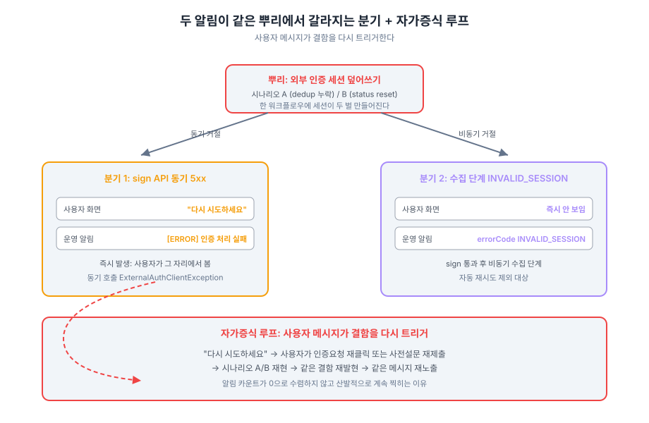

> **TL;DR**
>
> 결함 코드를 고쳐 머지했는데도 운영 알림이 0으로 수렴하지 않았다. 배포도 끝났고, 다른 결함도 없었다. 범인은 화면에 나가는 문장 한 줄이었다. "다시 시도하세요"라는 안내를 사용자가 그대로 따라 하면, 그 행동이 결함의 트리거 조건을 다시 만든다.
>
> 코드 결함은 머지가 끝점이다. 그런데 사용자 메시지가 결함을 다시 부르는 구조에서는 머지가 끝점이 아니다. 픽스 대상에 문장이 포함된다.

---

## 머지했는데 알림이 안 죽는다

[앞 편](../why2/)에서 세션 덮어쓰기 결함을 찾아 두 입구를 모두 막았다. 핫픽스는 머지됐다. 같은 결함이라면 이제 알림은 시간이 지나며 0으로 수렴해야 한다.

```text
09:56 → 4건
10:34 → 1건
11:08 → 3건
12:45 → 2건
13:51 → 4건
```

내려가다가 다시 튄다. 머지는 끝났고 알림은 남았다. 운영자는 숫자만 본다. 숫자가 남아 있으면 장애도 남아 있는 것처럼 보인다.

이 시점에서 후보는 둘이다. 배포가 아직 덜 깔렸거나, 우리가 막은 결함이 전부가 아니었거나. 둘 다 확인해보자.

## 두 가설을 지우고 나니 아무것도 안 남았다

첫 가설은 배포 지연. 서버 3대에 rolling update가 진행 중이면 일부 인스턴스가 옛 버전이라 알림이 산발적으로 남을 수 있다. 배포 상태를 확인했다. 전부 끝나 있었다. 기각.

두 번째 가설은 미발견 결함. 같은 결함의 다른 트리거가 있는지 코드를 다시 훑었다. 없었다. 입구는 두 개가 전부였고 둘 다 막혀 있었다. 기각.

코드만 보면 끝난 사건이다. 그런데 알림은 계속 뜬다. 시스템 안에서 찾을 수 있는 설명이 바닥났다면, 시스템 밖을 봐야 한다는 뜻이다.

## 범인은 사람의 손가락이었다

알림 로그를 시간순으로 볼 때는 산발적인 잔여 알림처럼 보였다. 사용자별로 묶는 순간 그림이 바뀌었다.

```text
사용자 X: 09:56, 10:34, 11:08  (3건)
사용자 Y: 12:45, 13:51         (2건)
```

새로운 결함이 아니다. 같은 사용자가 같은 결함을 반복해서 밟고 있다. 무엇이 사용자를 반복하게 만들까? 화면에 나가는 문장이 답을 들고 있었다.

```kotlin
class ExternalAuthClientException(
    message: String = "인증 처리 실패입니다. 다시 시도하세요"
) : ...
```

사용자는 이 문장을 읽고 시키는 대로 한다. 인증요청을 다시 누르거나, 사전 설문부터 다시 제출한다. 그런데 앞 편에서 봤듯 바로 그 두 행동이 세션 덮어쓰기의 트리거다.

| 사용자 행동 | 재현되는 입구 | 결과 |
|---|---|---|
| 인증요청 다시 클릭 | 입구 A | 세션 덮어쓰기 재발 |
| 사전 설문 다시 제출 | 입구 B | 세션 덮어쓰기 재발 |

실패하면 메시지가 뜨고, 메시지가 다시 시도를 시키고, 다시 시도가 실패를 만든다. 악보로 치면 "다시 시도하세요"는 도돌이표다. 사용자는 악보에 적힌 대로 성실하게 연주했을 뿐이다.

## 루프의 세기는 실패가 보이는 속도가 정한다

세션 덮어쓰기 이후의 거절은 두 갈래로 나뉜다고 했다. 이 분기가 루프의 세기도 가른다.



| 분기 | 거절 시점 | 사용자 노출 | 운영자 알림 |
|---|---|---|---|
| 동기 5xx | sign API 호출 단계 | "인증 처리 실패입니다. 다시 시도하세요" | `[ERROR] 인증 처리 실패입니다…` |
| 비동기 거절 | sign 통과 후 수집 단계 | 즉시 안 보임. 수집 결과 후 안내 | `errorCode: INVALID_SESSION` |

동기 실패는 사용자가 그 자리에서 보고 그 자리에서 다시 누른다. 루프가 초 단위로 돈다. 비동기 거절은 사용자가 한참 뒤에야 알게 되므로 즉시 따라 할 행동이 없다. 루프가 약하다.

실패를 사용자에게 빨리 보여주는 건 보통 좋은 UX다. 그런데 그 실패에 "다시 시도"라는 출구를 붙여놓고 그 출구가 다시 실패로 이어진다면, 빠른 피드백은 빠른 재발이 된다.

## 문장을 고치다

코드 픽스는 결함의 발현을 막는다. 하지만 이미 사용자 화면에 나간 문장은 여전히 재시도를 시키고 있다. 그래서 픽스 범위가 문장까지 넓어졌다.

```kotlin
when {
    isRecentRetry(workflowCode, withinSeconds = 30) -> {
        "잠시 후 다시 시도해 주세요. 이전 인증이 처리 중입니다."
    }
    else -> {
        "인증 처리 실패입니다. 다시 시도하세요."
    }
}
```

같은 워크플로우에서 짧은 시간 안에 재시도가 감지되면 안내를 바꾼다. "다시 시도하세요"를 무조건 내보내지 않는 것이다.

전체 조치를 자리별로 정리하면 이렇다.

| 조치 | 막는 자리 |
|---|---|
| 입구 차단 (앞 편의 A, B) | 결함의 발현 (코드) |
| 외부 idempotency 계약 | 결함이 나도 외부에서 흡수 |
| 메시지 분기 | 결함의 증폭 (사용자 행동) |

메시지 분기는 보조선이지 본 라인이 아니다. 코드 차단이 빠지면 첫 발현은 그대로 일어난다. 그리고 `isRecentRetry`의 시간창 30초는 아직 감이다. 너무 짧으면 의미가 없고, 너무 길면 정말로 다시 시도해야 하는 사용자에게 엉뚱한 안내가 나간다. 이 임계값은 운영 데이터가 정해줄 자리다.

## 이 루프는 어디서 끝나는가

자가증식 루프에도 끝점은 있다. 두 군데인데, 둘 다 마음 편한 끝점은 아니다.

하나는 외부 세션 TTL 만료. 120분이 지나면 세션이 만료되면서 루프의 전제가 사라지고 새 세션이 정상 발급된다. 사용자가 두 시간을 버티면 자연 회복된다. 다른 하나는 운영자의 수동 reset. 앞 편에서 봤듯 `INVALID_SESSION`은 자동 retry 제외 대상이라 시스템 스스로는 회복하지 않는다.

두 시간짜리 자연 회복과 사람 손. 이게 전부라는 사실 자체가 이 구조의 비용이다.

## 머지가 끝점이 아닌 결함

보통의 코드 결함은 머지가 끝점이다. 픽스가 배포되면 새 케이스는 더 이상 들어오지 않고, 알림은 자연히 0으로 수렴한다.

사용자 메시지가 결함의 트리거를 다시 만드는 구조에서는 다르다. 실패 메시지가 다음 요청의 입력이 된다. 결함 하나가 사용자 수만큼, 재시도 횟수만큼 증폭된다.

| 결함 종류 | 끝점 | 사용자 1명당 알림 |
|---|---|---|
| 일반 | 머지 시점 | 1건 |
| 자가증식 | 세션 TTL 만료 또는 운영자 reset | 재시도 횟수만큼 |

운영자가 머지를 끝점으로 보고 알림이 0으로 가길 기다리는데 0이 오지 않는 이유가 이것이다. 사용자가 문장을 따라 행동하는 한, 코드 결함이 사라져도 알림은 한참 더 떨어진다.

## 마치며

배포 상태를 확인하고 코드를 두 번 훑는 동안에는 답이 없었다. 시스템 안에서만 원인을 찾고 있었기 때문이다. 단서는 로그를 사용자별로 묶는 순간 나왔다. 같은 사람이 같은 실패를 다시 밟고 있다는 사실이 보인 뒤에야, 화면의 문장이 픽스 대상 목록에 올라갔다.

장애 분석의 기본 질문은 "어디서 일어났나"다. 그런데 이 루프는 그 질문으로는 안 잡힌다. "누구에게 반복됐나"를 물어야 보인다. 다음에 픽스를 머지했는데도 알림이 수렴하지 않으면, 배포 상태 다음으로 확인할 것은 알림의 사용자별 분포다. 그리고 하나 더. 에러 화면에 "다시 시도하세요"를 넣기 전에, 그 재시도가 정말 상황을 바꾸는지 한 번만 자문해보자. 사용자에게 보여주는 문장은 출력이 아니라 다음 입력이다.
