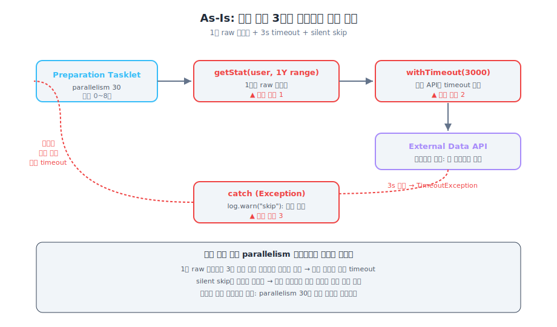
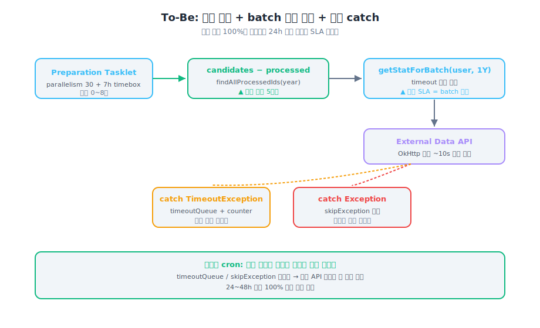
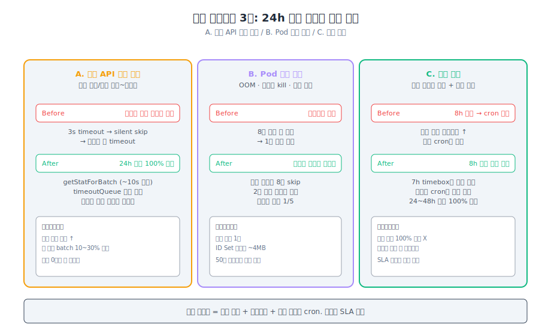

> **TL;DR**
>
> 매일 새벽 0~8시에 모수 50만짜리 알림 발송 배치를 돌리고 있었다.
> 운영 timeout이 자주 떴고, 같은 사용자가 며칠째 누락되는 보고가 들어왔다.
>
> 처음 이틀은 parallelism 튜닝이었다. 30 → 50 → 30 → 다시 50.
> 한쪽 누르면 다른 쪽이 튀어나오는 구조라 천장에 부딪혔다.
>
> 결국 풀린 건 **SLA 정의 자체를 의심한 다음**이었다.
> "8h 안에 한 번에 100%"가 아니라 "24h 안에 누적 100%"로 가정을 바꾸니, 멱등 필터 5라인으로 풀이가 끝났다.

---

## SLA 가정을 의심할것

배치 설계할 때 가장 먼저 박는 가정이 보통 "운영 윈도우 안에 한 번에 끝낸다" 다.  
이게 운영 1년이 지나면 SLA의 천장이 된다는 점.

| 잘못 들 수 있는 가정 | 더 안전한 가정 |
|---|---|
| 단일 실행 8h 안에 100% 적재 | 24h 안에 100% 누적 적재 |
| 외부 API timeout 3초면 충분 | batch 처리 SLA ≠ 일반 API SLA |
| `catch (Exception)` 으로 묶으면 안전 | 외부 의존 장애 / 데이터 결함은 분리 catch |

이 가정 셋이 같이 들어가야 운영 1~2년 뒤 모수가 늘어도 안 깨진다.

---

## 1. 문제 — 8h 윈도우 안에 다 안 끝남

배치가 운영 윈도우(0~8시)를 점점 자주 넘기고 있었다.
parallelism 30으로 평소 2~3시간이면 끝나는데, 어느 날부터 8시간 넘김.

같은 사용자가 며칠째 누락된다는 보고가 따로.

---

## 2. 처음 이틀 — parallelism 튜닝의 천장

<div class="attempts">

<div class="attempt">

### parallelism 30 → 50

"동시 처리량을 늘리면 끝나겠지." 단순한 가설.

50으로 올렸더니 **외부 API rate limit** 걸림. 429 에러가 누적.

</div>

<div class="attempt">

### parallelism 50 → 30 → 다시 30 유지

다시 30으로 내림. 처리 속도는 줄었지만 8h 안에 들어가긴 함.

근데 그 다음 달엔 또 못 끝냄.  
모수가 슬슬 늘고 있었다.

</div>

<div class="attempt">

### timeout 늘리기?

"3초가 너무 짧은 거 아닌가?" 라는 의심.  
근데 timeout을 늘리면 단건 처리 시간이 늘어 전체 실행 시간이 더 길어진다.  
parallelism과 충돌.

</div>

</div>

여기까지 이틀쯤. 한쪽 누르면 다른 쪽이 튀어나오는 구조.

### 천장의 정체를 분해



배치 한 건의 호출 경로를 분해했다.

| # | 코드 위치 | 결함 |
|---|---|---|
| 1 | `Tasklet.execute:120` | 1년 범위 raw 풀스캔 호출 |
| 2 | `ExternalDataProvider.kt:27` | 일반 API용 `withTimeout(3000)` 가드 |
| 3 | `Tasklet.execute:228` | `catch (Exception)` 으로 timeout silent skip |

이 셋이 묶여 있는 동안엔

- 1년치 raw 응답이 3초 안에 들어올 가능성은 사실상 없음 → **일정 비율이 매일 timeout**
- silent skip은 추적을 막음 → 다음 실행에서 같은 사용자가 같은 timeout
- parallelism은 단건 timeout 횟수만 줄일 뿐, 같은 사람 누락 패턴은 그대로

여기서 멈췄다.  
> parallelism으로는 안 풀린다.

---

## 3. 가정을 바꾸니 풀이가 바뀌었다

질문을 다시 했다.
**"단일 실행 8h 안에 100%"가 진짜 SLA인가?**

확인해보니:
- 알림 발송은 적재 다음 날 새벽
- 적재가 24h 안에만 끝나면 발송 SLA는 안 깨진다

**"24h 안에 100% 누적 적재"** 로 SLA를 재정의하면 풀이가 완전히 달라진다.

데이터가 N-1년 immutable이라는 도메인 특성을 이용 — 한 번 처리한 사용자는 다시 처리 안 해도 된다.

---

## 4. 해결 — 멱등 필터 + batch 전용 호출 + 분리 catch



### 멱등 필터 — 5라인

```kotlin
fun execute(): RepeatStatus {
    val candidateIds = candidateReader.findActiveUserIds(targetYear)
    val processed   = materialRepo.findAllProcessedIds(targetYear)
    val pendingIds  = candidateIds - processed   // ← 멱등 필터

    log.info("targetYear={} candidates={} processed={} pending={}",
        targetYear, candidateIds.size, processed.size, pendingIds.size)

    pendingIds.chunked(CHUNK_SIZE).forEach { chunk ->
        chunk.forEach(::processOne)
    }
    return RepeatStatus.FINISHED
}
```

`candidateIds - processed` 한 줄.

장애 시나리오에서 어떻게 풀리는지:

| 시나리오 | Before | After |
|---|---|---|
| Pod 죽음 (8천/1만 처리 후) | 1만 다시 = 8h SLA 위협 | 2천만 모수 = 1/5 비용 |
| 외부 API 일시 장애 | 매일 같은 사용자 timeout | 다음날 미처리 분량만 자동 재처리 |
| 모수 폭증 | 8h 초과 → cron 겹침 | 7h timebox → 다음날 이어서 |

추가 비용은 쿼리 1회 + ID Set 메모리 ~4MB.

```sql
CREATE INDEX idx_material_processed ON campaign_material (target_year, processed_at);
```

**여기서 잃는 것:**
"단일 실행 100% 보장"을 포기한다.
운영팀과 "발송은 적재 후 익일 새벽" 룰을 합의해야 한다.
발송 일정이 적재와 같은 날이면 24h 분산 못 씀 — 이 SLA 재정의는 발송 일정에 의존한다.

### batch 전용 호출 경로

`getStatForBatch`가 dead code로 정의만 돼 있었다. 와이어링만 추가.

```kotlin
class ExternalDataProvider(private val client: ExternalClient) {
    // 일반 API — 사용자 화면 보고 있어서 3초 안에 답해야 함
    suspend fun getStat(userId: Long, range: DateRange): List<Record> =
        withTimeout(3_000) { client.fetch(userId, range) }

    // batch — timeout 가드 없음 (OkHttp 기본 ~10s 까지 대기)
    suspend fun getStatForBatch(userId: Long, range: DateRange): List<Record> =
        client.fetch(userId, range)
}
```

같은 함수 두 벌. `withTimeout(3000)` 한 줄이 다름.

**핵심: 응답시간 SLA(일반 API) ≠ 처리 SLA(batch).**
batch에선 누락이 응답시간보다 비싸다.

**여기서 잃는 것:**
첫 적재 batch 전체 시간이 10~30% 증가 가능 (단건 처리 시간 ↑).
누락 0건이 더 비싸다고 봐서 감수했지만, 모수가 100만 넘어가면 이 트레이드오프 다시 봐야 한다.

### timeout 분리 catch

silent skip을 두 갈래로 나눔.

```kotlin
chunk.forEach { userId ->
    try {
        processOne(userId)
    } catch (e: TimeoutException) {
        timeoutQueue.add(userId)
        externalApiTimeoutCounter.increment()
        log.warn("timeout userId={} — will be retried tomorrow", userId)
    } catch (e: Exception) {
        skipException.put(userId, e)
        log.error("skip userId={} cause={}", userId, e.javaClass.simpleName)
    }
}
```

- `timeoutQueue` → 외부 API 장애 시그널
- `skipException` → 데이터 결함 시그널

대응이 다른 두 알림.

```promql
sum(rate(external_api_timeout_total[5m]))
/
sum(rate(batch_processed_total[5m])) > 0.05
```

---

## 5. 결과 — 시나리오 회복



| 시나리오 | Before | After |
|---|---|---|
| A. 외부 API 일시 장애 | 며칠째 같은 사용자 누락 | 24h 안에 100% 적재 |
| B. Pod 중간 죽음 | 처음부터 다시 | 미처리 분량만 재처리 |
| C. 모수 폭증 | 8h 초과 → cron 겹침 | 7h timebox → 다음날 이어서 |

**최소 합격선: 멱등 필터 + 7h 타임박스 + 자동 재실행 cron.**
셋만 있으면 시나리오 B/C 의 24h SLA 보장.

---

## 안 푼 것 / 애매했던 결정들

- **단일 실행 100% 포기** — 운영팀 합의 받았지만 솔직히 모든 PM이 동의한 건 아니다. "왜 한 번에 다 못 하나" 라는 질문이 분기 회의에서 또 나온다
- **closed-year stat 경로 강제** — 닫힌 연도는 stat 테이블 활용 시 1차 적재 부하 자체 감소. 호환성 전수 검증 부담으로 후순위로 미뤘는데, 이게 진짜 답일 가능성이 큼
- **OkHttp `connectTimeout`/`readTimeout` 명시 부재** — 환경마다 다르게 잡혀 있을 수 있음. 환경 일관성 + 무한 대기 가드 차원에서 명시해야 함
- **모수 정의 합의** — 활성/휴면/신규 가입 컷오프 운영팀 합의 대기

---

## 메모

parallelism 만 만지고 있었다.
30 → 50 → 30 → 50. 운영 윈도우 들어가면 안도, 못 들어가면 다시 내리고.

가정을 바꾼 건 어느 한 시점의 결정이 아니었다.
"왜 같은 사용자가 며칠째 누락되지?" 라는 질문이 어느 날 떠올랐고, parallelism으론 그 질문이 안 풀린다는 게 보였다.

그제서야 SLA 정의 자체를 다시 읽었다.
발송 일정이 익일 새벽이라는 사실을 처음 안 것도 그때.
"24h 안에 누적"이 가능한 도메인이라는 걸 코드보다 운영 일정에서 먼저 본 자리.

코드 답이 운영 정책에 의존하는 케이스가 있다는 걸 늦게 알았다.
