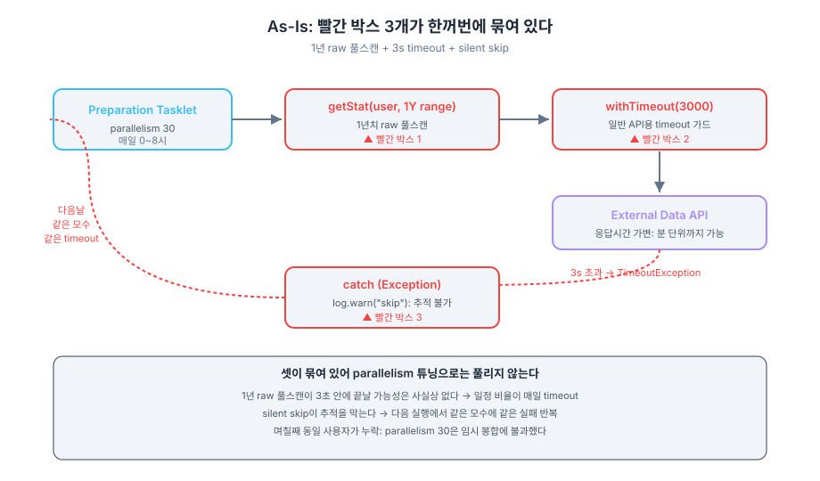
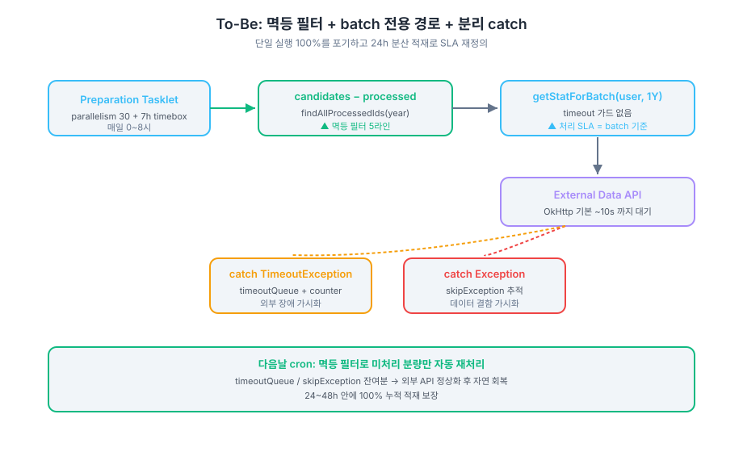
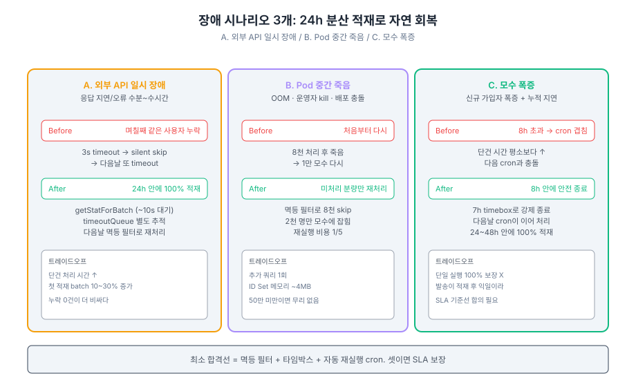

> **TL;DR**
>
> 새벽 배치가 운영 윈도우를 넘기고, 같은 사용자가 며칠째 누락된다는 보고가 들어왔다. 이틀 동안 parallelism 숫자만 만졌다. 올리면 외부 API가 막고, 내리면 시간이 터지는 시소였다.
>
> 풀린 건 코드를 고친 뒤가 아니라 질문을 바꾼 뒤였다. "어떻게 더 빨리 끝낼까"가 아니라 "왜 같은 사용자가 다시 빠질까". 그 질문이 SLA 가정 자체를 다시 읽게 만들었고, 답은 멱등 필터 다섯 줄이었다.

---

## 시소 위에서 보낸 이틀

상황부터. 매일 새벽 0시부터 8시까지, 사용자 50만 명분의 외부 데이터를 적재하는 배치가 돈다. 사용자마다 외부 API를 호출해 1년치 데이터를 받아 저장하고, 이 데이터로 다음 날 새벽에 알림이 발송된다. 동시 처리 수(parallelism)는 30, 외부 호출에는 3초 timeout, 실패한 건은 예외를 잡아 조용히 건너뛴다.

어느 날부터 이 배치가 8시간 윈도우를 넘기기 시작했다. 첫 반응은 누구나 하는 그것이었다. 동시 처리량을 올리자.

30을 50으로 올렸다. 외부 API rate limit에 걸려 429가 쌓였다. 다시 30으로 내렸다. 윈도우 안에는 들어왔는데 다음 달 모수가 늘자 또 넘겼다. timeout을 늘리는 선택지도 있었지만, 그건 단건 처리 시간을 늘려 전체 시간을 더 키운다.

올리면 외부가 막고, 내리면 시간이 터진다. 시소의 양 끝을 오가며 이틀을 썼다. 시소에는 균형점이 없었다. 애초에 시소가 문제가 아니었기 때문이다.

## 봉투 뒷면 계산이 놓친 것

이틀 내내 머릿속에 있던 계산은 이거였다.

```text
1.1만 건 × 건당 1.5초 ≈ 4.6시간
```

이 곱셈이 "처리량이 부족하다"는 프레임을 만들었다. 그런데 이 프레임에는 설명이 안 되는 관측이 하나 있었다. 같은 사용자가 며칠째 누락된다는 보고다.

느린 배치라면 사용자는 늦게라도 처리된다. 오늘 밀린 사람이 내일은 앞쪽에 있을 테니까. 그런데 같은 사람이 계속 빠진다는 건, 속도 문제가 아니라 매일 같은 자리에서 같은 방식으로 실패하는 구조가 있다는 뜻이다. 처리량 프레임에 갇혀 있는 동안 이 신호를 이틀간 뒤로 밀어뒀다. 이 사건에서 제일 부끄러운 대목이다.

## 한 명이 매일 같은 자리에서 넘어지는 이유

속도를 더 짜내는 대신, 배치 한 건이 지나가는 경로를 분해했다.



| # | 코드 위치 | 결함 |
|---|---|---|
| 1 | `Tasklet.execute:120` | 1년 범위 raw 풀스캔 호출 |
| 2 | `ExternalDataProvider.kt:27` | 일반 API용 `withTimeout(3000)` 가드 |
| 3 | `Tasklet.execute:228` | `catch (Exception)` 으로 timeout silent skip |

셋을 이어 붙이면 "같은 사용자가 매일 빠지는" 기계가 완성된다. 1년치 raw 데이터가 3초 안에 도착할 가능성은 현실적으로 없으니, 데이터가 많은 사용자는 매일 timeout이 난다. silent skip이 그 실패를 지우니 아무도 모른다. 다음 날 배치는 처음부터 다시 도니, 그 사용자는 또 같은 3초 벽에 부딪힌다. 매일, 같은 사람이, 같은 자리에서.

parallelism은 이 기계를 한 톨도 건드리지 못한다. 동시 처리를 아무리 늘려도 "데이터 많은 사용자 + 3초 벽 + 침묵"의 조합은 그대로다.

## SLA를 다시 읽다

여기서 질문을 바꿨다. 8시간 안에 한 번의 실행으로 100%를 끝내는 게 정말 요구사항인가?

운영 일정을 확인해보니 발송은 적재 다음 날 새벽이었다. 그러니까 적재가 24시간 안에만 누적으로 끝나면 발송 SLA는 안 깨진다. 그리고 이 데이터는 전년도분이라 불변이다. 한 번 처리한 사용자는 다시 처리할 필요가 없다.

두 사실을 합치면 SLA가 다시 쓰인다. "8h 안에 한 번에 100%"가 아니라 "24h 안에 누적 100%". 이 한 줄의 차이로 배치의 정체성이 바뀐다. 한 번에 끝내야 하는 일이 아니라, 남은 분량을 다음 실행이 이어받는 일이 된다.

출석부에 비유하면 이렇다. 어제까지 출석 도장이 찍힌 사람은 오늘 다시 부르지 않는다. 오늘은 도장 없는 사람만 부른다. 결석한 사람은 내일 또 부르면 된다.

## 출석부 다섯 줄



```kotlin
fun execute(): RepeatStatus {
    val candidateIds = candidateReader.findActiveUserIds(targetYear)
    val processed   = materialRepo.findAllProcessedIds(targetYear)
    val pendingIds  = candidateIds - processed   // 멱등 필터

    log.info("targetYear={} candidates={} processed={} pending={}",
        targetYear, candidateIds.size, processed.size, pendingIds.size)

    pendingIds.chunked(CHUNK_SIZE).forEach { chunk ->
        chunk.forEach(::processOne)
    }
    return RepeatStatus.FINISHED
}
```

`candidateIds - processed`. 이 한 줄이 출석부다. 실패한 실행을 처음부터 다시 시작하는 대신, 이미 도장 찍힌 사람을 빼고 남은 사람만 본다. 장애 시나리오에 대입해보면 효과가 선명하다.

<style>
.metric-fig{--fig-surface:#ffffff;--fig-ink:#0f172a;--fig-ink2:#334155;--fig-muted:#94a3b8;--fig-hair:#e6eaf1;--fig-baseline:#d0d7e2;--c-green:#16a34a;--c-greenink:#15803d;--c-red:#ef4444;--c-redink:#b91c1c;--c-blue:#2f6fed;--c-blueink:#1d4ed8;--c-amber:#d97706;--c-amberink:#b45309;margin:2.4em 0;border:1px solid var(--fig-hair);border-radius:18px;background:var(--fig-surface);padding:18px 20px 10px;overflow:hidden;box-shadow:0 1px 2px rgba(2,6,23,.05),0 14px 40px rgba(2,6,23,.09)}
.metric-fig svg{width:100%;height:auto;display:block;max-width:100%}
.metric-fig svg text{font-family:ui-monospace,"SF Mono","JetBrains Mono",Menlo,monospace}
.metric-fig figcaption{font-size:13.5px;color:var(--fig-muted);line-height:1.6;padding:12px 2px 6px;font-family:ui-monospace,SFMono-Regular,Menlo,monospace}
.metric-fig figcaption b{color:var(--fig-ink2);font-weight:600}
@media (prefers-reduced-motion: reduce){.metric-fig svg animate,.metric-fig svg animateMotion{display:none}}
</style>

<figure class="metric-fig">
  <svg viewBox="0 0 660 250" role="img" aria-label="위 레인은 매일 전원을 처음부터 다시 처리하며 같은 자리에서 실패하고 아래 레인은 출석부 덕분에 남은 사람만 처리한다" xmlns="http://www.w3.org/2000/svg">
    <text x="24" y="30" font-size="12" fill="var(--fig-muted)" font-weight="600">Before: 매일 전원 다시</text>
    <circle cx="60" cy="70" r="11" fill="var(--fig-baseline)" opacity="0.45"/><circle cx="60" cy="70" r="11" fill="var(--c-green)"><animate attributeName="opacity" values="0;0;1;1;0;0" keyTimes="0;0.05;0.08;0.70;0.74;1" dur="9s" repeatCount="indefinite"/></circle><circle cx="112" cy="70" r="11" fill="var(--fig-baseline)" opacity="0.45"/><circle cx="112" cy="70" r="11" fill="var(--c-green)"><animate attributeName="opacity" values="0;0;1;1;0;0" keyTimes="0;0.095;0.125;0.70;0.74;1" dur="9s" repeatCount="indefinite"/></circle><circle cx="164" cy="70" r="11" fill="var(--fig-baseline)" opacity="0.45"/><circle cx="164" cy="70" r="11" fill="var(--c-green)"><animate attributeName="opacity" values="0;0;1;1;0;0" keyTimes="0;0.14;0.17;0.70;0.74;1" dur="9s" repeatCount="indefinite"/></circle><circle cx="216" cy="70" r="11" fill="var(--fig-baseline)" opacity="0.45"/><circle cx="216" cy="70" r="11" fill="var(--c-green)"><animate attributeName="opacity" values="0;0;1;1;0;0" keyTimes="0;0.185;0.215;0.70;0.74;1" dur="9s" repeatCount="indefinite"/></circle><circle cx="268" cy="70" r="11" fill="var(--fig-baseline)" opacity="0.45"/><circle cx="268" cy="70" r="11" fill="var(--c-green)"><animate attributeName="opacity" values="0;0;1;1;0;0" keyTimes="0;0.22999999999999998;0.26;0.70;0.74;1" dur="9s" repeatCount="indefinite"/></circle><circle cx="320" cy="70" r="11" fill="var(--fig-baseline)" opacity="0.45"/><circle cx="320" cy="70" r="11" fill="var(--c-red)"><animate attributeName="opacity" values="0;0;1;1;0;0" keyTimes="0;0.27499999999999997;0.305;0.70;0.74;1" dur="9s" repeatCount="indefinite"/></circle><circle cx="372" cy="70" r="11" fill="var(--fig-baseline)" opacity="0.45"/><circle cx="372" cy="70" r="11" fill="var(--c-green)"><animate attributeName="opacity" values="0;0;1;1;0;0" keyTimes="0;0.32;0.35;0.70;0.74;1" dur="9s" repeatCount="indefinite"/></circle><circle cx="424" cy="70" r="11" fill="var(--fig-baseline)" opacity="0.45"/><circle cx="424" cy="70" r="11" fill="var(--c-green)"><animate attributeName="opacity" values="0;0;1;1;0;0" keyTimes="0;0.365;0.395;0.70;0.74;1" dur="9s" repeatCount="indefinite"/></circle>
    <text x="510" y="74" font-size="11" fill="var(--c-redink)" font-weight="700">다음날: 전원 리셋
      <animate attributeName="opacity" values="0;0;1;1;0" keyTimes="0;0.70;0.74;0.9;1" dur="9s" repeatCount="indefinite"/>
    </text>
    <text x="24" y="140" font-size="12" fill="var(--fig-muted)" font-weight="600">After: 출석부, 남은 사람만</text>
    <circle cx="60" cy="180" r="11" fill="var(--fig-baseline)" opacity="0.45"/><circle cx="60" cy="180" r="11" fill="var(--c-green)"><animate attributeName="opacity" values="0;0;1;1;0" keyTimes="0;0.05;0.08;0.96;1" dur="9s" repeatCount="indefinite"/></circle><circle cx="112" cy="180" r="11" fill="var(--fig-baseline)" opacity="0.45"/><circle cx="112" cy="180" r="11" fill="var(--c-green)"><animate attributeName="opacity" values="0;0;1;1;0" keyTimes="0;0.095;0.125;0.96;1" dur="9s" repeatCount="indefinite"/></circle><circle cx="164" cy="180" r="11" fill="var(--fig-baseline)" opacity="0.45"/><circle cx="164" cy="180" r="11" fill="var(--c-green)"><animate attributeName="opacity" values="0;0;1;1;0" keyTimes="0;0.14;0.17;0.96;1" dur="9s" repeatCount="indefinite"/></circle><circle cx="216" cy="180" r="11" fill="var(--fig-baseline)" opacity="0.45"/><circle cx="216" cy="180" r="11" fill="var(--c-green)"><animate attributeName="opacity" values="0;0;1;1;0" keyTimes="0;0.185;0.215;0.96;1" dur="9s" repeatCount="indefinite"/></circle><circle cx="268" cy="180" r="11" fill="var(--fig-baseline)" opacity="0.45"/><circle cx="268" cy="180" r="11" fill="var(--c-green)"><animate attributeName="opacity" values="0;0;1;1;0" keyTimes="0;0.22999999999999998;0.26;0.96;1" dur="9s" repeatCount="indefinite"/></circle><circle cx="320" cy="180" r="11" fill="var(--fig-baseline)" opacity="0.45"/><circle cx="320" cy="180" r="11" fill="var(--c-red)"><animate attributeName="opacity" values="0;0;1;1;0;0" keyTimes="0;0.27499999999999997;0.305;0.74;0.78;1" dur="9s" repeatCount="indefinite"/></circle><circle cx="320" cy="180" r="11" fill="var(--c-green)"><animate attributeName="opacity" values="0;0;1;1;0" keyTimes="0;0.80;0.84;0.96;1" dur="9s" repeatCount="indefinite"/></circle><circle cx="372" cy="180" r="11" fill="var(--fig-baseline)" opacity="0.45"/><circle cx="372" cy="180" r="11" fill="var(--c-green)"><animate attributeName="opacity" values="0;0;1;1;0" keyTimes="0;0.32;0.35;0.96;1" dur="9s" repeatCount="indefinite"/></circle><circle cx="424" cy="180" r="11" fill="var(--fig-baseline)" opacity="0.45"/><circle cx="424" cy="180" r="11" fill="var(--c-green)"><animate attributeName="opacity" values="0;0;1;1;0" keyTimes="0;0.365;0.395;0.96;1" dur="9s" repeatCount="indefinite"/></circle>
    <text x="510" y="184" font-size="11" fill="var(--c-greenink)" font-weight="700">다음날: 6번만
      <animate attributeName="opacity" values="0;0;1;1;0" keyTimes="0;0.74;0.78;0.96;1" dur="9s" repeatCount="indefinite"/>
    </text>
    <text x="24" y="236" font-size="10.5" fill="var(--fig-muted)">빨간 점: 데이터가 많아 3초 벽에 걸리는 사용자. Before에서는 매일 같은 자리에서 실패한다.</text>
  </svg>
  <figcaption>출석부 한 줄(<b>candidateIds - processed</b>)의 효과. 위는 매일 처음부터 다시 돌며 같은 사용자가 같은 벽에 부딪히고, 아래는 도장 없는 사람만 다시 부른다.</figcaption>
</figure>

| 시나리오 | Before | After |
|---|---|---|
| Pod 죽음 (1만 중 8천 처리 후) | 1만 처음부터 다시 | 남은 2천만 추가 처리 |
| 외부 API 일시 장애 | 매일 같은 사용자 timeout | 다음날 미처리 분량만 자동 재처리 |
| 모수 폭증 | 8h 초과로 cron 겹침 | 7h timebox 후 다음날 이어서 |

비용은 쿼리 1회, ID Set 메모리 약 4MB, 인덱스 하나.

```sql
CREATE INDEX idx_material_processed ON campaign_material (target_year, processed_at);
```

공짜에 가깝지만 진짜 비용은 다른 데 있었다. "새벽 한 번의 실행이 모든 걸 끝낸다"는 운영 감각을 버리고, 발송은 적재 후 익일 새벽이라는 룰을 운영팀과 합의해야 했다. 발송이 적재와 같은 날인 도메인이라면 이 재정의는 쓸 수 없다.

## 카운터 규정을 창고에 적용하면

남은 결함 중 하나는 3초 timeout의 출처였다. 이 값은 원래 일반 API의 것이다. 사용자가 화면을 보며 기다리는 경로니까 3초 안에 응답하거나 포기하는 게 맞다. 그런데 batch가 같은 함수를 쓰면서 이 규정이 그대로 딸려 들어왔다.

카운터 손님 응대 규정을 창고 정리에 적용한 셈이다. 카운터에서는 3초가 서비스 품질이지만, 창고에서는 아무도 기다리지 않는다. 창고에서 3초 규정이 하는 일은 정리를 빨리 끝내는 게 아니라 무거운 짐을 전부 버리는 것이다.

```kotlin
class ExternalDataProvider(private val client: ExternalClient) {
    // 일반 API: 사용자 화면 보고 있어서 3초 안에 응답해야 함
    suspend fun getStat(userId: Long, range: DateRange): List<Record> =
        withTimeout(3_000) { client.fetch(userId, range) }

    // batch: timeout 가드 없음 (OkHttp 기본 ~10s 까지 대기)
    suspend fun getStatForBatch(userId: Long, range: DateRange): List<Record> =
        client.fetch(userId, range)
}
```

응답시간 SLA와 처리 SLA는 다른 계약이다. batch에서는 누락이 지연보다 비싸다. 대가로 첫 적재 시간이 10~30% 늘 수 있는데, 이건 감수했다. 모수가 100만을 넘으면 다시 볼 트레이드오프다.

## 침묵을 두 가지 소리로

마지막 결함은 silent skip. timeout과 데이터 결함을 같은 catch로 삼키면 운영은 아무것도 알 수 없다. 이 둘은 대응이 완전히 다르다. timeout은 기다리거나 재시도할 문제고, 데이터 결함은 데이터를 고쳐야 할 문제다.

```kotlin
chunk.forEach { userId ->
    try {
        processOne(userId)
    } catch (e: TimeoutException) {
        timeoutQueue.add(userId)
        externalApiTimeoutCounter.increment()
        log.warn("timeout userId={}, will be retried tomorrow", userId)
    } catch (e: Exception) {
        skipException.put(userId, e)
        log.error("skip userId={} cause={}", userId, e.javaClass.simpleName)
    }
}
```

알림도 갈랐다. timeout 비율이 5%를 넘으면 외부 API 장애 신호로 울린다.

```promql
sum(rate(external_api_timeout_total[5m]))
/
sum(rate(batch_processed_total[5m])) > 0.05
```

## 장애가 나도 다음날 이어받는다



최종 그림의 최소 합격선은 셋이다. 멱등 필터, 7시간 타임박스, 자동 재실행 cron. 이 셋이 있으면 Pod이 죽든 모수가 폭증하든 24시간 SLA는 지켜진다. 7시간에 끊는다는 건 그날 안에 끝내겠다는 욕심을 접는 대신, 어떤 실행도 다음 실행이 이어받을 수 있게 만든다는 뜻이다.

## 마치며

이 사건을 한 줄로 줄이면, batch 튜닝인 줄 알았는데 운영 계약을 다시 읽는 일이었다. parallelism 시소에서 이틀을 보낸 이유는 코드만 보고 있어서였고, 풀이는 "발송은 익일 새벽"이라는 운영 일정표에서 나왔다. 코드의 모양이 운영 정책에 의존하는 경우가 있다는 걸, 이틀 값을 치르고 배웠다.

다음에 배치가 윈도우를 넘기면 처리량 숫자를 만지기 전에 두 가지부터 확인해보자. 하나, 같은 대상이 반복해서 실패하고 있지 않은가. 그렇다면 속도가 아니라 구조다. 둘, "한 번에 100%"가 정말 계약인가, 아니면 그냥 오래된 습관인가. 계약서를 다시 읽는 데는 이틀이 아니라 십 분이면 된다.

아직 못 정한 것도 남아 있다. 단일 실행 100%를 포기한 합의는 분기 회의마다 "왜 한 번에 다 못 하나"로 되돌아오고, 닫힌 연도의 stat 테이블 직접 조회는 호환성 검증 부담으로 후순위에 있고, OkHttp의 connect/read timeout 명시와 모수 정의 합의도 대기 중이다.
