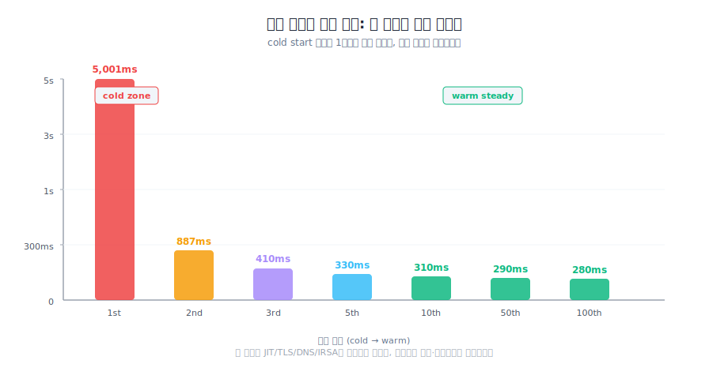
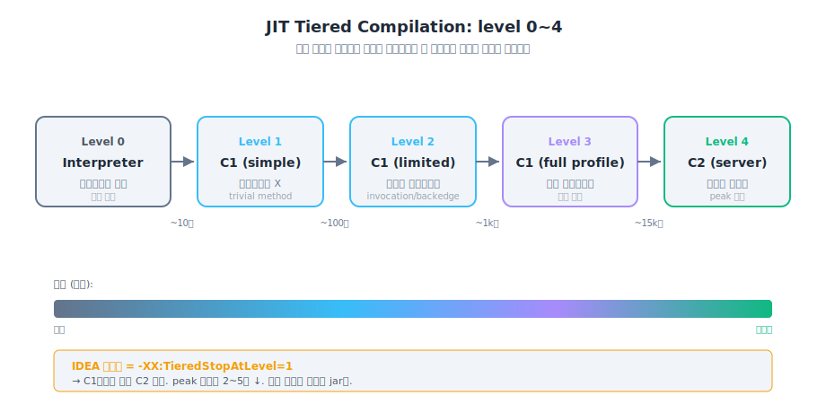
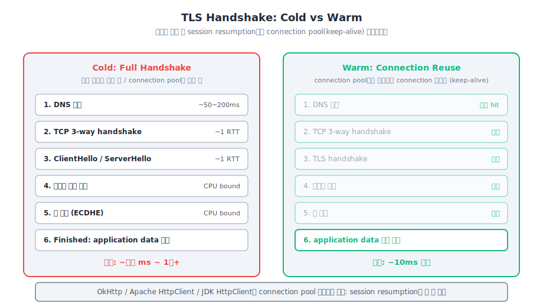
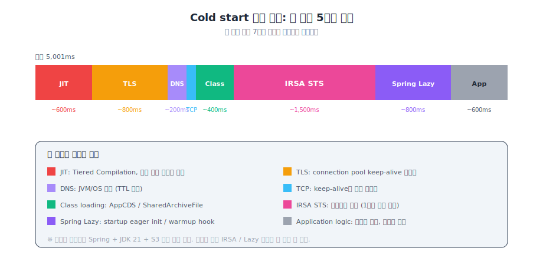
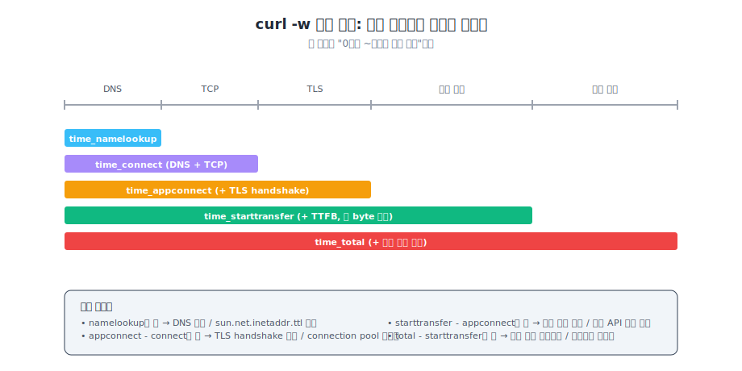
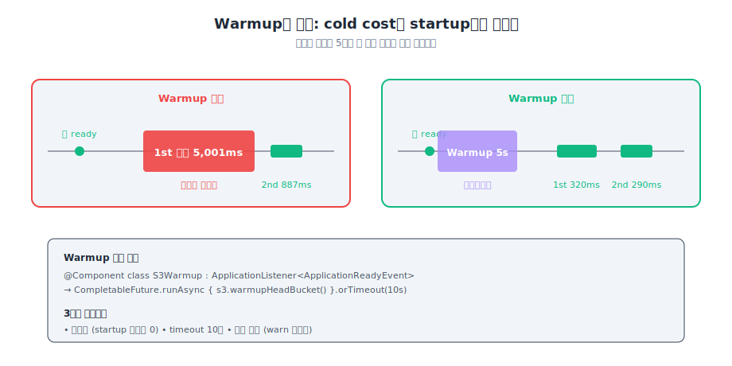
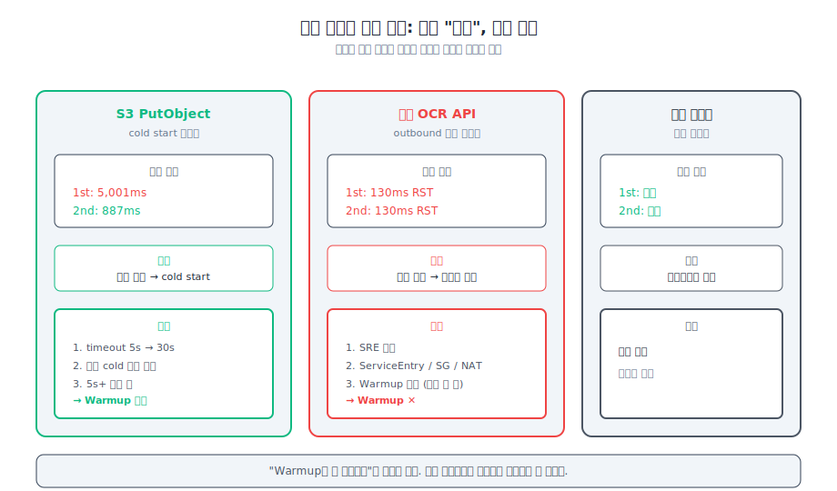
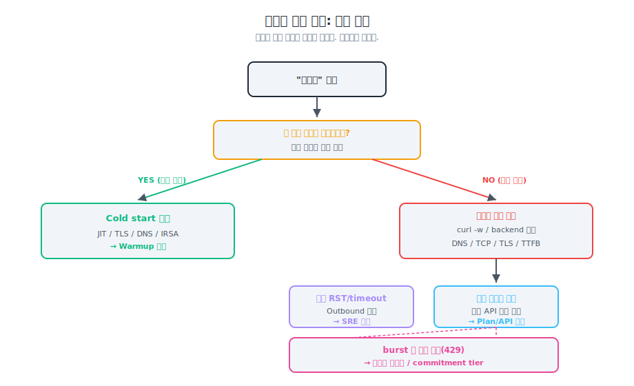

> **TL;DR**
>
> Spring + JDK 21 앱에서 첫 외부 API 호출이 5~10초, 두 번째부터는 0.3초였어요.  
> "이거 cold start네, warmup 도입하면 풀리겠다." 이게 처음 가설이었습니다.
>
> 한 외부 API에서 막혔어요.  
> 매번 130ms 만에 RST. 두 번째도, 세 번째도, 100번째도 똑같이 130ms RST.  
> warmup을 100번 해도 못 풀어요.
>
> 같은 "느림"이라는 증상으로 묶여 있던 게, 원인이 셋이 다 달랐습니다.
>
> 이 문제는 cold start가 아니라 **진단 없이 같은 처방을 반복한 문제**였어요.

---

## 첫 호출만 유독 느렸어요

```text
1st call: 5~10s   (cold)
2nd call: 0.3s    (warm)
3rd call: 0.3s
```

같은 process, 같은 endpoint, 같은 사용자.  
첫 호출만 느림.



운동 시작할 때랑 닮았어요.  
처음 1km는 다리 풀려서 느리고, 5분 뛰면 페이스가 올라옵니다.

---

## "이거 cold start네, warmup 도입하면 풀리겠다"

처음엔 자료 찾고 정리부터 했어요.

| 단계 | 첫 호출 | 이후 |
|---|---|---|
| JVM JIT | 인터프리터에서 C1/C2 컴파일 진행 | 네이티브 코드 |
| TLS Handshake | Full handshake | Connection pool 재사용 (keep-alive) |
| DNS | 실제 질의 (50~200ms) | OS/JVM DNS 캐시 |
| TCP Connection | 3-way handshake | 기존 connection 재사용 |
| 클래스 로딩 | lazy load | 이미 로드 |
| AWS IRSA STS | AssumeRoleWithWebIdentity (1~2s) | 캐시된 임시 자격증명 |
| Spring Lazy Init | 일부 빈 첫 사용 시 초기화 | 이미 초기화 |

JIT은 단순 "인터프리터에서 네이티브"가 아닙니다.  
Tiered Compilation 4단계로 진행돼요 (Level 0 인터프리터, 1 C1, 2~3 C1+profiling, 4 C2).



TLS도 "세션 재사용" 보다 "Connection 재사용" 이 더 정확합니다.  
OkHttp/Apache/JDK HttpClient는 대부분 connection pool로 처리해요.



EKS IRSA 첫 STS 호출 1~2초, Spring lazy bean 초기화 1~3초.  
JIT + TLS + DNS + IRSA + lazy 합산이 4~7초 흔합니다.



근데 이걸 다 외우는 게 답이 아니에요.

> *"첫 호출만 느린지." 이 한 가지로 cold start를 가르는 게 진짜 판단 기준이었습니다.*

---

## 측정은 curl `-w` 단계별로 나눠야 합니다



```bash
curl -w "
  DNS:           %{time_namelookup}s
  CONNECT:       %{time_connect}s
  SSL_HANDSHAKE: %{time_appconnect}s
  TTFB:          %{time_starttransfer}s
  TOTAL:         %{time_total}s
" -s -o /dev/null https://...
```

DNS, TCP, TLS, 서버 처리, 클라이언트 처리.  
다섯 단계로 분리해서, 어디가 느린지 정확히 짚어줍니다.

---

## Application warmup 코드를 넣었어요

```kotlin
@Component
class S3Warmup(
    private val s3Service: S3Service?,
) : ApplicationListener<ApplicationReadyEvent> {

    private val log = LoggerFactory.getLogger(javaClass)

    override fun onApplicationEvent(event: ApplicationReadyEvent) {
        val s3 = s3Service ?: return
        // 비동기 + timeout + try-catch. startup 블로킹 0, 실패 무시.
        CompletableFuture.runAsync {
            runCatching { s3.warmupHeadBucket() }
                .onFailure { log.warn("S3 warmup failed (ignored): {}", it.message) }
        }.orTimeout(10, TimeUnit.SECONDS)
    }
}
```



여기까지가 "cold start 일반론" 이었어요.  
S3 첫 호출은 이걸로 풀렸습니다.

---

## 그런데 외부 OCR API에서 막혔어요

같은 앱에 외부 OCR API 호출도 있었습니다.  
"같은 cold start 패턴이겠지" 싶어서 같이 warmup 코드를 추가했어요.

근데 패턴이 달랐습니다.

| 외부 호출 | 첫 호출 | 두 번째 | 패턴 |
|---|---|---|---|
| S3 PutObject | 5001ms timeout | 887ms 성공 | 첫만 느림, cold start |
| 외부 OCR API | 130ms RST | 130ms RST | 매번 같음, 다른 원인 |
| 사내 LLM Proxy | 정상 | 정상 | 무관 |

S3는 첫 호출만 5초 timeout, 두 번째부터 800ms.  
근데 OCR API는 첫, 두번째, 100번째 다 똑같이 130ms 만에 RST.



130ms는 우리쪽에서 만들어진 시간이 아니에요.  
요청이 우리쪽에서 빨리 끊긴다는 뜻이고, 인프라에서 outbound가 막혀 있을 가능성이 큽니다.  
warmup 100번 해도 같은 패턴이 그대로 나옵니다.

여기서 첫 가설이 무너졌어요.

> *"느림"이라는 한 가지 증상으로 묶여 있던 게, 원인이 셋이 다 달랐습니다.*

---

## 진단을 먼저 했어야 했어요



원인을 분리한 뒤 처방을 다르게 가져갔습니다.

| 외부 호출 | 진단 | 처방 |
|---|---|---|
| S3 PutObject | Cold start (JIT + IRSA + TLS) | warmup 코드 추가 |
| 외부 OCR API | Outbound 차단 | SRE 컨택, ServiceEntry 등록 요청 |
| 사내 LLM Proxy | 무관 | 그대로 유지 |

S3 timeout도 5s에서 30s로 임시 조정해서 진짜 cold start 시간을 측정한 뒤에 warmup을 도입했어요.  
"5초 timeout 떨어진다" 는 우리가 만든 한도였지, 진짜 cold start 시간이 아니었습니다.

진단 순서는 이렇습니다.

```text
1. 증상 측정 (어떤 호출 / 얼마나 / 어떤 패턴)
2. 반복 호출 비교, 두 번째부터 빨라지는가
3. 단계별 elapsed 분리, DNS/TCP/TLS/서버/클라이언트 (curl -w)
4. 인프라 검증, pod 안에서 nc/curl로 outbound 가능한가
5. 외부 API 한도 검증, 콘솔/문서에서 RPM·동시성 제한
6. 위 통과 + 첫 호출만 느리면 cold start 확정, warmup
```

처음엔 1단계에서 바로 6단계로 직진했어요.  
진단을 빼먹고 약 처방.

---

## "느림" 진단 매트릭스

같은 증상이라도 원인 카테고리가 다르면 처방이 다릅니다.

| 증상 | 원인 카테고리 | Warmup으로 풀리나? | 진짜 답 |
|---|---|---|---|
| 첫 호출 느리고 두 번째부터 빠름 | Cold start (JIT/connection/STS) | YES | App startup 시 dummy 호출 |
| 매번 똑같이 빠르게 RST/timeout | Outbound 차단 (방화벽, mesh) | NO | SRE, ServiceEntry, SG, NAT |
| 매번 비슷한 시간 (예: 1.7s) | 외부 API 자체 시간 | NO | 외부 API plan 인상 / 다른 API |
| burst 시 일부 거절 (429) | 외부 rate limit | NO | concurrency 직렬화 / commitment tier |

진단 없이 warmup 직진은 약 처방이에요.

---

## K8s probe와 rolling update가 cold start 답인가요?

처음엔 "K8s probe로 다 풀린다" 고 들었던 적도 있어요.  
이게 절반만 맞는 말이었습니다.

| 주장 | 실제 |
|---|---|
| Readiness probe로 ready 전 트래픽 차단 | 정확. 단 앱 시작 완료 ≠ JIT/connection warm. probe 통과해도 JIT은 cold. |
| 사내 chassis가 워밍업 수행 | 보통 `DataSource eager init` 같은 startup task만. 외부 API 워밍업은 안 함. |
| Rolling update | 트래픽 안전성. cold start 자체 해결은 X. |

probe와 rolling update는 장애 회피용이에요.  
첫 호출 latency 자체는 별도 워밍업이 필요합니다.

---

## IDEA 디버그 vs 프로덕션

IntelliJ의 Run/Debug 설정에서 "Run with fast startup" 옵션이 켜져 있으면, `-XX:TieredStopAtLevel=1` 이 붙어서 C1까지만 컴파일됩니다.  
옵션을 안 켜면 default JIT (C2까지)로 돌긴 하지만, 디버거 attach 자체가 JIT 최적화를 막아요.

| 항목 | IDEA 디버그 | 프로덕션 |
|---|---|---|
| JIT 단계 | fast startup 옵션 시 C1만, default도 디버거 어태치로 최적화 제약 | C1 + C2 정상 |
| Warm 성능 | 2~5배 느림 (디버거 + 최적화 제약) | 최적 |

운영 성능 측정은 IDEA가 아니라 빌드된 jar로.

> **포기한 것**: 로컬 IDEA에서 본 latency는 운영 신호가 아닙니다. 측정이 필요하면 빌드한 jar를 띄워야 해요.

---

## 안 푼 것 / 애매했던 결정들

- **GraalVM Native Image**: startup 50ms 수준이지만 PGO 없으면 peak 처리량이 떨어집니다. reflection 설정 부담도 커요. 도입 평가 못 했습니다.
- **AppCDS**: `-XX:+UseAppCDS` 는 deprecated. `ArchiveClassesAtExit` / `SharedArchiveFile` 만 써야 합니다. 도입 안 했지만 startup 5~10% 단축 여지 있어요.
- **외부 OCR API SRE 작업 일정**: ServiceEntry 등록 요청 보냈지만 인프라 팀 일정에 의존하는 자리.
- **OkHttp `connectTimeout`/`readTimeout` 명시 부재**: 환경마다 default가 달라서 일관성 위험 있어요.

---

## 메모

처음엔 cold start 자료를 굉장히 자세히 정리했어요.  
JIT Tiered Compilation 그림, TLS handshake 단계, IRSA 흐름. 다 도식화.

근데 실제로 막힌 건 그 자료 안에 답이 없는 케이스였습니다.  
S3는 cold start, OCR API는 outbound 차단.  
자료 하나로 둘 다 풀리지 않았어요.

"내가 정리한 일반론 안에 답이 있을 거라는 가정" 이 처음 가설을 직진하게 만든 자리였습니다.

사실 막혔던 자리는 cold start가 아니었어요.  
**진단 없이 같은 처방을 반복한 실패**였습니다.

같은 증상이라도 처방이 같지는 않아요.  
warmup이 약이 되는 케이스인지부터 가르는 게 먼저였습니다.
