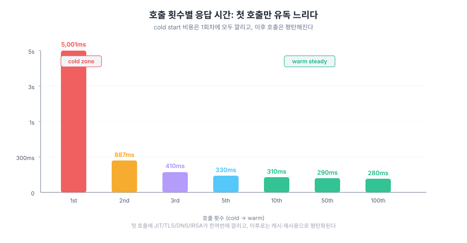
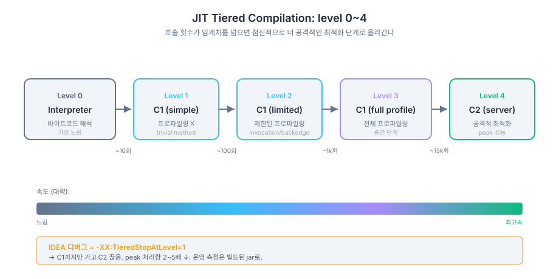
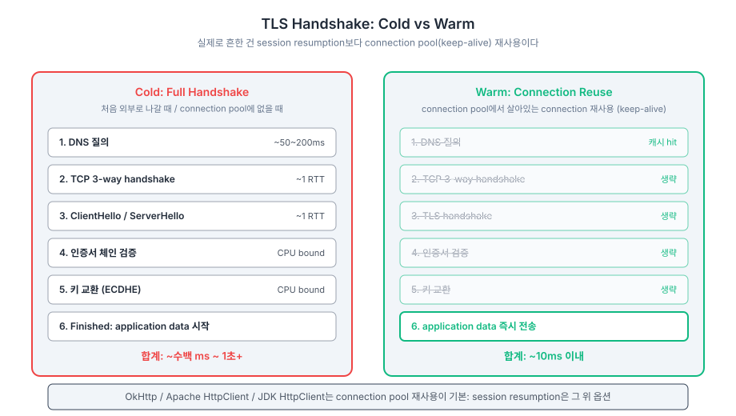
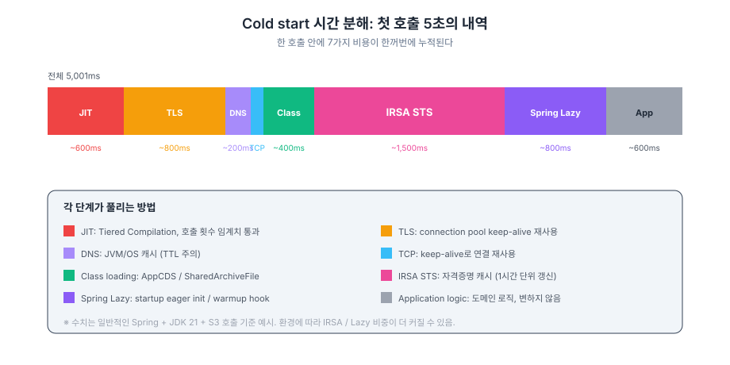
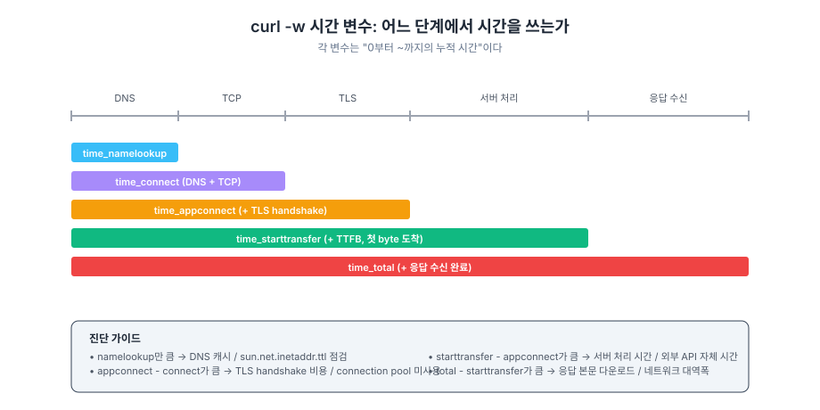
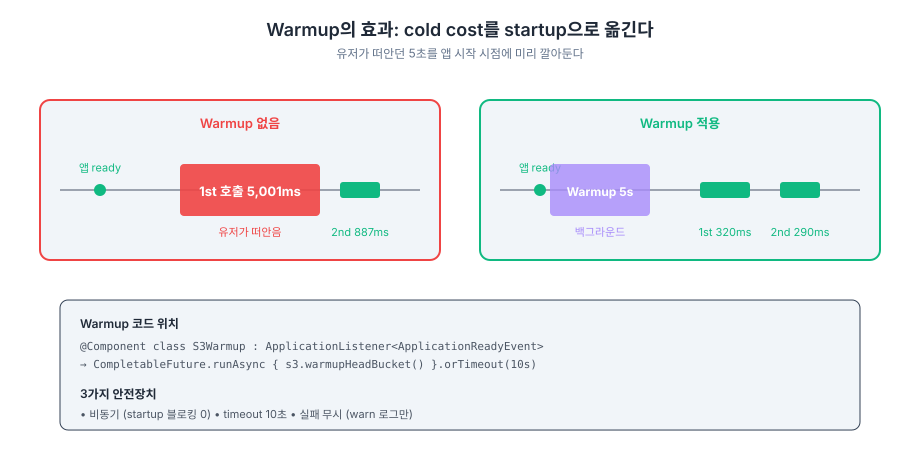
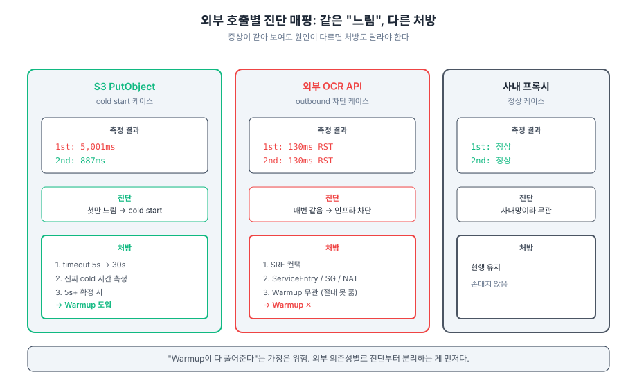
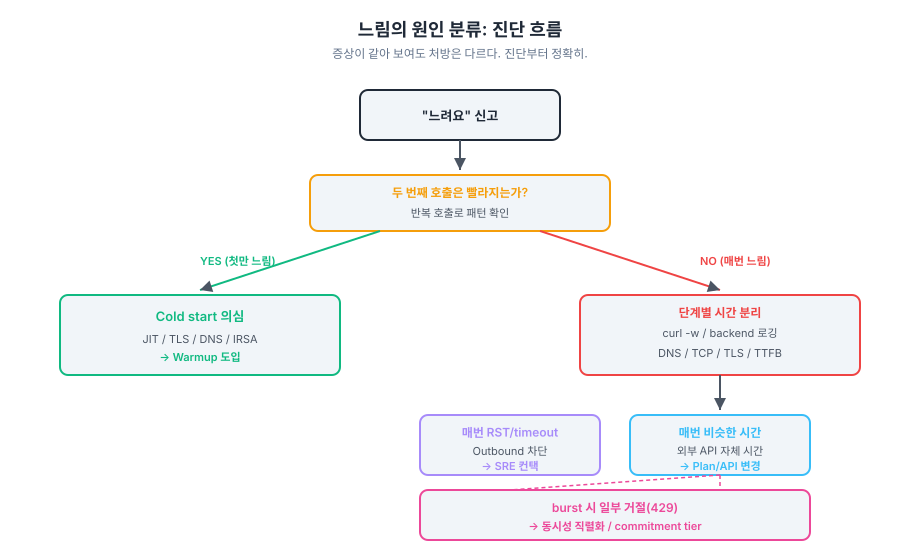

> **TL;DR**
>
> 첫 외부 호출만 5~10초, 두 번째부터는 0.3초. 이 패턴을 보자마자 이름이 나왔다. cold start. 이름이 빨리 나온 게 이 사건의 문제였다.
>
> 같은 앱의 "느림" 두 개 중 S3는 정말 cold start여서 warmup으로 풀렸다. 외부 OCR API는 첫 번째든 100번째든 똑같이 130ms에 끊기는 outbound 차단이어서 warmup 100번으로도 안 풀렸다. 같은 증상처럼 보이는 두 개의 다른 병이었고, 진단 없이 같은 약을 썼다.

---

## 이름이 너무 빨리 나왔다

Spring + JDK 21 앱이 EKS 위에서 돈다. 외부로 나가는 호출은 세 갈래. S3 업로드, 외부 OCR API, 사내 LLM Proxy. 어느 날 관측된 패턴은 이랬다.

```text
1st call: 5~10s   (cold)
2nd call: 0.3s    (warm)
3rd call: 0.3s
```



첫 호출만 느리고 두 번째부터 빠르다. 이 패턴은 서버 개발자에게 너무 익숙해서, 보는 순간 이름이 튀어나온다. "아, cold start네." 그리고 이름이 붙는 순간 진단은 끝난 것 같은 기분이 든다. 처방도 자동으로 따라온다. warmup을 넣자.

여기서 저지른 실수는 하나다. "느림"이라는 한 단어로 S3와 OCR API를 같은 바구니에 담고, 같은 처방을 두 군데 다 적용한 것이다.

## cold start라는 진단은 재료가 넘친다

cold start를 의심할 근거는 차고 넘쳤다. 첫 호출이 느려질 수 있는 이유를 쌓아보면 이렇다.

| 단계 | 첫 호출 | 이후 |
|---|---|---|
| JVM JIT | 인터프리터에서 C1/C2 컴파일 진행 | 네이티브 코드 |
| TLS Handshake | Full handshake | Connection pool 재사용 (keep-alive) |
| DNS | 실제 질의 (50~200ms) | OS/JVM DNS 캐시 |
| TCP Connection | 3-way handshake | 기존 connection 재사용 |
| 클래스 로딩 | lazy load | 이미 로드 |
| AWS IRSA STS | AssumeRoleWithWebIdentity (1~2s) | 캐시된 임시 자격증명 |
| Spring Lazy Init | 일부 빈 첫 사용 시 초기화 | 이미 초기화 |







IRSA 첫 STS 호출 1~2초, lazy bean 초기화 1~3초, 여기에 JIT과 TLS와 DNS를 더하면 4~7초는 흔하게 나온다. 관측된 5~10초와 맞아떨어진다.

그런데 여기에 함정이 있다. 이유가 많을수록 가설은 더 그럴듯해질 뿐, 그럴듯함은 진단이 아니다. 위 표를 다 외워도 OCR API는 한 뼘도 풀리지 않았다.

## "느리다"를 다섯 조각으로 찢기

처방 전에 해야 했던 일은 시간을 분해하는 것이었다. "느리다" 한 단어 안에는 DNS, TCP, TLS, 서버 처리, 클라이언트 처리가 다 섞여 있다.



```bash
curl -w "
  DNS:           %{time_namelookup}s
  CONNECT:       %{time_connect}s
  SSL_HANDSHAKE: %{time_appconnect}s
  TTFB:          %{time_starttransfer}s
  TOTAL:         %{time_total}s
" -s -o /dev/null https://...
```

귀찮은 작업이다. 하지만 이 다섯 줄이 처방을 늦추는 대신 원인을 고정해준다. 병원에서 열이 난다고 바로 약을 주지 않고 체온과 혈액부터 재는 것과 같다.

## S3: 진짜 감기였다

S3는 처음 가설이 맞았다. 첫 호출 비용이 실제로 컸고, startup 직후 dummy 호출로 그 비용을 미리 내면 됐다.

```kotlin
@Component
class S3Warmup(
    private val s3Service: S3Service?,
) : ApplicationListener<ApplicationReadyEvent> {

    private val log = LoggerFactory.getLogger(javaClass)

    override fun onApplicationEvent(event: ApplicationReadyEvent) {
        val s3 = s3Service ?: return
        // 비동기 + timeout + try-catch. startup 블로킹 0, 실패 무시.
        CompletableFuture.runAsync {
            runCatching { s3.warmupHeadBucket() }
                .onFailure { log.warn("S3 warmup failed (ignored): {}", it.message) }
        }.orTimeout(10, TimeUnit.SECONDS)
    }
}
```



측정에서도 하나 배웠다. 처음 관측된 "5초 timeout"은 실제 cold start 시간이 아니라 우리가 정해둔 한도였다. timeout을 30초로 임시로 올려 진짜 시간을 잰 뒤에야 warmup의 효과를 제대로 비교할 수 있었다. 자로 잰 게 아니라 자의 끝을 잰 셈이었으니까.

## OCR: 감기약이 안 듣는 열

같은 앱의 OCR API에도 같은 warmup을 넣었다. S3에서 방금 효과를 본 처방이라 더 의심 없이 넣었다. 그런데 숫자가 다르게 나왔다.

| 외부 호출 | 첫 호출 | 두 번째 | 패턴 |
|---|---|---|---|
| S3 PutObject | 5001ms timeout | 887ms 성공 | 첫만 느림, cold start |
| 외부 OCR API | 130ms RST | 130ms RST | 매번 같음, 다른 원인 |
| 사내 LLM Proxy | 정상 | 정상 | 무관 |



첫 번째도, 두 번째도, 100번째도 똑같이 130ms 만에 연결이 리셋(RST)된다. 여기서 130ms라는 숫자를 읽어보자. 외부 서버가 일을 하다가 실패한 시간치고는 너무 짧고 너무 균일하다. 이건 요청이 목적지에 도착하기 전에 우리 쪽 인프라 어딘가에서 끊기는 시간이다. 가게가 느린 게 아니라, 가게로 가는 문이 잠겨 있는 것이다.

cold start는 정의상 반복하면 풀리는 문제다. 반복해도 똑같이 실패한다면 그건 cold start가 아니다. 잠긴 문 앞에서 warmup은 노크를 더 많이 하는 코드일 뿐이다.

<style>
.metric-fig{--fig-surface:#ffffff;--fig-ink:#0f172a;--fig-ink2:#334155;--fig-muted:#94a3b8;--fig-hair:#e6eaf1;--fig-baseline:#d0d7e2;--c-green:#16a34a;--c-greenink:#15803d;--c-red:#ef4444;--c-redink:#b91c1c;--c-blue:#2f6fed;--c-blueink:#1d4ed8;--c-amber:#d97706;--c-amberink:#b45309;margin:2.4em 0;border:1px solid var(--fig-hair);border-radius:18px;background:var(--fig-surface);padding:18px 20px 10px;overflow:hidden;box-shadow:0 1px 2px rgba(2,6,23,.05),0 14px 40px rgba(2,6,23,.09)}
.metric-fig svg{width:100%;height:auto;display:block;max-width:100%}
.metric-fig svg text{font-family:ui-monospace,"SF Mono","JetBrains Mono",Menlo,monospace}
.metric-fig figcaption{font-size:13.5px;color:var(--fig-muted);line-height:1.6;padding:12px 2px 6px;font-family:ui-monospace,SFMono-Regular,Menlo,monospace}
.metric-fig figcaption b{color:var(--fig-ink2);font-weight:600}
@media (prefers-reduced-motion: reduce){.metric-fig svg animate,.metric-fig svg animateMotion{display:none}}
</style>

<figure class="metric-fig">
  <svg viewBox="0 0 660 250" role="img" aria-label="S3는 첫 호출만 느리고 이후 빨라지지만 OCR은 몇 번을 불러도 똑같이 130ms에 끊긴다" xmlns="http://www.w3.org/2000/svg">
    <text x="40" y="26" font-size="12" fill="var(--fig-muted)" font-weight="600">S3: 첫 호출만 비싸다 (cold start)</text>
    <line x1="40" y1="110" x2="360" y2="110" stroke="var(--fig-baseline)"/>
    <rect x="40" y="38" width="22" height="72" rx="3" fill="var(--c-amber)" opacity="0"><animate attributeName="opacity" values="0;0;0;0" keyTimes="0;0.5;0.9;1" dur="7s" repeatCount="indefinite"/></rect>
    <rect x="40" width="22" rx="3" fill="var(--c-amber)" y="110" height="0"><animate attributeName="height" values="0;0;72;72;0;0" keyTimes="0;0.06;0.09;0.88;0.92;1" dur="7s" repeatCount="indefinite"/><animate attributeName="y" values="110;110;38;38;110;110" keyTimes="0;0.06;0.09;0.88;0.92;1" dur="7s" repeatCount="indefinite"/></rect>
    <rect x="80" width="22" rx="3" fill="var(--c-green)" y="110" height="0"><animate attributeName="height" values="0;0;12;12;0;0" keyTimes="0;0.06;0.09;0.88;0.92;1" dur="7s" repeatCount="indefinite"/><animate attributeName="y" values="110;110;98;98;110;110" keyTimes="0;0.06;0.09;0.88;0.92;1" dur="7s" repeatCount="indefinite"/></rect><rect x="120" width="22" rx="3" fill="var(--c-green)" y="110" height="0"><animate attributeName="height" values="0;0;12;12;0;0" keyTimes="0;0.13;0.16;0.88;0.92;1" dur="7s" repeatCount="indefinite"/><animate attributeName="y" values="110;110;98;98;110;110" keyTimes="0;0.13;0.16;0.88;0.92;1" dur="7s" repeatCount="indefinite"/></rect><rect x="160" width="22" rx="3" fill="var(--c-green)" y="110" height="0"><animate attributeName="height" values="0;0;12;12;0;0" keyTimes="0;0.2;0.23;0.88;0.92;1" dur="7s" repeatCount="indefinite"/><animate attributeName="y" values="110;110;98;98;110;110" keyTimes="0;0.2;0.23;0.88;0.92;1" dur="7s" repeatCount="indefinite"/></rect><rect x="200" width="22" rx="3" fill="var(--c-green)" y="110" height="0"><animate attributeName="height" values="0;0;12;12;0;0" keyTimes="0;0.27;0.3;0.88;0.92;1" dur="7s" repeatCount="indefinite"/><animate attributeName="y" values="110;110;98;98;110;110" keyTimes="0;0.27;0.3;0.88;0.92;1" dur="7s" repeatCount="indefinite"/></rect><rect x="240" width="22" rx="3" fill="var(--c-green)" y="110" height="0"><animate attributeName="height" values="0;0;12;12;0;0" keyTimes="0;0.34;0.37;0.88;0.92;1" dur="7s" repeatCount="indefinite"/><animate attributeName="y" values="110;110;98;98;110;110" keyTimes="0;0.34;0.37;0.88;0.92;1" dur="7s" repeatCount="indefinite"/></rect><rect x="280" width="22" rx="3" fill="var(--c-green)" y="110" height="0"><animate attributeName="height" values="0;0;12;12;0;0" keyTimes="0;0.41;0.44;0.88;0.92;1" dur="7s" repeatCount="indefinite"/><animate attributeName="y" values="110;110;98;98;110;110" keyTimes="0;0.41;0.44;0.88;0.92;1" dur="7s" repeatCount="indefinite"/></rect><rect x="320" width="22" rx="3" fill="var(--c-green)" y="110" height="0"><animate attributeName="height" values="0;0;12;12;0;0" keyTimes="0;0.48;0.51;0.88;0.92;1" dur="7s" repeatCount="indefinite"/><animate attributeName="y" values="110;110;98;98;110;110" keyTimes="0;0.48;0.51;0.88;0.92;1" dur="7s" repeatCount="indefinite"/></rect>
    <text x="51" y="32" font-size="10" fill="var(--c-amberink)" text-anchor="middle" font-weight="700">5s
      <animate attributeName="opacity" values="0;0;1;1;0" keyTimes="0;0.06;0.1;0.88;1" dur="7s" repeatCount="indefinite"/>
    </text>
    <text x="440" y="102" font-size="11" fill="var(--c-greenink)" font-weight="700">두 번째부터 0.3s</text>
    <text x="40" y="150" font-size="12" fill="var(--fig-muted)" font-weight="600">OCR: 몇 번을 불러도 130ms RST (잠긴 문)</text>
    <line x1="40" y1="228" x2="360" y2="228" stroke="var(--fig-baseline)"/>
    <rect x="40" width="22" rx="3" fill="var(--c-red)" y="228" height="0"><animate attributeName="height" values="0;0;10;10;0;0" keyTimes="0;0.06;0.09;0.88;0.92;1" dur="7s" repeatCount="indefinite"/><animate attributeName="y" values="228;228;218;218;228;228" keyTimes="0;0.06;0.09;0.88;0.92;1" dur="7s" repeatCount="indefinite"/></rect><rect x="80" width="22" rx="3" fill="var(--c-red)" y="228" height="0"><animate attributeName="height" values="0;0;10;10;0;0" keyTimes="0;0.13;0.16;0.88;0.92;1" dur="7s" repeatCount="indefinite"/><animate attributeName="y" values="228;228;218;218;228;228" keyTimes="0;0.13;0.16;0.88;0.92;1" dur="7s" repeatCount="indefinite"/></rect><rect x="120" width="22" rx="3" fill="var(--c-red)" y="228" height="0"><animate attributeName="height" values="0;0;10;10;0;0" keyTimes="0;0.2;0.23;0.88;0.92;1" dur="7s" repeatCount="indefinite"/><animate attributeName="y" values="228;228;218;218;228;228" keyTimes="0;0.2;0.23;0.88;0.92;1" dur="7s" repeatCount="indefinite"/></rect><rect x="160" width="22" rx="3" fill="var(--c-red)" y="228" height="0"><animate attributeName="height" values="0;0;10;10;0;0" keyTimes="0;0.27;0.3;0.88;0.92;1" dur="7s" repeatCount="indefinite"/><animate attributeName="y" values="228;228;218;218;228;228" keyTimes="0;0.27;0.3;0.88;0.92;1" dur="7s" repeatCount="indefinite"/></rect><rect x="200" width="22" rx="3" fill="var(--c-red)" y="228" height="0"><animate attributeName="height" values="0;0;10;10;0;0" keyTimes="0;0.34;0.37;0.88;0.92;1" dur="7s" repeatCount="indefinite"/><animate attributeName="y" values="228;228;218;218;228;228" keyTimes="0;0.34;0.37;0.88;0.92;1" dur="7s" repeatCount="indefinite"/></rect><rect x="240" width="22" rx="3" fill="var(--c-red)" y="228" height="0"><animate attributeName="height" values="0;0;10;10;0;0" keyTimes="0;0.41;0.44;0.88;0.92;1" dur="7s" repeatCount="indefinite"/><animate attributeName="y" values="228;228;218;218;228;228" keyTimes="0;0.41;0.44;0.88;0.92;1" dur="7s" repeatCount="indefinite"/></rect><rect x="280" width="22" rx="3" fill="var(--c-red)" y="228" height="0"><animate attributeName="height" values="0;0;10;10;0;0" keyTimes="0;0.48;0.51;0.88;0.92;1" dur="7s" repeatCount="indefinite"/><animate attributeName="y" values="228;228;218;218;228;228" keyTimes="0;0.48;0.51;0.88;0.92;1" dur="7s" repeatCount="indefinite"/></rect><rect x="320" width="22" rx="3" fill="var(--c-red)" y="228" height="0"><animate attributeName="height" values="0;0;10;10;0;0" keyTimes="0;0.55;0.58;0.88;0.92;1" dur="7s" repeatCount="indefinite"/><animate attributeName="y" values="228;228;218;218;228;228" keyTimes="0;0.55;0.58;0.88;0.92;1" dur="7s" repeatCount="indefinite"/></rect>
    <rect x="420" y="196" width="128" height="24" rx="7" fill="var(--c-red)" opacity="0.14"/>
    <text x="484" y="212" font-size="11" fill="var(--c-redink)" text-anchor="middle" font-weight="700">warmup ×100
      <animate attributeName="opacity" values="1;1;0.3;1;1" keyTimes="0;0.7;0.75;0.8;1" dur="7s" repeatCount="indefinite"/>
    </text>
    <text x="484" y="234" font-size="10.5" fill="var(--fig-muted)" text-anchor="middle">변화 없음</text>
  </svg>
  <figcaption>같은 "느림", 다른 병. 위는 반복하면 풀리는 <b>첫 호출 비용</b>이고, 아래는 반복해도 똑같이 끊기는 <b>outbound 차단</b>이다. 아래에 warmup은 노크만 늘린다.</figcaption>
</figure>

## 진단이 갈리면 처방도 갈린다



| 외부 호출 | 진단 | 처방 |
|---|---|---|
| S3 PutObject | Cold start (JIT + IRSA + TLS) | warmup 코드 추가 |
| 외부 OCR API | Outbound 차단 | SRE 컨택, ServiceEntry 등록 요청 |
| 사내 LLM Proxy | 무관 | 그대로 유지 |

사후에 정리한 진단 순서는 이렇다. 이 순서대로 갔으면 이름을 잘못 붙일 일이 없었다.

```text
1. 증상 측정 (어떤 호출 / 얼마나 / 어떤 패턴)
2. 반복 호출 비교, 두 번째부터 빨라지는가
3. 단계별 elapsed 분리, DNS/TCP/TLS/서버/클라이언트 (curl -w)
4. 인프라 검증, pod 안에서 nc/curl로 outbound 가능한가
5. 외부 API 한도 검증, 콘솔/문서에서 RPM·동시성 제한
6. 위 통과 + 첫 호출만 느리면 cold start 확정, warmup
```

실제로 한 일은 1에서 6으로의 직진이었다. 2번 하나만 챙겼어도 OCR은 초기에 걸러졌다. "두 번째부터 빨라지는가"라는 질문에 OCR의 답은 처음부터 "아니오"였으니까.

같은 증상, 다른 병의 목록을 만들어두면 다음에 빠르다.

| 증상 | 원인 카테고리 | Warmup으로 풀리나? | 가야 할 처방 |
|---|---|---|---|
| 첫 호출 느리고 두 번째부터 빠름 | Cold start (JIT/connection/STS) | YES | App startup 시 dummy 호출 |
| 매번 똑같이 빠르게 RST/timeout | Outbound 차단 (방화벽, mesh) | NO | SRE, ServiceEntry, SG, NAT |
| 매번 비슷한 시간 (예: 1.7s) | 외부 API 자체 시간 | NO | 외부 API plan 인상 / 다른 API |
| burst 시 일부 거절 (429) | 외부 rate limit | NO | concurrency 직렬화 / commitment tier |

## 곁가지 두 개

이 사건을 파는 동안 두 가지 흔한 오해도 같이 정리됐다.

하나, "K8s probe가 있으면 되는 것 아닌가?" 절반만 맞다. readiness probe는 "트래픽을 받아도 되는가"를 묻는 장치다. probe를 통과한 순간에도 JIT은 cold고 connection pool은 비어 있다. probe와 rolling update는 장애 회피용이고, 첫 요청의 비용은 별도의 warmup이 줄인다.

둘, 로컬 IDEA에서 잰 숫자는 운영 신호가 아니다. "Run with fast startup" 옵션은 `-XX:TieredStopAtLevel=1`로 C1까지만 컴파일하고, 옵션이 없어도 디버거 attach 자체가 JIT을 제약한다. warm 성능이 2~5배 느리게 측정된다. 성능을 잴 거면 빌드된 jar로 재야 한다.

## 마치며

이 사건에서 틀린 건 지식이 아니었다. cold start에 대해 모은 자료는 정확했고, JIT 단계도 TLS handshake도 IRSA 흐름도 다 맞는 내용이었다. 틀린 건 순서였다. 진단보다 이름이 먼저 나왔고, 이름이 처방을 자동으로 결정해버렸다. 아는 게 많을수록 그럴듯한 이름이 빨리 나오고, 그래서 더 빨리 틀릴 수 있다.

다음에 "느리다"는 보고를 받으면 이름 붙이기 전에 질문 하나만 먼저 던져보자. 반복하면 빨라지는가? 빨라지면 cold 계열이고, 똑같으면 다른 병이다. 질문 하나 값으로는 꽤 싸다.

남은 숙제도 있다. GraalVM Native Image는 startup 50ms가 매력적이지만 PGO 없는 peak 처리량 하락과 reflection 설정 부담 때문에 평가 전이고, AppCDS는 startup 5~10% 단축 여지가 있다. OCR의 ServiceEntry 등록은 인프라 팀 일정에 물려 있고, OkHttp의 connect/read timeout 명시도 대기 중이다.
