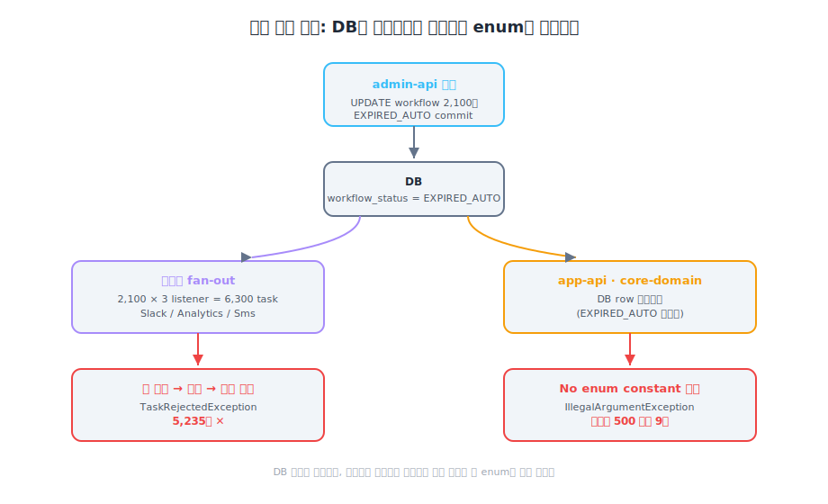
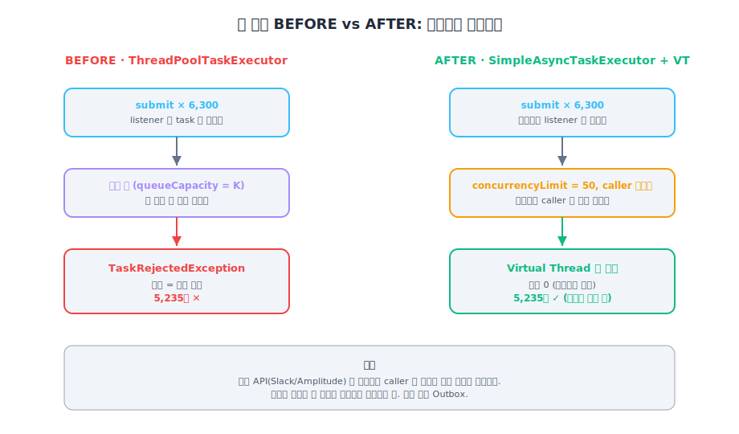
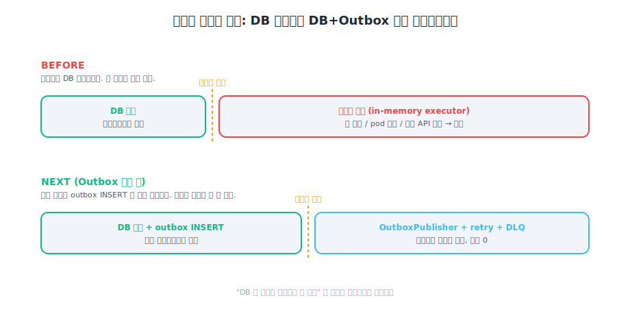

> **TL;DR**
>
> 미배포 enum + 배치 실행 → 비동기 이벤트 큐 거부 → **5,235건 영구 유실.**
> 1차 봉합으로 Virtual Thread + concurrencyLimit 도입. 큐 거부 0건. "성공"이라고 불렀다.
>
> 그 직후 한 가지 의문이 떠올랐다.
> "근데 executor pod 죽으면 in-memory 큐는?"
>
> VT 봉합은 **유실을 지연으로 옮긴 것**이지 정합성 경계를 옮긴 게 아니었다.
> 진짜 답은 Outbox — DB write와 이벤트 발행을 같은 트랜잭션에 묶기.
>
> **이 문제는 큐 용량이나 스레드 문제가 아니다.**
> **"DB와 이벤트 발행이 분리된 정합성 경계" 문제였다.**

---

## 이 글에서 가장 먼저 짚어둘 것 — VT는 봉합, Outbox는 답

처음엔 VT로 다 해결된 줄 알았다. 근데 그건 착각이었다.

| 처방 | 막는 자리 | 정합성 경계 |
|---|---|---|
| VT + concurrencyLimit (현재) | 큐 거부 → 0건 | DB 커밋까지만. **executor pod 죽으면 유실** |
| Outbox (NEXT) | DB + outbox 같은 트랜잭션 | **outbox INSERT까지** |

VT가 큐 거부를 0건으로 만든 건 사실이다. 근데 그게 정합성 보장은 아니다.
"유실 → 지연" 으로 옮긴 것이지, "유실 가능 → 유실 불가" 로 옮긴 게 아님.

같은 사고가 다음에 또 일어날 수 있는 자리:
- executor pod이 OOM/evict 되면 in-memory 큐 통째로 유실
- 외부 API가 장기간 정체되면 큐가 무한정 쌓이고 결국 같은 문제

이 글의 가장 큰 깨달음이 그 자리.

---

## 1. 문제 — 배치 한 번에 5,235건 유실

타임라인:

| 시각 (KST) | 구분 | 이벤트 |
|---|---|---|
| 13:07 | 시작 | 배치 실행 — DB 상태 일괄 변경 시작 (2,100건) |
| 13:10 | 장애 ① | 이벤트 처리 큐 소진 — 2,618건 거부 |
| 13:19 | 연쇄 | 알림 전송 실패 61건 |
| 13:21 | 장애 ① | 큐 소진 2차 — 2,617건 추가 거부 |
| 13:24 | 장애 ② | 다른 서버 첫 500 에러 (사용자 접근) |
| 13:31 | 탐지 | system alert 인지 — **탐지까지 24분** |
| 14:09 | 복구 | 영향 서버 재배포 완료 |

총 장애 1시간 2분.

---

## 2. 무슨 일이 일어났나 (BEFORE)



3개 서버가 같은 enum에 의존.

| 서버 | 역할 | enum 의존 |
|---|---|---|
| `admin-api` | 배치 실행 + 어드민 API | O |
| `app-api` | 사용자 앱 서버 | O |
| `core-domain` | 도메인 서버 (HTTP 호출) | O |

새 status `EXPIRED_AUTO`를 추가했는데 `admin-api`에만 배포하고 나머지 둘 누락.

### 2-1. 배치가 DB를 바꿨다

```sql
UPDATE workflow
SET    workflow_status = 'EXPIRED_AUTO'
WHERE  id IN (...);   -- 50건씩 42회 = 2,100건
```

DB는 정상.

### 2-2. 이벤트 처리 큐가 소진됐다

상태 전이 1건당 비동기 리스너 3개가 `workflowEventExecutor`에 submit.

```
2,100건 × 3 리스너 = 최대 6,300 태스크 → 수십 초 안에 executor 집중
  ├─ WorkflowSlackListener
  ├─ WorkflowAnalyticsListener
  └─ WorkflowSmsListener
```

BEFORE 코드 — 유계 큐, 거부 시 영구 유실:

```kotlin
ThreadPoolTaskExecutor().apply {
    corePoolSize  = N
    maxPoolSize   = M
    queueCapacity = K   // ← 초과 시 TaskRejectedException → 영구 유실
}
```

5,235건 유실 (13:10 / 13:21 두 차례).

### 2-3. enum 미배포 서버에서 500

```
java.lang.IllegalArgumentException:
  No enum constant support.enums.WorkflowStatus.EXPIRED_AUTO
```

500 에러 9건 (13:24~13:57). 그 시간대에 실제 진입한 사용자만 영향.

---

## 3. 시도 1 — VT + concurrencyLimit (그리고 의심)

장애 직후 1차 봉합으로 들어간 변경.

```kotlin
SimpleAsyncTaskExecutor("workflow-event-").apply {
    setVirtualThreads(true)
    concurrencyLimit = 50              // 초과 시 caller 블로킹 → 유실 없음
    setTaskTerminationTimeout(30_000L)
}
```



| 항목 | BEFORE | AFTER (VT) |
|---|---|---|
| 큐 초과 시 동작 | 거부 → **유실** | caller 블로킹 → **지연** |
| 이벤트 유실 건수 | 5,235건 | 0 |
| 배치 속도 | 빠름 | 외부 API 속도에 종속 |

큐 거부 0건. 이때 "성공"이라고 불렀다.

### 직후 떠오른 의문

retro 미팅에서 한 명이 물었다.
"근데 executor pod 이 죽으면 그 안의 task 큐는요?"

답: in-memory 큐라서 **유실.**

VT가 막은 건 **거부에 의한 유실**이지 **pod 죽음에 의한 유실**이 아니었다.
외부 API가 장기간 정체되면 큐는 무한정 쌓이고, 그 상태에서 pod이 evict되면 같은 사고.

VT 봉합으로 옮긴 건 큐 거부의 시점 — 거부를 지연으로 바꿨을 뿐.

**여기서 잃는 것:**
VT 봉합은 정합성 경계를 옮기지 않는다. DB 커밋까지만 보장하는 그대로. 외부 API 종속도 그대로 (외부 느려지면 배치 정체).

같은 종류 사고가 다음에 또 일어날 수 있다는 게 명확해졌다.

---

## 4. 사고 원인 vs 구조 원인

### 사고 원인

`admin-api`만 배포. 다른 두 서버 누락.

### 구조 원인 (이게 다음에 또 터질 이유)

| # | 결함 | 결과 |
|---|---|---|
| ① | 상태와 이벤트 강결합 — DB commit ≠ 이벤트 발행 보장 | DB 성공, 이벤트 유실 |
| ② | enum 하드코딩 — 3개 서버가 같은 enum 직접 의존 | 신규 상태 = 동시 배포 강제 |
| ③ | 이벤트 fan-out을 단일 executor에 집중 | 6,300 태스크 → 큐 폭발 필연 |
| ④ | 하루 1번 배치 = burst 설계 자체 | 2,100건 일괄 → 이벤트 6,300 폭발 |

이게 Outbox · Tolerant Reader · stream 전환이 필요한 이유.

---

## 5. NEXT — Outbox / Tolerant Reader / Stream

### P0 — 이벤트 유실 영구 차단 (Outbox)



```sql
CREATE TABLE workflow_outbox (
    id            BIGINT AUTO_INCREMENT PRIMARY KEY,
    workflow_code VARCHAR(50)  NOT NULL,
    event_type    VARCHAR(100) NOT NULL,
    payload       JSON         NOT NULL,
    status        VARCHAR(20)  NOT NULL DEFAULT 'PENDING',
    retry_count   INT          NOT NULL DEFAULT 0,
    created_at    DATETIME     NOT NULL DEFAULT NOW(),
    sent_at       DATETIME     NULL
);
CREATE INDEX idx_outbox_status ON workflow_outbox (status, created_at);
```

```kotlin
// 1) 트랜잭션: DB + outbox INSERT 같이
@Transactional
fun expireWorkflows(cutoff: LocalDateTime): Int {
    val transitioned = /* 기존 로직 */
    repo.saveAll(transitioned)
    outboxRepository.saveAll(transitioned.map(::toOutbox))
    return transitioned.size
    // eventPublisher.publishStatusChanged() 호출 제거 — outbox로 위임
}

// 2) 별도 publisher (스케줄러 또는 CDC)
@Scheduled(fixedDelay = 5_000)
fun publish() {
    outboxRepository.findPending(limit = 100).forEach { event ->
        runCatching { slackClient.send(event); analyticsClient.send(event) }
            .onSuccess { outboxRepository.markSent(event.id) }
            .onFailure { outboxRepository.incrementRetry(event.id) }
    }
}
```

`retry_count > 3` → `FAILED` 상태 + DLQ 처리 + alert.

**여기서 잃는 것:**
DB write가 2배. 운영 복잡도가 "DB + outbox + consumer + DLQ" 로 증가.
"이 복잡도가 비즈니스 가치 대비 정당화되는가" 라는 질문이 매번 따라온다.

### P1 — 계약 안정성 (Tolerant Reader)

```kotlin
data class WorkflowResponse(
    val code: String? = null,
    val workflowStatusRaw: String? = null,  // String으로 수신
) {
    val workflowStatus: WorkflowStatus?
        get() = workflowStatusRaw
            ?.let { raw -> runCatching { WorkflowStatus.valueOf(raw) }.getOrNull() }
            .also {
                if (it == null && workflowStatusRaw != null)
                    log.warn("알 수 없는 workflow 상태: {}", workflowStatusRaw)
            }
}
```

알 수 없는 값 = `null` + 경고 로그 + alert.
UNKNOWN fallback은 silent failure 위험이라 사용 안 함.

**여기서 잃는 것:**
"알 수 없는 status를 받았다" 가 일찍 안 보일 수 있다. 모니터링 alert 임계 잘못 잡으면 silent failure.

### P2 — 구조 개선 (배치 → 스트림)

```
[현재]  하루 1번 배치 → 2,100건 burst → 이벤트 6,300 폭발
[목표]  auto_calculated_at + 7일 시점 도래 시 Kafka delay message
        or scheduler가 개별 만료 처리 → burst 0
```

P0/P1으로 유실·계약 충격은 흡수되지만 burst 자체는 그대로. 규모 커지면 같은 비율로 압박.
stream 전환이 근본 답.

---

## 6. 핵심 질문 3가지

| # | 질문 | 현재 답 | 목표 답 |
|---|---|---|---|
| Q1 | 이벤트 유실 시 재처리 전략? | 없음 — 거부된 태스크는 사라짐 | Outbox + retry + DLQ |
| Q2 | 이벤트 멱등성 보장? | 미설계 | Slack: at-most-once / Analytics: event_id 기반 exactly-once |
| Q3 | 상태 변경 ↔ 이벤트 발행 정합성 경계? | DB 커밋까지만 | DB + outbox INSERT 같은 트랜잭션 |

---

## 안 푼 것 / 애매했던 결정들

- **Outbox 도입 일정** — P0 라고 적었지만 솔직히 분기 안에 들어갈지 자신 없음. PR 사이즈가 크고 멱등성 설계가 따라와서 단독 작업이 큼
- **CDC vs 스케줄러 publisher** — Debezium 도입할지, `@Scheduled` 폴링으로 갈지 결정 못 함. 운영 복잡도 차이가 커서 팀 합의 필요
- **VT concurrencyLimit 50** — 50이라는 숫자가 운영 측정값이 아니라 "외부 API rate limit이 100이니까 절반" 직관. P0 머지 전에는 이대로 가지만 임시 숫자
- **stream 전환 (P2)** — 아키텍처 변경 비용이 커서 분기 단위로 결정 못 함

---

## 메모

retro 미팅에서 큐 거부 0건을 성공이라고 부른 직후 의문이 떠오른 게 가장 컸다.
그 의문이 안 떠올랐으면 "VT로 풀렸다" 로 끝났을 거고, 다음 비슷한 패턴(executor pod 죽음, 외부 API 정체)에서 같은 사고를 또 찍었을 것.

탐지까지 24분 걸렸다.
운영 알림 자체가 유실돼서 알림으로는 알 수 없었고, system alert로 인지됨.
**장애 알림 자체가 유실되는 구조는 MTTR을 직접 늘린다.**
이번 사고가 알려준 가장 비싼 깨달음.

VT 봉합은 막은 게 아니라 **시간을 산 것**이다.
이 시간 안에 Outbox로 넘어가야 한다는 의미. 안 넘어가면 같은 사고 다시 만남.
