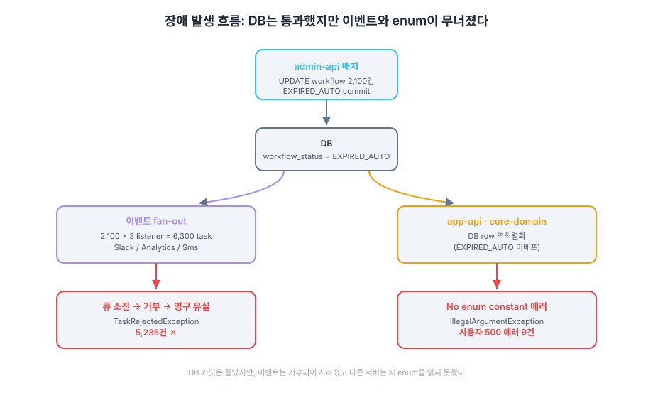
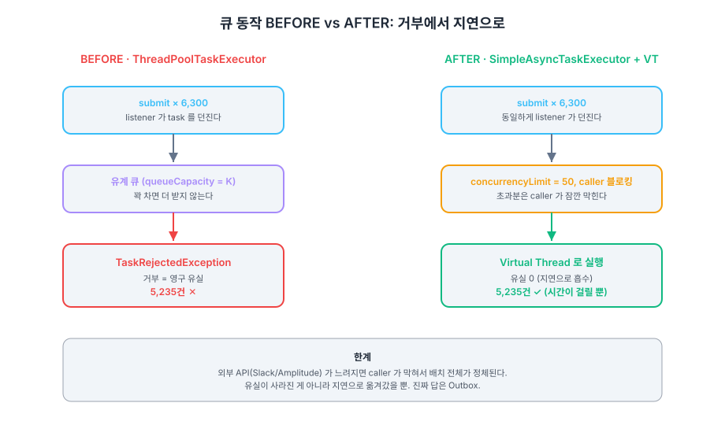
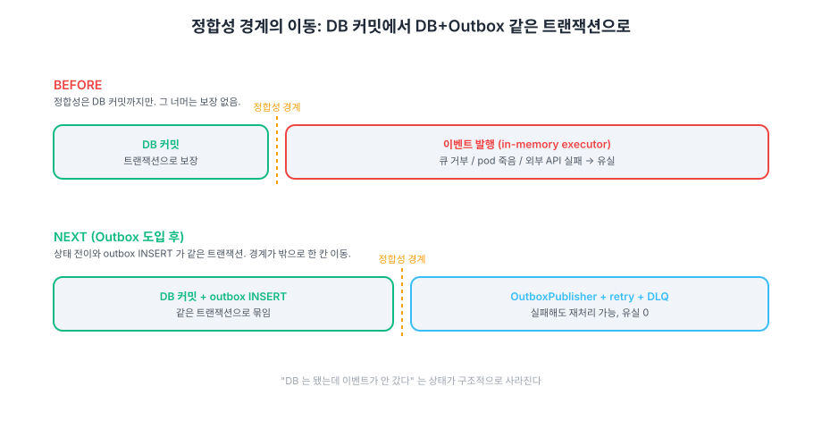

> **TL;DR**
>
> 배치 한 번에 이벤트 5,235건이 영구 유실됐다. 1차 봉합으로 Virtual Thread를 넣자 큐 거부가 0건이 됐고, 그 순간 "성공"이라는 말이 나왔다. 그 말이 너무 빨랐다.
>
> 거부 0건은 유실을 막았다는 뜻이 아니라 유실의 시점을 뒤로 밀었다는 뜻이었다. 이벤트는 여전히 메모리에 살고 있었고, executor pod이 죽으면 같은 사고다. 유실을 끝내는 건 처리 속도가 아니라 이벤트가 사는 위치를 바꾸는 일, 즉 Outbox였다.

---

## 62분의 기록

먼저 그날의 타임라인이다.

| 시각 (KST) | 구분 | 이벤트 |
|---|---|---|
| 13:07 | 시작 | 배치 실행. DB 상태 일괄 변경 (2,100건) |
| 13:10 | 1차 장애 | 이벤트 처리 큐 소진, 2,618건 거부 |
| 13:19 | 연쇄 | 알림 전송 실패 61건 |
| 13:21 | 2차 장애 | 큐 소진 2차, 2,617건 추가 거부 |
| 13:24 | 다른 서버 | 첫 500 에러 (사용자 접근) |
| 13:31 | 탐지 | system alert 인지. **탐지까지 24분.** |
| 14:09 | 복구 | 영향 서버 재배포 완료 |

총 62분. 그런데 이 표에서 가장 이상한 숫자는 5,235가 아니라 24다. 장애가 시작되고 사람이 알아채기까지 24분이 걸렸다. 이유는 뒤에서 나오는데, 미리 말하면 화재경보기가 불에 탔기 때문이다.

## 무슨 일이 있었나

시스템 그림부터. 서버 3대(`admin-api`, `app-api`, `core-domain`)가 같은 workflow status enum에 의존한다. 워크플로우 상태가 바뀌면 전이 1건마다 비동기 리스너 3개(Slack 알림, 분석, SMS)가 in-memory executor 큐에 태스크로 들어간다. DB를 바꾸는 일과 이벤트를 내보내는 일은 분리되어 있고, 이벤트의 유일한 거처는 그 메모리 큐다.

발단은 배포 누락이었다. 새 status `EXPIRED_AUTO`가 `admin-api`에만 배포되고 나머지 두 서버에는 안 나갔다. 그 상태에서 배치가 돌았다.



```sql
UPDATE workflow
SET    workflow_status = 'EXPIRED_AUTO'
WHERE  id IN (...);   -- 50건씩 42회 = 2,100건
```

DB는 정상이었다. 문제는 그다음. 상태 전이 1건당 리스너가 3개씩 붙으니 태스크 수는 곱셈으로 불어난다.

```text
2,100건 × 3 리스너 = 최대 6,300 태스크 -> 수십 초 안에 executor 집중
  ├─ WorkflowSlackListener
  ├─ WorkflowAnalyticsListener
  └─ WorkflowSmsListener
```

이 6,300개가 쏟아진 곳이 유계 큐다.

```kotlin
ThreadPoolTaskExecutor().apply {
    corePoolSize  = N
    maxPoolSize   = M
    queueCapacity = K   // 초과 시 TaskRejectedException -> 영구 유실
}
```

큐가 넘치면 태스크는 거부되고, 거부된 태스크를 다시 살릴 장치는 없다. 두 차례에 걸쳐 5,235건이 사라졌다. 한편 enum이 없는 서버에서는 `No enum constant WorkflowStatus.EXPIRED_AUTO`로 500 에러 9건이 났다.

그리고 24분의 답이 여기 있다. 유실된 이벤트 안에는 운영 알림도 포함되어 있었다. 장애를 알려야 할 알림이 장애로 유실된 것이다. 불이 났는데 경보기가 제일 먼저 탔다.

## 봉합: 물 퍼내는 속도를 올리다

1차 봉합의 목표는 명확했다. 큐가 꽉 찼을 때 버리지 말 것.

```kotlin
SimpleAsyncTaskExecutor("workflow-event-").apply {
    setVirtualThreads(true)
    concurrencyLimit = 50              // 초과 시 caller 블로킹, 유실 없음
    setTaskTerminationTimeout(30_000L)
}
```



| 항목 | BEFORE | AFTER (VT) |
|---|---|---|
| 큐 초과 시 동작 | 거부, 유실 | caller 블로킹, 지연 |
| 이벤트 유실 건수 | 5,235건 | 0 |
| 배치 속도 | 빠름 | 외부 API 속도에 종속 |

같은 배치를 다시 돌렸다. 큐 거부 0건. 회의에서 "성공"이라는 말이 나왔고, 나도 고개를 끄덕였다.

## "pod이 죽으면 그 큐는요?"

retro 미팅에서 누군가 물었다. executor pod이 죽으면 그 안의 태스크 큐는 어떻게 되냐고.

답은 간단했다. in-memory니까 사라진다. 그리고 그 간단한 답이 "성공"이라는 말을 거둬들였다.

VT 봉합이 막은 건 거부에 의한 유실이지, 유실 그 자체가 아니었다. 이벤트는 여전히 메모리에 산다. 배가 가라앉는 상황에 비유하면, 우리가 한 일은 물 퍼내는 속도를 올린 것이다. 확실히 배는 더 오래 뜬다. 하지만 구멍은 그대로다. 외부 API가 장기간 정체되면 큐가 무한정 쌓이고, 그 상태에서 pod이 evict되면 5,235건이 아니라 그 이상이 한 번에 사라진다.

거부 0건의 정확한 이름은 "성공"이 아니라 "아직 메모리에 남아 있는 위험"이었다.

<style>
.metric-fig{--fig-surface:#ffffff;--fig-ink:#0f172a;--fig-ink2:#334155;--fig-muted:#94a3b8;--fig-hair:#e6eaf1;--fig-baseline:#d0d7e2;--c-green:#16a34a;--c-greenink:#15803d;--c-red:#ef4444;--c-redink:#b91c1c;--c-blue:#2f6fed;--c-blueink:#1d4ed8;--c-amber:#d97706;--c-amberink:#b45309;margin:2.4em 0;border:1px solid var(--fig-hair);border-radius:18px;background:var(--fig-surface);padding:18px 20px 10px;overflow:hidden;box-shadow:0 1px 2px rgba(2,6,23,.05),0 14px 40px rgba(2,6,23,.09)}
.metric-fig svg{width:100%;height:auto;display:block;max-width:100%}
.metric-fig svg text{font-family:ui-monospace,"SF Mono","JetBrains Mono",Menlo,monospace}
.metric-fig figcaption{font-size:13.5px;color:var(--fig-muted);line-height:1.6;padding:12px 2px 6px;font-family:ui-monospace,SFMono-Regular,Menlo,monospace}
.metric-fig figcaption b{color:var(--fig-ink2);font-weight:600}
@media (prefers-reduced-motion: reduce){.metric-fig svg animate,.metric-fig svg animateMotion{display:none}}
</style>

<figure class="metric-fig">
  <svg viewBox="0 0 660 240" role="img" aria-label="pod이 죽으면 메모리 큐의 이벤트는 증발하지만 outbox 테이블의 이벤트는 남아서 발송된다" xmlns="http://www.w3.org/2000/svg">
    <rect x="40" y="56" width="240" height="150" rx="12" fill="none" stroke="var(--fig-baseline)">
      <animate attributeName="stroke" values="var(--fig-baseline);var(--fig-baseline);#ef4444;var(--fig-baseline)" keyTimes="0;0.40;0.44;0.5" dur="8s" repeatCount="indefinite"/>
    </rect>
    <text x="160" y="44" font-size="11" fill="var(--fig-muted)" text-anchor="middle">executor pod (메모리 큐)</text>
    <text x="160" y="80" font-size="10.5" fill="var(--fig-muted)" text-anchor="middle">메모지</text>
    <rect x="64" y="92" width="190" height="20" rx="5" fill="var(--c-blue)" opacity="0"><animate attributeName="opacity" values="0;0;0.55;0.55;0;0" keyTimes="0;0.05;0.08;0.44;0.48;1" dur="8s" repeatCount="indefinite"/></rect><rect x="64" y="120" width="190" height="20" rx="5" fill="var(--c-blue)" opacity="0"><animate attributeName="opacity" values="0;0;0.55;0.55;0;0" keyTimes="0;0.09;0.12;0.44;0.48;1" dur="8s" repeatCount="indefinite"/></rect><rect x="64" y="148" width="190" height="20" rx="5" fill="var(--c-blue)" opacity="0"><animate attributeName="opacity" values="0;0;0.55;0.55;0;0" keyTimes="0;0.13;0.16;0.44;0.48;1" dur="8s" repeatCount="indefinite"/></rect><rect x="64" y="176" width="190" height="20" rx="5" fill="var(--c-blue)" opacity="0"><animate attributeName="opacity" values="0;0;0.55;0.55;0;0" keyTimes="0;0.17;0.2;0.44;0.48;1" dur="8s" repeatCount="indefinite"/></rect>
    <text x="160" y="140" font-size="12" fill="var(--c-redink)" text-anchor="middle" font-weight="800">pod 죽음, 큐 증발
      <animate attributeName="opacity" values="0;0;1;1;0" keyTimes="0;0.46;0.5;0.96;1" dur="8s" repeatCount="indefinite"/>
    </text>
    <ellipse cx="492" cy="62" rx="110" ry="14" fill="none" stroke="var(--fig-baseline)"/>
    <path d="M382 62 V196 A110 14 0 0 0 602 196 V62" fill="none" stroke="var(--fig-baseline)"/>
    <text x="492" y="44" font-size="11" fill="var(--fig-muted)" text-anchor="middle">workflow_outbox (장부)</text>
    <rect x="404" y="96" width="176" height="18" rx="4" fill="var(--fig-baseline)" opacity="0"><animate attributeName="opacity" values="0;0;0.6;0.6;0" keyTimes="0;0.05;0.08;0.96;1" dur="8s" repeatCount="indefinite"/></rect><rect x="404" y="122" width="176" height="18" rx="4" fill="var(--fig-baseline)" opacity="0"><animate attributeName="opacity" values="0;0;0.6;0.6;0" keyTimes="0;0.09;0.12;0.96;1" dur="8s" repeatCount="indefinite"/></rect><rect x="404" y="148" width="176" height="18" rx="4" fill="var(--fig-baseline)" opacity="0"><animate attributeName="opacity" values="0;0;0.6;0.6;0" keyTimes="0;0.13;0.16;0.96;1" dur="8s" repeatCount="indefinite"/></rect><rect x="404" y="174" width="176" height="18" rx="4" fill="var(--fig-baseline)" opacity="0"><animate attributeName="opacity" values="0;0;0.6;0.6;0" keyTimes="0;0.17;0.2;0.96;1" dur="8s" repeatCount="indefinite"/></rect>
    <rect x="404" y="96" width="176" height="18" rx="4" fill="var(--c-green)" opacity="0"><animate attributeName="opacity" values="0;0;0.55;0.55;0" keyTimes="0;0.58;0.61;0.96;1" dur="8s" repeatCount="indefinite"/></rect><rect x="404" y="122" width="176" height="18" rx="4" fill="var(--c-green)" opacity="0"><animate attributeName="opacity" values="0;0;0.55;0.55;0" keyTimes="0;0.65;0.68;0.96;1" dur="8s" repeatCount="indefinite"/></rect><rect x="404" y="148" width="176" height="18" rx="4" fill="var(--c-green)" opacity="0"><animate attributeName="opacity" values="0;0;0.55;0.55;0" keyTimes="0;0.72;0.75;0.96;1" dur="8s" repeatCount="indefinite"/></rect><rect x="404" y="174" width="176" height="18" rx="4" fill="var(--c-green)" opacity="0"><animate attributeName="opacity" values="0;0;0.55;0.55;0" keyTimes="0;0.79;0.82;0.96;1" dur="8s" repeatCount="indefinite"/></rect>
    <text x="492" y="230" font-size="10.5" fill="var(--c-greenink)" text-anchor="middle" font-weight="700">남은 이벤트는 publisher가 발송한다
      <animate attributeName="opacity" values="0;0;1;1;0" keyTimes="0;0.56;0.6;0.96;1" dur="8s" repeatCount="indefinite"/>
    </text>
  </svg>
  <figcaption>같은 이벤트 네 건. pod이 죽는 순간 메모리 큐(왼쪽)는 통째로 증발하지만, 같은 트랜잭션으로 <b>outbox</b>(오른쪽)에 적힌 이벤트는 남아서 발송된다.</figcaption>
</figure>

## 사고 원인과 구조 원인

사고의 원인은 배포 누락이다. 절차를 고치면 이번 사고는 재발하지 않는다. 하지만 이 사고를 가능하게 만든 구조는 네 겹이었고, 구조를 두면 다음 실수가 같은 유실을 만든다.

| # | 결함 | 결과 |
|---|---|---|
| 1 | 상태와 이벤트 강결합. DB commit ≠ 이벤트 발행 보장 | DB 성공, 이벤트 유실 |
| 2 | enum 하드코딩. 3개 서버가 같은 enum 직접 의존 | 신규 상태 = 동시 배포 강제 |
| 3 | 이벤트 fan-out을 단일 executor에 집중 | 6,300 태스크로 큐 폭발 필연 |
| 4 | 하루 1번 배치 = burst 설계 자체 | 2,100건 일괄로 이벤트 6,300 폭발 |

## 메모지가 아니라 장부에

핵심은 1번이다. 이벤트가 사는 곳이 메모리인 한, 어떤 튜닝을 해도 프로세스의 죽음과 함께 사라진다. 약속을 메모지에 적어두면 메모지를 잃어버리는 순간 약속도 사라진다. 장부에 적어야 한다.

그 장부가 Outbox다. DB 상태 변경과 이벤트 기록을 같은 트랜잭션에 넣는다. 커밋이 됐다면 이벤트도 DB에 있다. pod이 죽어도 장부는 남는다.



```sql
CREATE TABLE workflow_outbox (
    id            BIGINT AUTO_INCREMENT PRIMARY KEY,
    workflow_code VARCHAR(50)  NOT NULL,
    event_type    VARCHAR(100) NOT NULL,
    payload       JSON         NOT NULL,
    status        VARCHAR(20)  NOT NULL DEFAULT 'PENDING',
    retry_count   INT          NOT NULL DEFAULT 0,
    created_at    DATETIME     NOT NULL DEFAULT NOW(),
    sent_at       DATETIME     NULL
);
CREATE INDEX idx_outbox_status ON workflow_outbox (status, created_at);
```

```kotlin
// 1) 트랜잭션: DB + outbox INSERT 같이
@Transactional
fun expireWorkflows(cutoff: LocalDateTime): Int {
    val transitioned = /* 기존 로직 */
    repo.saveAll(transitioned)
    outboxRepository.saveAll(transitioned.map(::toOutbox))
    return transitioned.size
    // eventPublisher.publishStatusChanged() 호출 제거. outbox로 위임.
}

// 2) 별도 publisher (스케줄러 또는 CDC)
@Scheduled(fixedDelay = 5_000)
fun publish() {
    outboxRepository.findPending(limit = 100).forEach { event ->
        runCatching { slackClient.send(event); analyticsClient.send(event) }
            .onSuccess { outboxRepository.markSent(event.id) }
            .onFailure { outboxRepository.incrementRetry(event.id) }
    }
}
```

`retry_count > 3`이면 `FAILED`로 넘겨 DLQ 처리와 alert가 붙는다.

물론 장부는 공짜가 아니다. DB write가 두 배가 되고, 운영 요소도 "DB + outbox + publisher + DLQ"로 늘어난다. 그래서 Outbox 도입 전에는 항상 같은 질문이 따라온다. 이 운영 비용을 낼 만큼 이벤트 유실이 비싼가? 이번엔 답이 쉬웠다. 유실된 것 중에 장애 알림이 있었다. 알림이 유실되는 시스템에서는 모든 장애의 탐지 시간이 길어진다. 24분이 그 증거였다.

## 모르는 단어를 만난 서버의 예절

2번 결함도 손봤다. 서버 셋이 같은 enum을 직접 들고 있으면, 새 상태 하나 추가할 때마다 세 서버의 동시 배포가 강제된다. 이번처럼 하나가 빠지면 모르는 단어를 만난 서버가 500을 던진다.

```kotlin
data class WorkflowResponse(
    val code: String? = null,
    val workflowStatusRaw: String? = null,  // String으로 수신
) {
    val workflowStatus: WorkflowStatus?
        get() = workflowStatusRaw
            ?.let { raw -> runCatching { WorkflowStatus.valueOf(raw) }.getOrNull() }
            .also {
                if (it == null && workflowStatusRaw != null)
                    log.warn("알 수 없는 workflow 상태: {}", workflowStatusRaw)
            }
}
```

status를 String으로 받고, 아는 값이면 enum으로 바꾸고, 모르는 값이면 null과 경고 로그와 alert로 처리한다. 모르는 단어를 만나면 소리 지르는 대신 메모해두고 하던 일을 계속하는 것이다. UNKNOWN 같은 fallback enum은 일부러 쓰지 않았다. 모르는 값이 조용히 UNKNOWN으로 흡수되면 "새 상태가 왔다"는 신호 자체가 사라지기 때문이다. 대신 alert 임계를 잘못 잡으면 이 관용이 silent failure가 될 수 있다는 위험은 남는다.

## 그래도 burst는 남는다

Outbox가 유실을 막아도, 하루 1번 배치가 2,100건을 일괄로 밀어 넣는 구조는 그대로다. 압력은 규모에 비례해 커진다. 근본적으로는 만료 시점이 도래한 건을 개별로 처리하는 stream 전환(Kafka delay message 또는 개별 scheduler)까지 가야 하는데, 이건 운영 모델을 바꾸는 결정이라 P2로 밀렸다.

미결 목록은 이렇다.

| # | 질문 | 현재 상태 | 목표 상태 |
|---|---|---|---|
| Q1 | 이벤트 유실 시 재처리 전략? | 없음. 거부된 태스크는 사라짐. | Outbox + retry + DLQ |
| Q2 | 이벤트 멱등성 보장? | 미설계 | Slack: at-most-once. Analytics: event_id 기반 exactly-once. |
| Q3 | 상태 변경과 이벤트 발행 정합성 경계? | DB 커밋까지만 | DB + outbox INSERT 같은 트랜잭션 |

Outbox 도입이 분기 안에 들어갈지는 솔직히 자신이 없고(PR이 크고 멱등성 설계가 딸려온다), publisher를 CDC(Debezium)로 갈지 스케줄러 폴링으로 갈지도 팀 합의가 필요하다. `concurrencyLimit = 50`도 측정값이 아니라 "외부 rate limit 100의 절반"이라는 감이다.

## 마치며

이 사고에서 제일 오래 남은 건 5,235라는 숫자가 아니라 "성공"이라고 말한 타이밍이다. 큐 거부 0건은 진짜 지표처럼 생겼고, 실제로 뭔가를 막고 있었고, 회의실의 모두가 안도했다. 하지만 그 숫자가 답한 질문은 "이벤트가 거부되는가"였지 "이벤트가 살아남는가"가 아니었다.

봉합과 해결은 다르다. 봉합은 시간을 사는 것이고, 그 시간 안에 구조를 바꾸지 않으면 같은 사고를 다시 만난다. 다음에 어떤 지표가 0이 되어 안도하게 되면 한 번만 물어보자. 이 0은 문제가 사라졌다는 뜻인가, 문제가 자리를 옮겼다는 뜻인가.
