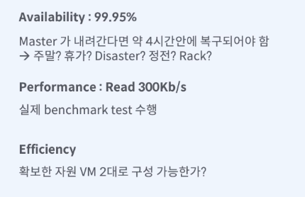

## Redis란?
- 정의: Remote Dictionary Storage의 약자로, 이름 그대로 원격 위치에 데이터를 저장하는 메모리 기반의 데이터 저장소다. 실시간으로 데이터를 처리해야 하는 다양한 애플리케이션에서 주로 사용된다.
- 특징:
  - 메모리 기반: 데이터를 메모리에 저장하여 높은 속도로 데이터 처리 및 접근이 가능하다. 이는 데이터베이스, 캐시, 메시지 브로커 등 다양한 형태로의 활용을 가능하게 한다. 하지만, 메모리는 휘발성이기 때문에 전원이 꺼지면 저장된 데이터는 없어진다.
  - 싱글 스레드: 마술처럼 느껴질 수 있는 Redis의 빠른 처리 속도는 싱글 스레드 아키텍처에서 비롯된다. 이는 복잡한 동시성 처리나 락(lock) 없이 단순하고 신속한 데이터 처리를 가능하게 한다. 하지만, 멀티 코어 서버의 경우 하나의 CPU 코어만 사용한다는 의미이기도 하다.
  - 처리량: 초당 5만에서 25만 요청을 처리할 수 있다는 점은 Redis의 처리 능력이 얼마나 뛰어난지를 잘 보여준다.
  - 데이터 저장 형태: Key-Value 형식으로 간단하면서도 직관적인 데이터 관리를 가능하게 한다. 이는 개발자들이 효과적으로 데이터를 저장하고 관리할 수 있는 구조를 제공한다.
- 장점
  - 빠른 Read/Write 속도: 메모리 기반의 특성으로 인해 전통적인 디스크 기반 데이터베이스보다 읽기와 쓰기 속도가 월등히 빠르다.
  - 다양한 아키텍처 지원: Stand Alone부터 시작해 Master-Slave, Sentinel, Cluster 등 다양한 구성으로 확장성과 높은 가용성을 제공한다.
  - 파티셔닝: 더 큰 데이터 세트를 여러 서버에 분산하여 저장함으로써, 단일 서버의 메모리 한계를 극복하고, 처리량을 증가시킬 수 있다.
  - 인기: 대규모 배포가 용이하고, 다양한 프로그래밍 언어로 작성된 클라이언트 라이브러리 지원으로 인해 널리 사용된다.
- 단점
  - 휘발성 문제: 다만, 휘발성을 보완하기 위해 AOF와 RDB 스냅샷 같은 지속성 옵션을 제공하기도 한다. 이를 통해 데이터의 영속성을 확보할 수 있다.
  - 단일 스레드 구조: 멀티 코어 서버의 모든 코어를 활용하지 못하는 한계가 있다.
  - 메모리 단편화: 시간이 지나면서 메모리가 조각화되어 관리가 필요하다. 메모리를 효율적으로 관리하지 않으면, 시스템의 성능에 영향을 미칠 수 있다.
  - 대용량 데이터 처리 부적합: 데이터의 양이 많아질수록 메모리와 디스크 간의 동기화에 시간이 오래 걸리고, 이로 인해 지연 시간이 발생하면서 전체 성능에 영향을 미칠 수 있다.

> Redis는 고성능, 고확장성, 고가용성을 제공하는 다목적 데이터 저장소이다. 하지만, 그 사용법과 환경에 따른 한계는 명확히 인지하고, 용도에 맞게 적절히 활용해야 한다.

## 목적 : Cashing

> 자주 (사용되고, 반복되고) 빠르게 응답해야 되는것들 을 미리 준비해 두는것.

## 일반적 사용 : Session Store, List Data Caching
- List 형태의 데이터의 경우 일반 SQL 서버보다 약 10 배 이상의 성능을 낸다고 알려져있다.

## Redis 구조
Redis 는 크게 4가지의 구조로 볼 수 있다.

- Stand Alone 모드
  - 정의: Redis 서버 단 하나만 사용하는 기본적인 설정.
  - 특징: 간단하게 설정 가능하며, 개인 프로젝트나 작은 규모의 서비스에 아주 적합.
- Master-Replica 구성
  - 정의: 하나의 마스터와 하나 이상의 복제(레플리카) 노드로 구성.
  - 동작 방식: 마스터에서 데이터 변경 시, 레플리카는 마스터와 데이터 차이를 확인 후 동일하게 복사함.
  - 고급 설정:
    - 앞단에 로드 밸런서 배치 및 하트비트 감시를 통해 마스터 장애 발생 시, 스크립트를 실행하여 레플리카를 임의로 마스터로 승격시킬 수 있음. 이 과정이 자동화된 것이 Sentinel.
- Sentinel 시스템
  - 정의: Redis의 모니터링 및 자동 장애 복구 시스템.
  - 기능:
    - 마스터가 실패할 경우, 자동으로 레플리카 중 하나를 새 마스터로 승격시킴.
    - 원래의 마스터가 복구되면, 이전 마스터 역할을 하던 노드는 레플리카로 전환됨.
    - 배치 권장 사항: 마스터와 레플리카를 서로 다른 존(예: 데이터센터)에 배치하는 것이 좋음.
- Cluster 모드
  - 정의: 복수의 마스터와 복수의 레플리카가 있는 복잡한 구성.
  - 필요 조건: 최소 3대의 노드가 필요하고, 각각의 레플리카가 붙는 형태.
  - 특징:
    - Sentinel을 따로 두지 않아도, 장애 상황 시 자동으로 상호 보완하는 메커니즘을 갖춤.
    - 데이터 샤딩을 통해 성능면에서 개선됨. 임의로 데이터를 나눔으로써, 데이터를 여러 마스터에 분산 저장하여 처리 속도 및 확장성을 높임.

> 각 구성 및 모드는 프로젝트의 요구사항과 시스템의 규모에 따라 선택할 수 있으며, Redis의 다양한 사용 방법을 통해 서비스의 안정성, 가용성 및 성능을 향상시킬 수 있다.

## 어떤 Redis 구조가 적절한가
- 사전에 정의한 품질 요건에 따라 다르다.

---
## 실습
