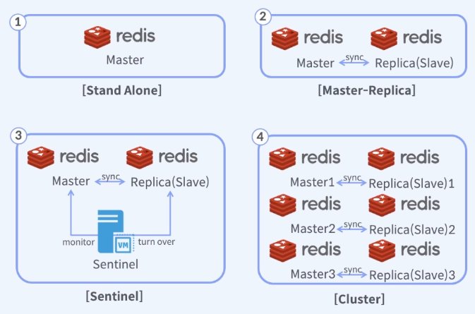
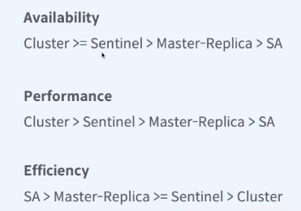

## Redis 구조
Redis 는 크게 4가지의 구조로 볼 수 있다.

- Stand Alone (레디스 한대만 가지고 사용)
- Master-Replica (Master 와 read 용 Replica 를 두는 경우)
  - Master 에서 데이터가 변경이 되면 Replica 가 Master 와 데이터 차이를 확인후 똑같이 복사한다.
  - 구성하는것에 따라 Sentinel 과 비슷할 수 도 있다.
    - 앞단에 벨런서가 있다고 치고, heart Beat 을 감시해서 master 가 죽으면 스크립트를 실행해서 임의로 Replica 를 master 로 승격 시킬 수 있다.
      - 이게 자동화 된게 sentinel 이다.
- Sentinel
  - 모니터링 툴이다.
    - Master 가 죽으면 Replica 를 Master 로 승격시킨다.
    - Master 를 ( 사람이 ) 복구 하면 기존 Master 역할 하던 친구는 Replica 가 된다.
    - 보통 Master 와 Replica 는 서로 다른 존에 두는것이 좋다. ( 재난, 화재 등 ..) 
- Cluster
  - 복수개의 Master 와 복수개의 Replica 가 있는 형태이다.
  - 기존 3 대 가 있어야 하고, Replica 가 따로 붙는 형태.
  - sentinel 이라는것을 따로 두지 않아도 장애상황시 자동으로 상호 보완 한다.
  - 샤딩한다.
    - 임의로 데이터를 나눈다.
    - 성능면으로 좀더 좋다

## 어떤 Redis 구조가 적절한가
- 사전에 정의한 품질 요건에 따라 다르다.

