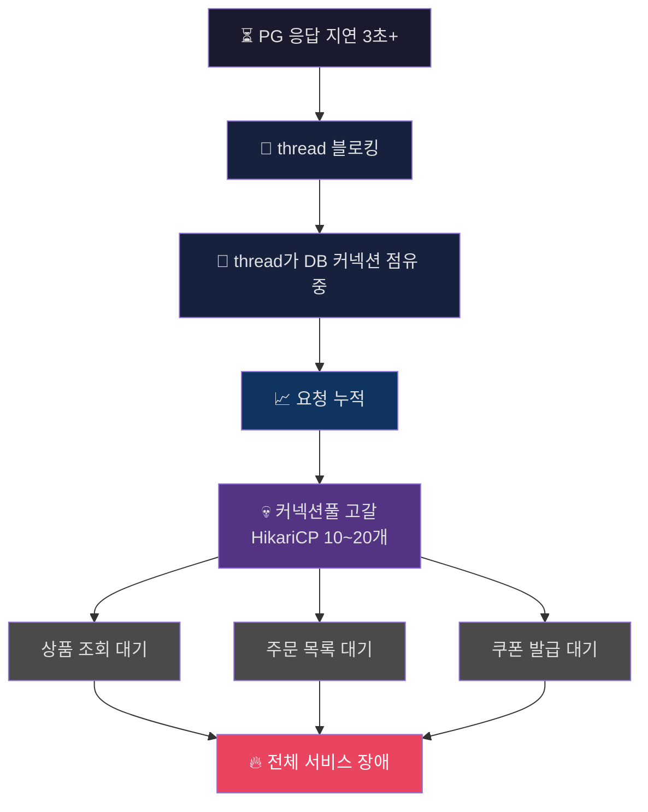
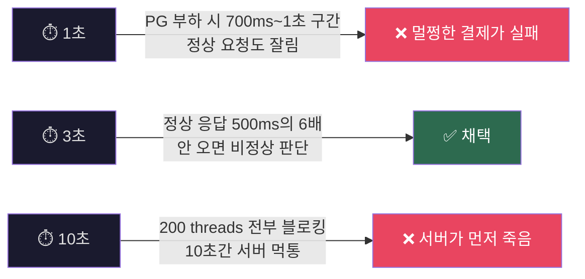
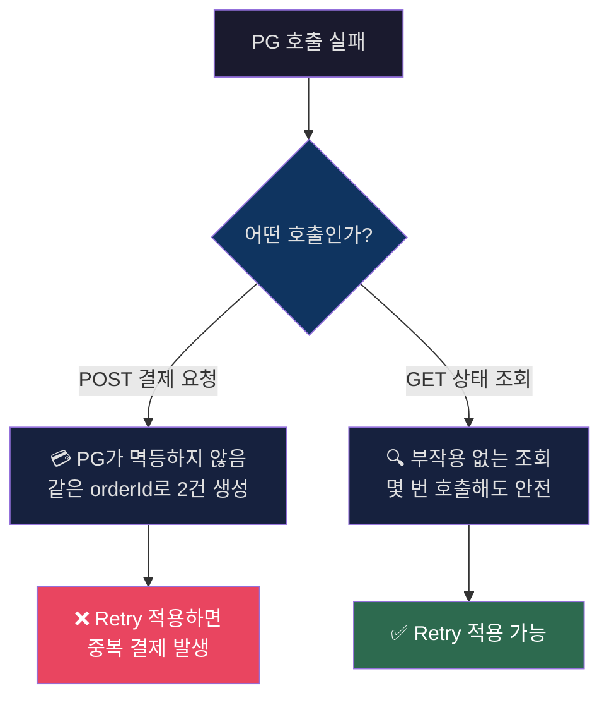
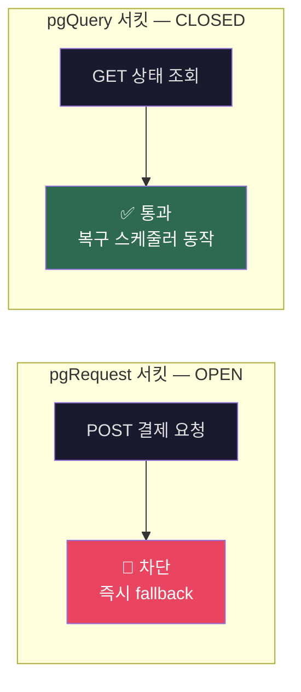
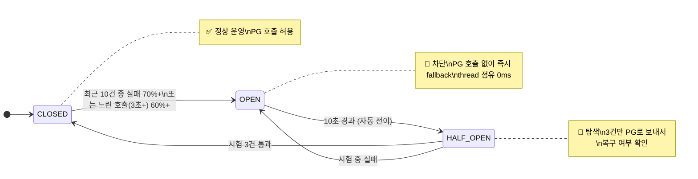
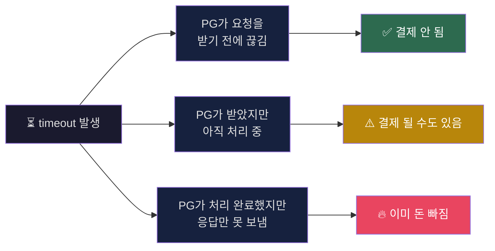
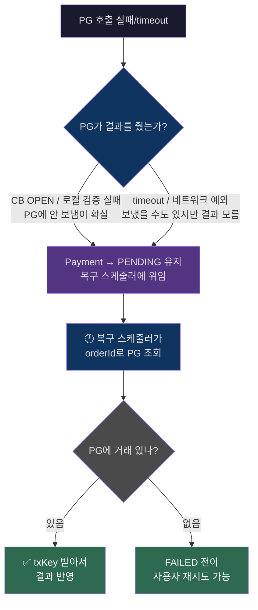
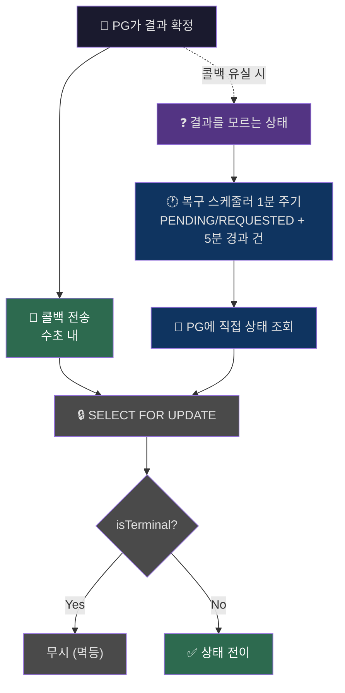
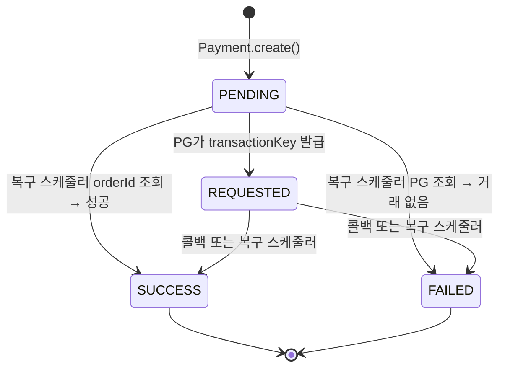

> **TL;DR**
>
> PG 연동 과정에서 외부 시스템이 느려졌을 때, 우리 서비스까지 같이 죽지 않으려면 어떻게 해야 하는지를 다룹니다.
>
> Timeout, Retry, Circuit Breaker를 어떤 기준으로 설정했는지.  
> 그리고 응답을 못 받은 결제 건을 어떻게 복구하는지를 다룹니다.

---

## PG가 느려지면 왜 서비스 전체가 멈출까?

외부 시스템이 느려지는 상황에서 부터 시작합니다.

PG 응답이 3초씩 밀리기 시작하면, 요청을 처리하던 thread는 그 응답을 기다리는 동안 반환되지 않습니다.  
HTTP 호출은 기본적으로 동기 블로킹 방식이라,    
응답이 올 때까지 thread가 계속 점유된 상태로 남아있게 됩니다.

이 상태에서 DB 조회나 업데이트를 먼저 수행했다면,   
해당 thread는 DB 커넥션을 잡은 상태로 외부 응답을 기다리게 됩니다.

thread와 DB 커넥션이 같이 묶입니다.
이게 몇 건 쌓이기 시작하면 상황이 달라집니다.

HikariCP 같은 커넥션 풀은 보통 10~20개 수준인데,   
외부 응답을 기다리는 요청이 이걸 점유하고 있으면 새로운 요청은 DB 커넥션을 얻지 못하고 대기하게 됩니다.

> *여기서부터, 결제와 상관없는 API까지 영향을 받습니다.*



실패는 빨리 끝납니다.  
thread도 커넥션도 바로 반환됩니다.  

지연은 끝나지 않고, thread와 커넥션을 쥔 채로 남아있습니다.  
그게 쌓이고, 결국 퍼지게 됩니다.

실패가 아니라 지연 때문에 발생한 문제였습니다.

그런데 여기에 더 위험한 시나리오는, PG가 결제를 성공시켰는데,   
응답이 돌아오는 도중에 timeout으로 잘린 경우입니다.  

PG 쪽에서는 카드사 승인이 완료되어 사용자 돈이 빠진 상태인데,   
우리 시스템은 응답을 못 받았으니 "실패"로 알고 있습니다.

그야말로, 결제는 되었는데 유저 입장에서는 서비스를 이용할 수가 없는 상황이 되는 거죠.

*그래서 질문을 바꿨습니다.*    

"어떻게 처리할 것인가"가 아니라 **"얼마나 빨리 포기하고, 모르는 상태를 어떻게 다룰 것인가"** 로요.  

> 결정해야 했던 건, PG 응답을 얼마나 기다릴 것인가? 였습니다.

---

## 그러면 얼마나 빨리 끊어야 할까요?

```yaml
payment.pg:
  connect-timeout: 1000   # TCP 연결 수립까지 허용하는 시간
  read-timeout: 3000      # PG 응답을 기다리는 최대 시간
```

PG 정상 응답이 100~500ms인 상황에서, read-timeout을 어디에 놓을지가 첫 번째 판단이었습니다.



1초는 정상 요청도 잘라내고, 10초는 서버가 먼저 죽게됩니다.

3초를 타협의 기준으로 잡았습니다.

사실 정확도의 문제가 아니라, **어디까지 같이 죽을 것인가**를 정해야 했어요.

> **포기한 것**: PG가 2.8초에 승인을 완료했지만 응답이 3.1초에 도착하는 경우, 이 응답은 버려집니다.
> 유저 입장에서는 결제가 됐는데 주문이 안 잡히는 상황이 생길 수 있습니다.

그런데 3초 만에 끊었다고 해서 바로 실패로 확정하기엔 아쉬웠습니다.
네트워크가 순간적으로 흔들린 거라면, 한 번 더 시도하면 성공할 수도 있기 때문이에요.

> 그래서 재시도를 고민했습니다.

---

## 끊었는데, 다시 시도해야 할까?

처음에는 결제 요청(POST)에도 Retry를 걸었습니다.  
네트워크가 순간적으로 흔들린 거라면, 한 번 더 보내면 성공할 수도 있으니까요.   

그런데 PG 시뮬레이터에 같은 orderId로 요청을 두 번 보내보니, **별도 결제건이 2건 생겼습니다.**  

> PG가 멱등하지 않은 겁니다.



그래서 **결제 요청(POST)에서는 Retry를 제거**하고, **조회(GET)에만 적용**했습니다.

```yaml
resilience4j.retry.instances.pgQueryRetry:   # 조회 전용
  max-attempts: 2
  wait-duration: 1s
  retry-exceptions:
    - org.springframework.web.client.ResourceAccessException
    - java.io.IOException
```

결제 요청이 실패하면 재시도 대신 PENDING 상태를 유지하고, 복구 스케줄러가 PG에 확인하는 방식으로 대응합니다.

> **포기한 것**: 네트워크가 순간적으로 끊겨서 1초 뒤에 재시도하면 성공했을 결제도,
> 재시도 없이 PENDING으로 남습니다. 대신 중복 결제는 발생하지 않습니다.

> 그러면 결제 요청이 계속 실패하는 상황에서, 다음 요청도 PG에 보내는 게 맞을까요?

---

## 계속 실패하는데, 계속 보내야 할까?

여기서 한 가지 더 고려할 게 있었습니다.

결제 서킷이 열리면 PG 호출이 차단되는데,   
**복구 스케줄러가 PG에 상태를 조회하는 것까지 막히면 안 됩니다.**  
결제가 안 되는 건 괜찮지만,   

이미 접수된 결제의 결과를 확인하지 못하면 PENDING/REQUESTED 상태가 영원히 남게 됩니다.

그래서 서킷브레이커를 **결제(pgRequest)와 조회(pgQuery)로 분리**했습니다.

```yaml
resilience4j.circuitbreaker.instances:
  pgRequest:                              # 결제 요청 전용
    sliding-window-size: 10
    minimum-number-of-calls: 10           # 이게 없으면 기본값 100 → 100건 전에는 실패율 계산 안 됨
    failure-rate-threshold: 70
    wait-duration-in-open-state: 10s
    permitted-number-of-calls-in-half-open-state: 3
    slow-call-duration-threshold: 3s
    slow-call-rate-threshold: 60
    automatic-transition-from-open-to-half-open-enabled: true
  pgQuery:                                # 조회 전용
    sliding-window-size: 10
    minimum-number-of-calls: 10
    failure-rate-threshold: 70
    wait-duration-in-open-state: 30s      # 조회는 관대하게
    permitted-number-of-calls-in-half-open-state: 3
    slow-call-duration-threshold: 3s
    slow-call-rate-threshold: 60
    automatic-transition-from-open-to-half-open-enabled: true
```



서킷을 하나로 묶으면 결제 실패가 조회까지 차단하고, 복구 자체가 불가능해지는 구조였습니다.



| 설정 | 값 | 왜 이 값인가 |
|------|-----|-------------|
| sliding-window | 10 | 100으로 잡으면 50건 터지는 동안 계속 보내게 됩니다 |
| minimum-number-of-calls | 10 | 기본값은 100. 이걸 안 내리면 100건 전에는 실패율 계산 자체가 안 됩니다 |
| failure-rate-threshold | 70% | PG 기본 실패율 40%에서 30%p 여유. 50%면 정상 운영 중에도 서킷이 열립니다 |
| slow-call-threshold | 3초 / 60% | read-timeout과 같은 기준입니다. 2.9초짜리가 반복되면 곧 timeout 납니다 |
| pgRequest wait-duration | 10초 | 결제는 빠르게 복구 시도해야 합니다 |
| pgQuery wait-duration | 30초 | 조회는 관대하게. 복구 스케줄러가 계속 시도할 수 있도록 |
| automatic-transition | true | 트래픽 없는 시간대에도 HALF_OPEN 전이가 되도록 |

> **포기한 것**: CB OPEN 10초 동안 들어오는 모든 결제는, PG가 50%는 성공시키고 있었더라도 시도조차 하지 않고 실패합니다.

한 가지 더 있습니다.  
CircuitBreaker는 "언제 차단할지"를 결정하지만,  
CLOSED 상태에서 "동시에 몇 건까지 보낼지"는 제한하지 않습니다.

PG가 3초씩 느려지기 시작하면,   
서킷이 열리기 전까지 많은 요청이 한꺼번에 PG로 향할 수 있습니다.

이걸 막으려면 Bulkhead를 앞에 두어 동시 PG 호출 수를 제한해야 합니다.  
이번에는 적용하지 않았지만, PG사가 동시 연결 제한을 걸고 있다면 필수입니다.

> **포기한 것**: Bulkhead 없이는 서킷이 열리기 전까지 동시 PG 호출 수에 제한이 없습니다. PG가 느려지는 초기 구간에서 thread가 한꺼번에 묶일 수 있습니다.

timeout, retry, circuit breaker, bulkhead까지.  
"언제 끊을지, 뭘 재시도할지, 언제 안 보낼지"는 정해졌습니다.

그런데, 아직 하나 찜찜한 부분이 남았습니다.  

> timeout이 났을 때, 이걸 "실패"로 봐도 되는 것인지.

---

## timeout이 났는데, 이걸 실패로 봐도 될까요?

timeout이 발생했을 때, 실제 결과는 세 가지 중 하나입니다.



우리 쪽에서는 이 셋을 구분할 방법이 없습니다. 아는 건 하나뿐입니다. 

> **"모른다..."**

이 "모름"을 FAILED로 확정하면, 세 번째 경우가 문제가 됩니다.

PG는 카드사 승인을 완료하고 돈을 빼간 상태인데, 우리는 "실패"라고 확정한 겁니다.
PG에서 뒤늦게 콜백이 와도 Payment가 이미 FAILED(최종 상태)이므로 무시됩니다.
유저는 돈이 빠졌는데 "결제 실패"를 보게 됩니다.

그래서 이 서비스에서는 fallback이든 예외든, **결과를 모르면 PENDING을 유지**하도록 했습니다.



이 서비스에서는 PG에 보냈는지 안 보냈는지 확실하지 않으면 PENDING을 유지합니다.
복구 스케줄러가 orderId로 PG에 직접 물어보고, 거래가 있으면 반영하고, 없으면 그때 FAILED로 전이시킵니다.
결과가 확정되기까지 최대 5분이 걸리지만, 유령 결제는 안 생깁니다.

> PG에 보내는 orderId는 주문 ID 그대로가 아니라 `{날짜}_{주문ID}_{결제ID}` 조합키로 만들었습니다.
> 예를 들면 `20260320_000001_42` 같은 형태입니다.
>
> 같은 주문에 대해 재결제를 하더라도 결제ID가 다르기 때문에 PG에 고유한 키로 들어가고,
> 복구 조회 시에도 정확히 해당 결제 시도 1건만 매칭됩니다.  

결과를 모르면 PENDING으로 남기고, 복구 스케줄러가 나중에 확인하는 구조입니다.
이게 가능하려면 PG 호출이 트랜잭션 밖에 있어야 합니다.

> 이 시점이, 트랜잭션을 쪼개야 하는 타이밍 이였습니다.

---

## 그런데 왜 트랜잭션을 쪼갰을까요?

앞에서 PG 지연이 thread를 묶고, thread가 DB 커넥션을 묶는 문제를 이야기했습니다.

해당 문제를 끊으려면 PG 호출 시점에 DB 커넥션을 잡고 있지 않아야 합니다.

`@Transactional` 범위 안에서 DB 접근이 먼저 발생하면,    
이후 PG 응답을 기다리는 동안 JDBC 커넥션이 트랜잭션 종료 시점까지 점유될 수 있습니다.  

그래서 트랜잭션을 세 조각으로 쪼개는 방식을 택했습니다.

```mermaid
sequenceDiagram
    participant UC as RequestPaymentUseCase<br/>(트랜잭션 없음)
    participant TxSvc as PaymentTransaction<br/>Service
    participant DB as MySQL
    participant PG as PG 시뮬레이터

    rect rgb(40, 60, 90)
        Note over TxSvc,DB: 🟦 트랜잭션 #1 — ~10ms
        UC->>TxSvc: createPendingPayment()
        TxSvc->>DB: 주문 검증 + Payment INSERT(PENDING)
        TxSvc-->>UC: {paymentId, amount}
        Note over DB: ✅ 커밋. 커넥션 반환.
    end

    rect rgb(90, 50, 30)
        Note over UC,PG: 🟧 트랜잭션 밖 — 최대 3초 (Retry 없음)
        UC->>PG: requestPayment()
        PG-->>UC: {transactionKey} 또는 실패
        Note over UC: DB 커넥션 점유 없음
    end

    rect rgb(30, 70, 50)
        Note over TxSvc,DB: 🟩 트랜잭션 #2 — ~10ms
        UC->>TxSvc: markRequested() 또는 markFailed()
        TxSvc->>DB: UPDATE payment
        Note over DB: ✅ 커밋. 커넥션 반환.
    end
```



| 어떻게 묶느냐 | DB 커넥션 점유 시간 | 리스크 |
|--------------|-------------------|--------|
| 하나의 트랜잭션 | 최대 3초+ | 10건이면 커넥션풀이 바닥나고 전체 장애 |
| 쪼갠 트랜잭션 | ~20ms | 트랜잭션 #1 커밋 후 서버 죽으면 PENDING 고착 |

커넥션풀 고갈은 **전체 서비스 장애**이고, PENDING 고착은 **해당 주문 1건의 문제**입니다.   
둘 중 어떤 리스크를 안을지는 선택의 여지가 없었습니다.

트랜잭션을 쪼갰으니 Payment가 PENDING이나 REQUESTED로 한동안 남을 수 있습니다.
이걸 언제 최종 확정하느냐가 다음 문제입니다.

> PG가 콜백을 보내주면 좋겠지만, 콜백이 안 오면 어떻게 되나 ?

---

## 콜백이 안 오면 어떻게 될까 ?

PG는 비동기로 결제를 처리한 뒤 콜백으로 결과를 보내주는데,    
콜백은 안 올 수도 있습니다.  

네트워크 장애, 서버 다운, PG 버그 등 이유는 다양합니다.

콜백에 100% 의존하면 결과를 영원히 모르는 건이 생기기 때문에,  
콜백은 "빠른 경로"로만 보고 **복구 스케줄러를 안전망으로 두었습니다.**



5분이라는 기준은 PG 비동기 처리 최대 5초에 콜백 지연까지 감안하여 설정하였어요.     
1분이면 PG가 아직 처리 중인 건을 조회하게 되고,     
10분이면 사용자가 너무 오래 기다리게 되기 때문에.

콜백 중복이나 콜백과 스케줄러가 동시에 같은 건을 처리하려는 경우를 방어하기 위해 `SELECT FOR UPDATE` + `isTerminal()` 체크를 두었습니다.  
먼저 도착한 쪽이 처리하고, 나중 쪽은 무시하는 방식입니다.

> **포기한 것**: REQUESTED 상태가 최대 5분간 지속됩니다.
> 유저 입장에서는 "결제 버튼 눌렀는데 아무 반응이 없는" 상태가 5분간 이어질 수 있습니다.

여기까지의 판단들이 결국 Payment의 상태 설계로 모이게 됩니다.

---

## Payment 상태 설계



| 상태 | 의미 | Order 영향 |
|------|------|-----------|
| `PENDING` | PG에 보냈는지조차 모릅니다 | 없음 |
| `REQUESTED` | PG가 접수했습니다. 결과는 모릅니다 | 없음 |
| `SUCCESS` | 결제 확정 | **Order → COMPLETED** |
| `FAILED` | 해당 결제 시도는 종료. 같은 주문에 새 결제 생성은 가능 | 없음 (Order는 PENDING 유지) |

SUCCESS일 때만 Order가 COMPLETED.  
FAILED여도 Order는 PENDING 유지. 다른 카드로 다시 시도할 수 있게.

---

## 트레이드오프 전체 정리 !

| 결정 | 얻은 것 | 포기한 것 |
|------|---------|----------|
| read-timeout 3초 | thread 점유 최소화 | 3초 이후 도착한 PG 성공 응답은 버림 |
| 결제 POST에 Retry 미적용 | 중복 결제 방지 | 네트워크 순단 시 재시도 없이 PENDING 유지 |
| 조회 GET에만 Retry (max-attempts 2 = 재시도 1회) | 복구 스케줄러 안정성 확보 | PG 500이 순간 부하여도 재시도 안 함 |
| 서킷 인스턴스 분리 (pgRequest/pgQuery) | 결제 서킷 열려도 복구 조회 가능 | 인스턴스 2개 관리 비용 |
| CB threshold 70% (PG 실패율 40% + 30%p 여유) | 정상 운영 시 서킷 미작동 보장 | 실패율 70% 넘어야 차단 — 감지가 50%보다 늦음 |
| fallback 시 PENDING 유지 + orderId 복구 | PG 성공 건 유실 방지 | 최대 5분간 결과 미확정 |
| 트랜잭션 분리 | DB 커넥션풀 보호 | PENDING 고착 가능성 |
| 복구 스케줄러 5분 | 콜백 유실 보상 | 최대 5분간 결과 미확정 |

---

## 결론

PG가 느려지면 thread가 묶이고, thread가 DB 커넥션을 쥔 채로 남아있기 때문에 결제와 상관없는 API까지 같이 죽습니다.

그래서 3초에 끊고, 결제 POST는 PG가 멱등하지 않아 재시도하지 않았고, 실패가 쌓이면 서킷을 열어 아예 안 보내도록 했습니다.

결과를 모르는 경우에는 PENDING으로 놔두고 복구 스케줄러가 나중에 PG에 직접 확인하는 방식을 택했습니다.  

트랜잭션을 쪼개서 PG 호출 동안 커넥션을 잡지 않도록 했고,   
서킷도 결제와 조회로 나눠서 결제가 터져도 복구 조회는 살아있도록 했습니다.  

하지만...완벽하진 않습니다.  

5분간 결과를 모르는 구간이 생기고, PG가 절반은 성공시키고 있어도 서킷이 열리면 전부 막히게 됩니다.  

PG 하나 때문에 서비스 전체가 죽는 것보다는 낫지만, 5분이라는 미확정 구간은 프론트에서 polling이나 push로 풀어야 하는 영역이라 서버만으로는 줄이기 어렵습니다.

Bulkhead 도입, 결제 취소 API 연동, PENDING 체류 시간 단축은 다음 과제로 남겨뒀습니다.
