**TL;DR**

이번 전환에서 중요하지 않았던 건 폴더 이름과 레이어 개수였다. 무엇이 무엇에 결합돼 있는지였다.

구조를 나누는 근거로 개수를 쓰면 매번 임계값을 정해야 한다. 슬라이스 여덟 개 중 몇 개에 `index.ts`를 둘지, 상태 하나에 store를 몇 개 쓸지, status 몇 번대를 경계로 올릴지.

이 구조에서는 판단 기준이 하나다. 그 둘이 서로를 알아야 하는가.

전환 전에는 `shopping.ts` 하나가 장바구니와 위시리스트의 상태와 action과 reset 경계를 함께 들고 있었다. 조회 실패는 화면마다 인라인으로 처리했고 route 단위 오류 경계는 없었다. 이 작업은 폴더를 FSD 모양으로 옮기는 것이 아니라, 어떤 코드가 서로를 알아야 하는지 다시 정하는 작업이었다.

결정을 한꺼번에 내리지 않았다. 장바구니와 위시리스트의 경계를 먼저 정했다. 그 경계가 정해지자 토글 UI를 어느 레이어에 둘지와 상품 카드에 행위를 어디서 붙일지가 따라 나왔다. 조회 계약의 소유자가 정해진 뒤에야 Public API 범위를 정했다. 구조 이동을 마친 뒤에는 실패가 멈출 화면을 코드에 배치했다. 옮기는 순서도 같은 이유로 아래에서 위였다. `shared`가 먼저 자리를 잡아야 위 레이어가 이동하면서 그것을 참조할 수 있다. 반대로 하면 상위가 아직 옮기지 않은 하위를 임시 경로로 참조하는 구간이 생긴다. 레이어 개수는 계획이 아니라 이 결정들이 남긴 결과였다.

아래 셋은 그중 첫 번째 결정과 마지막 두 결정이다.

## 하나의 store에 모으려다 화살표가 거꾸로 섰다

처음에는 store 하나가 더 싸 보였다. 장바구니와 위시리스트를 함께 비우는 reset이 한 곳에 있고, 나누면 그 조율 비용이 생긴다. 그래서 모델만 나누고 store는 하나로 두는 안을 골랐다. 여기서 capability는 둘처럼 독립적으로 변경되는 기능 단위다. 모델과 store를 모두 나누는 안은 `runtime을 분리해야 할 근거가 없다`고 적고 반려했다.

그때는 각 조각이 어느 레이어에 앉을지 아직 정하지 않았다. 목표 트리를 그리자 보였다.

공통 runtime 조립부는 두 모델을 하나의 store 인스턴스로 묶고 selector를 만든다. 두 capability를 함께 import하므로 조립부는 `entities`보다 위 레이어에 있어야 한다. 그런데 토글 UI는 `entities/cart/ui`에 뒀다. 그 UI는 `useIsInCart` 같은 selector를 쓴다. selector가 상위 조립부에 있으니 `entities`가 위 레이어를 import하게 된다.



빠져나갈 길을 셋 검토했다.

| 방법 | 결과 |
| --- | --- |
| store 인스턴스를 `shared`에 둔다 | 합쳐진 store 타입이 두 capability 상태를 알아야 해서 `shared` → `entities` 의존이 생긴다 |
| 조립부가 store를 props로 내려준다 | 조합부부터 leaf까지 store를 들고 내려가야 한다 |
| 토글 UI를 조립부와 같은 레이어로 올린다 | 정책이 없는 UI를 위해 레이어를 여는 것과 같아진다 |

셋 다 원래 결정 하나를 깨거나 더 큰 결합을 만든다. 모델과 store를 모두 나누는 쪽으로 바꿨다.

바꾼 근거는 반려 사유가 약해졌다는 것이다. 비교 대상이 `복잡도 증가 대 0`에서 `복잡도 증가 대 역방향 의존`으로 달라졌다. 실제로 치른 비용은 reset 헬퍼 한 줄이었다.

하나의 store에 슬라이스를 모으는 건 Zustand의 관례이지 도메인의 요구가 아니다. 두 capability를 독립으로 정해 놓고 그 경계를 지키려고 라이브러리 관례를 우회하는 factory를 만들었다. 그 우회가 레이어 규칙까지 건드리고 있었다. 관례를 지키려고 설계를 비틀고 있다는 신호다.

위시리스트를 지울 때 손댈 곳이 셋에서 둘로 줄었다. 공통 조립부가 없어졌기 때문이다.

> **포기한 것**: 하나의 store가 주는 reset 일관성. 두 capability가 항상 함께 비워져야 하는 정책이 생기면 통합을 다시 본다. 지금은 그런 정책이 없다.

## 같은 5xx가 화면에 따라 다른 범위를 가져야 했다

과제 예시는 `5xx는 경계로, 4xx는 화면 안에서`를 든다. 이 선을 따르지 않았다.

status로 정하면 상품 목록에서 5xx가 났을 때 검색 폼과 카테고리와 정렬까지 사라진다. 그런데 사용자는 조건을 바꿔 다른 결과로 갈 수 있었다. 반대로 홈에서는 4xx여도 그릴 것이 없어 `main` 전체가 죽는 편이 맞다.

status는 재시도가 의미 있는지를 정한다. 화면을 지워야 하는지를 정하지 않는다.

대신 화면이 그 응답에 강결합인지를 물었다. 응답 없이 사용자가 할 수 있는 일이 남아 있으면, 그 일을 없애는 실패 처리는 인과가 맞지 않는다.

| 실패 | 죽는 범위 | 사는 것 |
| --- | --- | --- |
| 목록 API 장애 | 결과 영역만 | 필터, 페이지네이션, Header, 장바구니 상태 |
| 홈 API 장애 | `main` | Header. `layout`에 있어 다른 화면으로 나갈 수 있다 |
| 렌더링 오류 | 루트 `error.tsx` | Header |

### 그런데 재시도 판정이 반대로 열려 있었다

여기까지 정하고 넘어갔다. 그런데 외부 리뷰에서 `isRetryable`이 `ApiError`가 아닌 모든 실패를 재시도 가능으로 본다는 지적을 받았다. 확인해 보니 사실이었다.

200 응답이 계약을 어겨 파싱이 깨지면 `SyntaxError`가 난다. 이게 네트워크 단절과 같은 취급을 받아 결과 영역에 다시 시도 버튼이 붙는다. 다시 받아도 같은 본문이라 눌러도 같은 실패다.

5주차에 없앤 죽은 버튼이 다른 경로로 되살아나 있었다.

전파 기준을 다시 잡았다. status가 아니라 전송 계층이 설명할 수 있는 실패인가다.

```ts
export const isExpectedFailure = (error: unknown) =>
  error instanceof ApiError || error instanceof NetworkError || isTimeout(error)

// 다시 보내면 달라질 수 있는 것은 서버 오류, 타임아웃, 네트워크 단절뿐이다.
export const isRetryable = (error: unknown) => {
  if (error instanceof ApiError) return error.status >= 500
  return isTimeout(error) || error instanceof NetworkError
}
```

두 함수가 서로 다른 질문에 답한다. 하나는 화면이 이 실패를 설명할 수 있는가, 다른 하나는 다시 보내면 결과가 달라지는가다. 전역 기본값에서 각각 다른 곳에 쓰인다.

```ts
queries: {
  retry: (failureCount, error) =>
    isRetryable(error) && failureCount < MAX_QUERY_RETRIES,
  throwOnError: (error) => !isExpectedFailure(error),
}
```

원래 분류는 실패를 조회와 렌더 둘로만 나눴다. 조회 중에 예상 밖 오류가 난다는 경우가 분류에 없었다. `error.tsx`는 그전까지 평소에 비어 있는 경계였다. 이제 실제로 도달 가능한 경계가 됐다.

> **포기한 것**: 실패 UI 공통 컴포넌트. 두 화면이 같은 모양을 반복하면 묶을 후보인데, 출구가 서로 다르다. 목록은 조건 초기화이고 홈은 다른 화면 링크다. 모양이 달라서 묶을 것이 문구뿐이다.

## `index.ts`를 몇 개 만들지 정하려 했다

슬라이스가 여덟 개다. Public API는 슬라이스 밖에서 접근을 허용한 진입점이고, deep import는 이 진입점을 거치지 않고 내부 파일을 직접 읽는 경로다. 몇 개에 Public API를 둘지 정해야 했다.

처음 기준은 숨길 대상의 개수였다. 여럿이고 여러 세그먼트에 걸쳐 있으면 파일을 만든다. 하나면 검증 항목으로 처리한다. 이 기준으로 `widgets/header`는 파일 없이 갔다. 감출 것이 `HeaderCounts` 하나이고 소비자도 `app/layout.tsx` 하나였기 때문이다.

외부 리뷰에서 반박을 받았다. 검증 항목은 사람이 지키는 규칙일 뿐 deep import를 기술적으로 막지 못한다. 그리고 임계값을 1과 2 사이에 두는 데는 근거가 없었다.

기준을 유무로 바꿨다.

```ts
// header 슬라이스가 외부에 공개하는 전부다.
// HeaderCounts는 내부 구현이다. 개수 배지만 클라이언트 컴포넌트로 두고 Header 자체는
// 서버 컴포넌트로 남기는 분리인데, 외부가 HeaderCounts를 직접 쓰면 그 의도가 깨진다.
export { default as Header } from './ui/Header'
```

`HeaderCounts`는 하나지만 그 하나가 서버 컴포넌트와 클라이언트 컴포넌트의 분리를 지탱한다. 개수로 보면 최솟값이고 결합으로 보면 경계다.

숨길 것이 없는 슬라이스에는 만들지 않았다. `entities` 셋과 `shared`가 그렇다. `entities/cart/model`은 store 인스턴스를 export하지 않고 selector 훅만 내보낸다. `index.ts` 없이도 성립하는 Public API다.

모든 슬라이스에 두는 안은 반려했다. 숨길 내부가 없는 다섯 개의 `index.ts`는 내부를 그대로 재수출하는 파일이 된다. 그게 정확히 barrel이다. 경계 의도가 없는 재수출은 이름 충돌과 순환 의존의 입구다.

나머지 슬라이스는 deep import가 가능한 상태로 남는다. 파일을 옮기면 소비자가 깨진다. 슬라이스가 작아서 옮길 일이 적다는 것에 기대고 있다. 이 기대가 틀리면 다시 본다.

## 세 번 다 개수로 정했다가 세 번 다 뒤집혔다

세 결정의 첫 판단에는 공통점이 있다.

| 결정 | 처음 근거 | 바꾼 근거 |
| --- | --- | --- |
| store를 몇 개 둘까 | 하나면 reset 조율 비용이 없다 | 조립부가 `entities` 위에 앉아야 해서 의존이 역방향이 된다 |
| 무엇을 경계로 올릴까 | 5xx는 경계, 4xx는 화면 안 | 같은 status가 화면에 따라 다른 범위를 가져야 한다 |
| `index.ts`를 몇 개 만들까 | 숨길 것이 여럿이면 파일, 하나면 검증 항목 | 하나라도 명확하면 경계는 성립한다 |

처음 근거는 전부 세기 쉬운 값이다. store 개수, status 번호, 숨길 대상 개수. 바꾼 근거는 전부 결합의 방향이다. 누가 누구를 import하는가, 화면이 응답 없이 살 수 있는가, 그 하나가 무엇을 지탱하는가.

장바구니와 위시리스트는 서로의 store를 모르게 됐고, 위시리스트를 삭제할 때 손댈 곳은 셋에서 둘로 줄었다. 목록 API가 실패해도 필터와 페이지네이션은 남아 사용자가 조건을 바꿔 빠져나올 수 있다. 숨길 내부가 있는 세 슬라이스에는 외부에 공개할 계약을 명시했고, 나머지 다섯은 열어 두었다.

세기 쉬운 값으로 정하면 임계값을 어디 둘지가 남는다. 그리고 임계값에는 대개 근거가 없다. 1과 2 사이에 선을 그은 이유를 적을 수 없었던 것이 그 예다.

## 아직 해결하지 않은 범위

경계를 기계가 아니라 사람이 지킨다. `index.ts`가 없는 다섯 슬라이스는 deep import를 막을 방법이 없다. 있는 셋도 규칙일 뿐이다. 의존 규칙을 도구로 강제하는 일은 이번 범위에 넣지 않았다.

`error.tsx`가 실제로 도달 가능해졌지만 route 경계라 단위 테스트로 재현하기 어렵다. 지금은 수동 검증으로 남아 있다.
