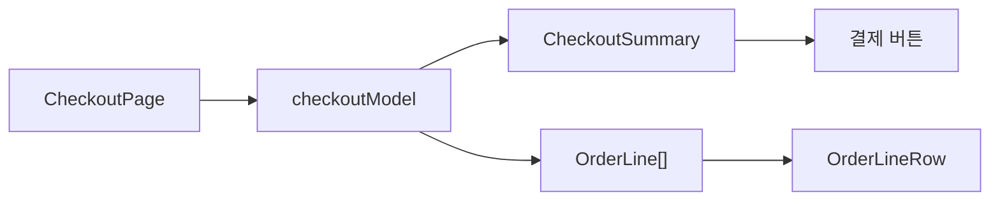

**TL;DR**

체크아웃 화면을 처음 봤을 때는 긴 컴포넌트가 문제처럼 보였습니다.
상품, 배송지, 쿠폰, 포인트, 결제 수단, 약관이 한 파일에 몰려 있었으니까요.

그런데 코드를 따라가 보니 더 불편한 지점이 있었습니다.
최종 결제 금액이 한 곳에서 결정되지 않았습니다.
화면 컴포넌트는 계산 규칙을 알고 있었습니다.
금액 한 줄을 그리는 컴포넌트도 상품과 배송비와 할인을 모두 구분하고 있었고요.

그래서 컴포넌트를 먼저 찢지 않았습니다.
먼저 돈의 의미를 나눴습니다.

## 처음엔 파일 길이가 문제처럼 보였습니다

체크아웃 화면은 원래 길어지기 쉽습니다.
상품 목록을 보여줘야 하고 배송지를 고르게 해야 하고 쿠폰과 포인트도 받아야 합니다.
마지막에는 약관 동의와 결제 버튼까지 들어갑니다.

처음에는 자연스럽게 이런 생각이 들었습니다.

> 이거 컴포넌트부터 나누면 되지 않을까?

그런데 바로 쪼개면 오히려 문제를 숨길 것 같았습니다.
긴 컴포넌트가 항상 나쁜 코드는 아닙니다.
문제는 길이가 아니라 서로 다른 이유로 바뀌는 코드가 한 덩어리 안에서 서로를 건드리는 상태였습니다.

배송비 정책이 바뀌어도 같은 파일을 봐야 했습니다.
쿠폰 정책이 바뀌어도 같은 파일을 봐야 했습니다.
포인트 차감 규칙이 바뀌어도 같은 파일을 봐야 했어요.

이쯤 되면 질문을 바꿔야 했습니다.

> *어떻게 잘게 나눌까가 아니라, 어떤 값이 어디서 결정되어야 할까?*

> **포기한 것**: 파일을 바로 작게 만드는 선택을 버렸습니다.
> 작은 파일 여러 개가 생겨도 금액 규칙이 흩어져 있으면 읽기 쉬워지지 않기 때문입니다.

## 금액은 어디서 한 번만 결정되어야 할까요?

체크아웃에서 가장 위험한 값은 최종 결제 금액입니다.
화면에 보이는 값과 버튼에 찍히는 값과 주문 완료 후 보이는 값이 다르면 끝입니다.
사용자는 UI 버그라고 느끼겠지만 실제로는 계약이 깨진 겁니다.

문제는 `finalPrice`가 화면 상태처럼 다뤄지고 있었다는 점이었습니다.
상품 합계, 배송비, 쿠폰, 포인트에서 다시 계산할 수 있는 값인데도 `useState` 초기값으로 묶여 있었습니다.
첫 렌더의 값은 맞을 수 있습니다.
그 뒤에 배송지나 쿠폰이 바뀌면 틀릴 수 있죠.

돌아가는 화면이라 더 위험했습니다.
처음 숫자가 맞으면 통과한 것처럼 보이니까요.

그래서 금액 계산을 화면 밖으로 빼냈습니다.
계산 함수는 화면을 모릅니다.
입력으로 장바구니, 배송지, 회원, 쿠폰, 포인트 사용 여부만 받습니다.
그리고 화면이 믿어도 되는 요약값을 돌려줍니다.

```ts
export type CheckoutSummary = {
  itemTotal: number
  shippingFee: number
  couponDiscount: number
  memberDiscount: number
  pointDiscount: number
  finalPrice: number
}
```

이 타입을 만든 뒤에야 화면 코드가 조금 덜 불안해졌습니다.
이제 결제 금액을 확인하려면 렌더링 컴포넌트가 아니라 계산 모델을 보면 됩니다.

```ts
const payableBeforePoint = Math.max(
  0,
  itemTotal + shippingFee - couponDiscount - memberDiscount,
)

const pointDiscount = usePoint
  ? Math.min(Math.max(0, pointInput), member.point, payableBeforePoint)
  : 0
```

여기서 일부러 하한도 걸었습니다.
쿠폰과 포인트가 과하게 들어와도 최종 결제 금액이 음수가 되면 안 됩니다.
UI에서 막을 수도 있습니다.
그래도 금액 모델이 한 번 더 닫아줘야 한다고 봤어요.

> **포기한 것**: 화면에서 바로 계산하는 편함을 버렸습니다.
> 대신 금액 규칙을 한 함수 안에 모았습니다.
> 같은 입력이면 같은 결과가 나와야 합니다.

## `OrderLineRow`는 왜 불편했을까요?

금액 모델을 보니 다음 문제는 `OrderLineRow`였습니다.
이름만 보면 주문 금액 한 줄을 그리는 컴포넌트였어요.
그런데 실제 역할은 더 컸습니다.

상품이면 썸네일과 옵션과 수량을 보여줘야 합니다.
배송비면 라벨과 금액만 있으면 됩니다.
쿠폰이면 쿠폰 코드가 붙습니다.
포인트와 회원 할인은 할인 금액처럼 보여야 하고요.

처음에는 `type` 하나로 처리하기 쉽습니다.

```tsx
<OrderLineRow
  type="coupon"
  label="쿠폰 할인"
  amount={couponDiscount}
  couponCode={coupon.code}
  isDiscount
/>
```

문제는 필요 없는 props도 같이 열려 있다는 점입니다.
상품 라인이 아닌데 `thumbnail`을 넘길 수 있습니다.
쿠폰 라인이 아닌데 `couponCode`를 넘길 수도 있습니다.
`isDiscount`를 빼먹는 순간도 생깁니다.
할인인데 빨간색도 마이너스 표시도 안 붙는 거죠.

타입이 막아주지 않는 실수는 결국 사람이 기억해야 합니다.
체크아웃 화면에서 그건 좋은 거래가 아니었습니다.

그래서 라인 자체를 먼저 나눴습니다.

```ts
export type ProductOrderLine = {
  kind: 'product'
  id: string
  label: string
  amount: number
  thumbnail: string
  option: string
  quantity: number
}

export type CouponDiscountOrderLine = {
  kind: 'coupon'
  label: string
  amount: number
  couponCode: string
}

export type PointDiscountOrderLine = {
  kind: 'point'
  label: string
  amount: number
}

export type OrderLine = ProductOrderLine | PaymentOrderLine
```

이렇게 바꾸면 컴포넌트가 받는 props가 줄어든다기보다 잘못된 조합이 줄어드는 쪽에 가깝습니다.
상품 라인은 상품에 필요한 값만 갖습니다.
쿠폰 라인도 마찬가지입니다.

컴포넌트는 이제 모든 optional props를 방어하지 않아도 됩니다.
`kind`를 보고 그 라인에 맞는 값만 읽습니다.

```tsx
function LineDescription({ line }: { line: OrderLine }) {
  switch (line.kind) {
    case 'product':
      return (
        <small>
          {line.option} · 수량 {line.quantity}
        </small>
      )
    case 'coupon':
      return line.couponCode ? <small>{line.couponCode}</small> : null
    case 'subtotal':
    case 'shipping':
    case 'memberDiscount':
    case 'point':
      return null
    default:
      return assertNever(line)
  }
}
```

`assertNever`도 같이 뒀습니다.
나중에 카드 즉시할인 같은 라인이 추가됐는데 렌더링을 잊으면 타입이 알려줘야 합니다.
그걸 리뷰어가 눈으로 찾게 두고 싶지는 않았어요.

> **포기한 것**: `OrderLineRow.Item`, `OrderLineRow.Discount`처럼 바로 컴포넌트를 더 나누는 선택은 미뤘습니다.
> 지금 문제는 컴포넌트 이름보다 금액 라인의 모델이 먼저였기 때문입니다.

## 할인은 표시 컴포넌트가 알면 안 됐습니다

한 가지 더 걸렸던 부분은 `Price`였습니다.
가격을 보여주는 컴포넌트 안에 VIP 할인 규칙이 숨어 있었어요.

처음엔 별일 아닌 것처럼 보입니다.
어차피 가격을 보여주는 자리니까 할인된 가격을 같이 보여주면 편합니다.
체크아웃에서는 이 편함이 위험했어요.

표시 컴포넌트가 VIP 할인을 알고 있으면 최종 금액 모델과 화면 표시가 서로 다른 말을 할 수 있습니다.
계산 모델은 65,000원이라고 말하는데 가격 컴포넌트는 VIP 할인을 적용해서 다른 숫자를 보여줄 수 있는 거죠.

그래서 할인은 `checkoutModel`로 옮겼습니다.
`Price`는 가격을 보여주기만 합니다.

```ts
const memberDiscount =
  member.grade === 'VIP' ? Math.round((itemTotal - couponDiscount) * 0.1) : 0
```

이 코드가 완벽한 할인 정책이라는 뜻은 아닙니다.
다만 할인 정책이 어디에 있는지는 분명해졌습니다.
금액 규칙은 모델에 있습니다.
표시 컴포넌트는 결과만 보여줍니다.

> **포기한 것**: 표시 컴포넌트가 알아서 할인까지 보여주는 편함을 버렸습니다.
> 대신 같은 금액을 보는 기준을 하나로 맞췄습니다.

## Context를 넣지 않은 이유는 뭘까요?

체크아웃 화면은 상태가 많습니다.
배송지, 쿠폰, 포인트, 약관, 결제 수단이 있습니다.
이런 화면을 보면 Context를 넣고 싶어집니다.

하지만 이번에는 넣지 않았습니다.
전달 단계가 깊지 않았습니다.
중간 컴포넌트가 완전히 의미 없는 전달자도 아니었고요.
결제 데이터는 어디서 내려오는지 보여야 했습니다.

Context는 나쁜 도구가 아닙니다.
다만 지금 문제는 props drilling이 아니라 모델과 계약이었습니다.
Context를 넣으면 금액 계산의 출처가 더 잘 보이는 게 아니라 더 숨을 가능성이 컸습니다.



이 정도 흐름이면 숨기지 않는 편이 낫다고 봤습니다.
계산은 모델로 빠집니다.
화면은 계산값을 명시적으로 받습니다.

> **포기한 것**: props 전달을 줄이는 선택을 포기했습니다.
> 대신 결제 금액이 어디서 만들어지고 어디로 흘러가는지 남겼습니다.

## 검증은 숫자부터 봤습니다

리팩터링이 무섭게 느껴지는 이유는 간단합니다.
코드는 예뻐졌는데 금액이 바뀌면 안 되니까요.

그래서 먼저 금액 계산을 스모크 테스트로 묶었습니다.
일반 배송, 도서산간 배송, 쿠폰, 포인트, VIP 할인, 과한 할인 입력을 확인했습니다.
특히 과한 쿠폰과 포인트가 들어와도 최종 금액이 0 아래로 내려가지 않는지 봤습니다.

```ts
assert.equal(summary.finalPrice, 0)
assert.equal(summary.couponDiscount, 65000)
assert.equal(summary.memberDiscount, 0)
assert.equal(summary.pointDiscount, 0)
```

검증 명령도 따로 뺐습니다.

```bash
pnpm test:checkout
pnpm lint
pnpm build
```

브라우저 자동 조작까지 하고 싶었지만 그건 막혔습니다.
로컬 브라우저의 Apple Events JavaScript 설정이 꺼져 있어서 자동 클릭 검증은 못 했습니다.
이 한계는 기록에 남겼습니다.
못 본 걸 봤다고 적는 것보다는 낫다고 봤어요.

> **포기한 것**: 모든 흐름을 자동 조작으로 확인했다는 말을 포기했습니다.
> 대신 계산 계약과 빌드 검증으로 확인한 범위를 분리해서 적었습니다.

## 작은 파일보다 먼저 필요했던 것

이번 리팩터링에서 얻은 판단은 단순했습니다.
체크아웃 화면은 컴포넌트 분리보다 금액 모델링이 먼저였어요.

`CheckoutPage`가 길어서 불편한 건 맞습니다.
하지만 길이만 보고 자르면 배송, 쿠폰, 포인트, 회원 할인 규칙이 여러 파일로 흩어질 수 있습니다.
파일은 작아집니다.
대신 결제 금액은 더 추적하기 어려워집니다.

먼저 돈의 의미를 나눴습니다.
그 다음에 타입으로 잘못된 조합을 닫았습니다.
UI는 그 모델을 소비하게 했고요.

아직 남은 것도 있습니다.
카드 즉시할인, 부분 취소, 무료배송 쿠폰이 들어오면 지금의 union을 그대로 키울지 다시 나눌지 봐야 합니다.
그때는 계산 모델과 표시 모델을 한 번 더 분리할지도 모릅니다.

지금 단계에서는 거기까지 가지 않았습니다.
아직 오지 않은 요구사항까지 먼저 추상화하면, 지금 읽어야 할 코드가 다시 흐려질 것 같았습니다.

> **포기한 것**: 미래의 모든 결제 케이스를 담는 구조를 만들지 않았습니다.
> 지금 확인한 냄새만 고쳤어요.
> 다음 변경이 올 때 어디를 봐야 하는지만 남겼습니다.

한 줄로 줄이면 이렇습니다.
체크아웃 화면에서 먼저 믿을 수 있어야 하는 건 컴포넌트 구조가 아니라 결제 금액입니다.
