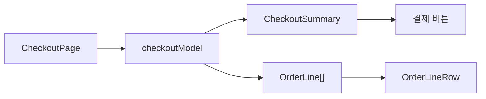

**TL;DR**

이 화면에서 중요한 건 긴 컴포넌트를 나누는 일이 아니었다. 최종 결제 금액이 한 곳에서 결정되는가였다.

금액 규칙이 모델 하나로 모이면 화면이 믿을 수 있는 값이 생긴다. 같은 입력이면 같은 결과가 나오고 과한 할인이 들어와도 최종 금액은 0 아래로 내려가지 않는다. 잘못된 금액 라인 조합은 사람이 아니라 타입이 막는다.
이 글은 그 구조가 없을 때 열려 있던 실패 경로들을 다룬다. 상태로 저장돼 낡아 가는 finalPrice, 쿠폰 라인에 넘길 수 있던 썸네일, 모델과 다른 숫자를 말할 수 있던 가격 컴포넌트.

## 최종 금액이 한 곳에서 결정되지 않았다

체크아웃 화면은 원래 길다. 상품, 배송지, 쿠폰, 포인트, 결제 수단, 약관이 한 파일에 있었고 컴포넌트부터 나누고 싶어지는 모양새였다.

코드를 따라가면 더 위험한 것이 나온다. `finalPrice`가 `useState` 초기값으로 잡혀 있었다. 상품 합계, 배송비, 쿠폰, 포인트에서 다시 계산되는 값이 상태로 저장돼 있는 구조다.
이 구조의 실패 경로는 시간차로 열린다. 첫 렌더의 값은 맞다. 그 뒤 배송지나 쿠폰이 바뀌면 저장된 값은 낡는다. 화면에 보이는 금액, 버튼에 찍히는 금액, 주문 완료 후 금액이 서로 다른 말을 할 수 있게 된다. 사용자에게는 UI 버그로 보이지만 실제로는 계약이 깨진 상태다. 돌아가는 화면이라 더 위험하다. 처음 숫자가 맞으면 통과한 것처럼 보인다.

계산이 화면 밖으로 나가면 이 경로가 닫힌다. 계산 함수는 화면을 모르고 장바구니, 배송지, 회원, 쿠폰, 포인트 사용 여부만 받는다. 화면이 믿어도 되는 요약값이 돌아온다.

```ts
export type CheckoutSummary = {
  itemTotal: number
  shippingFee: number
  couponDiscount: number
  memberDiscount: number
  pointDiscount: number
  finalPrice: number
}
```

```ts
const payableBeforePoint = Math.max(
  0,
  itemTotal + shippingFee - couponDiscount - memberDiscount,
)

const pointDiscount = usePoint
  ? Math.min(Math.max(0, pointInput), member.point, payableBeforePoint)
  : 0
```

하한이 모델 안에 있는 이유도 같은 논리다. 쿠폰과 포인트가 과하게 들어와도 최종 결제 금액은 음수가 될 수 없다. UI가 막더라도 금액 모델이 한 번 더 닫는다. 입력을 막는 계층과 값을 보증하는 계층은 다른 계층이다.

계산할 수 있는 값은 저장하지 않는다. 그리고 결제 금액의 결정 지점은 하나다.
다만 모델이 보증하는 것은 금액의 값까지다. 그 값이 화면에 어떻게 놓이는지는 별개의 문제다. 거기에도 실패 경로가 두 개 있었다.

## 쿠폰 라인에 썸네일을 넘길 수 있었다

`OrderLineRow`는 이름만 보면 주문 금액 한 줄을 그리는 컴포넌트다. 실제로는 상품이면 썸네일과 옵션과 수량, 배송비면 라벨과 금액, 쿠폰이면 쿠폰 코드, 할인이면 마이너스 표시까지 전부 한 컴포넌트가 받았다.

```tsx
<OrderLineRow
  type="coupon"
  label="쿠폰 할인"
  amount={couponDiscount}
  couponCode={coupon.code}
  isDiscount
/>
```

이 인터페이스에서는 필요 없는 props도 항상 열려 있다. 상품 라인이 아닌데 `thumbnail`을 넘길 수 있고 쿠폰 라인이 아닌데 `couponCode`를 넘길 수 있다. `isDiscount`를 빠뜨리면 할인인데 빨간색도 마이너스 표시도 붙지 않는다. 타입이 막지 않는 조합은 전부 사람의 기억이 막아야 한다.

라인을 종류별 union으로 나누면 조합 자체가 닫힌다.

```ts
export type ProductOrderLine = {
  kind: 'product'
  id: string
  label: string
  amount: number
  thumbnail: string
  option: string
  quantity: number
}

export type CouponDiscountOrderLine = {
  kind: 'coupon'
  label: string
  amount: number
  couponCode: string
}
```

컴포넌트는 optional props를 방어하는 대신 `kind`를 보고 그 라인에 맞는 값만 읽는다.

```tsx
function LineDescription({ line }: { line: OrderLine }) {
  switch (line.kind) {
    case 'product':
      return (
        <small>
          {line.option} · 수량 {line.quantity}
        </small>
      )
    case 'coupon':
      return line.couponCode ? <small>{line.couponCode}</small> : null
    case 'subtotal':
    case 'shipping':
    case 'memberDiscount':
    case 'point':
      return null
    default:
      return assertNever(line)
  }
}
```

`assertNever`가 마지막 문이다. 카드 즉시할인 같은 라인이 추가됐는데 렌더링이 빠지면 리뷰어의 눈이 아니라 타입 에러가 알린다.
잘못된 조합은 규율이 아니라 표현이 안 되게 만들어 막는다. 이 union이 감당하는 범위는 지금 존재하는 라인 여섯 종까지다. 부분 취소나 무료배송 쿠폰이 오면 구조를 다시 볼 자리다.

## 가격 컴포넌트가 다른 금액을 말할 수 있었다

`Price`는 가격을 보여주는 컴포넌트인데 그 안에 VIP 할인 규칙이 있었다.

표시 컴포넌트가 할인 규칙을 알면 진실이 둘이 된다. 계산 모델은 65,000원이라고 말하는데 가격 컴포넌트는 VIP 할인을 스스로 적용해 다른 숫자를 보여줄 수 있다. 금액 모델을 세운 의미가 표시 계층에서 무너지는 경로다.

할인은 `checkoutModel`로 옮겨졌고 `Price`는 결과만 보여준다.

```ts
const memberDiscount =
  member.grade === 'VIP' ? Math.round((itemTotal - couponDiscount) * 0.1) : 0
```

이 코드가 완벽한 할인 정책이라는 뜻은 아니다. 다만 할인 정책의 주소는 분명해졌다. 금액 규칙은 모델에 있고 표시 컴포넌트는 계산하지 않는다.

## Context는 금액의 출처를 숨길 뻔했다

배송지, 쿠폰, 포인트, 약관, 결제 수단. 상태가 많은 화면은 Context를 부른다. 이번에는 들어가지 않았다.

전달 단계가 깊지 않았고 중간 컴포넌트가 의미 없는 전달자도 아니었다. 지금 문제는 props drilling이 아니라 모델과 계약이다. Context가 들어가면 금액 계산의 출처가 더 잘 보이는 게 아니라 더 숨는다.


```mermaid
flowchart LR
    A["CheckoutPage"] --> B["checkoutModel"]
    B --> C["CheckoutSummary"]
    B --> D["OrderLine[]"]
    C --> E["결제 버튼"]
    D --> F["OrderLineRow"]
```

계산은 모델로 빠지고 화면은 계산값을 명시적으로 받는다. 결제 금액이 어디서 만들어져 어디로 흘러가는지가 코드에 남는 쪽을 골랐다.
이 판단의 적용 범위는 이 화면까지다. 전달이 실제로 깊어지는 화면에서는 같은 논리로 반대 결론이 나올 수 있다.

## 검증은 숫자의 계약부터다

리팩터링에서 지켜야 하는 것은 코드 모양이 아니라 금액이다. 계산 모델은 스모크 테스트로 묶였다. 일반 배송, 도서산간 배송, 쿠폰, 포인트, VIP 할인, 그리고 과한 할인 입력.

```ts
assert.equal(summary.finalPrice, 0)
assert.equal(summary.couponDiscount, 65000)
assert.equal(summary.memberDiscount, 0)
assert.equal(summary.pointDiscount, 0)
```

과한 쿠폰이 들어와도 최종 금액은 0에서 멈추고 나머지 할인은 0으로 밀린다. 이 계약이 깨지면 테스트가 먼저 안다.
검증 명령은 `pnpm test:checkout`, `pnpm lint`, `pnpm build`로 분리돼 있다.

브라우저 자동 조작 검증은 하지 못했다. 로컬 브라우저의 Apple Events JavaScript 설정이 꺼져 있어 자동 클릭 경로가 막혔다. 확인한 범위는 계산 계약과 빌드까지고 그 경계는 기록에 남아 있다.

> **포기한 것**: 모든 흐름을 자동 조작으로 확인했다는 문장. 못 본 것을 봤다고 적는 것보다 확인한 범위의 경계를 적는 쪽이 남는다.

## 사례들이 가리키는 것

세 실패 경로는 같은 결론으로 모인다. 체크아웃에서 먼저 믿을 수 있어야 하는 것은 컴포넌트 구조가 아니라 결제 금액이다.

파일 길이만 보고 잘랐다면 배송, 쿠폰, 포인트, 회원 할인 규칙이 여러 파일로 흩어졌을 것이다. 파일은 작아지고 결제 금액은 더 추적하기 어려워진다. 순서는 반대였다. 돈의 의미를 먼저 나눈다. 타입으로 잘못된 조합을 닫는다. UI는 그 모델을 소비한다.

## 아직 해결하지 않은 범위

카드 즉시할인, 부분 취소, 무료배송 쿠폰이 들어오면 지금의 union을 그대로 키울지 다시 나눌지 결정해야 한다. 그때는 계산 모델과 표시 모델의 분리가 다시 검토 대상이 된다.
지금 그 구조를 만들지 않은 이유는 하나다. 아직 오지 않은 요구사항을 먼저 추상화하면 지금 읽어야 할 코드가 다시 흐려진다.

> **포기한 것**: 미래의 모든 결제 케이스를 담는 구조. 지금 확인된 실패 경로만 닫았다. 다음 변경이 올 때 어디를 봐야 하는지만 남겼다.
