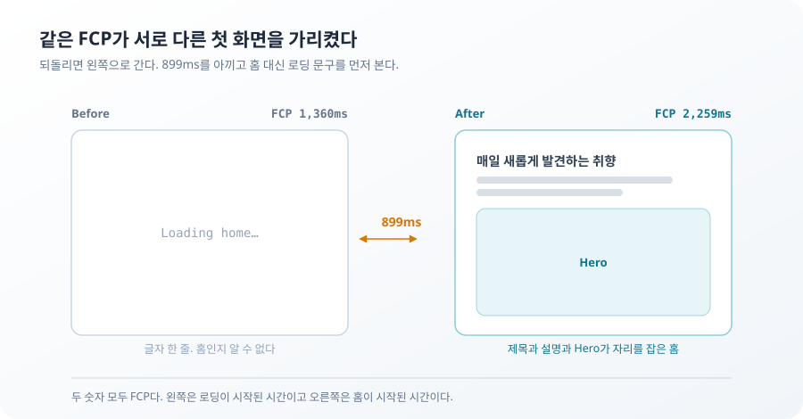
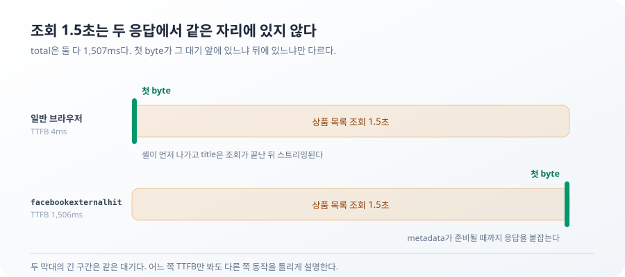

**TL;DR**

홈 LCP 42,175ms를 3,131ms까지 줄였다가 3,384ms로 되돌렸다. 3,131ms는 Hero 화질을 깨서 얻은 값이었다.

같은 회차에서 FCP는 1,360ms에서 2,259ms로 나빠졌다. 그건 남겼다. 빨리 보이는 `Loading home…`과 조금 늦게 보이는 실제 홈은 같은 화면이 아니다.

숫자가 무엇을 담고 있는지는 세 번 더 물어야 했다. 1.5초는 누구의 시간인지, 끊긴 요청이 실패인지, 128ms 중 어디가 느린지.

## 42초 동안 무엇을 기다렸나

처음 Lighthouse 결과를 보고 숫자를 잘못 읽은 줄 알았다. 4.2초가 아니라 42초였다.

LCP element는 Hero 이미지였다. 3840×2160 원본 한 장이 7,545,525B였고 navigation이 시작된 뒤 626ms가 지나서야 요청됐다. 느린 네트워크 조건에서는 큰 파일과 늦은 출발이 그대로 겹쳤다.

원본을 그대로 내려보내고 CSS로 줄여 그리고 있었다. `next/image`에 `sizes`를 주면 브라우저가 작은 후보를 고른다. Hero는 빌드할 때부터 알고 있는 이미지라 초기 HTML에서 요청 힌트도 보낼 수 있다. 요청 시작은 626ms에서 41ms로 당겨졌다.

남은 문제는 `sizes`에 무엇을 적느냐였다.

## 3,131ms는 화질을 깨서 얻은 값이었다

첫 답은 Hero 박스 폭인 388px이었다. 전송량이 32,425B가 됐고 LCP 중앙값은 3,131ms로 내려왔다. 원본의 233분의 1이다.

그런데 가방의 가죽 결이 뭉개졌다.

`sizes`는 이미지가 차지하는 폭을 신고하는 계약인데, `object-fit: cover`가 걸린 세로 박스에서는 그려지는 폭이 박스 폭보다 크다. 이미지가 좌우로 넘쳐 잘리기 때문이다. 모바일 Hero 박스는 388×485로 4:5이고 원본은 16:9다. 높이가 크기를 정하므로 박스 폭을 `W`라 할 때 실제로 그려지는 폭은 이렇게 된다.

```text
W × 5/4 × 16/9 = W × 20/9
```

388px 박스는 862 CSS px를 그린다. DPR 1.75에서 필요한 물리 픽셀은 1,509다. 브라우저가 고른 750px 후보는 화면에서 2.01배 확대됐다. 데스크톱 박스는 1232×616으로 가로형이라 폭이 그대로 크기를 정한다. 어긋난 건 모바일뿐이었다.

`sizes`를 렌더 폭에 맞추자 후보가 1920px이 됐다.

| 측정 | 원본 | 박스 폭 388을 신고 | 렌더 폭 862를 신고 |
| --- | ---: | ---: | ---: |
| Hero 전송량 | 7,545,525B | 32,425B | 162,058B |
| LCP 중앙값 | 42,175ms | 3,131ms | 3,384ms |
| 모바일 확대 배율 | | 2.01배 | 0.79배 |
| 원본 대비 평균 채널차 | | 3.12 | 1.46 |

253ms는 각 조건 내부 산포인 212ms, 123ms보다 크다. 측정 노이즈가 아니라 실제 악화다.

그래도 오른쪽을 택했다. 3,131ms는 `sizes`를 실제보다 좁게 신고해서 얻은 값이다. 잘린 것은 해상도지 구도가 아니다. 크롭은 `object-position`이 정하므로 후보 크기와 무관하고, 피사체와 문구는 두 경우가 같다.

> **포기한 것**: 3,131ms와 32KB. 그 숫자를 지키려면 모바일에서 이미지를 2배로 늘려 그려야 했다.

낭비도 남는다. 1920px 가로 이미지를 받아 4:5로 잘라내므로 폭의 45%만 화면에 보인다. 없애려면 모바일용 세로 crop을 별도 에셋으로 둬야 한다.

## 빨라진 홈에서 FCP는 왜 느려졌나

FCP 중앙값은 1,360ms에서 2,259ms가 됐다. LCP를 39초 줄인 같은 화면에서 첫 페인트는 899ms 늦어졌다.

처음 의심한 건 Hero 이미지였다. 이미지 요청이 네트워크를 차지해서 글자까지 늦게 보이는 것 같았다. Hero를 아예 차단하고 다시 측정했다.

2,257ms.

이미지가 없어도 FCP는 그대로였다. 이미지 경쟁 가설은 여기서 버렸다.

이번에는 Hero의 한글 제목과 설명만 라틴 문자로 바꿨다. FCP가 1,357ms로 돌아왔다. 서버 셸에 한글이 들어오면서 첫 200ms 구간의 Pretendard 요청은 2개 64KB에서 7개 183KB로 늘어 있었다.

한글 문구가 원인 변수라는 데까지는 확인했다. Lighthouse Lantern이 폰트 요청을 어떤 순서로 계산해 899ms를 만들었는지는 확인하지 못했다. 모르는 구간을 그럴듯한 설명으로 채우지는 않았다.

이제 선택지가 생겼다. 한글 셸을 다시 데이터 뒤로 숨기면 FCP 1,360ms를 되찾는다. 대신 사용자는 홈 제목이 아니라 로딩 문구를 먼저 본다.



같은 FCP라는 이름 아래 서로 다른 장면을 놓고 있었다. Before는 로딩이 시작된 시간이고 After는 실제 홈이 시작된 시간이다.

> **포기한 것**: 1,360ms라는 더 낮은 FCP. 그 숫자를 되찾으려면 초기 HTML에서 홈의 제목과 설명을 빼야 했다.

899ms 악화는 그대로 남겼다. 더 느린 숫자를 선택한 게 아니라 먼저 보여줄 화면을 선택한 결과다.

## 서버가 기다린 1.5초는 누구의 시간이었나

첫 페인트에 무엇을 담을지를 정하고 나니 응답 첫 byte에서 같은 질문이 나왔다. 검색어와 카테고리를 공유 카드에 넣기로 하자 상품 목록 metadata가 조회 결과를 기다리게 됐다. 이 대기가 사용자 TTFB까지 막는지 확인했다.

`/products?scenario=slow`에 일반 UA와 `facebookexternalhit` UA를 보냈다.



일반 UA에는 서버 셸이 먼저 왔다. metadata는 조회가 끝난 뒤 스트리밍됐다. `facebookexternalhit` UA는 metadata가 준비될 때까지 첫 byte도 받지 못했다. 이 UA가 Next.js의 metadata streaming 대상에서 제외된 결과로 관찰됐다. 크롤러가 부분 HTML을 어떻게 다루는지는 이 측정으로 확인하지 않았다.

같은 1.5초가 사용자에게는 응답 뒤쪽에 있고 크롤러에게는 TTFB에 있었다. 어느 쪽 숫자만 봐도 다른 쪽 동작을 틀리게 설명한다.

> **포기한 것**: 크롤러의 빠른 TTFB. 응답 내용으로 공유 카드를 만들려면 크롤러는 조회를 기다린다. 대신 일반 사용자의 셸은 그 대기에서 빠져나온다.

## 두 건이 끊겼는데 화면에는 오류가 없다

조회에 1.5초를 걸어 두고 정렬을 세 번 연속으로 바꿨다.

| 순서 | 요청 | 결과 |
| --- | --- | --- |
| 1 | `sort=popular` | `net::ERR_ABORTED` |
| 2 | `sort=price-asc` | `net::ERR_ABORTED` |
| 3 | `sort=price-desc` | 완료 |

두 건이 끊겼다. 그런데 마지막 화면에는 오류 문구도 `Try again`도 없다. 표시 개수는 30이고 카드는 12개이며 안내 행은 비어 있다. URL은 `sort=price-desc`이고 완료된 요청도 같은 조건이다.

끊긴 요청도 응답 없이 끝난다는 점에서는 서버가 죽은 것과 같다. 취소를 사용자에게 보여줄 실패로 다뤘다면, 사용자가 스스로 정렬을 바꾼 정상 동작이 매번 에러 화면이 된다. 끊긴 요청은 사용자가 만들었고 서버 실패는 시스템이 만들었다.

먼저 시작한 요청이 나중에 도착해 화면을 덮는 일도 없었다. 낡은 요청은 끊기고 화면은 마지막 조건의 결과만 그린다.

## 클릭 128ms 중 핸들러는 1ms였다

찜 버튼에서는 이름 하나가 구간을 가렸다. 24개 카드 중 하나를 눌렀을 때 상호작용 duration 중앙값은 128ms였는데 이벤트 processing은 1ms였다. 지연의 대부분은 117ms인 presentation delay였다.

Profiler에서는 클릭 한 번에 카드 24개가 같은 commit에서 update됐다. 각 카드가 위시리스트 ID 배열 전체를 구독하고 있어서다. ID 하나가 추가될 때마다 새 배열이 만들어졌고 관계없는 카드까지 다시 그려졌다.

```tsx
const selected = usePerformanceWishlist((state) =>
  state.wishlistIds.includes(product.id),
)
```

카드가 구독할 값을 자기 상품의 찜 여부로 줄였다. 그 뒤 update된 카드는 24개에서 클릭한 1개로 줄었다. 합계 actualDuration은 66ms에서 4ms, 상호작용 duration은 128ms에서 56ms가 됐다.

`memo`는 붙이지 않았다. selector 하나로 렌더 범위가 정리됐는데 경계를 더 추가할 이유가 없었다.

이 수치는 현장 INP가 아니다. CPU 4배 slowdown을 건 로컬 환경에서 같은 클릭을 다섯 번 측정한 결과다. 다만 128ms 중 어느 구간이 줄었는지와 어떤 카드가 다시 그려졌는지는 설명할 수 있다.

## 숫자보다 먼저 같은 화면을 만들었다

성능 숫자는 서로 다른 것을 같은 이름으로 묶는다. 로딩 문구와 실제 홈은 모두 FCP가 있고, 사용자와 크롤러는 모두 TTFB가 있다. 사용자가 끊은 요청과 서버가 죽은 요청은 모두 오류로 도착하고, 클릭 핸들러가 끝난 뒤 생긴 렌더도 interaction duration 안에 들어간다. 화질을 깎아서 만든 LCP도 그냥 LCP다.

그래서 측정 전에 바뀌지 않을 것을 정했다. Hero의 구도와 피사체를 유지한다. 홈 제목을 로딩 뒤로 숨기지 않는다. 공유 카드에는 실제 검색 결과를 담는다. 조건을 바꾸는 동안 오류 화면을 띄우지 않는다. 카드 24개와 화면 계산을 유지한다.

점수가 움직인 사실은 마지막 확인에 가깝다. 실제로 바꿀 곳은 시간을 쪼개고 원인 후보를 하나씩 지웠을 때 드러났다. 반대로 숫자가 좋아졌어도 그 숫자가 화면을 깎아서 얻은 것이면 되돌릴 이유가 생긴다.

## 아직 모르는 것

측정은 로컬의 제한된 네트워크와 CPU 조건에서 이뤄졌다. 실제 기기의 Core Web Vitals 분포는 없다. 한글 문구가 FCP를 바꾼 원인 변수라는 데까지만 확인했고 Lantern 내부 스케줄링은 추적하지 못했다.

크롤러도 `facebookexternalhit` 하나만 비교했다. INP는 한 상품의 첫 클릭만 쟀다. 긴 세션에서 가장 느린 상호작용이 무엇인지는 현장 데이터가 있어야 알 수 있다.

배포 환경의 Open Graph URL은 확인하지 못했다. 로컬에서는 HTTPS origin을 주입했을 때 전체 URL 합성을 확인했지만 실제 배포 응답은 다르다. 서버 컴포넌트가 자기 Route Handler를 HTTP로 호출하는 구조도 과제 본문과 발제 자료의 기준이 충돌해, 어느 문서가 최종 계약인지 확인이 남아 있다.
