**TL;DR**

이번 범위에서 중요한 건 상태 관리 라이브러리 세 개를 붙이는 일이 아니었다. 서버 데이터, URL 조건, 비로그인 장바구니, 입력 중인 검색어가 서로의 자리를 침범하지 않게 하는 일이었다.

각 상태의 원본을 하나로 두고, 계산할 수 있는 값은 저장하지 않았다. 이 기준에서 URL 입력은 parser에서 걸러지고, 범위를 벗어난 페이지에는 돌아갈 경로가 생긴다. 필요 없어진 요청은 fetch 단계에서 멈추며, 문서에 적힌 검증 절차도 실제 동작과 맞아야 한다.

## page=1e20은 왜 재시도로 복구되지 않았나

주소창에 page=100000000000000000000이 들어오면 상품 목록은 에러 화면으로 바뀌었다. 재시도 버튼은 있었지만 몇 번을 눌러도 결과는 달라지지 않았다.

문제는 API 응답이 아니라 그 이전에 있었다.
URL의 page 값은 parser를 통과해 상품 목록 요청에 포함됐다. API는 이 값을 안전 정수 범위를 벗어난 값으로 판단해 400을 반환했다. 에러 화면의 재시도 버튼은 같은 URL을 기준으로 같은 요청을 반복했다. 원인이 URL에 남아 있으니 재시도만으로는 정상 상태로 돌아갈 수 없었다.



첫 parser는 Number.isInteger를 사용했다.

```ts
const page = Number(value)
return Number.isInteger(page) && page >= 1 ? page : null
```

문제는 Number.isInteger(1e20)이 true라는 점이다. 정수 여부만 검사할 뿐 그 값이 안전하게 표현 가능한 정수인지는 확인하지 않는다. 반면 API는 Number.isSafeInteger를 기준으로 page를 확인한다. 클라이언트와 API가 서로 다른 유효성 기준을 쓰면서 parser는 통과하지만 API에서는 거절되는 구간이 생겼다.

```ts
const parseAsPageNumber = createParser<number>({
  parse: (value) => {
    const page = Number(value)
    return Number.isSafeInteger(page) && page >= 1 ? page : null
  },
  serialize: (value) => String(value),
})
```

안전한 양의 정수가 아니면 parser는 null을 반환하고 parser에 걸어 둔 기본값인 1페이지로 돌아간다. 잘못된 URL이 더 이상 API 에러 화면까지 전달되지 않는다.



입력 검증은 잘못된 값을 거절하는 일이 아니라 복구 가능한 상태만 다음 경계로 보내는 일이다. 400을 정확하게 보여주는 것보다 사용자가 빠져나올 수 없는 400을 만들지 않는 편이 낫다.
다만 parser가 막는 것은 URL이 API 계약을 벗어나는 경우다. 정상 요청에서 발생하는 서버 장애와 네트워크 오류에는 별도의 재시도와 복구 정책이 필요하다. 그리고 형식이 유효해도 존재하지 않는 페이지는 응답을 받아야 드러난다. 다음 사례다.

> **포기한 것**: 4xx 응답에 재시도를 끄는 정책. parser가 경계를 지키고 나면 이 화면이 400을 만들 경로 자체가 없다. 도달할 수 없는 경로에 에러 분기를 얹는 비용만 남아서 접었다.

## 빈 배열은 왜 상품 없음과 같은 상태가 아닌가

상품 30개를 12개씩 세 페이지로 보여주는 목록에서 page=99가 담긴 URL을 열면 "조건에 맞는 상품이 없습니다"가 떴다. 상품은 그대로 있었다.

page=99는 형식상 유효한 값이라 parser를 통과한다. 서버는 전체 배열에서 99페이지 구간을 잘라내고 그 구간에는 아무것도 없다. 응답은 200, products는 빈 배열, totalCount는 30이다. 화면은 배열이 비었다는 사실 하나로 "결과 없음" 분기에 들어갔고 이 분기에는 페이지네이션이 없다. 존재하는 상품과 사용자 사이에 클릭으로 건널 수 없는 화면이 생긴 것이다.

같은 빈 배열이 두 상태를 담고 있었다. totalCount가 0이면 조건 불일치, 0이 아니면 범위 밖 페이지다. 지금은 totalCount가 분기를 가르고 범위 밖 페이지에는 전체 개수와 함께 1페이지로 가는 버튼이 남는다.
홈도 같은 결이다. 상품 섹션이 비어도 배너와 카테고리는 유지된다. 응답 일부의 공백이 화면 전체를 접을 이유는 없다.

빈 배열은 데이터의 모양이지 사용자가 처한 상태의 이름이 아니다. items.length가 0이라는 사실만으로는 검색 결과 없음과 범위 밖 페이지를 구분할 수 없다. UI 상태는 응답의 일부가 아니라 전체 맥락에서 결정돼야 한다.
이 구분이 작동하는 범위는 계약 안의 200 응답까지다. 계약을 벗어난 응답은 렌더 예외가 되고 이를 격리할 경계는 아직 없다. 마지막에 다시 다룬다.

## 캐시 키는 왜 요청 조건 전체를 표현해야 하나

이 절의 실패는 화면에서 관찰된 것이 아니다. 구조를 정하면서 제거한 경로다.

key와 요청이 각자 조건을 조립하는 구조에서는 한쪽에만 조건이 추가되는 변경이 가능하다. category가 key에는 들어 있지만 요청에서는 빠진다면 캐시는 두 조건을 서로 다른 요청으로 구분하면서도 서버에는 같은 요청을 보낸다. 서로 다른 캐시 공간에 같은 응답이 저장되고 화면은 이를 정상적인 조건별 결과로 받아들인다. key가 표현하는 요청과 queryFn이 실행하는 요청의 의미가 어긋난 상태다. 에러가 없는 버그라 발견도 늦다.

조건 객체 하나가 key와 queryFn을 함께 만들면 이 경로가 사라진다.

```ts
export type ProductListCondition = Required<ProductListQuery>

export const commerceQueries = {
  products: {
    all: () => ['products'] as const,
    lists: () => [...commerceQueries.products.all(), 'list'] as const,
    list: (condition: ProductListCondition) =>
      queryOptions({
        queryKey: [...commerceQueries.products.lists(), condition],
        queryFn: ({ signal }) => fetchProducts(condition, signal),
        staleTime: 30_000,
        gcTime: 5 * 60_000,
      }),
  },
}
```

조건 객체를 공유한 이유는 중복 코드를 줄이기 위해서가 아니다. 캐시가 구분하는 요청과 서버가 실제로 처리하는 요청의 의미를 같게 만들기 위해서다. 기본 정렬이 요청에 항상 명시되는 것도 같은 이유다. 기본값을 생략하면 서버와 클라이언트가 서로 다른 조건으로 요청을 해석할 여지가 생긴다.

키는 일반적인 주소에서 구체적인 주소로 내려간다. `['products']`는 상품 도메인 전체,
`['products', 'list']`는 조건과 무관한 목록 전체, 마지막 condition까지 붙은 키는 특정
목록 하나다. 조건 객체만 붙였을 때도 캐시는 분리되지만 목록과 상세가 함께 생기면
“목록만 무효화”할 주소가 없다. 계층은 현재 조회뿐 아니라 이후의 무효화 범위까지
표현한다.

위 코드의 signal도 같은 결이다. 조건이 바뀌어 쿼리가 새 key로 갈아타면 React Query는 밀려난 쿼리에 취소 신호를 보낸다. 첫 구현의 fetch는 그 신호를 받지 않았고 아무도 보지 않을 응답이 네트워크를 타고 끝까지 내려왔다. signal이 fetch 옵션까지 내려가면 이탈한 요청은 클라이언트에서 중단된다.

캐시 키는 배열의 모양이 아니라 요청의 의미를 표현하는 계약이다.
이 계약이 보장하는 것은 조건과 응답의 짝까지다. 캐시를 얼마나 오래 신선하게 볼지는 별도 결정이고 근거는 화면의 동선이다. 목록은 조건 이동과 뒤로 가기가 잦아 30초, 홈은 배너와 랭킹이 분 단위로 바뀌지 않아 60초, 비활성 캐시는 조건을 바꿨다 돌아오는 동선을 덮도록 5분. 취소 역시 클라이언트 연결까지다. 서버가 이미 시작한 처리는 이 신호로 멈추지 않는다.

도메인 정책을 아직 정하지 않은 새 쿼리에는 전역 staleTime 20초를 적용했다. 이 값은
정답이라서가 아니라 한 화면 안에서 발생하는 불필요한 재요청을 막는 최소선이다.
홈과 목록처럼 수명이 설명된 쿼리는 팩토리의 60초와 30초가 이 기본값을 덮어쓴다.

> **포기한 것**: 페이지 전환 중 기존 목록을 유지하는 placeholderData. 전환마다 로딩 화면이 한 번 깜빡인다는 것을 알고도 뒀다. key 사이를 데이터가 건너다니는 옵션이라 캐시 정책과 붙여서 검증해야 할 결정이고, 이번 범위의 경계 밖이다.

## 테스트할 수 없는 검증 절차는 어떻게 남았나

설계 문서의 절차대로 주소창에 scenario=error를 입력해도 에러 화면은 나타나지 않는다.

scenario는 mock API가 에러와 빈 응답을 강제하는 테스트용 스위치다. 테스트용 제어값이 공유 가능한 URL에 남으면 안 되므로 사용자 URL 상태와 쿼리 조건에서 제외됐다. 클라이언트는 scenario를 요청에 싣지 않는다. 문서의 절차는 이 제외 결정 이전의 가정 위에 남아 있었다. 코드가 입력 경로를 닫았는데 문서는 닫히기 전의 경로를 가리키고 있었던 것이다.
재현되지 않는 절차의 문제는 문서 오류로 끝나지 않는다. 그 절차로 확인했다는 상태는 실제로 확인된 적이 없는 상태다. 빈 화면은 테스트가 있었고 에러 분기는 없었다.

지금은 목록 요청이 실패하면 전용 화면이 뜨고 재시도가 성공하면 목록으로 복귀하는 흐름까지 fetch 대역 테스트가 지킨다.

검증 절차도 구현이 허용하는 경로 안에 있어야 한다. 문서가 코드와 다른 입력 경로를 전제하면 검증 문장은 남아 있어도 실제로는 아무것도 확인하지 못한다.
대역 테스트가 실제인 것은 fetch 경계까지다. 실제 네트워크와 브라우저 히스토리의 동작은 대역 밖에 있다.

## 사례로 확인한 네 가지 불변식

네 가지 기준은 구현 전에 정했지만 실제 효용은 실패 경로를 대입했을 때 드러났다.

1. 같은 사실은 한 곳만 수정할 수 있다. 서버 상품 데이터는 서버가, 검색 조건은 URL이, 익명 장바구니는 클라이언트 store가 쓴다. 다른 위치에 존재하는 값은 원본의 스냅샷이나 파생값이다.
2. 소유권에는 쓰기 권한과 수명이 포함된다. URL이 원본이라는 말은 누구나 원본에 쓸 수 있다는 뜻이었고 그 자리에 경계가 필요했다.
3. 외부 입력은 원본으로 채택되기 전에 정규화된다. page=1e20이 이 기준이 비어 있을 때의 결과를 보여줬다.
4. 복구할 수 없는 상태는 UI에 존재하지 않는다. 영원히 실패하는 재시도 화면과 출구 없는 빈 화면이 반례였다.

캐시 키 사례가 남긴 원칙은 이 넷과 별개다. 캐시 key와 요청은 동일한 정규화 조건에서 만들어진다. 저장소가 둘이 되는 문제가 아니라 같은 의미의 두 표현이 한 근원에서 나와야 한다는 문제라서다.

원본이 하나라는 말은 복사본이 하나만 존재해야 한다는 뜻이 아니다. 서버 응답은 쿼리 캐시에 복사되지만 값을 변경하고 진실을 확정할 권한은 서버에 있다. 이 기준으로 나눈 소유권은 다음과 같다.

| 상태 | 원본 | 클라이언트 보관 위치 | 수명 | 공유 범위 |
| --- | --- | --- | --- | --- |
| 홈, 상품 목록 데이터 | 서버 | TanStack Query 캐시 | 캐시 정책 | 각 화면 |
| 검색어, 카테고리, 정렬, 페이지 | URL | URL | URL이 유지되는 동안 | 공유, 새로고침, 히스토리 |
| 장바구니, 위시리스트 | 클라이언트 store | Zustand store | 앱 세션 | 홈, 목록, 헤더 |
| 제출 전 검색어 | 컴포넌트 | useState | 입력 중 | 검색 폼 |

파생값은 이 표에 없다. 개수와 포함 여부는 ID 배열에서, 로딩과 요청 에러는 쿼리의 요청 상태에서 나온다. 빈 결과의 의미는 응답의 products와 totalCount, 현재 조건을 해석해 결정된다. 저장하는 순간 원본과 어긋날 수 있는 값들이라 저장하지 않는다.

구현체는 표의 보관 위치 그대로다. 조건 변경은 history push로 새 항목이 되고 검색, 카테고리, 정렬이 바뀌면 page는 1로 돌아간다. 헤더는 배열의 길이만, 상품 버튼은 자기 ID의 포함 여부와 action만 구독한다.

Zustand store 자체는 모듈 밖으로 공개하지 않았다. 화면이 store 전체를 구독하거나 내부
필드 이름에 직접 의존하지 않도록 `useCartCount`, `useIsInCart`, `useToggleCart` 같은
용도별 selector 훅만 공개한다. 이 훅은 단순한 편의 함수가 아니라 화면과 저장소 사이의
어댑터다. 테스트도 내부 store의 `getState`나 `setState`를 직접 검사하지 않고 공개된
selector 훅이 보여주는 행동을 검증한다.



> **포기한 것**: 새로고침 후에도 장바구니가 남는 persist. 세션이 끝나면 담은 것이 사라진다는 걸 알고 남겼다. 저장값의 hydration 불일치와 버전 마이그레이션이 같이 오는 결정이라 소유권 분리와 한 호흡에 넣지 않았다.

## 아직 해결하지 않은 범위

이번 범위가 보장하는 것은 소유권 분리와 그 경계의 실패 처리까지다.
서버 프리패치는 요청별 QueryClient와 hydration 전달 구조가 필요해 별도 결정으로 남아 있다.
렌더 예외를 격리할 Error Boundary는 아직 없다. 페이지 단위 경계와 복구 UI를 함께 정해야 하는 문제라 이번 범위에서 제외했고 현재는 계약을 벗어난 응답이 페이지 전체 렌더 실패로 이어질 수 있다.
로그인이 생기면 장바구니의 쓰기 권한은 서버로 넘어간다. store에 ID만 두는 구조는 그 이관에서 버릴 것을 최소화한다.

URL 정규화, 빈 결과 분기, 에러 후 재시도, store 파생값과 화면 간 공유는 상태 계약 테스트로 확인한다. query key 계층과 전역 캐시 기본값도 별도 단위 테스트로 고정했다. 잘못된 URL의 기본값 수렴, fetch 취소 신호, store 초기화까지 포함한 전체 테스트는 109건이다. lint, 타입 검사, 프로덕션 빌드를 포함한 pnpm check도 작성 시점 기준으로 통과한다.
