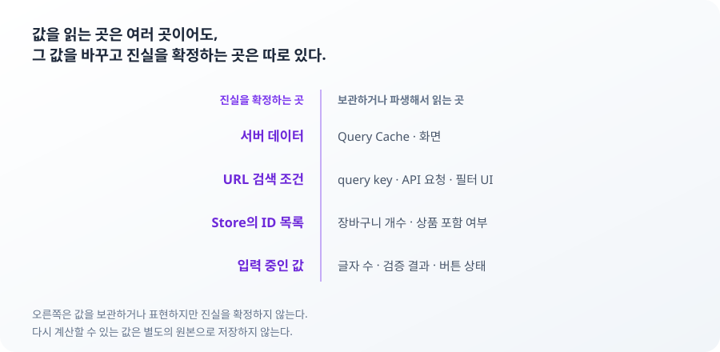

**TL;DR**

이번 범위에서 중요한 건 상태 관리 라이브러리 세 개를 붙이는 일이 아니었다. 어떤 값의 진실을 누가 확정하는지 정하는 일이었다.

상태의 소유자는 그 값을 보관하는 곳이 아니라 값을 변경하고 진실을 확정할 권한을 가진 곳이다. 서버 응답은 쿼리 캐시에 복사되지만 소유자는 서버다. URL 조건은 화면과 API 요청이 함께 읽지만 소유자는 URL이다. 보관 위치는 소유자를 정한 다음에 따라온다.



소유자가 헷갈릴 때 쓴 판정 기준은 세 가지다. 하나의 사실은 한 곳에서 확정하고 나머지 표현은 거기서 파생한다. 정규화되지 않은 외부 입력은 아직 내부 상태가 아니다. 같은 개념에서 나온 값이라도 쓰이는 경계가 다르면 진실을 확정하는 주체가 다를 수 있다.

## page=1e20은 왜 재시도로 복구되지 않았나

주소창에 page=100000000000000000000이 들어오면 상품 목록은 에러 화면으로 바뀌었다. 재시도 버튼은 있었지만 몇 번을 눌러도 결과는 달라지지 않았다.

문제는 API 응답이 아니라 그 이전에 있었다.
URL의 page 값은 parser를 통과해 상품 목록 요청에 포함됐다. API는 이 값을 안전 정수 범위를 벗어난 값으로 판단해 400을 반환했다. 에러 화면의 재시도 버튼은 같은 URL을 기준으로 같은 요청을 반복했다. 원인이 URL에 남아 있으니 재시도만으로는 정상 상태로 돌아갈 수 없었다.


첫 parser는 Number.isInteger를 사용했다.

```ts
const page = Number(value)
return Number.isInteger(page) && page >= 1 ? page : null
```

Number.isInteger(1e20)은 true다. 정수 여부만 검사할 뿐 그 값이 안전하게 표현 가능한 정수인지는 확인하지 않는다. API는 Number.isSafeInteger를 기준으로 본다. 클라이언트와 API가 서로 다른 유효성 기준을 쓰면서 parser는 통과하지만 API에서는 거절되는 구간이 생겼다.

기준을 Number.isSafeInteger로 바꾸면 1e20은 걸린다. 그런데 값만 보는 판정에는 구멍이 하나 더 있다.

| URL의 page | `Number()` 결과 | 값만 보는 판정 | 표기까지 보는 판정 |
| --- | --- | --- | --- |
| `3` | 3 | 통과 | 통과 |
| `007` | 7 | 통과 | 거절 |
| `1e20` | 1e+20 | 거절 | 거절 |

`007`과 `7`은 같은 페이지다. 값만 보면 둘 다 통과한다. 그런데 URL이 다르다. 조건의 원본이 URL이므로 query key도 갈린다. 같은 목록이 캐시 두 칸을 차지하고 한쪽이 갱신돼도 다른 쪽은 옛 응답을 들고 있다. 표기가 갈리는 만큼 캐시가 갈린다.

그래서 판정은 표기부터 한다.

```ts
const parsePageValue = (raw: string) => {
  if (!/^[1-9]\d*$/.test(raw)) return null
  const page = Number(raw)
  return Number.isSafeInteger(page) && page >= 1 ? page : null
}
```

통과하지 못한 값은 parser에 걸어 둔 기본값인 1페이지로 돌아간다. 잘못된 URL이 더 이상 API 에러 화면까지 전달되지 않는다.

입력 검증은 잘못된 값을 거절하는 일이 아니라 복구 가능한 상태만 다음 경계로 보내는 일이다. 400을 정확하게 보여주는 것보다 사용자가 빠져나올 수 없는 400을 만들지 않는 편이 낫다.

그래도 실패는 남는다. parser가 막는 건 URL이 API 계약을 벗어나는 경우뿐이고, 정상 요청에서도 서버는 죽는다. 이때 재시도 버튼 하나로는 부족하다. 실패마다 열려 있는 길이 다르기 때문이다.

```tsx
let exit: React.ReactNode
if (isRetryable(error)) {
  exit = <button onClick={() => refetch()}>다시 시도</button>
} else if (canResetFilters) {
  exit = <button onClick={() => setFilters(null)}>검색 조건 초기화</button>
} else {
  exit = <Link href="/">홈으로</Link>
}
```

`isRetryable`은 ApiError가 아니거나 status가 500 이상일 때만 참이다. 400과 404에서 재시도는 같은 요청을 반복할 뿐이다. 조건이 거절된 실패는 조건을 되돌려야 벗어난다. 조건이 이미 기본값이면 초기화해도 URL과 query key가 그대로여서 화면이 변하지 않는다. 그때는 결과 영역 밖으로 나가는 길을 준다.

정규화되지 않은 입력을 내부 상태로 들이지 않고, 들어와 버린 실패에는 원인에 맞는 출구를 연다. 형식이 유효해도 존재하지 않는 페이지는 응답을 받아야 드러난다. 다음 사례다.

## 빈 배열은 왜 상품 없음과 같은 상태가 아닌가

상품 30개를 12개씩 세 페이지로 보여주는 목록에서 page=99가 담긴 URL을 열면 "조건에 맞는 상품이 없습니다"가 떴다. 상품은 그대로 있었다.

page=99는 형식상 유효한 값이라 parser를 통과한다. 서버는 전체 배열에서 99페이지 구간을 잘라내고 그 구간에는 아무것도 없다. 응답은 200, products는 빈 배열, totalCount는 30이다. 화면은 배열이 비었다는 사실 하나로 결과 없음 분기에 들어갔고 이 분기에는 페이지네이션이 없다. 존재하는 상품과 사용자 사이에 클릭으로 건널 수 없는 화면이 생긴 것이다.

같은 빈 배열이 두 상태를 담고 있었다. 분기를 가르는 건 배열 길이 하나가 아니라 두 값의 조합이다.

```tsx
if (data.products.length === 0 && data.totalCount > 0) {
  // 범위 밖 페이지. 상품은 있는데 이 구간에만 없다
  results = (
    <>
      <p>없는 페이지입니다. 조건에 맞는 상품은 {data.totalCount}개입니다.</p>
      <button onClick={() => handlePageChange(1)}>1페이지로 이동</button>
    </>
  )
} else if (data.products.length === 0) {
  // 조건 불일치. 이 조건에는 상품이 없다
  results = <p>조건에 맞는 상품이 없습니다.</p>
}
```

두 분기의 차이는 문구가 아니라 출구다. 범위 밖 페이지에는 1페이지로 가는 버튼이 남는다. 조건 불일치에는 조건을 바꾸는 것 말고 할 일이 없으므로 버튼을 두지 않는다.

빈 배열은 데이터의 모양이지 사용자가 처한 상태의 이름이 아니다. items.length가 0이라는 사실만으로는 검색 결과 없음과 범위 밖 페이지를 구분할 수 없다. 원본 사실은 응답에 있고 화면 상태는 거기서 파생된다. 두 층을 같은 값으로 취급하면 파생을 소유자로 착각하게 된다.

이 구분이 작동하는 범위는 계약 안의 200 응답까지다.

> **보류한 것**: 계약을 벗어난 응답을 격리할 Error Boundary. mock API가 그런 응답을 만들지 못해 지금은 막을 대상을 재현할 수 없다. 동작을 확인할 수 없는 안전망은 두지 않는다.

## 캐시 키는 왜 요청 조건 전체를 표현해야 하나

이 절의 실패는 화면에서 관찰된 것이 아니다. 구조를 정하면서 제거한 경로다.

key와 요청이 각자 조건을 조립하는 구조에서는 한쪽에만 조건이 추가되는 변경이 가능하다. category가 key에는 들어 있지만 요청에서는 빠진다면 캐시는 두 조건을 서로 다른 요청으로 구분하면서도 서버에는 같은 요청을 보낸다. 서로 다른 캐시 공간에 같은 응답이 저장되고 화면은 이를 정상적인 조건별 결과로 받아들인다.

반대 방향은 더 위험하다. key에는 category가 없고 요청에만 있으면 서로 다른 서버 요청이 같은 캐시 공간을 공유한다. 카테고리를 바꿔도 이전 카테고리의 응답이 그대로 재사용될 수 있다. 어느 방향이든 key가 표현하는 요청과 queryFn이 실행하는 요청의 의미가 어긋난다. 에러가 없는 버그라 발견도 늦다.

조건 객체 하나가 key와 queryFn을 함께 만들면 이 경로가 사라진다.

```ts
export const commerceQueries = {
  products: {
    list: (condition: ProductListCondition) =>
      queryOptions({
        queryKey: ['products', 'list', condition],
        queryFn: () => fetchProducts(condition),
      }),
  },
}
```

조건 객체를 공유한 이유는 중복 코드를 줄이기 위해서가 아니다. 캐시가 구분하는 요청과 서버가 실제로 처리하는 요청의 의미를 같게 만들기 위해서다. 기본 정렬이 요청에 항상 명시되는 것도 같은 이유다. 기본값을 생략하면 서버와 클라이언트가 서로 다른 조건으로 요청을 해석할 여지가 생긴다.

조건에는 URL에 없는 값도 하나 섞인다. pageSize다. 사용자가 바꾸는 값이 아니라 URL에 남기지 않지만, 화면이 직접 끼워 넣으면 호출자마다 다른 값이 들어가 같은 URL이 다른 요청이 된다. 조립하는 자리를 훅 하나로 고정했다.

캐시 키는 배열의 모양이 아니라 요청의 의미를 표현하는 계약이다. 요청 조건이라는 사실을 key와 queryFn이 각자 결정하지 않는다. 둘 다 URL이 확정한 조건 객체를 읽기만 한다.

> **포기한 것**: 페이지 전환 중 이전 목록을 임시로 유지하는 placeholderData. 로딩 깜빡임을 줄일 수 있지만 새 페이지의 응답이 오기 전까지 이전 조건의 목록이 화면에 남는다. URL이 확정한 페이지 번호와 화면에 보이는 상품이 잠시 어긋난다. 그 상태를 어떤 UI로 표현할지 함께 정해야 해서 이번 범위에서는 제외했다.

## 카테고리 이름은 왜 화면마다 달랐나

서버에서 카테고리 이름을 바꾸자 홈과 목록 필터가 서로 다른 이름을 보여줬다. 홈은 응답으로 그렸고 목록 필터는 프런트 상수로 그렸다.

허용값과 표시 이름은 같은 카테고리에서 나오지만 쓰이는 경계가 다르다. URL parser는 빌드 시점에 정해진 값만 내부 조건으로 받아들인다. 화면에 표시할 이름은 서버 응답이 확정한다. 둘을 한 상수에 묶어 두면 서버가 바꾼 이름이 목록 필터에는 도착하지 않는다.

```tsx
const categoryLabel = (value: CategoryFilter) =>
  data?.categories.find((category) => category.id === value)?.name ??
  categoryFallbackLabels[value]
```

응답 이후의 표시 이름은 서버에서 읽는다. 로컬 값은 첫 응답 전 폴백으로만 남긴다. 같은 개념에서 나온 값이라도 쓰이는 경계가 다르면 진실을 확정하는 주체도 달라질 수 있다. 한 객체의 모든 속성이 같은 소유자를 갖지는 않는다.

폴백이 화면에 떠 있는 구간에는 이름의 원본이 잠시 둘이다. 응답 전 첫 페인트에 한정되지만 완전히 사라진 문제는 아니다.

## 사례가 남긴 소유권 판정 기준

세 기준은 구현 전에 정했지만 실제 효용은 실패 경로를 대입했을 때 드러났다.

1. 하나의 사실은 한 곳에서 확정하고 나머지 표현은 거기서 파생한다. 결과 없음과 범위 밖 페이지는 products와 totalCount에서 파생된다. 요청 조건은 조건 객체 하나가 확정하고 key와 요청은 그것을 함께 읽는다.
2. 정규화되지 않은 외부 입력은 아직 내부 상태가 아니다. page=1e20이 parser를 통과해 요청 조건이 된 것이 반례다.
3. 같은 개념에서 나온 값이라도 쓰이는 경계가 다르면 진실을 확정하는 주체가 다를 수 있다. 카테고리의 허용값과 표시 이름이 그렇다.

원본이 하나라는 말은 복사본이 없어야 한다는 뜻이 아니다. 소유자만 값을 바꾼다는 뜻이다. 보관 위치는 그다음에 정해진다.

| 상태 | 원본 | 클라이언트 보관 위치 | 수명 | 공유 범위 |
| --- | --- | --- | --- | --- |
| 홈, 상품 목록 데이터 | 서버 | TanStack Query 캐시 | 캐시 정책 | QueryClient 범위에서 필요한 화면 |
| 검색어, 카테고리, 정렬, 페이지 | URL | URL | URL이 유지되는 동안 | 공유, 새로고침, 히스토리 |
| 장바구니, 위시리스트 | 클라이언트 store | Zustand store | 새로고침 전 | 홈, 목록, 헤더 |
| 제출 전 검색어 | 컴포넌트 | useState | 입력 중 | 검색 폼 |

장바구니는 비로그인 익명 상태라 서버 원본이 없다. 원본이 store 하나뿐이라 저장할 것과 파생할 것을 직접 갈라야 한다.

```ts
// 판별에 필요한 ID만 저장한다. Product를 복사하면 서버 캐시와 두 번째 원본이 생긴다.
const useShoppingStore = create<ShoppingState>((set) => ({
  cartIds: [],
  toggleCart: (productId) =>
    set((state) => ({ cartIds: toggleId(state.cartIds, productId) })),
}))

// 화면에는 store가 아니라 용도별 selector 훅만 공개한다.
export const useCartCount = () =>
  useShoppingStore((state) => state.cartIds.length)

export const useIsInCart = (productId: string) =>
  useShoppingStore((state) => state.cartIds.includes(productId))
```

개수와 포함 여부는 ID 배열에서 계산한다. store를 그대로 열어 두면 소비자가 전체를 구독하거나 임의의 필드에 의존하게 된다. 그 순간 store의 모양이 화면의 계약이 된다.

> **이번 범위에서 제외한 것**: 장바구니 영속화. 새로고침 후 상태가 사라지는 대신 hydration과 저장 데이터 마이그레이션 문제를 이번 설계에서 분리했다.

URL 정규화, 빈 결과 분기, 에러 후 재시도, query key와 요청 조건의 일치, 페이지 간 장바구니 공유를 테스트로 확인했다. 작성 시점 기준 전체 테스트 109건과 lint, 타입 검사, 프로덕션 빌드가 통과한다.

상태 관리 라이브러리는 값을 보관하는 방법을 제공했다. 어떤 값이 진실이고 누가 그것을 바꿀 수 있는지는 그 앞에서 정해져 있어야 했다.
