**TL;DR**

이번 범위에서 중요한 건 상태 관리 라이브러리 세 개를 붙이는 일이 아니었다. 서버 데이터, URL 조건, 비로그인 장바구니, 입력 중인 검색어가 서로의 자리를 침범하지 않게 하는 일이었다.

상태의 소유자는 그 값을 보관하는 곳이 아니라 값을 변경하고 진실을 확정할 권한을 가진 곳이다. 서버 응답은 쿼리 캐시에 복사되지만 소유자는 서버다. URL 조건은 화면과 API 요청이 함께 읽지만 소유자는 URL이다. 배치는 전부 이 기준에서 나온다.

소유자를 판정할 때 쓴 불변식은 네 가지다.

1. 하나의 사실은 한 곳에서 결정하고 다른 표현은 그 값에서 파생한다.
2. 상태는 쓰기 권한을 가진 소유자에게 두고 필요한 수명과 공유 범위보다 넓게 보관하지 않는다.
3. 외부 입력은 정규화되기 전까지 내부 상태로 취급하지 않는다.
4. 모든 오류와 빈 상태에는 정상 상태로 돌아갈 수 있는 경로가 존재한다.

## page=1e20은 왜 재시도로 복구되지 않았나

주소창에 page=100000000000000000000이 들어오면 상품 목록은 에러 화면으로 바뀌었다. 재시도 버튼은 있었지만 몇 번을 눌러도 결과는 달라지지 않았다.

문제는 API 응답이 아니라 그 이전에 있었다.
URL의 page 값은 parser를 통과해 상품 목록 요청에 포함됐다. API는 이 값을 안전 정수 범위를 벗어난 값으로 판단해 400을 반환했다. 에러 화면의 재시도 버튼은 같은 URL을 기준으로 같은 요청을 반복했다. 원인이 URL에 남아 있으니 재시도만으로는 정상 상태로 돌아갈 수 없었다.


첫 parser는 Number.isInteger를 사용했다.

```ts
const page = Number(value)
return Number.isInteger(page) && page >= 1 ? page : null
```

문제는 Number.isInteger(1e20)이 true라는 점이다. 정수 여부만 검사할 뿐 그 값이 안전하게 표현 가능한 정수인지는 확인하지 않는다. 반면 API는 Number.isSafeInteger를 기준으로 page를 확인한다. 클라이언트와 API가 서로 다른 유효성 기준을 쓰면서 parser는 통과하지만 API에서는 거절되는 구간이 생겼다.

기준을 `Number.isSafeInteger`로 바꾸면 1e20은 걸린다. 그런데 값만 보는 판정에는 구멍이 하나 더 있다. 표기를 보지 않는다.

| URL의 page | `Number()` 결과 | 값만 보는 판정 | 표기까지 보는 판정 |
| --- | --- | --- | --- |
| `3` | 3 | 통과 | 통과 |
| `007` | 7 | 통과 | 거절 |
| `0x10` | 16 | 통과 | 거절 |
| `%201` | 1 | 통과 | 거절 |
| `1e2` | 100 | 통과 | 거절 |
| `1e20` | 1e+20 | 거절 | 거절 |

`007`과 `7`은 같은 페이지다. 값만 보면 둘 다 통과한다. 그런데 URL이 다르다. 조건의 원본이 URL이므로 query key도 갈린다. 같은 목록이 캐시 두 칸을 차지하고 한쪽이 갱신돼도 다른 쪽은 옛 응답을 들고 있다. 표기가 갈리는 만큼 캐시가 갈린다.

그래서 판정은 표기부터 한다.

```ts
// 표기 검사가 먼저다. Number()만 쓰면 '0x10', ' 1', '1e2'가 통과하고
// '007'과 '7'이 같은 페이지의 다른 URL이 된다.
const parsePositiveIntegerValue = (
  raw: string,
  isValid: (value: number) => boolean,
) => {
  if (!/^[1-9]\d*$/.test(raw)) return null
  const value = Number(raw)
  return isValid(value) ? value : null
}

const isValidPage = (page: number) => Number.isSafeInteger(page) && page >= 1

export const parsePageValue = (raw: string) =>
  parsePositiveIntegerValue(raw, isValidPage)
```

이 판정 규칙은 parser 안에 있지 않다. mock API route가 같은 파일을 읽는다. 두 처리의 책임은 다르다. 클라이언트 정규화는 잘못된 입력을 요청 전에 되돌려 불필요한 400 왕복을 줄이는 UX 처리다. 서버 검증은 클라이언트를 신뢰하지 않는다는 전제에서 따로 한다. 책임은 나누되 기준까지 갈라지면 같은 URL이 화면과 API에서 다르게 판정된다.

파싱을 통과하지 못한 값은 parser에 걸어 둔 기본값인 1페이지로 돌아간다. 잘못된 URL이 더 이상 API 에러 화면까지 전달되지 않는다.


같은 문제가 검색어에도 있었다. 폼은 제출할 때 앞뒤 공백을 자른다. 주소창에 직접 입력하거나 뒤로 가기로 돌아오는 경로는 폼을 거치지 않는다. `q=%20신발`과 `q=신발`이 다른 query key가 된다. 정규화를 폼이 아니라 parser에 두면 어느 경로로 들어와도 같은 조건이 된다.

```ts
const parseAsSearchQuery = createParser<string>({
  parse: (value) => value.trim(),
  serialize: (value) => value.trim(),
})
```

입력 검증은 잘못된 값을 거절하는 일이 아니라 복구 가능한 상태만 다음 경계로 보내는 일이다. 400을 정확하게 보여주는 것보다 사용자가 빠져나올 수 없는 400을 만들지 않는 편이 낫다. 정규화되지 않은 입력을 내부 상태로 들이지 않고, 잘못된 상태가 UI에 남기 전에 정상 경로로 돌려보낸다. 두 불변식이 여기서 하나의 parser로 만난다.

재시도 버튼도 다시 봤다. 실패마다 열려 있는 길이 다르다.

```tsx
let exit: React.ReactNode
if (isRetryable(error)) {
  exit = <button onClick={() => refetch()}>다시 시도</button>
} else if (canResetFilters) {
  exit = <button onClick={() => setFilters(null)}>검색 조건 초기화</button>
} else {
  exit = <Link href="/">홈으로</Link>
}
```

`isRetryable`은 ApiError가 아니거나 status가 500 이상일 때만 참이다. 400과 404에서 재시도는 같은 요청을 반복할 뿐이다. 조건이 거절된 실패는 조건을 되돌려야 벗어난다. 조건이 이미 기본값이면 초기화해도 URL과 query key가 그대로여서 화면이 변하지 않는다. 그때는 결과 영역 밖으로 나가는 길을 준다. 셋 중 하나는 실제로 동작한다.

다만 parser가 막는 것은 URL이 API 계약을 벗어나는 경우다. 정상 요청에서 발생하는 서버 장애와 네트워크 오류에는 별도의 재시도와 복구 정책이 필요하다. 잘못된 page 값이 요청까지 도달하지 않으므로 이 입력을 위한 별도 400 재시도 분기는 두지 않았다. 형식이 유효해도 존재하지 않는 페이지는 응답을 받아야 드러난다. 다음 사례다.

## 빈 배열은 왜 상품 없음과 같은 상태가 아닌가

상품 30개를 12개씩 세 페이지로 보여주는 목록에서 page=99가 담긴 URL을 열면 "조건에 맞는 상품이 없습니다"가 떴다. 상품은 그대로 있었다.

page=99는 형식상 유효한 값이라 parser를 통과한다. 서버는 전체 배열에서 99페이지 구간을 잘라내고 그 구간에는 아무것도 없다. 응답은 200, products는 빈 배열, totalCount는 30이다. 화면은 배열이 비었다는 사실 하나로 "결과 없음" 분기에 들어갔고 이 분기에는 페이지네이션이 없다. 존재하는 상품과 사용자 사이에 클릭으로 건널 수 없는 화면이 생긴 것이다.

같은 빈 배열이 두 상태를 담고 있었다. totalCount가 0이면 조건 불일치, 0이 아니면 범위 밖 페이지다. 분기를 가르는 건 배열 길이 하나가 아니라 두 값의 조합이다.

```tsx
if (data.products.length === 0 && data.totalCount > 0) {
  // 범위 밖 페이지. 상품은 있는데 이 구간에만 없다
  results = (
    <>
      <p>없는 페이지입니다. 조건에 맞는 상품은 {data.totalCount}개입니다.</p>
      <button onClick={() => handlePageChange(1)}>1페이지로 이동</button>
    </>
  )
} else if (data.products.length === 0) {
  // 조건 불일치. 이 조건에는 상품이 없다
  results = <p>조건에 맞는 상품이 없습니다.</p>
}
```

두 분기의 차이는 문구가 아니라 출구다. 범위 밖 페이지에는 1페이지로 가는 버튼이 남는다. 조건 불일치에는 조건을 바꾸는 것 말고 할 일이 없으므로 버튼을 두지 않는다.

홈도 같은 결이다. 상품 섹션이 비어도 배너와 카테고리는 유지된다. 응답 일부의 공백이 화면 전체를 접을 이유는 없다.

빈 배열은 데이터의 모양이지 사용자가 처한 상태의 이름이 아니다. items.length가 0이라는 사실만으로는 검색 결과 없음과 범위 밖 페이지를 구분할 수 없다. UI 상태는 응답의 일부가 아니라 전체 맥락에서 결정돼야 한다. 원본 사실은 응답에 있고 화면 상태는 거기서 파생된다. 두 층을 같은 값으로 취급하면 파생을 소유자로 착각하게 된다.

이 구분이 작동하는 범위는 계약 안의 200 응답까지다. 계약을 벗어난 응답은 렌더 예외가 되며, 이를 격리할 Error Boundary는 이번 범위에 포함하지 않았다.

## 캐시 키는 왜 요청 조건 전체를 표현해야 하나

이 절의 실패는 화면에서 관찰된 것이 아니다. 구조를 정하면서 제거한 경로다.

key와 요청이 각자 조건을 조립하는 구조에서는 한쪽에만 조건이 추가되는 변경이 가능하다. category가 key에는 들어 있지만 요청에서는 빠진다면 캐시는 두 조건을 서로 다른 요청으로 구분하면서도 서버에는 같은 요청을 보낸다. 서로 다른 캐시 공간에 같은 응답이 저장되고 화면은 이를 정상적인 조건별 결과로 받아들인다.

반대 방향은 더 위험하다. key에는 category가 없고 요청에만 있으면 서로 다른 서버 요청이 같은 캐시 공간을 공유한다. 카테고리를 바꿔도 이전 카테고리의 응답이 그대로 재사용될 수 있다. 어느 방향이든 key와 요청 조건이 따로 조립되는 순간 key가 표현하는 요청과 queryFn이 실행하는 요청의 의미가 어긋난다. 에러가 없는 버그라 발견도 늦다.



조건 객체 하나가 key와 queryFn을 함께 만들면 이 경로가 사라진다.

```ts
export type ProductListCondition = Required<ProductListQuery>

export const commerceQueries = {
  products: {
    all: () => ['products'] as const,
    lists: () => [...commerceQueries.products.all(), 'list'] as const,
    list: (condition: ProductListCondition) =>
      queryOptions({
        queryKey: [...commerceQueries.products.lists(), condition],
        queryFn: ({ signal }) => fetchProducts(condition, signal),
        staleTime: 30_000,
        gcTime: 5 * 60_000,
      }),
  },
}
```

조건 객체를 공유한 이유는 중복 코드를 줄이기 위해서가 아니다. 캐시가 구분하는 요청과 서버가 실제로 처리하는 요청의 의미를 같게 만들기 위해서다. 기본 정렬이 요청에 항상 명시되는 것도 같은 이유다. 기본값을 생략하면 서버와 클라이언트가 서로 다른 조건으로 요청을 해석할 여지가 생긴다.

query key는 products, list, condition 순서로 구체화된다. 현재 목록을 구분하는 데만 필요한 구조는 아니다. 이후 상품 전체, 목록 전체, 특정 조건 목록을 서로 다른 범위로 무효화하기 위한 주소이기도 하다.

위 코드의 signal도 같은 결이다. 조건 변경으로 이전 쿼리가 inactive 상태가 되면 TanStack Query는 AbortSignal을 중단한다. queryFn이 이를 사용하지 않으면 Promise와 네트워크 요청은 그대로 진행된다. signal이 fetch 옵션까지 내려가야 이탈한 요청이 클라이언트에서 멈춘다.

캐시 키는 배열의 모양이 아니라 요청의 의미를 표현하는 계약이다. 요청 조건이라는 사실을 key와 queryFn이 각자 결정하지 않는다. 둘 다 URL이 확정한 조건 객체를 읽기만 한다.

이 계약이 보장하는 것은 조건과 응답의 짝까지다. 캐시를 얼마나 오래 신선하게 볼지는 별도 결정이고 근거는 화면의 동선이다.

| 대상 | 유지 시간 | 근거 |
| --- | --- | --- |
| 상품 목록 | staleTime 30초 | 조건 이동과 뒤로 가기가 잦다 |
| 홈 | staleTime 60초 | 배너와 랭킹이 분 단위로 바뀌지 않는다 |
| 그 외 쿼리 | staleTime 20초 | 전역 기본값 |
| 비활성 캐시 | gcTime 5분 | 조건을 바꿨다 돌아오는 동선을 덮는다 |

취소 역시 클라이언트 연결까지다. 서버가 이미 시작한 처리는 이 신호로 멈추지 않는다.

> **포기한 것**: 페이지 전환 중 이전 목록을 임시로 유지하는 placeholderData. 로딩 깜빡임을 줄일 수 있지만 새 페이지의 응답이 오기 전까지 이전 조건의 목록이 화면에 남는다. 페이지 번호와 실제로 보이는 상품이 잠시 어긋나는 상태를 어떤 UI로 표현할지 함께 검증해야 해 이번 범위에서는 제외했다.

## 테스트할 수 없는 검증 절차는 어떻게 남았나

검증 절차도 상태 계약의 소비자다. 어떤 값이 URL에 남고 어떤 값이 요청에 실리는지를 절차가 전제로 삼기 때문이다. 앞의 세 사례가 계약을 정하는 쪽이라면 이번은 그 계약을 읽고 있던 쪽이다.

설계 문서의 절차대로 주소창에 scenario=error를 입력해도 에러 화면은 나타나지 않는다.

scenario는 mock API가 에러와 빈 응답을 강제하는 테스트용 스위치다. 테스트용 제어값이 공유 가능한 URL에 남으면 안 되므로 사용자 URL 상태와 쿼리 조건에서 제외됐다. 클라이언트는 scenario를 요청에 싣지 않는다. 문서의 절차는 이 제외 결정 이전의 가정 위에 남아 있었다. 코드가 입력 경로를 닫았는데 문서는 닫히기 전의 경로를 가리키고 있었던 것이다.

재현되지 않는 절차의 문제는 문서 오류로 끝나지 않는다. 그 절차로 확인했다는 상태는 실제로 확인된 적이 없는 상태다. 빈 화면은 테스트가 있었고 에러 분기는 없었다.

지금은 목록 요청이 실패하면 전용 화면이 뜨고 재시도가 성공하면 목록으로 복귀하는 흐름까지 fetch 대역 테스트가 지킨다.

검증 절차도 구현이 허용하는 경로 안에 있어야 한다. 문서가 코드와 다른 입력 경로를 전제하면 검증 문장은 남아 있어도 실제로는 아무것도 확인하지 못한다.
대역 테스트가 실제인 것은 fetch 경계까지다. 실제 네트워크와 브라우저 히스토리의 동작은 대역 밖에 있다.

## 사례로 확인한 네 가지 불변식

앞에 적은 네 가지는 구현 전에 정했지만 실제 효용은 실패 경로를 대입했을 때 드러났다.

1. 하나의 사실은 한 곳에서 결정하고 다른 표현은 그 값에서 파생한다. 결과 없음과 범위 밖 페이지는 products와 totalCount에서 파생된다. 요청 조건은 하나의 조건 객체가 확정하고 key와 요청은 그것을 함께 읽는다.
2. 상태는 쓰기 권한을 가진 소유자에게 두고 필요한 수명과 공유 범위보다 넓게 보관하지 않는다. 장바구니가 URL에 실리지 않고 입력 중인 검색어가 store로 올라가지 않는 이유가 여기 있다. 아래 표가 그 배치다.
3. 외부 입력은 정규화되기 전까지 내부 상태로 취급하지 않는다. page=1e20이 parser를 통과해 요청 조건이 된 것이 반례다.
4. 모든 오류와 빈 상태에는 정상 상태로 돌아갈 수 있는 경로가 존재한다. 눌러도 결과가 같은 재시도 버튼과 페이지네이션이 없는 결과 없음 화면이 반례다.

원본이 하나라는 말은 복사본이 없어야 한다는 뜻이 아니다. 소유자만 값을 바꾼다는 뜻이다. URL 조건을 화면과 API 요청이 함께 읽는 것, 장바구니 ID에서 개수와 포함 여부를 계산하는 것도 같은 원칙이다.

| 상태 | 원본 | 클라이언트 보관 위치 | 수명 | 공유 범위 |
| --- | --- | --- | --- | --- |
| 홈, 상품 목록 데이터 | 서버 | TanStack Query 캐시 | 캐시 정책 | QueryClient 범위에서 필요한 화면 |
| 검색어, 카테고리, 정렬, 페이지 | URL | URL | URL이 유지되는 동안 | 공유, 새로고침, 히스토리 |
| 장바구니, 위시리스트 | 클라이언트 store | Zustand store | 새로고침 전 | 홈, 목록, 헤더 |
| 제출 전 검색어 | 컴포넌트 | useState | 입력 중 | 검색 폼 |

장바구니에는 상품 전체가 아니라 ID만 저장한다. Product를 통째로 복사하면 서버 캐시와 두 번째 원본이 생긴다.

```ts
const toggleId = (ids: string[], id: string) =>
  ids.includes(id) ? ids.filter((existing) => existing !== id) : [...ids, id]

// 비로그인 익명 상태라 서버 원본이 없다. 원본은 이 store 하나다.
const useShoppingStore = create<ShoppingState>((set) => ({
  cartIds: [],
  toggleCart: (productId) =>
    set((state) => ({ cartIds: toggleId(state.cartIds, productId) })),
}))

// 화면에는 store가 아니라 용도별 selector 훅만 공개한다.
export const useCartCount = () =>
  useShoppingStore((state) => state.cartIds.length)

export const useIsInCart = (productId: string) =>
  useShoppingStore((state) => state.cartIds.includes(productId))
```

개수와 포함 여부는 ID 배열에서 계산한다. 헤더는 `useCartCount`만, 상품 카드는 자기 ID의 `useIsInCart`만 구독한다. store를 그대로 열어 두면 소비자가 전체를 구독하거나 임의의 필드에 의존하게 된다. 그 순간 store의 모양이 화면의 계약이 된다.


> **이번 범위에서 제외한 것**: 장바구니 영속화. 새로고침 후 상태가 사라지는 대신 hydration과 저장 데이터 마이그레이션 문제를 이번 설계에서 분리했다.

URL 정규화, 빈 결과 분기, 에러 후 재시도, query key와 요청 조건의 일치, 페이지 간 장바구니 공유를 테스트로 확인했다. 작성 시점 기준 전체 테스트 109건과 lint, 타입 검사, 프로덕션 빌드가 통과한다.

상태 관리 라이브러리는 값을 보관하는 방법을 제공했다. 어떤 값이 진실이고 누가 그것을 바꿀 수 있는지는 그 앞에서 정해져 있어야 했다.
