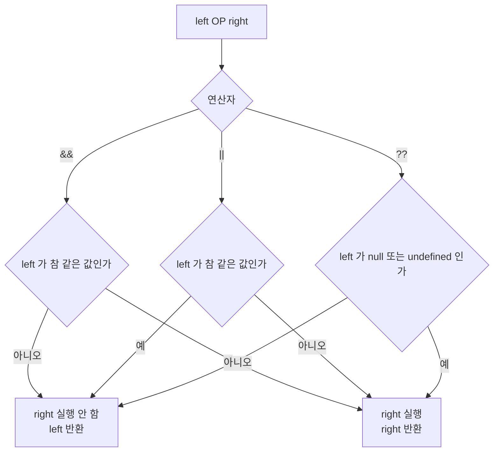

**TL;DR**

`Promise.all`은 작업을 시작하지 않는다. 이미 시작된 작업들이 끝나기를 기다리고 결과를 인덱스 자리에 놓을 뿐이다. 결과 배열의 순서는 완료 순서가 아니라 입력 순서다.

`&&`와 `||`는 조건 검사가 아니라 값을 고르는 연산이다. 왼쪽 값의 참·거짓만 보고 오른쪽을 실행할지 말지를 정한다. 실행되지 않은 코드는 실패하지 않으므로 예외도 로그도 남지 않는다.

두 자리 모두 소스 코드의 줄 순서가 실행 순서를 뜻하지 않는다. 앞의 것은 순서만 다르다. 뒤의 것은 실행 자체가 없다.

열 문제 중 5번 Promise.all Resolve Order와 7번 Short-Circuit Notification이 이 두 방향이다.

## 느린 작업이 먼저 나오는 결과 배열

늦게 끝난 작업이 결과 배열의 앞자리에 있다.

```js
const delay = (ms, value) => new Promise(resolve => setTimeout(() => resolve(value), ms))

const slow = delay(120, 'slow')
const fast = delay(10, 'fast')

await Promise.all([slow, fast]) // [ 'slow', 'fast' ]
```

실행 로그로 보면 `fast`가 먼저 끝났다.

```
fast 완료 @015ms
slow 완료 @125ms
결과 배열 [ 'slow', 'fast' ] @125ms
```

`Promise.all`은 받은 이터러블을 순회하면서 각 항목에 인덱스를 붙인다. 어떤 프로미스가 이행되면 그 프로미스의 인덱스 자리에 값을 넣고 남은 개수를 하나 줄인다. 남은 개수가 0이 되면 배열을 완성해 이행한다. 자리는 순회 시점에 정해지고 값은 완료 시점에 채워진다. 두 시점이 다르다.



전체 완료 시각은 가장 느린 작업이 정한다. 위 로그에서 `Promise.all`이 이행된 시점은 125ms로 `slow`가 끝난 시점과 같다.

먼저 끝난 순서가 필요하면 다른 함수를 쓴다.

```js
await Promise.race([delay(80, '느림'), delay(5, '빠름')]) // '빠름'
await Promise.any([delay(80, '느림'), delay(5, '빠름')])  // '빠름'
```

`race`는 가장 먼저 결정된 것을 그대로 따르고 거부도 결과로 받는다. `any`는 가장 먼저 이행된 것을 고르고 전부 거부됐을 때만 `AggregateError`로 실패한다. 타임아웃을 붙일 때는 `race`, 여러 미러 중 살아 있는 하나를 고를 때는 `any`다.

빈 배열은 즉시 이행된다.

```js
await Promise.all([]) // []
```

목록을 필터링한 결과가 비면 대기 없이 다음 줄로 간다. 이 경로에서 `Promise.all` 앞뒤에 둔 로딩 표시가 켜졌다 꺼지는 사이 렌더가 한 번도 일어나지 않는다.

## 배열에 담긴 순간 이미 시작한 작업들

`Promise.all`이 작업을 시작한다고 읽으면 다음 코드의 소요 시간을 설명하지 못한다.

```js
const tasks = [delay(120, 'a'), delay(10, 'b')]
for (const t of tasks) await t
// 총 121ms
```

두 번을 순서대로 기다렸는데 130ms가 아니라 121ms다. `delay(120, 'a')`가 평가되는 순간 `setTimeout`이 이미 등록됐다. 배열 리터럴이 만들어지는 시점에 두 타이머가 모두 돌기 시작한다. `await`는 시작 신호가 아니라 결과를 기다리는 지점이다.

생성 위치를 루프 안으로 옮기면 시간이 달라진다.

```js
for (const ms of [120, 10]) await delay(ms)
// 총 133ms
```

첫 `delay`가 끝난 뒤에 두 번째 `delay`가 호출되므로 타이머가 순차로 돈다. 코드 두 줄의 차이는 `await` 위치가 아니라 프로미스를 만드는 위치다.

거부 시점도 같은 방식으로 읽는다.

```js
const noisy = delay(60, 'x').then(() => console.log('거부 이후에도 계속 실행됨'))

try {
  await Promise.all([Promise.reject(new Error('boom')), noisy])
} catch (e) {
  console.log('all 거부', e.message)
}
// all 거부 boom      @380ms
// 거부 이후에도 계속 실행됨  @441ms
```

`Promise.all`은 첫 거부에서 바로 거부된다. 나머지 프로미스는 취소되지 않는다. 이미 시작된 요청은 응답을 받고 `then` 콜백도 실행된다. `Promise.all`이 반환한 프로미스와 그 안의 작업들은 수명이 다르다.

전부 끝난 뒤 성공과 실패를 함께 보려면 결과 형태를 바꾼다.

```js
await Promise.allSettled([Promise.resolve(1), Promise.reject(new Error('no'))])
// [ { status: 'fulfilled', value: 1 },
//   { status: 'rejected', reason: Error: no } ]
```

`allSettled`는 거부해도 이행된다. 실패 항목을 골라내는 일은 호출자 몫이 된다. `try/catch`로는 아무것도 잡히지 않는다.

> `Promise.all`은 스케줄러가 아니라 수집기다. 동시 실행을 만드는 것은 프로미스를 생성하는 위치다.

`Promise.all`이 보장하는 범위는 결과 수집까지다. 요청 100개를 배열에 담으면 100개가 한꺼번에 나간다. 동시 실행 개수를 제한하는 일은 이 API 밖에 있다. 취소도 `AbortController` 같은 별도 경로가 필요하다.

## `count && notify()`가 알림을 보내지 않는 이유

읽지 않은 알림 개수를 검사한 뒤 알림을 보낸다.

```js
let calls = 0
const notify = () => { calls++; return 'sent' }

const unread = 0
unread && notify()
// 값은 0, calls 는 0
```

`notify`가 호출되지 않는다. 예외도 경고도 없고 표현식의 값은 `0`이다.

`&&`는 왼쪽 피연산자를 평가하고 그 값이 거짓 같은 값이면 오른쪽을 평가하지 않은 채 왼쪽 값을 그대로 돌려준다. 참 같은 값이면 오른쪽을 평가해 오른쪽 값을 돌려준다. `||`는 반대다. 두 연산자 모두 불리언을 만들지 않는다. 피연산자 중 하나를 고를 뿐이다.

거짓 같은 값은 일곱 개다.

```js
[0, -0, 0n, '', null, undefined, NaN].map(Boolean)
// [ false, false, false, false, false, false, false ]
```

`0`과 빈 문자열이 이 목록에 있다는 사실이 실무에서 걸리는 지점이다. "값이 없음"을 검사하려던 코드가 "값이 0"까지 같이 걸러 낸다.

```js
Boolean('0') // true
Boolean([])  // true
Boolean({})  // true
```

빈 배열과 빈 객체는 참 같은 값이다. 길이로 판단하려면 `list.length`를 직접 봐야 한다.

기본값 병합에서 두 연산자가 갈린다.

```js
const config = { count: 0 }

config.count || 10 // 10
config.count ?? 10 // 0
```

`??`는 왼쪽이 `null`이나 `undefined`일 때만 오른쪽을 고른다. `0`과 `''`과 `false`는 그대로 통과한다. 재시도 횟수 `0`, 타임아웃 `0`, 검색어 빈 문자열처럼 값 자체가 의미를 가지는 자리에서는 `||`가 그 값을 지운다.

```js
'' || 'default' // 'default'
'' ?? 'default' // ''
false ?? true   // false
```

대입 연산자도 같은 규칙을 물려받는다.

```js
let a = 0; a ||= 10; a // 10
let b = 0; b ??= 10; b // 0
```

옵셔널 체이닝도 단축 평가다.

```js
const target = null
let evaluated = 0
target?.[(evaluated++, 'key')]
evaluated // 0
```

`target`이 `null`이면 대괄호 안의 표현식이 아예 평가되지 않는다. 인덱스 계산에 부수 효과를 넣어 두면 그 효과도 함께 사라진다. 메서드 호출도 마찬가지라 `logger?.write(buildMessage())`에서 `logger`가 없으면 `buildMessage`도 실행되지 않는다.



> 단축 평가는 조건문이 아니라 값 선택이다. 선택되지 않은 쪽은 실행되지 않는다. 실행되지 않은 코드는 실패도 하지 않는다.

이 구분이 답하는 것은 어떤 값이 통과하는지까지다. `??`로 바꿔도 서버가 `null` 대신 빈 문자열을 보내면 기본값은 적용되지 않는다. 어떤 표현이 "값 없음"인지는 API 계약에서 정해지고 연산자가 정하지 않는다.

## 두 문제가 남긴 규칙

한쪽은 시간의 문제고 다른 쪽은 실행 여부의 문제다. 소스 코드의 줄 순서로는 둘 다 읽히지 않는다.

1. 작업의 시작 시점은 그 작업을 기다리는 코드가 아니라 만드는 코드가 정한다. 배열에 담아 둔 프로미스 둘을 순차로 `await`했을 때 130ms가 아니라 121ms가 걸린 것이 증명이다.
2. 결과의 순서와 완료의 순서는 다른 축이다. `fast`가 15ms에 끝났는데 결과 배열의 두 번째 자리에 있는 것이 증명이다. 자리는 순회 시점에, 값은 완료 시점에 정해진다.
3. 실행되지 않은 코드는 관측되지 않는다. `unread && notify()`가 값 `0`을 남기고 호출 횟수를 0으로 유지한 것이 반례다. 잘못된 조건이 예외 대신 정상 값을 만들었다.

세 규칙 중 3번이 앞의 둘과 성격이 다르다. 1번과 2번은 실행이 일어났고 시각만 예상과 어긋난다. 로그에 타임스탬프를 붙이면 보인다. 3번은 실행 자체가 없어 로그에 아무것도 남지 않는다. 알림이 오지 않았다는 사실은 알림을 기다린 사람만 안다.

> **이 글에서 다루지 않은 것**: 마이크로태스크와 매크로태스크의 우선순위. `await`와 `then`이 마이크로태스크 큐로 가고 `setTimeout`이 매크로태스크 큐로 가는 차이는 위 예제들의 밀리초 단위 값에는 나타나지 않는다. 두 큐가 렌더 타이밍과 얽히는 자리는 별도로 봐야 한다.

## 다섯 편이 같은 곳을 가리킨 지점

열 문제는 서로 다른 API를 다뤘다. 남은 규칙은 세 문장으로 줄어든다.

기본값은 편의가 아니라 규격이다. 생략한 비교자, 생략한 초깃값, 생략한 진법 인자 자리에 언어가 무엇을 넣는지가 결과를 정한다. 1편과 4편이 같은 자리다.

경계는 한 겹이다. 동일성 판정, 동결, 복사, 프로토타입 조회가 모두 첫 겹에서 멈춘다. 그 바깥을 덮으려면 깊이를 코드로 적어야 한다. 2편과 3편이 같은 자리다.

틀린 결과가 정상 값의 모양을 한다. `[1, 10, 100, 9]`도 배열이고 `'123'`도 문자열이며 `size 2`도 숫자다. 예외가 나는 자리는 빈 배열 `reduce`와 동결 객체 쓰기 정도다. 나머지는 값을 만든 곳이 아니라 그 값을 쓰는 곳에서 드러난다.

마지막 문장이 이 시리즈에서 가장 다루기 어렵다. 타입 검사는 `[1, 10, 100, 9]`를 막지 못하고 테스트는 두 자리 숫자만 넣어 두면 통과한다. 남은 방법은 규격을 코드에 적는 것뿐이다. 비교자를 쓰고, 초깃값을 주고, 진법을 넘기고, 중복 판정의 키를 꺼내 놓는다. 이 시리즈에서 반복해서 나온 처방이 전부 같은 형태였다.
