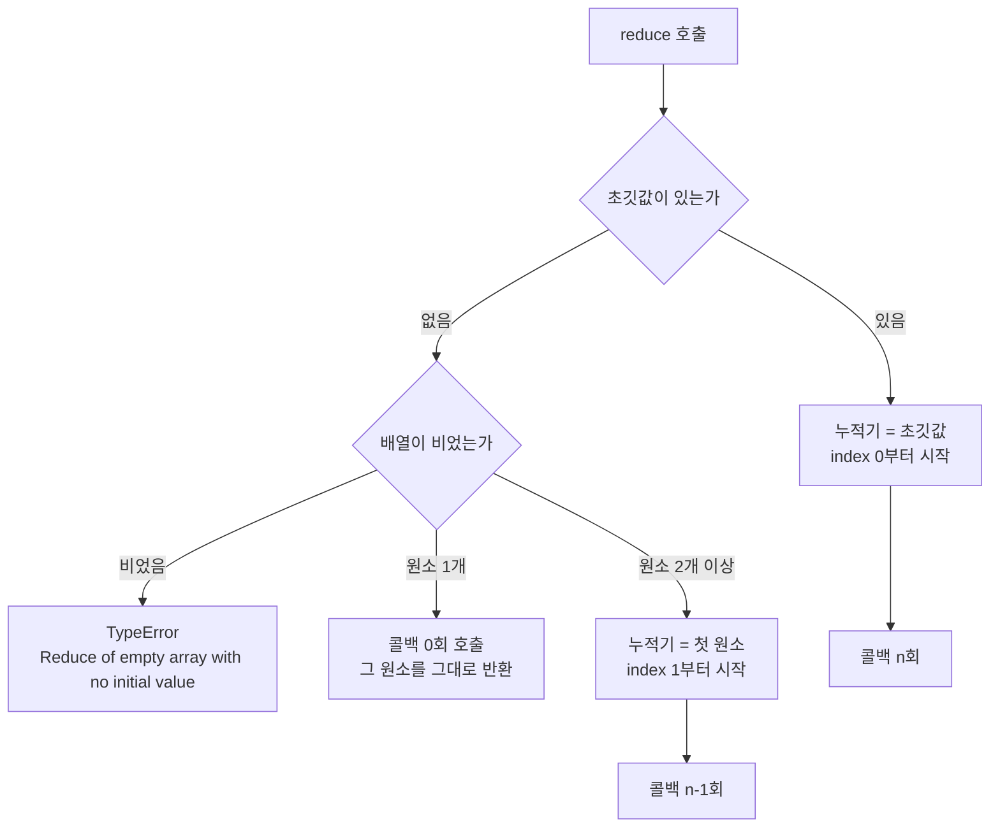

**TL;DR**

이 두 문제에서 걸리는 지점은 정렬 알고리즘도 reduce의 성능도 아니다. 인자를 생략했을 때 언어가 그 자리에 무엇을 넣는지다.

`sort()`의 빠진 비교자는 편의 기능이 아니라 규격이다. 모든 원소를 문자열로 바꾼 뒤 UTF-16 코드 유닛 순서로 비교한다. `reduce()`의 빠진 초깃값도 규격이다. 배열의 첫 원소가 누적기가 되고 그 원소의 타입이 결과 타입을 정한다.

두 자리 모두 예외를 던지지 않는다. 잘못된 결과가 정상 값의 모양을 하고 다음 코드로 흘러간다는 뜻이다.

시리즈에서 다루는 열 문제 중 1번 Array Sort Comparison과 6번 Reduce Math가 이 규칙 하나에서 나온다.

## 가격 배열을 정렬했더니 9가 맨 뒤로 간 이유

상품 가격 네 개를 오름차순으로 놓으려고 `sort()`를 부른다.

```js
const prices = [10, 9, 100, 1]
console.log(prices.sort())
// [ 1, 10, 100, 9 ]
```

1과 10과 100은 순서가 맞고 9만 맨 뒤에 있다. 에러도 경고도 없다.

비교자를 넘기지 않으면 `Array.prototype.sort`는 두 원소를 비교하기 전에 각각에 문자열 변환을 적용한다. 비교되는 값은 `10`과 `9`가 아니라 `"10"`과 `"9"`다. 문자열 비교는 앞에서부터 코드 유닛을 하나씩 본다. `'1'`은 U+0031이고 `'9'`는 U+0039다. 첫 글자에서 이미 `"10"`이 작다는 답이 나오고 남은 자릿수는 읽히지 않는다.



이 규칙은 자릿수가 모두 같을 때 우연히 정답을 만든다.

```js
[30, 12, 45].sort()   // [ 12, 30, 45 ]
[1, 5, 20, 10].sort() // [ 1, 10, 20, 5 ]
```

앞 줄은 맞고 뒷줄은 틀렸다. 두 줄의 코드는 같다. 데이터가 두 자리로만 채워져 있던 동안에는 문제가 드러나지 않는다. 목록에 세 자리 값이 처음 들어오는 날 정렬이 어긋난다.

음수는 자릿수가 같아도 깨진다.

```js
[-1, -10, -2].sort() // [ -1, -10, -2 ]
```

`"-1"`, `"-10"`, `"-2"`는 이미 문자열 오름차순이라 자리를 바꿀 이유가 없다. 정렬 함수가 정상적으로 끝났고 배열은 그대로다.

숫자 순서를 원하면 비교자로 순서를 직접 선언한다.

```js
[10, 9, 100, 1].sort((a, b) => a - b) // [ 1, 9, 10, 100 ]
```

`undefined`는 비교자와 무관하게 움직인다.

```js
[3, undefined, 1].sort()             // [ 1, 3, undefined ]
[3, undefined, 1].sort((a, b) => a - b) // [ 1, 3, undefined ]
```

`undefined`인 원소는 비교자에 전달되지 않고 정렬이 끝난 배열의 뒤로 모인다. `a - b`가 `NaN`을 반환할 일 자체가 생기지 않는다. 비교자를 붙였다고 해서 모든 원소가 비교자를 거치는 것은 아니다.

`sort`는 새 배열을 만들지 않고 원본을 정렬한 뒤 그 원본을 반환한다. 정렬 결과를 다른 변수에 담아도 원본은 이미 바뀌어 있다. 원본을 남기려면 `toSorted`를 쓰거나 복사본을 정렬한다.

> 정렬 함수에 넘기지 않은 비교자는 "기본"이 아니라 "문자열 기준"이라는 선언이다.

정렬 대상이 실제로 문자열이면 기본 비교자가 맞는 선택이다. 한글과 영문이 섞인 목록에서 사람이 기대하는 순서를 원한다면 코드 유닛 순서는 답이 아니고 `localeCompare`가 필요하다. 이 절은 순서 규칙만 다뤘고 로케일 정렬은 범위 밖이다.

## `a > b` 비교자가 배열을 그대로 두는 이유

비교자를 붙이면 안전할 것 같지만 형태를 틀리면 정렬이 조용히 사라진다.

```js
[3, 1, 2].sort((a, b) => a > b) // [ 3, 1, 2 ]
```

원소 서른 개로 늘려도 결과는 입력 그대로다.

```js
const big = Array.from({ length: 30 }, (_, i) => (i * 7 + 3) % 30)
big.join(',')
// 3,10,17,24,1,8,15,22,29,6,13,20,27,4,11,18,25,2,9,16,23,0,7,14,21,28,5,12,19,26

[...big].sort((a, b) => a > b).join(',')
// 3,10,17,24,1,8,15,22,29,6,13,20,27,4,11,18,25,2,9,16,23,0,7,14,21,28,5,12,19,26
```

비교자가 반환하는 값은 순서 신호다. 음수면 앞의 값이 먼저, 양수면 뒤의 값이 먼저, 0이면 순서 유지다. 불리언은 숫자 자리에서 `true`가 1, `false`가 0으로 바뀐다. 음수가 나올 통로가 없다는 뜻이다. "이 둘은 자리를 바꿔야 한다"는 신호를 한 번도 보내지 못한 채 비교가 끝난다.

명세는 순서와 무관한 비교자를 넘겼을 때의 결과를 구현에 맡긴다. 위 출력은 Node 20의 V8에서 관측한 값이고 다른 엔진에서 같은 배열이 나온다는 보장은 없다. 어느 쪽이든 정렬은 일어나지 않는다.

> 비교자는 참과 거짓이 아니라 부호를 반환한다. 참·거짓을 반환하는 비교자는 실패하지 않고 아무 일도 하지 않는다.

`a - b`는 숫자에서만 부호가 성립한다. 문자열 필드로 정렬할 때 뺄셈을 그대로 옮기면 `NaN`이 나오고, `NaN`은 음수도 양수도 아니라 다시 아무 일도 일어나지 않는다. 이 절이 막는 것은 형태가 틀린 비교자까지고, 정렬 키를 잘못 고른 경우는 여전히 사람이 봐야 한다.

## reduce에서 초깃값을 생략하면 사라지는 것

장바구니 합계를 구하는 코드가 숫자 대신 문자열을 내놓는다.

```js
const parts = ['1', '2', '3']
parts.reduce((acc, cur) => acc + cur) // '123'
```

초깃값이 없으면 배열의 첫 원소가 그대로 누적기가 된다. 첫 누적기가 `'1'`이라는 문자열이고 `+`는 피연산자 한쪽이 문자열이면 덧셈 대신 연결을 한다. 콜백 안의 `+`는 정상 동작했다. 누적기의 타입이 처음부터 문자열이었을 뿐이다.

객체 배열에서는 결과가 더 알아보기 어렵다.

```js
const items = [{ price: 1200 }, { price: 800 }]

items.reduce((sum, item) => sum + item.price)    // '[object Object]800'
items.reduce((sum, item) => sum + item.price, 0) // 2000
```

첫 줄의 누적기는 `{ price: 1200 }`이고 객체와 숫자를 `+`로 묶으면 객체가 문자열로 변환된다. 화면에는 `[object Object]800`이 찍힌다. 타입 오류로 잡히지 않고 문자열 하나로 통과한다.

초깃값 유무는 타입만 바꾸지 않는다. 순회 자체가 달라진다.



원소 하나짜리 배열에 초깃값을 주지 않으면 콜백이 한 번도 실행되지 않는다.

```js
let calls = 0
const r = [7].reduce((a, b) => { calls++; return a + b })
// r === 7, calls === 0
```

콜백 안에 로깅이나 검증을 넣어 뒀다면 그 한 원소만 검사를 건너뛴다. 배열 길이가 1이 되는 순간에만 나타나는 분기다.

인덱스도 한 칸 밀린다.

```js
const seen = []
;[10, 20, 30].reduce((a, c, i) => { seen.push(i); return a + c })
// seen: [1, 2]

const seenWithSeed = []
;[10, 20, 30].reduce((a, c, i) => { seenWithSeed.push(i); return a + c }, 0)
// seenWithSeed: [0, 1, 2]
```

인덱스로 다른 배열을 참조하는 콜백이라면 초깃값을 붙이거나 빼는 것만으로 참조 대상이 통째로 어긋난다.

빈 배열은 유일하게 예외를 던지는 자리다.

```js
[].reduce((a, b) => a + b)    // TypeError: Reduce of empty array with no initial value
[].reduce((a, b) => a + b, 0) // 0
```

필터링 결과가 비는 순간 합계 코드가 죽는다. 초깃값 `0`은 이 예외까지 같이 막는다.

> 초깃값은 시작 숫자가 아니라 누적기의 타입 선언이다. 이 선언이 없으면 타입은 데이터의 첫 원소가 정한다.

초깃값이 객체나 배열이면 다른 문제가 생긴다. 콜백이 그 초깃값을 매번 변형하면 reduce 호출들이 같은 참조를 나눠 쓰게 된다. 그쪽은 얕은 복사 문제라 이 시리즈 3편에서 다룬다.

## 두 문제가 남긴 규칙

`sort()`와 `reduce()`는 하는 일이 다르다. 빠진 인자를 언어가 규격대로 채운다는 점만 같다.

1. 생략한 인자 자리에는 편의 기본값이 아니라 명세가 들어간다. `[10, 9, 100, 1].sort()`가 `[1, 10, 100, 9]`를 내놓는 것이 증명이다. 문자열 비교라는 규격이 그대로 실행됐다.
2. 결과의 타입은 연산자가 아니라 피연산자가 정한다. `['1', '2', '3'].reduce((a, b) => a + b)`가 `'123'`이 되는 것이 증명이다. `+`는 숫자 덧셈과 문자열 연결 중 어느 쪽인지를 스스로 정하지 않는다.
3. 두 규칙 모두 예외를 던지지 않는다. `[30, 12, 45].sort()`가 정답을 내놓는 동안에는 코드가 맞는지 틀린지 구분되지 않는다.

세 번째가 앞의 둘보다 다루기 어렵다. 틀린 결과에 예외가 붙어 있으면 테스트가 잡는다. `[1, 10, 100, 9]`는 배열이고 `'123'`은 문자열이라 다음 함수로 그대로 전달된다. 문제가 드러나는 자리는 값을 만든 곳이 아니라 그 값을 화면에 그리는 곳이다.

> **이 글에서 다루지 않은 것**: 정렬 안정성과 로케일 정렬. 현재 명세는 `sort`가 안정 정렬임을 보장하지만 같은 키를 가진 원소들의 순서를 설계 근거로 삼는 문제는 별도 판단이 필요하다. `localeCompare`와 `Intl.Collator`의 비용도 여기서는 재지 않았다.

다음 편은 값이 같은지를 묻는 자리다. `sort`가 두 값의 순서를 물었다면 `Set`은 두 값이 같은 것인지를 묻는다. 그 질문에 `===`가 답하지 않는다.
