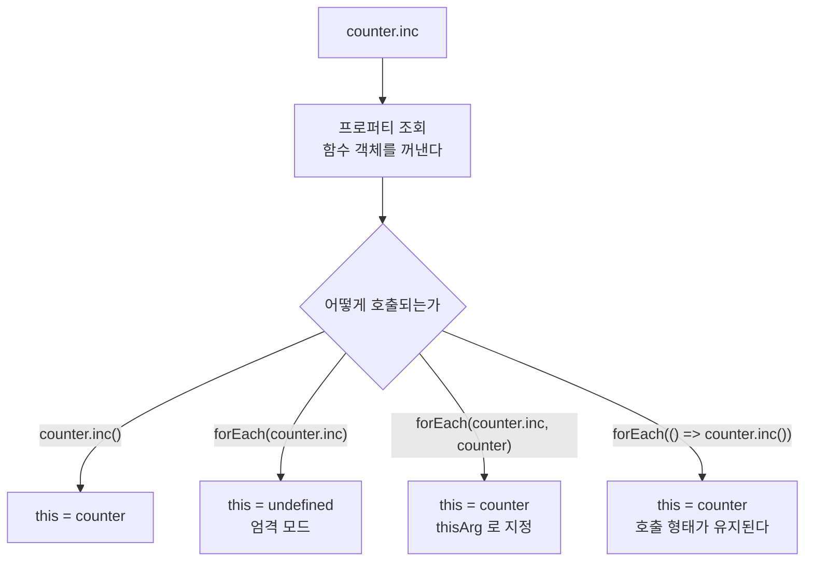

**TL;DR**

프로퍼티 접근과 함수 호출은 각각 두 단계로 나뉜다. 이름을 어디서 찾았는지와 찾은 값이 어디에 적용되는지는 다른 질문이다.

읽기는 프로토타입 체인을 올라가고 쓰기는 올라가지 않는다. `child.retry++` 한 줄이 프로토타입에서 값을 읽고 자기 자신에 값을 쓴다. 반면 프로토타입에 있는 객체를 꺼내 변형하면 쓰기가 일어나지 않은 채로 공유 상태가 바뀐다.

호출도 같은 구조다. 메서드를 객체에서 꺼내는 순간 소속이 끊긴다. 콜백에 몇 개의 인자가 들어가는지는 콜백을 넘긴 쪽이 아니라 부르는 쪽이 정한다.

열 문제 중 4번 Prototypal Inheritance와 9번 Array Method Binding이 이 비대칭에서 나온다.

## `child.retry++` 한 줄이 두 객체를 건드리는 이유

기본값 객체를 프로토타입으로 삼아 인스턴스를 만든다.

```js
const base = { retry: 3 }
const child = Object.create(base)

child.retry     // 3
child.retry++
child.retry     // 4
base.retry      // 3
```

읽을 때는 `base`의 값이 보였는데 증가시킨 뒤에는 `child`만 바뀌었다.

프로퍼티 읽기는 객체 자신에서 시작해 없으면 `[[Prototype]]` 링크를 따라 올라간다. `child`에는 `retry`가 없으므로 `base`에서 `3`을 찾는다. 프로퍼티 쓰기는 올라가지 않는다. 대입은 그 객체 자신에 프로퍼티를 만든다. `child.retry++`는 `child.retry = child.retry + 1`이라 읽기가 `base`에서 오고 쓰기가 `child`로 간다.



증가 이후의 상태는 처음과 다르다.

```js
Object.hasOwn(child, 'retry') // true
Object.keys(child)            // [ 'retry' ]
```

`child`는 이제 자기 `retry`를 가진다. 이후의 읽기는 `base`까지 올라가지 않는다. `base.retry`를 바꿔도 `child`에는 반영되지 않는다. 기본값을 프로토타입에 두고 나중에 일괄 변경하는 설계라면, 한 번이라도 대입이 일어난 인스턴스는 그 시점부터 갱신 대상에서 빠진다.

`in`과 `Object.hasOwn`이 답을 나누는 자리도 여기다.

```js
const fresh = Object.create(base)
'retry' in fresh              // true
Object.hasOwn(fresh, 'retry') // false
```

`in`은 체인 전체를 보고 `hasOwn`은 자기 자신만 본다. 값 존재 확인에 두 연산자를 섞어 쓰면 프로토타입에 기본값이 있는 객체에서 서로 다른 분기를 탄다.

`Object.create(null)`로 만든 객체는 체인 자체가 없다.

```js
'toString' in Object.create(null) // false
```

`Object.prototype`이 붙지 않아 `toString`도 `hasOwnProperty`도 없다. 문자열 키 맵으로 쓰기에는 안전하고 그대로 `String()`에 넘기면 예외가 난다.

> 읽기는 체인을 탐색하고 쓰기는 탐색하지 않는다. 두 연산이 같은 표현식 안에 있어도 대상 객체가 다르다.

이 규칙이 설명하는 범위는 데이터 프로퍼티까지다. 프로토타입에 세터가 정의되어 있으면 대입이 자기 프로퍼티를 만들지 않고 그 세터를 호출한다. 접근자 프로퍼티가 섞인 체인에서는 위 문장이 그대로 성립하지 않는다.

## 프로토타입에 올린 배열이 인스턴스 전부에서 공유되는 이유

앞 절의 규칙은 대입이 있을 때의 이야기다. 대입 없이 값을 바꾸면 결과가 반대다.

```js
const base = { tags: [] }
const child = Object.create(base)

child.tags.push('x')

base.tags                    // [ 'x' ]
Object.hasOwn(child, 'tags') // false
```

`child.tags`는 읽기다. 체인을 올라가 `base.tags` 배열의 참조를 가져온다. `push`는 그 배열을 직접 변형한다. `child`에는 대입이 일어난 적이 없으므로 자기 프로퍼티도 생기지 않는다. 프로토타입에 있는 배열 하나를 모든 자식이 나눠 쓴다.

생성자 함수에서도 같다.

```js
function Dog(name) { this.name = name }
Dog.prototype.tricks = []

const a = new Dog('a')
const b = new Dog('b')

a.tricks.push('sit')
b.tricks // [ 'sit' ]
```

`a`에 가르친 기술이 `b`에도 있다. 인스턴스마다 별도 배열을 원하면 생성자 안에서 대입한다.

```js
function Dog(name) {
  this.name = name
  this.tricks = []
}
```

클래스 필드도 같은 자리에 놓인다.

```js
class Cache {
  constructor() { this.store = new Map() }
}
Object.hasOwn(new Cache(), 'store') // true
```

원시값을 프로토타입에 두면 이 문제가 드러나지 않는다.

```js
Dog.prototype.legs = 4
const c = new Dog('c')
c.legs // 4
Dog.prototype.legs = 3
c.legs // 3
```

`c.legs`는 읽을 때마다 체인을 올라가므로 프로토타입 변경이 그대로 보인다. 대입이 없으니 자기 프로퍼티도 생기지 않는다. 이 연결은 편리하기도 하고, 인스턴스 하나가 `c.legs = 5`를 실행한 뒤부터는 그 인스턴스만 연결이 끊긴다.

원시값과 객체가 프로토타입에서 다르게 보이는 이유는 프로토타입이 둘을 다르게 다뤄서가 아니다. 원시값은 대입으로만 바뀌고 객체는 대입 없이도 바뀐다.

> 프로토타입에 놓인 값은 읽기로 공유된다. 공유가 위험해지는 조건은 그 값이 변형 가능한 객체일 때다.

이 절이 다루는 것은 상태 공유까지다. 메서드를 프로토타입에 두는 것은 여전히 인스턴스마다 함수 객체를 만들지 않는 방법이고, 이 글은 그 메모리 차이를 재지 않았다.

## `['1','2','3'].map(parseInt)`가 `[1, NaN, NaN]`인 이유

문자열 배열을 숫자로 바꾸려고 `parseInt`를 그대로 넘긴다.

```js
['1', '2', '3'].map(parseInt) // [ 1, NaN, NaN ]
```

첫 항목만 성공한다.

`map`은 콜백을 부를 때 항상 인자 세 개를 넘긴다. 원소, 인덱스, 배열이다. 콜백이 몇 개를 받겠다고 선언했는지는 호출 방식에 영향을 주지 않는다. `parseInt`는 두 번째 인자를 진법으로 읽는다.

```js
parseInt('1', 0) // 1
parseInt('2', 1) // NaN
parseInt('3', 2) // NaN
```

진법 `0`은 지정하지 않은 것과 같게 처리되어 10진수로 읽힌다. 진법 `1`은 유효 범위인 2에서 36 밖이라 `NaN`이다. 진법 `2`에서 `'3'`은 표현할 수 없는 숫자라 `NaN`이다. 세 결과가 그대로 배열이 된다.

값에 따라 답이 달라져서 더 알아보기 어렵다.

```js
['10', '10', '10'].map(parseInt) // [ 10, NaN, 2 ]
['1', '7', '11'].map(parseInt)   // [ 1, NaN, 3 ]
```

두 번째 줄에서 `'11'`은 진법 2로 읽혀 `3`이 된다. `NaN`이 아니라 숫자다. 타입 검사도 통과하고 값만 틀린다.

`Number.parseInt`는 `parseInt`와 같은 함수라 결과도 같다.

```js
['1', '2', '3'].map(Number.parseInt) // [ 1, NaN, NaN ]
```

두 번째 인자를 읽지 않는 함수는 안전하다.

```js
['1', '2', '3'].map(Number)     // [ 1, 2, 3 ]
['1', '2', '3'].map(parseFloat) // [ 1, 2, 3 ]
[1.4, 2.6, 3.5].map(Math.round) // [ 1, 3, 4 ]
```

`Number`와 `parseFloat`와 `Math.round`는 인자를 하나만 읽고 나머지를 버린다. 함수를 그대로 넘겨도 되는지는 그 함수가 두 번째 인자로 무엇을 하는지에 달렸다. `parseInt.length`가 2이고 `Number.length`가 1인 것이 그 차이다.

인자 개수는 메서드마다 다르다.

```js
const seen = { map: 0, sort: 0, reduce: 0 }
const items = ['a', 'b', 'c']

items.map((...args) => { seen.map = args.length })
items.sort((...args) => { seen.sort = args.length; return 0 })
items.reduce((...args) => { seen.reduce = args.length })

seen // { map: 3, sort: 2, reduce: 4 }
```

같은 함수를 `map`과 `reduce`에 각각 넘기면 받는 인자가 다르다. 콜백을 재사용할 때 인자 목록이 호출부마다 바뀐다는 뜻이다.

원하는 인자만 전달하려면 감싼다.

```js
['1', '2', '3'].map(n => parseInt(n, 10)) // [ 1, 2, 3 ]
```

> 콜백의 시그니처는 콜백이 아니라 호출자가 정한다. 함수 이름을 그대로 넘기는 코드는 그 호출자의 인자 목록을 전부 받아들이겠다는 선언이다.

이 규칙이 막는 것은 인자 개수 문제까지다. 진법을 명시한 `parseInt(n, 10)`도 `'12abc'`를 `12`로 읽고 `'abc'`를 `NaN`으로 읽는다. 입력 문자열이 온전한 숫자인지는 별도로 확인해야 한다.

## 메서드를 콜백으로 꺼내면 this가 사라지는 이유

카운터 객체의 메서드를 `forEach`에 넘긴다.

```js
const nums = [1, 2, 3]
const counter = { n: 0, inc() { this.n += 1 } }

nums.forEach(counter.inc)
// TypeError: Cannot read properties of undefined (reading 'n')
```

`counter.inc`는 함수 객체를 꺼내는 표현식이다. 꺼낸 함수에는 `counter`와의 연결이 없다. `this`는 호출 시점의 호출 형태로 정해지는데, `forEach`는 콜백을 `thisArg` 없이 부른다. 엄격 모드에서 그때의 `this`는 `undefined`다.

`obj.method()` 형태로 부를 때만 `obj`가 `this`가 된다. 점 표기법은 함수를 찾는 방법이면서 동시에 `this`를 정하는 방법이다. 함수를 변수에 담거나 인자로 넘기면 앞의 역할만 남고 뒤의 역할은 사라진다.



연결을 되살리는 방법은 세 가지다.

```js
const nums = [1, 2, 3]
const counter = { n: 0, inc() { this.n += 1 } }

nums.forEach(counter.inc, counter)      // thisArg
counter.n // 3

nums.forEach(counter.inc.bind(counter)) // bind
counter.n // 6

nums.forEach(() => counter.inc())       // 호출 형태 유지
counter.n // 9
```

`thisArg`는 `map`, `forEach`, `filter`, `some`, `every`, `find`가 받는다. `reduce`와 `sort`에는 없다. 같은 배열 메서드끼리도 시그니처가 다르다.

화살표 함수를 메서드로 쓰면 `thisArg`가 무시된다.

```js
const badCounter = { n: 0, inc: () => { this.n += 1 } }
```

화살표 함수는 자기 `this`를 만들지 않고 정의된 자리의 `this`를 그대로 쓴다. 객체 리터럴은 스코프를 만들지 않으므로 `this`는 모듈의 `this`이고 ES 모듈에서 그 값은 `undefined`다. `bind`도 `call`도 이 함수의 `this`를 바꾸지 못한다.

> 점 표기법은 함수를 찾는 일과 수신자를 정하는 일을 한꺼번에 한다. 함수만 꺼내면 수신자는 따라오지 않는다.

세 가지 복구 방법이 같지는 않다. `bind`는 호출할 때마다 새 함수 객체를 만들 수 있어 렌더마다 새 참조가 내려가면 하위 컴포넌트의 비교가 매번 실패한다. 어느 방법을 쓸지는 참조 동일성이 관측되는지에 달렸고, 이 글은 그 판단까지 다루지 않았다.

## 두 문제가 남긴 규칙

프로토타입 조회와 콜백 호출은 서로 다른 기능이다. 조회와 적용이 분리되어 있다는 점이 같다.

1. 이름을 찾는 경로와 값을 쓰는 경로가 다르다. `child.retry++` 뒤에 `base.retry`가 `3`으로 남는 것이 증명이다. 한 표현식 안에서 읽기는 프로토타입에, 쓰기는 자기 자신에 갔다.
2. 대입 없이 바뀌는 상태는 소유자를 만들지 않는다. `child.tags.push('x')` 뒤에 `Object.hasOwn(child, 'tags')`가 `false`인 것이 증명이다. 값은 바뀌었고 그 값을 바꾼 객체는 자기 프로퍼티를 얻지 못했다.
3. 함수를 꺼내는 표현식과 호출하는 표현식이 다르면 수신자와 인자가 모두 호출부에서 정해진다. `['1','2','3'].map(parseInt)`가 `[1, NaN, NaN]`이 되고 `forEach(counter.inc)`가 `TypeError`가 되는 것이 각각의 증명이다.

세 규칙에서 위험한 쪽은 2번이다. 1번과 3번은 값이 틀리거나 예외가 나서 관측된다. 2번은 인스턴스 하나를 조작했을 때 다른 인스턴스가 바뀌는 형태라, 인스턴스를 하나만 만드는 테스트에서는 드러나지 않는다.

> **이 글에서 다루지 않은 것**: `class` 문법이 만드는 프로토타입 구조와 `super`의 조회 규칙. `super.method()`는 조회를 홈 객체의 프로토타입에서 시작하면서 `this`는 현재 수신자로 유지한다. 조회와 수신자가 갈라지는 또 하나의 자리라 별도로 봐야 한다.

지금까지는 값이 어디에 있고 이름이 어디서 발견되는지를 다뤘다. 다음 편은 시간이다. 코드에 적힌 순서와 실행되는 순서가 어긋나는 자리, 그리고 적혀 있어도 실행되지 않는 자리를 본다.
