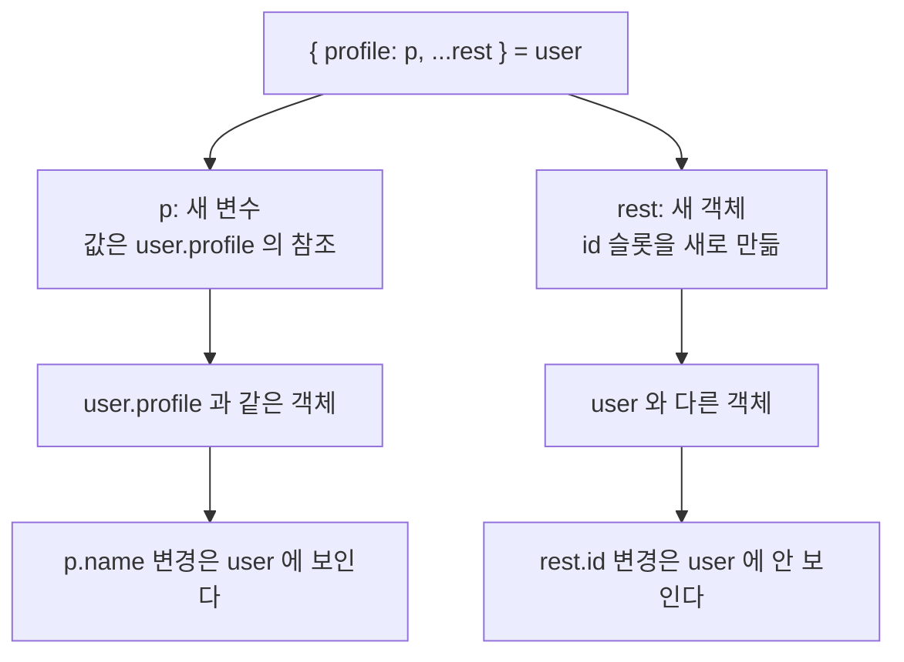

**TL;DR**

`Object.freeze`와 스프레드는 하는 일이 다르다. 경계를 긋는 깊이가 한 겹이라는 점만 같다.

`freeze`는 그 객체의 프로퍼티 슬롯만 잠근다. 슬롯에 담긴 참조가 가리키는 객체는 그대로 쓰기 가능하다. 스프레드는 그 객체의 열거 가능한 자기 프로퍼티만 새 슬롯에 옮긴다. 값이 참조면 참조가 복사되고 가리키는 대상은 하나 그대로다.

두 연산 모두 첫 겹 바깥에서는 아무것도 보장하지 않는다. 코드에서 "불변"과 "복사본"이라는 단어가 실제로 덮는 범위가 여기서 정해진다.

열 문제 중 3번 Deep Object Mutability와 8번 Spread and Rename이 이 경계의 안쪽과 바깥쪽이다.

## 동결한 설정 객체의 값이 바뀌는 이유

설정을 고정하려고 `Object.freeze`로 감싼다.

```js
const config = Object.freeze({ retry: { count: 3 }, timeout: 1000 })

config.retry.count = 5
config.retry.count // 5
```

값이 바뀌었다. 동결은 실패하지 않았다.

`Object.freeze(obj)`는 `obj`를 확장 불가로 만들고 `obj`의 자기 프로퍼티를 쓰기 불가와 재정의 불가로 바꾼다. 여기서 프로퍼티는 `retry`와 `timeout` 두 개다. `retry` 슬롯에 담긴 값은 객체를 가리키는 참조다. 잠긴 것은 그 참조를 다른 값으로 바꾸는 일이다. 참조가 가리키는 객체는 `freeze`의 대상에 들어간 적이 없다.

```js
Object.isFrozen(config)       // true
Object.isFrozen(config.retry) // false
```

첫 겹 프로퍼티에 직접 쓰면 막힌다. 막히는 방식은 코드가 실행되는 모드에 달렸다.

```js
'use strict'
config.timeout = 2000
// TypeError: Cannot assign to read only property 'timeout' of object '#<Object>'
```

느슨한 모드에서는 같은 코드가 예외 없이 무시된다.

```js
// 비엄격 모드
config.timeout = 2000
config.timeout // 1000
```

ES 모듈과 클래스 본문은 항상 엄격 모드라 예외가 뜬다. 스크립트로 로드되는 코드나 `'use strict'`가 없는 CommonJS 파일에서는 쓰기가 조용히 사라진다. 같은 `freeze`가 어떤 파일에서는 예외를 던지고 어떤 파일에서는 아무 말도 하지 않는다.

배열도 같은 규칙을 받는다.

```js
const list = Object.freeze([1, 2, 3])
list.push(4)
// TypeError: Cannot add property 3, object is not extensible
```

`push`는 새 인덱스 프로퍼티를 추가하려다 확장 불가에 걸린다. 이 예외는 엄격 모드가 아니어도 발생한다. 내부 동작이 쓰기 실패를 예외로 올리기 때문이다.

모든 겹을 잠그려면 재귀로 내려간다.

```js
const deepFreeze = obj => {
  Object.values(obj).forEach(value => {
    if (value && typeof value === 'object') deepFreeze(value)
  })
  return Object.freeze(obj)
}

Object.isFrozen(deepFreeze({ retry: { count: 3 } }).retry) // true
```

순환 참조가 있으면 이 함수는 스택을 넘긴다.

```js
const node = { name: 'a' }
node.self = node
deepFreeze(node)
// RangeError: Maximum call stack size exceeded
```

부모를 가리키는 필드를 가진 트리 노드가 이 경우다. 방문한 객체를 `Set`에 기록해 두면 멈춘다. 그러면 이 함수는 이미 그래프 순회기다. 설정 객체 한 겹을 얼리려던 일이 그래프 순회 문제로 바뀐다.

> `freeze`가 잠그는 대상은 값이 아니라 프로퍼티 슬롯이다. 슬롯 안에 참조가 들어 있으면 잠금은 그 참조에서 멈춘다.

동결이 막는 것은 이 객체를 경유하는 쓰기까지다. 같은 객체를 가리키는 다른 참조가 있으면 그쪽으로는 변경이 들어온다. `freeze` 이전에 넘어간 참조가 어디에 남아 있는지는 이 API가 답하지 않는다.

## `{ ...user }`가 지키는 경계와 넘기는 경계

응답 객체를 고쳐 쓰기 전에 복사본을 만든다.

```js
const user = { id: 1, profile: { name: 'kim', tags: ['a'] } }
const copy = { ...user }

copy.profile.name = 'lee'
user.profile.name // 'lee'
```

원본이 함께 바뀐다. 첫 겹은 분리됐다.

```js
copy.id = 9
user.id // 1
```

스프레드는 원본의 열거 가능한 자기 프로퍼티를 하나씩 읽어 새 객체에 쓴다. `profile` 프로퍼티에서 읽은 값은 객체가 아니라 객체를 가리키는 참조다. 그 참조가 새 슬롯에 복사되고 가리키는 객체는 여전히 하나다.



배열도 같다.

```js
const src = [{ n: 1 }]
const cloned = [...src]
cloned[0].n = 2
src[0].n // 2
```

스프레드가 옮기지 않는 것도 있다. 프로토타입이 그중 하나다.

```js
class Cart {
  constructor() { this.items = [] }
  add() { return 'added' }
}

const cart = new Cart()
typeof cart.add            // 'function'
typeof ({ ...cart }).add   // 'undefined'
```

`add`는 `Cart.prototype`에 있고 스프레드는 자기 프로퍼티만 읽는다. 클래스 인스턴스를 스프레드로 복사하면 데이터만 남은 평범한 객체가 되고 메서드 호출은 그 시점이 아니라 나중에 실패한다.

열거 불가 프로퍼티도 빠진다.

```js
const hidden = Object.defineProperty({ a: 1 }, 'secret', { value: 2, enumerable: false })
Object.keys({ ...hidden }) // [ 'a' ]
```

심볼 키는 옮겨진다. 열거 가능한 심볼 키는 복사 대상에 포함된다.

게터는 함수가 아니라 결과가 옮겨진다.

```js
const src2 = { get now() { return Date.now() } }
const spread = { ...src2 }
Object.getOwnPropertyDescriptor(spread, 'now')
// { value: 1753..., writable: true, enumerable: true, configurable: true }
```

원본에서 `now`는 읽을 때마다 계산되는 값이고 복사본에서는 스프레드가 실행된 순간의 고정 값이다. 시간이나 파생 계산을 게터로 노출한 객체를 스프레드로 넘기면 그 시점에 얼어붙는다.

키가 겹칠 때는 나중에 쓰인 쪽이 남는다.

```js
({ ...{ a: 1 }, a: 2 })          // { a: 2 }
({ a: 2, ...{ a: 1 } })          // { a: 1 }
({ ...{ a: 1 }, ...{ a: undefined } }) // { a: undefined }
```

세 번째 줄이 기본값 병합에서 자주 걸린다. `{ ...defaults, ...options }`에서 `options.a`가 명시적으로 `undefined`면 기본값이 살아남지 않고 `undefined`가 덮어쓴다. 값이 없다는 뜻으로 `undefined`를 넘긴 호출자와 기본값을 기대한 코드가 여기서 어긋난다.

모든 겹을 나누려면 다른 API가 필요하다.

```js
const nested = structuredClone(user)
nested.profile.tags.push('b')
user.profile.tags   // [ 'a' ]
nested.profile.tags // [ 'a', 'b' ]
```

`structuredClone`은 순환 참조를 처리하고 `Map`, `Set`, `Date`, `RegExp`, 타입 배열을 값으로 복제한다. 옮기지 못하는 것도 분명하다.

```js
structuredClone({ fn() {} })
// DOMException: fn(){} could not be cloned.
```

함수와 DOM 노드는 복제 대상이 아니라 예외다. 프로토타입도 유지되지 않아 클래스 인스턴스는 평범한 객체로 돌아온다. 동결 상태도 따라가지 않는다.

```js
Object.isFrozen(structuredClone(Object.freeze({ a: 1 }))) // false
```

> 스프레드는 슬롯을 새로 만들고 값은 그대로 옮긴다. 값이 참조면 "복사본"이라는 이름은 첫 겹까지만 사실이다.

`structuredClone`이 보장하는 것은 데이터 그래프의 분리까지다. 큰 객체를 요청마다 복제하는 비용은 여기서 재지 않았다. 복제 대신 변경 경로를 좁히는 선택지도 남아 있다.

## 구조분해의 이름 바꾸기가 복사가 아닌 이유

구조분해에서 이름을 바꾸면 값이 새로 생긴 것처럼 보인다.

```js
const { profile: p, ...rest } = user

p === user.profile // true
Object.keys(rest)  // [ 'id' ]
```

`profile: p`는 새 변수 `p`를 만들고 `user.profile`에서 읽은 값을 넣는다. 읽은 값이 참조이므로 `p`는 원본과 같은 객체를 가리킨다. 이름만 바뀌었다.

`rest`는 스프레드와 같은 규칙으로 만들어진 새 객체다. 앞에서 꺼낸 키는 빠지고 나머지 열거 가능한 자기 프로퍼티가 새 슬롯에 담긴다. `rest` 자체는 원본과 다른 객체다. `rest` 안의 참조들은 여전히 원본과 공유된다.

`rest`가 흔히 쓰이는 자리는 특정 필드를 지우는 코드다.

```js
const { password, ...safeUser } = rawUser
```

`safeUser`에는 `password` 키가 없다. 이 코드가 보장하는 범위는 첫 겹이다. `rawUser.profile.password` 같은 중첩 필드가 있으면 `safeUser.profile`이 원본과 같은 객체라 그대로 따라간다. 응답을 만들기 전에 민감 필드를 지우는 용도라면 어느 겹까지 검사했는지가 그 코드의 실제 범위다.



변수 이름이 바뀌었다는 사실과 값이 분리됐다는 사실은 서로를 뜻하지 않는다. 이름 바꾸기는 바인딩의 문제고 복사는 값의 문제다.

> 구조분해의 이름 바꾸기는 새 바인딩을 만들 뿐 새 값을 만들지 않는다. `rest`만 새 객체다.

이 규칙이 답하는 것은 어떤 슬롯이 새로 생기는지까지다. 그 슬롯에 담긴 참조를 누가 언제 변경하는지는 코드의 다른 곳에 있다. 참조를 넘겨받은 쪽이 읽기만 한다는 보장은 타입으로도 잡히지 않는다.

## 두 문제가 남긴 규칙

`freeze`와 스프레드는 반대 방향의 연산이다. 하나는 쓰기를 막고 하나는 새 슬롯을 만든다. 멈추는 깊이가 같다.

1. 두 연산의 단위는 객체가 아니라 프로퍼티 슬롯이다. `Object.isFrozen(config)`이 `true`이고 `Object.isFrozen(config.retry)`가 `false`인 것이 증명이다. 잠긴 것과 잠기지 않은 것이 한 객체 안에 공존한다.
2. 참조를 복사하는 일과 대상을 복사하는 일은 다르다. `copy.id = 9`가 원본을 건드리지 않고 `copy.profile.name = 'lee'`가 원본을 바꾸는 것이 한 줄 차이로 보여 주는 증명이다.
3. 새 이름을 얻은 값은 새 값이 아니다. `p === user.profile`이 `true`인 것이 반례다. 구조분해가 만드는 새 객체는 `rest` 하나다.

세 규칙이 같은 곳을 가리킨다. 코드에 적힌 "불변"과 "복사"는 값의 성질이 아니라 어떤 슬롯에 적용됐는지의 문제다. 깊이를 적지 않은 보장은 한 겹짜리 보장이다.

> **이 글에서 다루지 않은 것**: 구조 공유 기반 불변 자료구조. 매번 복제하는 대신 바뀐 경로만 새로 만들고 나머지를 공유하는 방식은 복사 비용과 참조 동일성 비교를 함께 바꾼다. 그 선택은 렌더 비교 전략과 묶여 있어 별도로 봐야 한다.

지금까지 두 편은 값이 어디에 있는지를 다뤘다. 다음 편은 이름이 어디에서 발견되는지다. 프로토타입 체인을 타고 올라간 조회와 그 자리에서 일어나는 쓰기가 같은 곳을 가리키지 않는다.
