**TL;DR**

`Set`이 중복을 지운다는 설명은 절반만 맞다. 무엇을 중복으로 볼지는 `Set`이 정하지 않는다. SameValueZero라는 판정 규칙이 정한다.

이 규칙은 `===`와 두 군데에서 갈라진다. `NaN`은 자기 자신과 같다고 본다. `+0`과 `-0`도 하나로 본다. 객체는 내용이 아니라 참조로 비교한다. 중복 제거가 실패하는 자리와 성공하는 자리가 여기서 전부 결정된다.

순서는 별개의 규칙이다. `Set`은 삽입 순서를 보존하고 정렬하지 않는다. 이미 있는 값을 다시 넣어도 위치는 그대로다. 지웠다가 다시 넣으면 맨 뒤로 간다.

열 문제 중 2번 A Set of Objects와 10번 Set Uniqueness and Ordering이 이 두 규칙의 앞뒤다.

## 모양이 같은 객체 두 개가 Set에 모두 남는 이유

API 응답에서 중복 사용자를 지우려고 `Set`에 넣는다.

```js
const users = [{ id: 1 }, { id: 2 }, { id: 1 }]
const unique = [...new Set(users)]
unique.length // 3
```

세 개가 그대로 남는다. `id: 1`인 항목은 화면에 두 번 그려진다.

`Set`은 새 값을 넣을 때 이미 들어 있는 값들과 SameValueZero로 비교한다. 객체에서 이 비교는 참조 비교다. `{ id: 1 }` 리터럴을 두 번 쓰면 객체도 두 개 만들어진다. 프로퍼티가 같아도 서로 다른 주소다.

```js
({ id: 1 }) === ({ id: 1 }) // false
```

같은 참조를 두 번 넣을 때만 하나로 합쳐진다.

```js
const one = { id: 1 }
new Set([one, one]).size // 1
new Set([{ id: 1 }, { id: 1 }]).size // 2
```



조회도 같은 규칙을 쓴다. 내용이 같은 객체를 새로 만들어 `has`에 넘기면 없다고 답한다.

```js
const seen = new Set([one])
seen.has({ id: 1 }) // false
seen.has(one)       // true
```

중복 판정의 기준이 `id`라면 그 기준을 코드로 적어야 한다. 객체를 키로 쓰는 대신 `id`를 키로 쓰는 `Map`이 그 자리를 맡는다.

```js
const byId = new Map(users.map(user => [user.id, user]))
Array.from(byId.values()) // [ { id: 1 }, { id: 2 } ]
```

`Map`의 키는 원시값 `1`이라 SameValueZero가 값 비교로 동작한다. 같은 `id`가 두 번 들어오면 나중 항목이 앞의 항목을 덮는다. 최신 값을 남길지 최초 값을 남길지는 이 덮어쓰기 방향으로 정해진다.

직렬화로 키를 만드는 방법도 자주 보인다.

```js
[...new Set(users.map(user => JSON.stringify(user)))]
// [ '{"id":1}', '{"id":2}' ]
```

문자열이 되었으니 중복은 사라진다. 다만 이 키는 프로퍼티 순서에 의존한다.

```js
JSON.stringify({ a: 1, b: 2 }) === JSON.stringify({ b: 2, a: 1 }) // false
```

두 객체는 같은 데이터를 담고 있지만 다른 키가 된다. 서버가 필드 순서를 바꿔 보내거나 클라이언트에서 객체를 재조립하는 경로가 하나라도 있으면 중복 제거가 조용히 풀린다. `undefined` 값과 함수를 가진 프로퍼티는 직렬화 과정에서 사라지므로, 그 필드로 구분되던 두 객체는 같은 키가 된다.

> 중복 판정의 기준이 데이터에 있으면 그 기준을 키로 꺼내 놓아야 한다. `Set`에 객체를 그대로 넣는 코드는 "참조가 같은 것만 중복"이라는 기준을 선택한 것이다.

`Map` 키 방식이 막는 것은 같은 배열 안의 중복까지다. 두 요청의 응답을 나눠 받아 각각 정규화한다면 어느 쪽 값을 진실로 볼지는 이 코드 밖에서 정해야 한다.

## NaN이 Set에서만 자기 자신과 같은 이유

`NaN`은 `===`로 자기 자신과 비교해도 거짓이다. `Set`에서는 반대로 동작한다.

```js
NaN === NaN            // false
new Set([NaN, NaN]).size // 1
```

`Set`이 쓰는 판정은 `===`가 아니라 SameValueZero다. 이름 그대로 `Object.is`에서 `+0`과 `-0`의 구분만 뺀 규칙이다. `Object.is`가 `NaN`을 같다고 보는 성질은 그대로 가져온다.

세 판정이 달라지는 곳은 두 개뿐이다.

| 비교 대상 | `===` | SameValueZero | `Object.is` |
| --- | --- | --- | --- |
| `NaN` 과 `NaN` | false | true | true |
| `+0` 과 `-0` | true | true | false |
| `'1'` 과 `1` | false | false | false |
| 같은 객체 참조 | true | true | true |
| 내용이 같은 다른 객체 | false | false | false |

같은 규칙을 쓰는 API끼리는 답이 일치하고 규칙이 다른 API는 어긋난다.

```js
[NaN].includes(NaN) // true   (SameValueZero)
[NaN].indexOf(NaN)  // -1     (===)
```

`includes`와 `indexOf`를 값 존재 확인에 바꿔 쓰는 코드가 흔한데, 배열에 `NaN`이 들어올 여지가 있으면 두 함수는 다른 답을 낸다. 파싱 실패한 숫자가 배열에 남아 있는 경우가 그 여지다.

`+0`과 `-0`은 `Set`에서 하나로 합쳐진다. 합쳐지는 방향도 정해져 있다.

```js
new Set([0, -0]).size // 1
Object.is([...new Set([-0])][0], -0) // false
```

`-0`만 넣어도 저장되는 값은 `+0`이다. `Set.prototype.add`가 `-0`을 `+0`으로 바꿔서 저장한다. 부호를 유지한 채 꺼낼 방법은 없다. 음수 방향 반올림 결과를 `Set`에 담아 두고 나중에 부호로 분기하는 코드라면 이 자리에서 부호가 사라진다.

타입 변환은 일어나지 않는다.

```js
new Set(['1', 1]).size // 2
```

`==`처럼 느슨하게 비교하는 경로는 없다. 숫자 ID와 문자열 ID가 섞여 들어오면 같은 사용자가 두 항목으로 남는다. 서버가 큰 정수를 문자열로 보내는 경우가 이 자리에 해당한다.

> `Set`의 유일성은 값이 비슷한지가 아니라 SameValueZero로 같은지를 묻는다. `===`로 코드를 읽으면 `NaN` 한 곳에서 예측이 어긋난다.

이 표가 답하는 범위는 판정 기준까지다. 어떤 판정이 그 도메인에서 옳은지는 별개다. 부동소수 계산 결과를 중복 제거할 때 `0.1 + 0.2`와 `0.3`은 어느 규칙에서도 다른 값이다. 허용 오차는 사람이 정해야 한다.

## Set의 순서를 정하는 것

`Set`이 값을 정리해 준다는 인상 때문에 정렬까지 해 줄 것처럼 보인다.

```js
[...new Set([30, 4, 100])] // [ 30, 4, 100 ]
```

넣은 순서 그대로다. `Set`은 삽입 순서를 기록하고 순회할 때 그 순서를 돌려준다. 정렬은 하지 않는다.

이미 있는 값을 다시 넣으면 아무 일도 일어나지 않는다.

```js
const s = new Set([3, 1, 2])
s.add(3)
Array.from(s) // [ 3, 1, 2 ]
```

`3`은 원래 자리인 맨 앞에 있다. "최근에 다시 등장했다"는 사실은 `Set`에 남지 않는다. 최근 방문 목록이나 최근 검색어를 `Set`으로 만들면 이 성질 때문에 순서가 갱신되지 않는다. 갱신하려면 지우고 다시 넣는다.

```js
s.delete(3)
s.add(3)
Array.from(s) // [ 1, 2, 3 ]
```

삭제 후 삽입은 새 삽입이라 맨 뒤로 간다. `Map`도 같다.

문자열을 넣으면 문자 단위로 펼쳐진다.

```js
[...new Set('hello')] // [ 'h', 'e', 'l', 'o' ]
```

`Set` 생성자는 이터러블을 받는다. 문자열도 이터러블이라 문자 하나씩 들어간다. 문자열 하나를 원소로 넣으려면 `new Set(['hello'])`처럼 배열로 감싼다. `add`는 이터러블을 펼치지 않으므로 `new Set().add('hello')`는 원소 하나짜리다.

크기를 읽는 이름도 배열과 다르다.

```js
new Set([1]).size   // 1
new Set([1]).length // undefined
```

`length`는 정의되지 않은 프로퍼티라 `undefined`가 나온다. 그 값을 숫자와 비교하는 조건문은 예외 없이 거짓이 된다. 배열을 `Set`으로 바꾸는 리팩터링에서 `length`가 그대로 남으면 이 자리에서 조건이 뒤집힌다.

> `Set`은 순서를 만들지 않고 기록한다. 순서에 의미를 부여하려면 삽입 시점을 사람이 조정해야 한다.

이 규칙이 보장하는 것은 순회 순서까지다. `Set`의 조회 성능은 명세가 선형 탐색보다 빠른 방식을 요구하지만 구체적인 자료구조와 상수는 엔진에 달려 있다. 원소 수가 적을 때 배열 `includes`보다 항상 빠르다는 근거는 여기에 없다.

## 두 문제가 남긴 규칙

`Set`을 쓰는 코드에서 어긋나는 곳은 자료구조가 아니라 비교 기준이었다.

1. 중복 판정 기준은 자료구조가 아니라 판정 알고리즘이 정한다. `new Set([{ id: 1 }, { id: 1 }]).size`가 2인 것이 증명이다. `Set`은 정상 동작했고 참조 두 개는 실제로 다른 값이다.
2. 도메인 기준과 언어 기준이 다르면 도메인 기준을 키로 꺼내야 한다. `id`를 키로 쓴 `Map`이 답을 바꾼 것이 증명이다. 같은 데이터에 같은 자료구조를 썼는데 결과가 달라진 이유는 키뿐이다.
3. 순서는 값의 성질이 아니라 삽입 이력이다. `s.add(3)`이 위치를 바꾸지 않고 `s.delete(3); s.add(3)`이 바꾸는 것이 증명이다.

1번과 3번은 방향이 반대다. 값의 동일성은 참조라는 값의 성질로 판정된다. 순서는 값과 무관한 이력으로 결정된다. `Set` 하나가 두 종류의 정보를 들고 있고 그중 하나만 `add`로 갱신된다.

> **이 글에서 다루지 않은 것**: `WeakSet`과 `WeakMap`. 참조 동일성을 쓴다는 점은 같지만 순회가 불가능하고 키가 수집 대상이 된다. 캐시 수명을 참조 도달 가능성에 맡기는 설계는 별도로 다뤄야 한다.

객체를 키로 쓰면 참조가 같은지를 묻는다는 사실은 여기서 끝나지 않는다. 다음 편은 그 참조를 복사한다고 믿는 자리다. `{ ...user }`와 `Object.freeze(config)`가 어디까지 새 객체를 만드는지를 본다.
