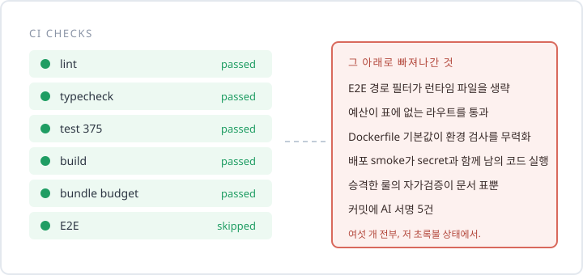
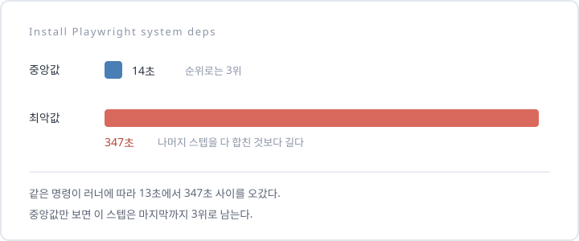

**TL;DR**

루프팩 프론트엔드 1기 10주를 마쳤다.
마지막 주에 게이트를 여덟 개 붙이고 CI가 전부 초록인 걸 보면서 끝났다고 생각했다.
그 상태로 다시 훑었더니 막으려던 게 여섯 개 통과하고 있었다.
더 아픈 건 그다음이었다. 그걸 고치는 과정에서 내가 새 결함 세 개를 만들었다.
10주 동안 늘어난 건 코드 실력보다 의심하는 습관이었다.

## 1주차, 커밋 버튼을 못 눌렀다

첫 주 과제는 개발 환경을 세우는 거였다.
ESLint랑 Prettier, husky를 깔자고 AI에게 시켰더니 몇 초 만에 파일 세 개가 쏟아졌다.
열어보니 다 그럴듯했다. 룰도 촘촘하고 주석도 붙어 있었다.

커밋하려고 손을 올렸는데 거기서 멈췄다.

이 룰이 왜 켜져 있는지 모른다.
왜 error고 왜 warn인지도 모른다.
모르는 채로 통과시키면 이건 내 환경이 아니라 AI가 깔아준 남의 환경이다.

그날 한 일은 룰을 지우는 거였다.
남긴 룰마다 왜 이 레벨인지 한 줄씩 적었다. 절반 넘게 날아갔다.
멘토가 그걸 보고 "왜 이 값이냐"를 또 물었다.

이 질문이 10주 내내 모양만 바꿔서 돌아온다.

## 숫자를 남기라는 말이 제일 귀찮았다

과제마다 절차가 똑같다.

```text
측정 전에 채택 기준을 먼저 고정한다
  → 같은 조건에서 3회 잰다
  → raw 값, 중앙값, 범위를 전부 남긴다
  → 기준에 못 미치면 기각하고, 기각한 이유도 제출한다
```

기각한 것도 제출물이라는 게 처음엔 이해가 안 됐다.
안 쓴 걸 왜 내지? 되는 것만 내면 되는 거 아닌가?

7주차 성능 과제에서 좀 달라졌다.
홈 화면이 느려서 감으로 preload를 붙이려다 멈췄다.
대신 요청 시각이랑 hero geometry를 따로 쟀다.
범인은 폰트 burst였다. preload를 붙였으면 엉뚱한 데를 고칠 뻔했다.

결과는 LCP 중앙값 42,175ms에서 3,384ms.
숫자만 보면 통쾌한데, 사실 저기서 배운 건 42초가 3초 된 게 아니었다.
**감으로 짚은 원인이 틀렸다는 것**이었다.

그때도 범위를 적으라는 건 여전히 귀찮았다. 42,169~42,184ms, 3,264~3,387ms.
이걸 왜 적으라는 건지는 마지막 주에 알게 된다.

## 내 테스트는 통과하고 있었다

8주차가 제일 아팠다.

과제가 테스트를 늘리라고 안 한다.
이미 쓴 테스트에 결함을 일부러 심어보라고 한다.

일곱 개를 심었다. 네 개는 잡혔다.
세 개가 살아남았다.

쿠키에서 `httpOnly`를 떼도 통과했다.
로그아웃 상태에서 보호 링크 prefetch를 열어도 통과했다.
서버가 내려주는 초기 HTML을 비워도 통과했다.

저 테스트들은 그 전까지 매번 초록이었다.
테스트가 375개 있었다. 나는 그게 꽤 촘촘하다고 생각하고 있었다.

개수는 검출력이 아니다.
이 문장을 머리로는 알고 있었다.
내 테스트가 세 번 뚫리는 걸 보고 나서야 손으로 알았다.

## 다 붙였다고 생각한 날

10주차는 검증을 기계에 새기는 주다.

게이트를 여덟 개 붙였다.
계측 함수 직접 import 차단, 커밋 AI 서명 차단, 주석 문체 검사, 번들 예산, 환경 변수 검증, E2E 경로 판정, CI 구성 감사, 그리고 각 게이트의 테스트.

CI를 돌렸더니 전부 초록이었다.
PR 올리고 제출하고 닫았다. 잘 끝났다고 생각했다.

## 그런데 여섯 개가 통과하고 있었다

며칠 뒤에 다시 훑었다.
"게이트를 붙였다"와 "게이트가 막는다"가 같은 말인지 확인해보고 싶었다.

막혀야 할 입력을 직접 넣어봤다.

루트에 파일 몇 개를 만들고 E2E가 도는지 찍었다.

```text
instrumentation.ts   -> 생략
middleware.ts        -> 생략
proxy.ts             -> 생략
src/foo.config.ts    -> 실행
```

앞의 셋은 Next 런타임이 읽는 파일이다.
루트에 런타임 파일을 새로 만들면 제일 비싼 게이트가 그냥 빠진다.
로그에는 흔적도 안 남는다.

내가 만든 필터는 허용 목록이었다.
목록에 있는 경로가 바뀌면 돌린다. 없으면 건너뛴다.
그러니까 모르는 경로는 전부 건너뛴다.

거부 목록이었으면 반대다. 모르는 경로는 전부 돌린다.
같은 목적의 필터인데 기본값 하나가 안전과 위험을 가른다.

원인은 위치였다.
판정이 workflow YAML 안의 bash 30줄이라 실행해볼 방법이 없었다.
스크립트로 빼내고 케이스를 쓰자마자 그 자리에서 드러났다.

가장 미묘한 로직이 가장 검사가 없는 자리에 있었다.



나머지 다섯도 성격이 같았다.
번들 예산은 예산표에 적힌 라우트만 돌았다. 새 라우트를 만들면 5MB든 뭐든 통과했다.
Dockerfile은 필수 환경 변수에 기본값을 채워넣었다. 값을 안 줘도 build가 통과했다.
환경 검사가 막으려던 사고가 환경 검사 안쪽에 있었다.

여섯 개 전부 CI가 초록인 상태로 있었다.

## 더 아팠던 건 그다음이었다

여섯 개를 다 고치고 점수를 다시 매겨봤다.
83점에서 95점이 됐다.

그런데 깎인 5점을 들여다보니 셋 다 **고치는 과정에서 내가 새로 만든 것**이었다.

질문 답변에 내용을 보태다가 "2~4문장" 규격을 넘겼다.
E2E 필터를 갈아엎고 나서 문서가 인용하는 근거를 안 바꿔서, 이제 없는 구현의 로그를 가리키고 있었다.
CI 구성을 바꿨는데 cold 측정을 다시 안 했다.

고치는 작업이 새 결함을 만드는 자리에는 게이트가 없었다.
이건 아직도 답을 못 찾았다.

## 훅이 내 손을 두 번 막았다

작업하다 웃긴 일이 있었다.

팀 규칙에 "커밋에 AI 서명을 넣지 않는다"가 있었다.
문서에만 있었다. 나는 그걸 읽었다.
그러고도 서명이 붙은 커밋을 다섯 개 만들었다.
눈으로 찾아서 지웠다.

그래서 그 규칙을 commit-msg 훅으로 내렸다.
서명이 있던 원본 커밋 다섯 개를 그 스크립트에 넣어보니 전부 거부했다.

며칠 뒤에 내가 만든 그 훅한테 커밋을 거절당했다.
그다음엔 중첩 삼항을 썼다가 lint-staged한테 막혔다.

문서로 적은 규칙은 지켜지지 않았고, 기계로 내린 규칙은 나부터 막았다.
이게 10주에서 제일 선명했던 장면이다.

## 범위를 왜 적으라고 했는지 마지막 날 알았다

CI 시간을 줄이려고 스텝별로 나눠 쟀다.

| 스텝 | 중앙값 |
| --- | ---: |
| 단위·DOM 테스트 | 20s |
| Playwright 시스템 의존성 설치 | 14s |
| E2E | 14s |
| 브라우저 다운로드 | 11s |
| build | 10s |

2위인 의존성 설치는 손 안 대고 4위인 다운로드부터 줄였다.
11초를 6초로 줄였는데 job 전체는 그대로였다.
사전에 채택 기준을 정해둔 덕에 그냥 기각하고 넘어갔다.

마지막 제출 실행에서 job이 429초가 나왔다.
스텝별로 열어봤더니 그중 347초가 의존성 설치 한 스텝이었다.
같은 명령이 다른 러너에서는 13초에서 28초 사이였다.



중앙값 14초로 3위였던 스텝의 최악값이 나머지를 다 합친 것보다 컸다.
중앙값만 보면 이 스텝은 마지막까지 3위로 남는다.

7주차에 범위를 적으라고 했던 이유가 여기서 회수됐다.
중앙값은 "보통 이렇다"를 말하고, 범위는 "최악에 뭘 감당해야 하나"를 말한다.
둘을 같이 안 보면 순위가 틀린 채로 계속 간다.

## 이 과정이 안 맞는 사람

솔직하게 적는다.

**결과물을 빨리 쌓고 싶으면 안 맞는다.**
10주 동안 만든 화면 수는 얼마 안 된다.
같은 화면을 두고 재고 기각하고 다시 재는 시간이 훨씬 길다.
포트폴리오 프로젝트 개수를 늘리는 과정이 아니다.

**AI한테 맡기고 결과만 받고 싶으면 안 맞는다.**
과제는 AI 사용을 권장한다.
대신 판단은 넘기지 말라고 매주 못박는다.
무엇을 required로 둘지, 예산을 얼마로 할지, 무엇을 룰로 올릴지.
이걸 넘기면 그 주에 남는 게 없다.

**리뷰에서 방어할 준비가 없으면 힘들다.**
"보통 이렇게 한다"가 근거로 안 통한다.
매번 왜 그 값이고 왜 그 레벨인지 물어본다. 나는 1주차에 이걸로 하루를 날렸다.

반대로 돌아가는 코드는 쓸 줄 아는데 그게 좋은 코드인지 설명이 막히는 상태라면, 정확히 그 지점을 건드린다.

## 커밋 버튼 앞에서

1주차에 세운 기준은 이거였다.

> 설명할 수 없는 코드는 커밋하지 않는다.

10주차에 형태가 하나 더 붙었다.

> 이 실수가 다시 들어오면 무엇이 막는가.

답이 "리뷰에서 보겠다"면 그 실수는 다시 들어온다.
내가 여섯 번 확인했다.

10주가 지나도 커밋 버튼 앞에서 여전히 멈춘다.
다른 게 있다면, 1주차에는 설명을 못 해서 멈췄고 지금은 막을 장치가 있는지 확인하느라 멈춘다.
이 습관 하나 얻자고 10주를 썼다. 남는 장사였다.
