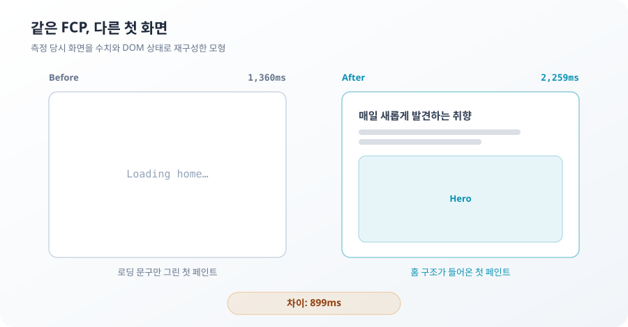

**TL;DR**

성능 수치 두 개를 나란히 놓는 것만으로는 비교가 되지 않는다. 화면, 측정 방식, 원인 후보 중 무엇을 같게 두었는지가 먼저다.

899ms의 원인을 찾는 동안 이 조건을 세 번 놓쳤다. 새로 측정해야 했던 건 한 번뿐이었다. 나머지 두 번은 이미 있던 결과에서 비교 대상을 다시 고르자 잡혔다.

## FCP 두 개를 비교하기 전에

FCP는 첫 콘텐츠가 그려진 시각이다. 이름이 같다고 같은 화면을 재는 것은 아니다. 로딩 문구 한 줄과 제목·설명·Hero가 들어온 홈에도 각각 FCP가 있다.

측정 방식도 값의 일부다. Lighthouse의 기본 simulated 감속은 비감속 관측을 느린 가상 링크에 얹어 재생한다. applied 감속은 브라우저 요청에 제한을 직접 건다. 둘 다 FCP를 내지만 답하는 질문은 다르다.

원인까지 말하려면 조건이 하나 더 붙는다. 후보 둘이 함께 움직이면 어느 쪽이 결과를 바꿨는지 정할 수 없다. 한 후보는 그대로 두고 다른 후보만 달라지는 조건이 필요하다.

| 비교 전에 고정할 것 | 고정하지 않으면 생기는 오류 |
| --- | --- |
| 첫 페인트에 들어온 화면 | 서로 다른 장면의 FCP를 속도 차이로 읽는다 |
| 감속 방식 | 시뮬레이션 차이를 브라우저의 실제 대기로 읽는다 |
| 원인 후보 하나 | 함께 움직인 값 중 하나를 원인으로 고른다 |

이 세 조건을 실제 수치에 대입해 보자.

## 퀴즈 1. 홈은 899ms 느려졌을까

같은 두 빌드를 Lighthouse로 측정했다.

| 감속 방식 | Before | After | 차이 |
| --- | ---: | ---: | ---: |
| simulated (Lantern) | 1,360ms | 2,259ms | 899ms |
| applied (DevTools) | 1,627ms | 1,705ms | 78ms |

> **질문**: 사용자가 겪는 첫 페인트 지연은 899ms, 78ms 중 어느 쪽일까?

둘 다 사용자 데이터는 아니다. 78ms도 Lab에서 적용형 감속을 건 결과다. 여기서 말할 수 있는 것은 같은 두 빌드의 차이가 감속 방식에 따라 899ms와 78ms로 달라졌다는 데까지다.

899ms를 사용자 지연으로 읽으려면 화면도 같아야 한다. 하지만 첫 페인트에 들어온 내용이 달랐다.



Before의 1,360ms에는 `Loading home`만 보였다. After의 2,259ms에는 홈 제목과 설명, Hero 영역이 들어왔다. 더 빠른 값으로 돌아가려면 한글 셸을 다시 데이터 뒤로 숨겨야 한다.

첫 번째 오류는 값에 없었다. 다른 화면과 다른 감속 방식을 한 번에 묶고 899ms를 사용자의 대기로 읽은 비교가 틀렸다.

이 오류만 새 측정이 필요했다. 같은 빌드와 화면을 유지한 채 applied 감속으로 다시 재야 simulated 결과와 구분할 수 있었다.

## 퀴즈 2. 총합이 같으면 폰트는 무관할까

After에서는 navigation 이후 300ms 안에 시작된 Pretendard 서브셋 요청이 늘었다.

```js
const fonts = report.audits['network-requests'].details.items.filter((item) => item.resourceType === 'Font')
const firstBurst = fonts.filter((item) => item.networkRequestTime < 300)
```


> **질문**: 세 조건의 폰트 총합이 모두 10건 265,088B라면, 첫 300ms의 폰트 요청이 늘었다는 주장은 폐기해도 될까?

총합은 300ms 구간을 반박하지 못한다. 원래 주장은 전체 폰트가 늘었다는 말이 아니다. 첫 페인트보다 앞선 300ms 구간에 요청이 얼마나 몰렸는지를 말한다.

Before는 2건 64,312B다. After 한글은 7건 183,324B다. 라틴 치환은 다시 2건 64,312B다. 조건마다 다섯 번 측정한 값도 같았다.

전체가 같다는 사실은 시간에 따른 배분까지 같다는 뜻이 아니다. 총합으로 구간에 대한 주장을 폐기하면 비교 대상이 바뀐다.

두 번째 오류는 새 측정 없이 잡혔다. 커밋된 Lighthouse 결과를 총합이 아니라 요청 시작 시각으로 다시 나누면 됐다.

## 퀴즈 3. document와 폰트 중 무엇을 남길까

Before에서 After로 바뀔 때 두 값이 함께 움직였다.

- document 완료: 5ms → 509ms
- 300ms 이전 폰트: 64,312B → 183,324B

899ms를 document가 CSS의 선행 의존 비용으로 들어간 결과라고 설명할 수도 있다. Before와 After만 보면 반박할 조건이 없다.

여기에 셸 문구만 라틴 문자로 바꾼 회차를 놓는다. 셋 다 같은 simulated 감속이며 각 다섯 번의 중앙값이다.

| 값 | Before | After 한글 | 라틴 치환 |
| --- | ---: | ---: | ---: |
| document 완료 | 5ms | 509ms | 509ms |
| 300ms 이전 폰트 | 64,312B | 183,324B | 64,312B |
| render blocking 전체 추정 | 732ms | 1,625ms | 725ms |
| Lantern FCP | 1,360ms | 2,259ms | 1,356ms |

> **질문**: 라틴 치환 열까지 설명하지 못하는 후보는 document와 폰트 중 어느 쪽일까?

document는 After 한글과 라틴 치환에서 모두 509ms다. 결과는 같지 않다. render blocking 추정은 1,625ms에서 725ms로, Lantern FCP는 2,259ms에서 1,356ms로 돌아간다. document 하나로는 이 차이를 설명하지 못한다.

두 원인 후보 중 결과와 함께 달라진 값은 300ms 이전 폰트 바이트다. 이 대조로 확인한 것은 판별 변수까지다. 그 바이트가 Lantern 내부에서 어떤 계산을 거쳐 FCP에 반영되는지는 아직 모른다.


세 번째 오류도 새 측정 없이 잡혔다. 라틴 치환 회차는 document를 원인으로 적을 때 이미 있었다. 대조군이 없었던 게 아니라 사용하지 않았다.

## 실제 브라우저는 폰트를 기다렸을까

판별 변수를 찾았다고 사용자 지연의 기전까지 설명한 것은 아니다. applied 조건에서 한글과 라틴을 다시 비교했다.

| applied 조건 | FCP |
| --- | ---: |
| After 한글 | 1,705ms |
| 라틴 치환 | 1,700ms |

차이는 5ms다. 한글에 필요한 Pretendard 서브셋은 4,040ms에 도착했다. 첫 페인트는 그보다 2,335ms 먼저 끝났다.

`@font-face` 92개에는 `font-display: swap`이 설정돼 있다. 브라우저는 서브셋을 기다리지 않고 대체 글꼴로 먼저 그렸다. simulated 조건에서는 폰트 바이트와 FCP 추정이 함께 움직였지만, applied 조건의 한글과 라틴 FCP 차이는 5ms였다.

그래서 한글 셸은 초기 HTML에 남겼다. 홈 제목을 로딩 뒤로 숨기지 않았다. 폰트를 차단하거나 라틴으로 바꾸지도 않았다. 시뮬레이션 점수를 낮추기 위한 코드 변경은 여기서 멈췄다.

해결한 것은 899ms가 아니다. 899ms를 사용자가 기다린 시간으로 읽고 코드를 바꾸려던 진단을 멈췄다. 실제 홈을 먼저 보내는 구조는 유지됐다.

## 이런 비교를 해본 적이 있다

성능 문제를 좁힐 때 값 하나가 움직이면 그 값을 원인으로 고르기 쉽다. 총합이 같으면 앞서 세운 가설을 버리기도 한다. 실험을 이미 해두고도 보고 싶은 두 열만 비교할 때도 있다.

세 번 모두 숫자는 맞았다.

- 1,360ms와 2,259ms는 Lighthouse가 낸 값이다.
- 폰트 총합 10건 265,088B도 맞다.
- document 완료 5ms와 509ms도 맞다.

틀린 것은 숫자 옆에 놓은 비교 대상이었다. 화면이 달랐고, 시간 범위가 달랐고, 두 후보를 구분할 조건이 빠졌다.

다음 측정에서 먼저 적을 것은 예상 원인이 아니다.

| 질문 | 먼저 고정할 것 |
| --- | --- |
| 두 값이 같은 경험을 재는가 | 화면과 사용자 상태 |
| 반증이 원래 주장에 답하는가 | 시간 범위와 집계 단위 |
| 후보 둘 중 하나를 고를 수 있는가 | 한 번에 하나만 달라지는 조건 |

새 데이터가 필요했던 건 첫 번째뿐이었다. 나머지 둘은 이미 손에 있던 결과의 비교 대상을 다시 고르자 드러났다.

## 아직 모르는 것

적용형 78ms도 Lab 측정이다. 실제 사용자가 겪는 지연이라고 말할 수 없다. 현장 Core Web Vitals 분포가 있어야 사용자 기기와 네트워크에서의 차이를 말할 수 있다.

300ms 이전 폰트 바이트가 Lantern 결과와 함께 움직였다는 데까지는 확인했다. 그 바이트가 Lantern 안에서 어떤 경로로 FCP 추정에 반영되는지는 특정하지 않았다.

실제 Lighthouse 리포트 캡처도 보존하지 못했다. 이 글의 화면은 당시 수치와 DOM 상태로 재구성한 모형이다. 표의 값은 커밋된 결과에서 회수했지만 원본 리포트 화면을 대신하지는 않는다.
