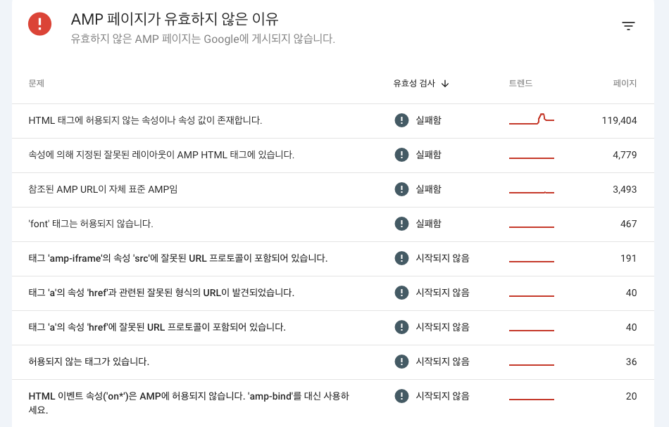
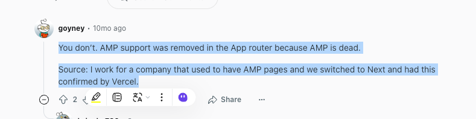
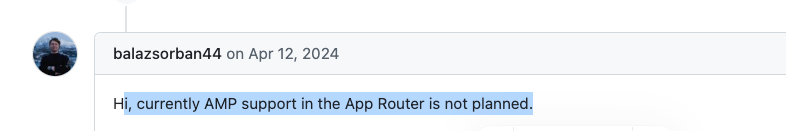
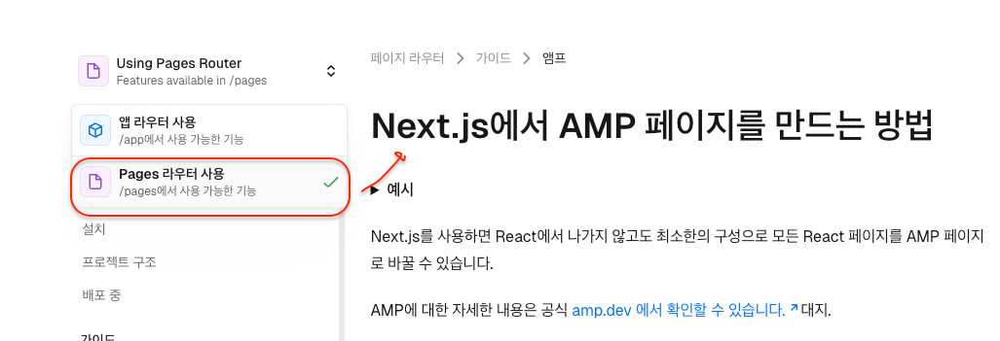
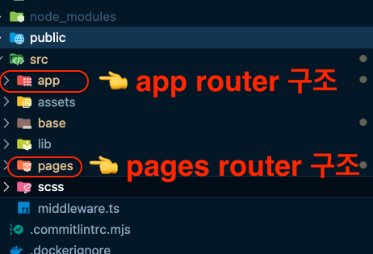

## 들어가며
현재 한 언론사에서 뉴스 웹사이트 운영과 성능 최적화를 진행하고 있다.  

뉴스 기사의 **검색 노출 최적화**는 단순한 트래픽을 넘어 **광고 수익**과 직결된다.

요즘 대부분의 사용자는 뉴스를 포털보다는 검색을 통해 소비하며,
특히 모바일 사용자의 70% 이상은 검색 결과 상단에서만 기사를 클릭한다.

아래로는 거의 내려가지 않기 때문에, 검색 결과 2페이지에 있는 기사는 사실상 묻힌다고 봐도 된다.

수많은 뉴스 매체들이 같은 이슈를 거의 동시에 다루는 상황에서 검색 결과에 잘 노출되기 위해서는, **'누가 먼저, 더 빠르게, 더 안정적으로 노출되느냐'** 가 실시간 트래픽의 성패를 가른다.
   
웹사이트의 "속도"가 빠르고 사용자 경험이 좋아야 한다.

구글은 이를 수치화해서 측정할 수 있도록 ‘Core Web Vitals’라는 성능 지표를 제공하고 있다.
그리고 이 지표는 페이지의 노출, 유저의 이탈률, 나아가 수익성과도 직접적인 연관이 있다.

어찌 보면 당연한 이야기처럼 들릴 수 있다.    
기사를 작성해 발행하면 포털이나 구글 검색에 *잘 뜨는 것 이 기본이니까*.


 아 물론, 내가 기본이라고 말했던 오만함의 **잘** 의 조건은 다음과 같다.

## 검색 노출을 위한 기술 요소 그리고 해야할 것들

| 항목 | 설명 |
|------|------|
| **Core Web Vitals** | 구글이 정한 '웹사이트 건강검진 3종 세트 (LCP, CLS, INP)' |
| **AMP 지원** | 모바일 최적화를 위한 프레임워크. 초고속 로딩으로 이탈률을 낮춰준다 |
| **구조화 메타태그** | SNS 공유 시 미리보기 제공 + 검색 결과에 부가 정보 표시 가능 |
| **반응형 이미지 최적화** | 각 디바이스별로 가장 적절한 해상도의 이미지를 제공 |
| **코드 스플릿팅** | 페이지별로 필요한 코드만 로딩 → 초기 랜딩 속도 개선 |
| **경량 이미지** | CDN `w=` 파라미터 조절로 화질은 유지하며 용량은 줄임 |
| **Lazy Load** | 화면에 들어오기 전까지 이미지/광고 스크립트를 로딩하지 않음 |


- 등등 ..

개선해 나아간 부분들이 정말 다행스럽다. 프론트엔드 고수분들을 진심으로 존경하고 존경한다.

---
## 입사 첫날의 징크스

퇴사후 한달간의 리프레쉬 기간을 갖고, 어찌저찌 현 회사에 투입이 되었다.

구축 외주 인력 분들이 철수하게 되어, 운영에 필요한 인수인계를 받으면 되었다.   

가벼운 마음으로 모닝 커피 마시면서 한분 한분 인사를 드렸다.  
( 휴식후 너무 오랜만에 사람을 만나서 반가웠고 많이 웃었다.)

그리고 곧 철수하는 분들에게 부럽다는 표정을 숨기고, 잔여 이슈에 대해서 설명하는 시간을 가지기로 하며,
순조롭게 인수인계를 받을 준비를 하며 노트북을 키는 순간.

그런게 있다. 순조로운 인수인계 + 여유로울 만한 프로젝트 + 이상한 느낌

( 아니겠지 생각이 들때쯤. 부장님 조심 스러우면서 + 다급한 목소리 + 찐 )

**"형기 씨 . 잠시만, 급한 건인데..."**


---

## 첫번째 개선 미션
부장님께서 호출하신 이유는 AMP 페이지가 정상적으로 동작하지 않는 심각한 이슈가 있다고 하셨다.

현재 운영 중인 웹사이트는 Next.js 기반의 웹사이트로, 리뉴얼 개편 이후 트래픽이 1/3 정도 감소했다고 한다.

많은 원인중 제일 큰 이슈는 AMP 페이지가 Google Guide 규칙에 통과되지 못해, 기사의 노출 수 가 줄어들어 트레픽이 하락했다고 한다. 

그 결과, **검색 노출 하락 → 사용자 이탈 → 광고 수익 저하** 의 상태.

현재 프로젝트 내에 적용 되어있으나, 동작하지 않는 AMP 페이지를 걷어 낼지, 별도로 다른 프로젝트를 구축하여 AMP 페이지를 만들어서 사용할 수 있는지를 검토 해달라고 하셨다.

AMP 가 뭔지도 모르는 나는 잠깐의 히스토리 설명을 듣고 반나절 정도 분석후 검토할 시간을 달라고 말씀드렸다.

---

## AMP 의 적용 여부 판단

현재 도메인 특성에 맞는 기술인지 판단하고, 개선하면 되는 것을 잘 알기에 조금만 더 digging 을 해보았다. 
( <strike> 구글이 만든 기술이니 구글에 맞는 스킬이겠지. </strike> )

> AMP 란 ?
> - AMP 는 Accelerated Mobile Pages의 줄임말로, 모바일 웹 페이지를 더 빠르게 로딩하기 위한 오픈소스 프레임워크 이다.
> - 구글이 주도해서 만들었고, 현재는 다양한 회사와 커뮤니티가 함께 관리되고 있다.
> - 빠른 로딩 속도 + 안정적인 사용자 경험으로, 특히 뉴스/블로그/미디어 사이트에 매우 강력한 효과를 준다.
>
> AMP 는 운영중 제약이 많아서, 요즘에는 **Core Web Vitals 을 통해 대체하는 추세** 이다.

AMP 단점 요약

| 구분     | 단점 내용                   |
| ------ |-------------------------|
| 기능 | JS 사용 제한, 커스텀 기능 구현 어려움 |
| 디자인 | CSS 용량 제한, 커스터마이징 불편    |
| 개발 경험 | 디버깅 어려움, validator 의존   |
| 운영 부담 | AMP 따로 만들고 유지 → 리소스 증가  |
| 종속성 | 구글 캐시 도메인 문제, 유입 분석 어려움 |

> 제약이 있다는 말은 사용하지 못한다는 것이 아니라, amp 규칙에 맞는 문법으로 대체 해야 한다는 뜻이다.  

예를 들어, js 를 사용하고 싶다면, 아래와 같이 사용해야 한다.
```html
<amp-script layout="container" src="https://당신의-회사-cdn-주소-혹은-프로젝트-내에-별도-스크립트-파일이-필요합니다-젠장/script.js">
  <p>이곳에 스크립트가 삽입됨.</p>
</amp-script>
```

AMP ⚡ 장점   

| 구분                 | 장점 내용                                               |
| ------------------ | --------------------------------------------------- |
| 속도              | AMP는 로딩 속도가 **압도적으로 빠름** (HTML + 제한된 JS/CSS만 허용)    |
| 사용자 경험          | 기본적으로 Lazy Load + Viewport 우선 렌더링 → **UX 최적화**      |
| 검색 최적화          | **구글 AMP 캐시**에 의해 빠른 응답 + 검색 상단 노출 가능성 증가           |
| Core Web Vitals | LCP, CLS, INP 등 **성능 지표 자동 개선 효과**                  |
| SEO/트래픽         | 빠른 로딩 + UX 개선 → **이탈률 감소 + 유입 증가**                  |
| 내장 컴포넌트         | `amp-img`, `amp-carousel` 등으로 **인터랙션을 JS 없이 구현 가능** |
| 일관성             | AMP validator 통과 필수 → **표준화된 코드와 구조 강제**로 QA 부담 감소  |


현재 도메인에 AMP 적합성 검토... 🤔

현재 운영 중인 웹사이트는 기사 본문 중심의 뉴스 사이트다. 즉, 동적인 UI보다는 텍스트 콘텐츠 위주로 구성되어 있다.  

사용자가 본문을 한 번 로드한 이후에는 인터랙션이 거의 없는 만큼 사용자 경험이 단순하고, 정적 콘텐츠 중심인 구조다.  

이런 특성의 사이트는 AMP의 제약과 잘 맞는다.
복잡한 JS 상호작용이 거의 없고 페이지의 빠른 로딩과 안정적인 레이아웃이 더 중요하기 때문이다.


| 유형                   | AMP 적합도   | 이유                                            |
| -------------------- |-----------|-----------------------------------------------|
| 뉴스, 미디어, 퍼블리싱 플랫폼 | Best      | 정적 콘텐츠 중심 + 검색 유입이 중요                         |
| 쇼핑몰, 커뮤니티, SaaS  | Bad       | 동적 UI, 사용자 상호작용 많음                            |
| 2024 이후           | 선택적 적용 가능 | 구글이 AMP 강제 하지 않는다, 다만 여전히 Top Stories 노출은 유리함 |

---

## 뉴스 검색 유입의 변화 - 포털에서 검색

한국은 전통적으로 네이버 / 다음 같은 *포털 중심의 뉴스 소비* 환경이 강했다.  
하지만 최근 몇 년 사이, 이 구조에 점진적인 변화가 일어나고 있다.  

2023~2024년 주요 언론사 내부 트래픽 데이터(GA, GSC 등)를 살펴보면,  
포털 메인 노출 의존도가 줄고, 구글 검색을 통한 유입 비중이 점차 확대되고 있다.  

예를 들어, 특정 기사가 포털에서 노출되지 않아도  
구글 검색에서 "퇴직금 계산법", "청약 자격 조건", "2025 설날 날짜" 등 정보성 키워드로 지속 유입되는 패턴이 발견된다.    

기존의 "순간적인 폭발 트래픽(포털)"보다,    
**지속적·장기적인 트래픽 구조(검색)** 가 점점 중요해지고 있다는 신호다.  

> 특히 검색 기반 유입은 ‘롱테일 콘텐츠’ 확보에 핵심.  
> 반면, 포털 메인은 *경쟁도 심하고, 노출 타이밍도 예측이 불가능*

오케이 🙆 도메인 적합성 + amp 배경지식 습득 완료 . 그럼 이제 트러블 슈팅 을 해보자.



앞서 말했듯이 **AMP 페이지 는 정적 검증기 인 AMP Validator 를 통과해야만 페이지가 동작 가능** 하다. 

구글 search console 에서 계속 안되는 이유를 친절하게 알려준다.   
본문에 허용하지 않는 Tag 가 선언되어 있거나, ./next/static 하위 js 번들이 html 전체 문서에 포함되어 있으면 AMP 페이지가 정상적으로 동작하지 않는다고. ( 훌륭해.. )

그러나, 문제의 *태그* 를 해결해도 왜 next 번들 파일이 guide 규칙에 걸리는지 의문을 품던 도중






<h3>프로젝트 내에 AMP Page 가 App Router 기반으로 구현되어 있었고 이로인해 못쓴다는 뜻.</h3>
- 다 걷어내야 됌


Next.js의 pages 라우터 기반에서만 정식 지원하고, app router 기반에서는 공식적으로 AMP 지원이 되지 않는다는 사실을 알았다.

아래와 같은 구조에서 pages 하위에만 Amp 대상 페이지를 두면 되긴 하는데..    
문제는 현재 *app 디렉토리에 AMP 페이지가 개발되어 있는상태.* ( 범인 색출 성공 )   


 
마치 판매 기준을 어긴 것 과 같다. 샌드위치 속 재료를 기준에 맞게 모두 바꿨지만, 포장지가 비닐이 아니라 종이여야 했던 걸 몰랐던 상황처럼.

천만 다행으로, app / pages 라우터 방식을 next 에선 **모두 지원** 하니 모두 pages 방식으로 forting 하는 불상사는 발생하지 않는다. 

실험적으로 pages router 방식으로 mock 으로 테스트해보니, AMP Validator 에 걸리지 않은것도 확인 ✅

다시 부장님께 Amp 대상 페이지가 어떤것인지 여쭤보았고, **기사 상세 페이지만 대상** 이라고 하셨다. 

---

## 결론
- AMP 에 대한 배경지식 체크
- 현재 도메인에 AMP 적용은 적합
- AMP 페이지는 pages router 방식에서만 지원
- 모든 페이지를 Pages router 방식으로 전환 하는게 아니라 기사 상세 페이지만 AMP 페이지로 별도 구성

> 모든걸 옮길 필요 없이 뉴스 본문 기사만 옮기면 된다. ( 나머지 페이지는 app router 구조에서 계속 사용 가능. )

## AMP 페이지 개발
다음 편에서 계속.

## 참고 자료
- [Next.js AMP 공식 문서](https://nextjs.org/docs/app/building-your-application/routing/pages-and-layouts#amp)
- [2023 언론수용자 조사 - 한국언론진흥재단](https://www.journalist.or.kr/news/article.html?no=57770&utm_source=chatgpt.com)
- [포털 방문자, 뉴스보다 다른 콘텐츠 찾나… 뉴스 이용 '뚝' - 한국기자협회](https://www.journalist.or.kr/news/article.html?no=55137)
- [검색이 통로아닌 목적지로 변화](https://publishinstitute.org/news/search-engine-seo-google-news/)
- 시간을 아껴주신 분들
  - [버셀에 문의까지 주신분](https://www.reddit.com/r/nextjs/comments/1dpuvj7/how_do_i_configure_a_page_to_be_amp_in_app_router/)
  - [그외-외국 형님1](https://github.com/vercel/next.js/discussions/76918)
  - [그외-외국 형님2](https://github.com/vercel/next.js/issues/64354)
