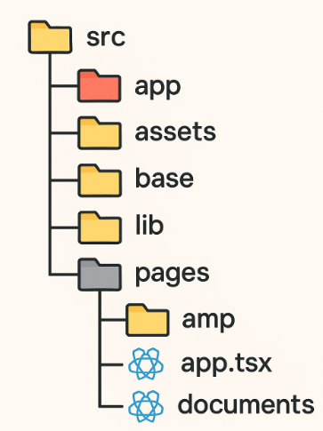
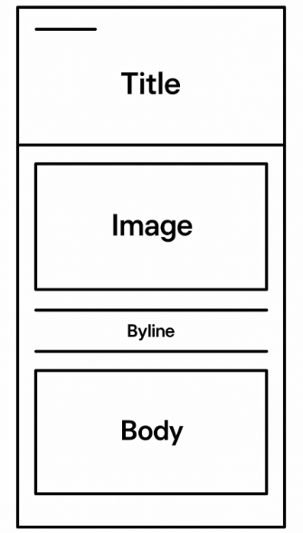
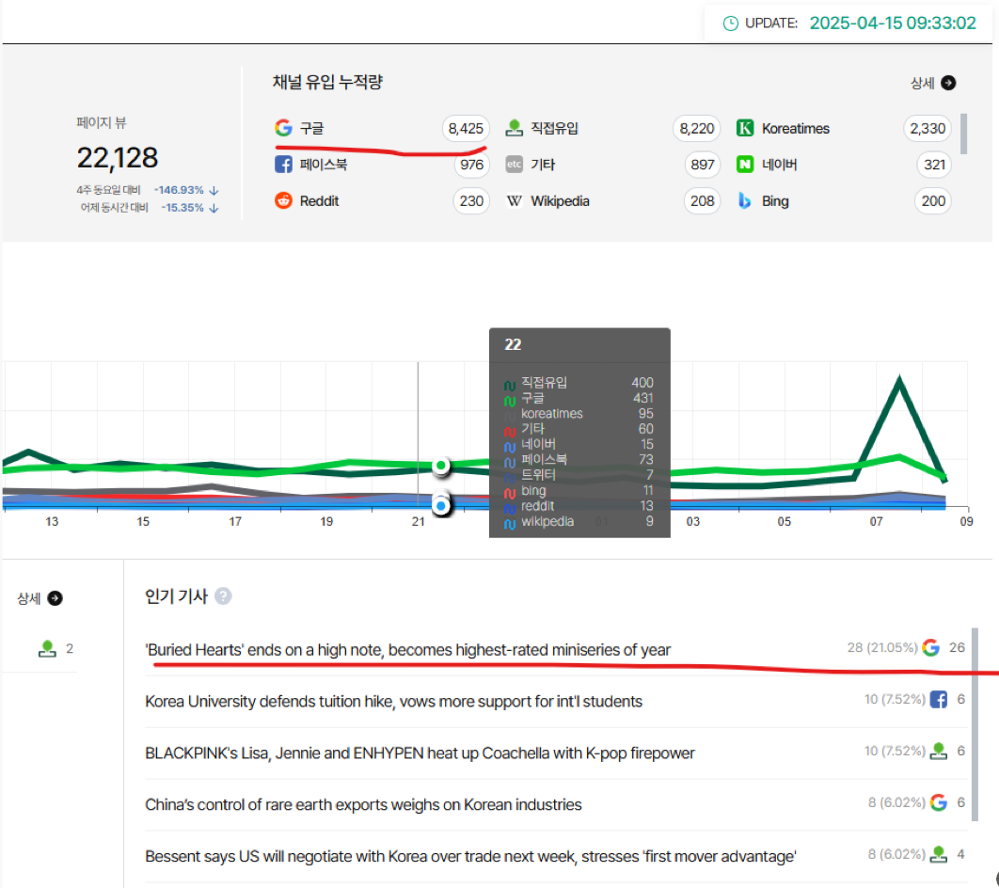
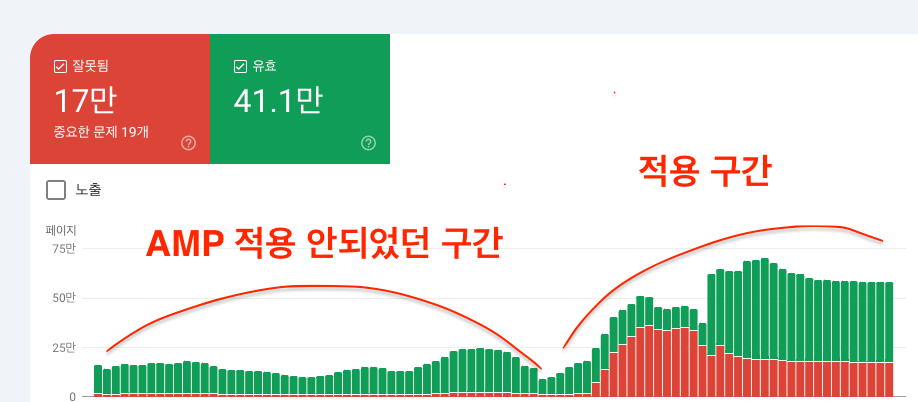
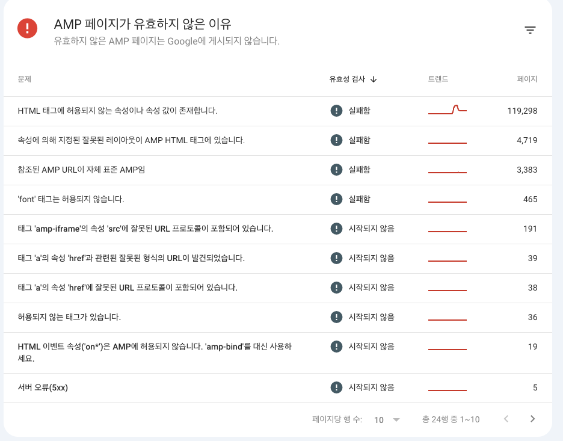
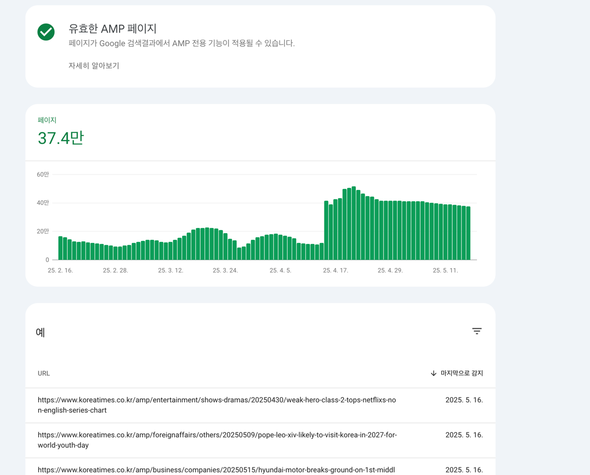

## 들어가며
AMP 페이지가 동작하지 않았던 이유는 NextJs 에서 지원하지 않은 Router 방식임을 확인.
Pages 디렉토리를 생성후, 하위에 amp 전용 페이지를 두는것으로 진행하기로 했다.

기사 본문의 내용은 기자님들이 별도 도메인에서 Editor로 작성한 본문이 string 형태로 DB 에 적재되니 응답 string 을 dom 으로 뿌려주면 되는 문제. 

AMP(Accelerated Mobile Pages)는 빠른 모바일 페이지 로딩을 위해 구글이 주도한 프레임워크로, **강력한 성능을 얻는 대신 엄격한 제약**을 동반한다.

Next.js에서도 AMP를 적용하려면 이 제약을 그대로 수용해야 하며, **페이지 구조, 스타일링, JS 사용 방식 등에서 별도의 대응이 필요하다.**

Next.js에서 AMP를 적용할 때도 이러한 제한이 그대로 적용된다.

시작 하기전에 기합 넣고 ! 


--- 

## TODO LIST 체크
- ✅ AMP 페이지 는 총 N Phase 로 배포 
  - ( 우선 amp 가 존재 하는것을 mvp 목표로 배포 ! )
- ✅ Pages Router 기반의 디렉토리 구조 설계
- ✅ AMP 대상 페이지 컴포넌트 설계
- ✅ middleware.ts 에서 /amp 로 시작하는 URL을 감지하여, 해당 페이지를 AMP 페이지로 리다이렉트 하도록 설정
- ✅ 스타일링 ( GPT 의 도움으로 스피드하게 해결 )
- ✅ 본문내용 api call 이후 제약 태그 -> amp 태그로 변환 util 만들기
- ✅ SEO 메타 태그 ( 손으로 일일히 해도 되지만 AI 이용해서 검수정도로만 빨리 ! )

## 되짚고 넘어가는 제약 사항
⚠️ AMP는 일반적인 React 환경과 달리 다음과 같은 제한이 있다

☝️. **React Hook 사용 제한**  
- `useEffect`, `useState` 등 hook 기반 로직 사용 불가

✌️. **Sass/SCSS 등 외부 스타일 방식 제한**  
- 모든 스타일은 inline 또는 제한된 CSS 내에서 처리해야 함

🫰. **일반 script 태그 사용 불가**  
- `<script>` 태그 자체를 금지하며, JS는 `amp-script`로 제한적으로만 허용됨

> 전체 AMP 검증은 [AMP Validator](https://validator.ampproject.org/) 를 통해 실시간 확인 가능

---

## 🗂️ 디렉팅 구조 전략
pages 디렉토리 를 기반으로 amp 디렉토리를 생성하고, 하위에 slug 페이지를 작성한다.

> 🔖 slug 란 ?
> - ex ) /news/2025/04/17/기사제목
> - URL의 일부를 사람이 읽기 좋고 검색엔진 친화적으로 만든 문자열


middleware.ts 에서 /amp 로 시작하는 URL을 감지하여, 해당 페이지를 AMP 페이지로 리다이렉트 하도록 설정.


```text
 
📁 src
|── components                     
    ├── amp                        👈 amp 페이지 내 공통컴포넌트 ( Header, Body, Footer 등 재사용 컴포넌트들 쭉쭉 넣어주고 ~ )
    |... 원래 있던 친구들 내비두고 ~
├── pages                         
│   ├── amp                        👈 AMP 페이지 전용 디렉토리
│   │   └── [slug].tsx             👈 section 카테고리별 디렉토리
|   |     └── [depth1].tsx         👈 amp depth 1 본문 페이지
|   |         └── [depth2].tsx     👈 amp depth 2 본문 페이지
|   |             └── [depth3].tsx 👈 amp depth 3 본문 페이지
```

이렇게 되면 사실상 **사용자 관점** 에서 보이는 기사 뷰 페이지는 2벌이다.
- 일반 페이지 [ PC / MO ] <-- 다행이 반응형으로 통합되어 있어서 아멘...
- AMP 페이지 ( depth 별 )

기존 기사 본문 URL 구조는 **slug url** 형식으로 되어있으니 amp 페이지로 유입될 경우 본문에 해당되는 amp 페이지로 redirect 해주면 된다 
pages 만 UI 뼈대를 만든 후 공통화 컴포넌트화 시키면 되겠다.



> AMP는 제약은 많지만, 뉴스 도메인에선 여전히 유의미하다
> 
> React hook이나 script 사용은 어렵지만 기본 콘텐츠 위주 뉴스 페이지엔 큰 무리는 없다
> 
> middleware.ts + slug 기반으로 AMP 라우팅 처리하면 깔끔하게 대응 가능
> 
> AMP 페이지는 별도로 구성하되, 디자인/구조는 최대한 기존과 일치시키는 전략이 효과적이다

## 기사 본문에서 amp 태그로 변환하는 util 함수 만들기 
- 일반 HTML 태그는 사용 불가, AMP 전용 태그만 사용 가능
- 예를 들어, `` 태그는 `<amp-img>`로 대체해야 하며, `<script>` 태그는 `<amp-script>`로 대체해야 한다
- `<style amp-custom>` 태그에는 **최대 50KB까지만** CSS 작성 가능
- 애니메이션 전용으로 허용된 `<style amp-keyframes>`는 **최대 500KB까지** 허용되지만,
  이는 `<body>` 하단에만 위치할 수 있고, 오직 키프레임 규칙만 작성 가능하다
- JS 이벤트 핸들러 제거 , javascript: 링크 제거 
- 허용되지 않는 태그 하위 호환
  - font, area, form

👉 **총 CSS + 인라인 스타일 합산이 75KB를 넘지 않도록** 주의해야 한다 - [ 관련 공식문서 ](https://amp.dev/documentation/guides-and-tutorials/learn/spec/amphtml)

---

## ⚡️ 대략 적인 AMP 페이지 구조 ( 보여줄 수 없어서 추상적으로 대체 )
```html
<!DOCTYPE html>
<html ⚡>

  <!-- 공통 대상 Header -->
  <head>
    <meta charset="utf-8">
    <meta name="viewport" content="width=device-width,minimum-scale=1,initial-scale=1">
    <link rel="canonical" href="원본 URL 잘 집어넣어야 합니다.">
    <meta name="amp-google-client-id-api" content="googleanalytics">
    
    <!--  공통 대상 : Style  -->
    <style amp-custom>
      /* AMP 전용 CSS 들어올 자리 ( 용량 50KB 안넘기게 살살 다뤄줘 ) */
    </style>
    
  </head>
  
  <body>
    
    <!--  공통 대상 : 뉴스 기사 Body -->
    <main>
      <!--  공통 대상 : 예쁘게 컴포넌트 화 -->
      <article>
        기사 본문이 들어갈 자리
      </article>
      
      <!--  갖가지 광고 예쁘게 공통으로 말아 -->
      <ad>
        광고 들어갈 자리 Lazy Load 적용 대상
      </ad>
      
    </main>
    
    <!--  공통 대상 : footer 야 뭐...  -->
    <footer>푸터 들어갈 자리</footer>
  </body>
</html>
```

---

## AMP 규칙에 맞는 Style 

Amp 용으로 style 잡는게 좀 까다로웠다 ( sass 방식이 왜 안돼 ... 하나하나 분석하다가 이건 도저히 아니다 싶었다. )

AMP는 `<style amp-custom>` 단 하나만 허용
- 모든 사용자 정의 스타일은 `<head>` 안의 `<style amp-custom>` 안에 작성해야 함.
- `<style>` 태그가 두 개 이상 있으면 AMP 유효성 검사에서 실패. ( 별 ... )
- 총 CSS 용량은 75KB 이하
- CSS 속성은 inline 스타일로 작성해야 함. ( CSS-in-JS 방식은 사용 불가 )
  - `<style amp-custom>` 내부 전체 CSS 크기 합이 75KB (75,000 bytes)를 넘으면 안 됨.
- 초과 시 AMP validation 실패 → 페이지 노출 불가.


미지원 CSS 속성/기능
- @import 사용 불가 ❌ 
- !important 사용 불가 ❌
- position: fixed는 예외적으로 일부 AMP 컴포넌트에서만 허용 (ex. <amp-sidebar>)
- animation, keyframes는 제한적으로만 허용됨 
- filter, backdrop-filter, mix-blend-mode 등 일부 CSS 속성 사용 불가.


AMP 구성요소의 스타일링
- `<amp-img>`,`<amp-carousel>`, `<amp-sidebar>` 등 AMP 컴포넌트는 반드시 지정된 방식으로 스타일링해야 함.
- 특히 layout="responsive" 등 AMP layout 시스템에 맞는 설정 필수.


.    
.  
.  
.  
.  
.  
.  


---

## G 선생의 Style 도움으로 대망의 1차 배포 성공 🏰
검색 색인과 AMP 페이지 1차 반영 이후 구글 유입이 조금씩이나만 바로 잡혀가는 모습이 너무 보기 좋다.





구글 Search Console 에서 AMP 메뉴를 확인하니, 저 빨간건 ... amp validator 에서 검증이 안된다는 뜻이다.  
아니 유효하지 않은 페이지가 17만 이라고 ...??? 뭐때문인지 ....



오 이런 ㅠㅠ 누락된 허용하지 않은 태그, 미디어 속성의 태그에 src 가 https 가 아닌 http 가 존재하거나,  
<기사이름> 이런식의 태그가 아닌데 태그라고 오 인식하는 문제가 있었다.  

( 이미지 혹은 뷰어 용 태그에 src 는 https 가 아니라 http 로 되어있는 부분은 server 에서 처리가 필요 ) 

> 이걸 어떻게 표준화 할까 ...?

---

## 🤔 라이브러리를 안 쓰고 처리 할 수 없었을까 ?

DOMParser 를 쓸 수 없었다. 
브라우저 런타임에서만 동작하는 Web API 이고, Next.js의 서버 사이드 코드(SSR), 즉 Node.js 환경에서는 사용할 수 없다.

기사 본문은 **서버 사이드 데이터 페칭** 시점에 가져온다. 그래서 amp guide 에 맞는 dom 으로 변환하는 util 함수 내에,  
기사 본문을 amp guide 에 맞는 정규식으로 치환하거나 제거하는 방식으로 진행했더니 너무 위험했다.  

(기사 본문 내용이 틀어지거나, inline Style 이 깨지거나 ... 보여야 할 내용이 일부분 사라지거나 ...)

| 작업 예시                          | 라이브러리 없이 가능? | 설명                        |
| ------------------------------ | ------------ | ------------------------- |
| `` → `<amp-img>` 변환       | 🔴 어려움       | HTML 구조 파싱이 필요, 정규식으론 불안정 |
| `<iframe>` → `<amp-iframe>`    | 🔴 어려움       | 조건 분기 및 속성 매핑 복잡          |
| `onClick`, `onMouseOver` 속성 제거 | 🔶 가능하지만 복잡  | 수백 개 태그 모두 순회해야 함         |
| 불필요한 태그 제거 (`<font>`, `<map>`) | 🔶 가능하지만 비효율 | 정규식 + 수작업으로 불안정           |
| 최종 HTML 문자열로 재조립               | 🔴 위험        | 구조 깨질 확률 높음               |


이 과정에서 여러 라이브러리를 도입했는데, 목표는 다음과 같았다.  

- HTML 태그를 파싱해서 변형하거나 제거하는 작업이 필요하다.
- 따라서, DOM을 조작할 수 있는 라이브러리가 필요하다.



---
## 🧩 라이브러리 도입 결정

✅ cheerio — DOM 파싱의 사실상 업계 표준 

AMP 변환의 핵심은 Google GuideLine 에 허용되지 않는 HTML 태그를 파싱해서 변형하거나 제거하는 작업이 필연적인데,  
이때 cheerio는 서버 사이드에서 jQuery처럼 HTML을 다룰 수 있는 경량 라이브러리로, 아래 작업들을 편하게 처리할 수 있었다.

사용법은 아래 예시 로.
```jsx
const $ = cheerio.load(html);
$(".writer").remove(); // 불필요한 요소 제거
$("img").each(...);    // 이미지 태그 변환
```

> 📌 대안은?  
> jsdom도 있었지만, 성능과 문법의 직관성에서 cheerio가 더 낫다고 판단.  
> - ( 훨씬 무겁고, DOM 구현이 브라우저 수준이지만, cheerio보다 느림 )  
> 단순한 조작에는 cheerio가 가장 적합하다.  

✅ isTag (from domhandler) — 안정성 있는 노드 필터링  

모든 DOM 노드가 태그는 아니기 때문에, cheerio("*").each(...) 루프를 돌릴 때는 노드 타입 검사를 해줘야 한다.  
이때 isTag()를 사용하면 안정적으로 태그 여부를 확인할 수 있다.  

```js
if (isTag(el)) {
    // 태그일 때만 속성 제거
}
```

⚠️ image-size + fetch  

별도 설치가 필요했던 라이브러리는 아니지만 안정성과 성능 사이의 고민이 존재했다.  

AMP에서는 <amp-img>에 반드시 width와 height가 있어야 한다.  
그런데 컨텐츠에 이 정보가 누락된 경우도 있어서, 서버에서 이미지를 직접 fetch하고 image-size로 크기를 추출할 필요가 있었다.  

img 태그에 크기를 알 수 없는 경우 별도로 호출하기로 하였다. 

```js
const res = await fetch(src);
const buffer = new Uint8Array(await res.arrayBuffer());
const { width, height } = imageSize(buffer);

```

이 방식은 어떤 이미지든 깨지지 않게 하려는 의도는 있으나, 단점도 존재한다.
- SSR 성능 저하 가능성 (네트워크 fetch + 버퍼 파싱)
- 이미지 수가 많아질수록 병목 현상 발생
---

## 보정한 amp 디테일 배포는 연휴 끝나고 진행 ㄱㄱ


## 마무리 
AMP 페이지 는 성능과 사용자 경험을 고려할 때 여전히 유용한 기술이다.  
정리하면 다음과 같다.

- Next.js에서 지원하는 기능이지만, 제약이 많아 사용하기 어려운 경우가 많다.
  - Guide 에 맞는 HTML 태그를 파싱하고 변형하는 정교한 작업이 필요하다. ( 물론 트레이드 오프는 있다. )
  - 이때 cheerio와 isTag를 사용하면 안정적으로 작업할 수 있다.
- 성능과 사용자 경험을 고려할 때 여전히 유용한 기술이다. ( 도메인 특성에 맞게 사용함이 핵심. )
- 제약을 잘 이해하고, 필요한 라이브러리를 적절히 활용해야 한다.