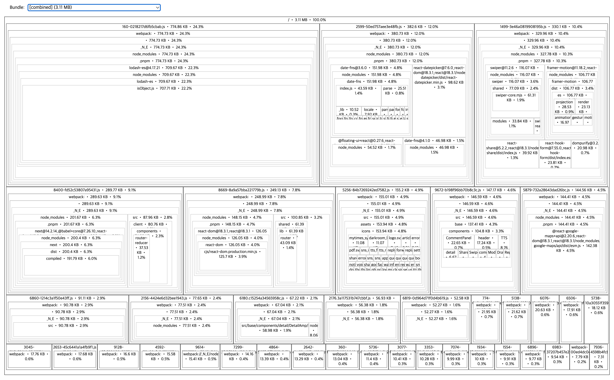

## 박살난 퍼포먼스로 다시 살리자

✅ 개선 목표
- PC / MO 페이지의 Core Web Vitals 점수 충족
- 이미지 / 폰트 최적화
- 광고 로딩 구조 재설계
- 불필요한 JS 다이어트
---

## 🖇️ 주요 적용 항목

| 항목 | 적용 방법 |
|------|-----------|
| 코드 스플리팅 | `next/dynamic`, `React.lazy` |
| SSR/ISR 최적화 | `dynamic()`, `revalidate`, `cache` 옵션 조정 |
| 이미지 최적화 | `next/image`, Skeleton UI, CDN w= 자동화 |
| 폰트 최적화 | `next/font`, preload |
| Web Vitals 분석 | Lighthouse, Vercel Speed Insights |

---

## ⚡ Core Web Vitals 별 개선 요약

| 지표명 (약어)                           | 설명                       | 일상 비유                              |
| ---------------------------------- | ------------------------ | ---------------------------------- |
| **CLS** (Cumulative Layout Shift)  | 화면이 로딩 중 갑자기 밀리거나 이동한 정도 | 버튼을 누르려는데 갑자기 밑으로 밀려서 광고 클릭한 상황 😡 |
| **SI** (Speed Index)               | 화면이 시각적으로 완성되는 속도        | 영화 시작할 때 화면이 빠르게 차오르는 느낌           |
| **FCP** (First Contentful Paint)   | 첫 텍스트나 이미지가 뜨는 시점        | 영화 타이틀이 처음 뜨는 순간                   |
| **LCP** (Largest Contentful Paint) | 메인 이미지나 큰 텍스트가 완전히 보일 때  | 표지부터 다 읽고 본문 읽을 준비 완료              |
| **TBT** (Total Blocking Time)      | JS가 렌더링을 막은 총 시간         | 문 열고 들어가려는데 안에서 JS 처리 중이라 안 열리는 상황 |


---

## 먼저 JS 번들 부터 정검 해보자

```bash

$ yarn add -D @next/bundle-analyzer
```

그런다음 next.config.js 에서 analyzer 를 활성화.
```js


import createBundleAnalyzer from "@next/bundle-analyzer";

// ...

const withBundleAnalyzer = createBundleAnalyzer({
    enabled: process.env.ANALYZE === "true",
    openAnalyzer: false,
});

// ... 

export default withBundleAnalyzer(nextConfig);
```

package.json script 부분역시, 명령어 활성화 필요. 

```js
"script": {
 ... 
  "analyze": "ANALYZE=true next build", 
  "analyze-explorer": "source-map-explorer '.next/static/chunks/*.js'",
 ...
}
 
```

먼저 어떤 라이브러리들이 번들에 포함되어 있는지 확인하기 위해 bundle-analyzer 를 설치해 주고 분석해 보니, lodash-es 와 moment-timezone 이 포함되어 있었다.
700KB 와 500KB 먹음직 스럽게 제거할 수 있는 크기였다. ( 그외 다수 도 +_+ )



 
📦 lodash 최적화

프로젝트 내에서 lodash-es가 설치되어 있었고, 실제 사용하는 함수는 debounce 하나뿐이었다.  
아마도 Tree Shaking을 노리고 lodash-es를 선택했던 것 같다.   

> tree shaking 이란 ?
> 실상 쓰는 코드만 번들에 포함시키고, 안 쓰는 코드를 제거하는 기능인 Tree Shaking

하지만 애석하게도, lodash-es는 ESM 구조이다.  
Tree Shaking이 가능하다고 알려져 있지만, 내부적으로 많은 공통 유틸 함수들이 함께 import되기 때문에,     
debounce 하나만 불러와도 수많은 내부 의존성 코드가 함께 번들된다.  

즉, 다음과 같은 코드 는 실제 번들 사이즈를 눈에 띄게 줄이지 못한다.
```js
import { debounce } from "lodash-es";
```

함수 단위 패키지로 대체 가 가능한 lodash 로 변경하기로 결정하였다.  
개별 모듈(함수)로 쪼개서 npm 패키지를 배포하고, 무었보다 monorepo로 관리하기 때문에 효과적으로 다이어트가 가능하다고 판단했다.  

lodash.debounce를 import하려면 lodash.debounce 패키지를 따로 설치해야 하고,  
타입스크립트 환경에서는 타입 정의 패키지(@types/lodash.debounce)도 필요하다.

```bash

$ yarn add lodash.debounce

$ yarn add -D @types/lodash.debounce
````

최소한의 코드만 번들에 포함되고, 사용방법은 다음과 같다.

```js
import debounce from "lodash.debounce";
```

## ⏰ moment-timezone 최적화 

앞서 말한 것 처럼 lodash는 함수별로 npm 패키지가 분리되어 있거나, ES 모듈 구조라서 개별 함수만 import할 수 있지만,   
moment/moment-timezone 는 하나의 큰 번들(모듈)로 배포되고 내부적으로 모든 기능이 단일 객체(moment)에 결합되어 있다.

죽, moment-timezone은 하나의 큰 번들이고, 부분 import 안 된다.. 구조 상 ESM도 아니고, 트리셰이킹도 불가능.

```js
import { tz } from "moment-timezone"; <- ❌
import moment from "moment/timezone"; <- ❌
```

구버전 브라우저(특히  Edge, 구형 크롬/파이어폭스 등)까지 완벽히 커버하면서, 타임존 목록 및 오프셋, 타임존 변환 등 기능을 제공하려면  
moment-timezone을 계속 사용하는 것이 가장 안전한 선택이라.. 이대로 두기로 하였다. ( 언론 뉴스 페이지다 보니, 해외 구형 디바이스 까지 커버 해야 한다. )  

moment-timezone은 오래된 브라우저까지 호환성을 고려해 설계되어 있다 (IE9 이상, 구형 모바일 브라우저 등 포함)
최신 방식인 Intl.supportedValuesOf('timeZone')는 최신 브라우저(크롬 104+, 사파리 16.4+ 등)에서만 지원되고  
구버전 브라우저에서는 동작하지 않는다.

굳이 하려면, 데이터 범위를 줄여서 번들 사이즈를 최적화 하는게 유일한 방법이다.   

```bash

# slim 빌드 사용
$ npx moment-timezone-data-builder --zones="Asia/Seoul" --start-year=1990 --end-year=2026 > data/packed/latest.json
```

추가적으로 next.config.js 내부 설정중 optimizePackageImports 를 사용하여 조금 더 영끌 다이어트를 할 수 있는데,  
date-fns, moment, swiper 같은 덩치 큰 라이브러리에서 "쓰는 것만 가져오도록" 자동 변환해줘서 번들 크기를 줄여준다.     
( 아 물론 lodash-es 는 효과가 미미...)  
```js

experimental: {
  optimizePackageImports: ["moment-timezone", "date-fns", "react-share", "swiper"],
   ...
},
```


## ✨ 결과 ✨  
3.11 MB -> 2.38 MB 로 줄어들었다. ( 약 23.5% 감소인데, 실제 웹 성능에선 체감 가능한 수준일것 같다. )  

  ➡️


( 이미지가 똑바로 안맞네; )

- 느린 네트워크, CPU 환경에서 0.7MB 감소는 LCP, TTI에 직격 영향을 줄 수 있다.
- JS는 CPU cost가 높아서 압축되어도 실행 비용이 큼 (압축 전 기준 0.7MB 감소는 👍 )  
- JS 줄이기만 해도 LCP, FID, CLS 등 모든 항목에 긍정적 영향.
- 3G 환경에선 700KB는 수 초 차이로 이어짐 ( 해외 사용자가 꽤 있다 게다가 구형 디바이스 유저도 많다. )


## 어 고생했고 .. 다음은 PC 와 MO 페이지의 성능 최적화


