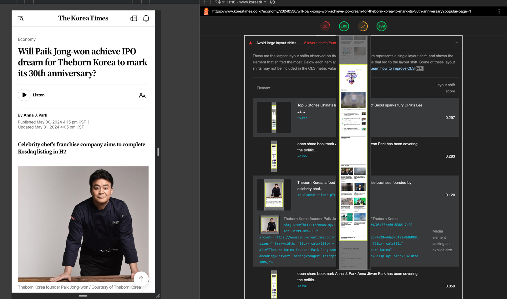
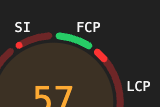
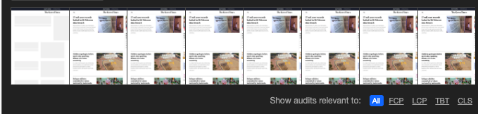
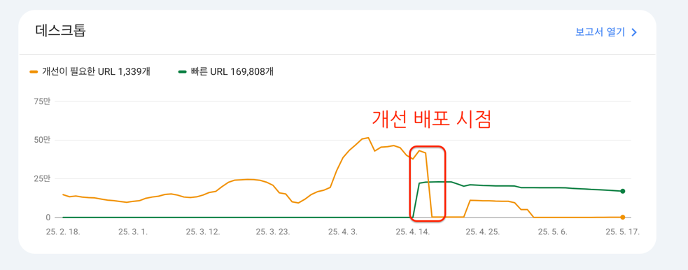

## 들어가며
1부에서 JS 번들 다이어트를 통해 전체 페이지의 무게를 줄이는 작업을 진행했다  
🤔그러나 홈페이지의 성능은 거의 그대로였다.


google Lighthouse 에서 측정 해보면, "왜 느려 보이는지", "어디서 막히는지", "어떻게 개선해야 하는지"를 구체적으로 살펴 볼 수 있다.    
(겁나 친절한데 ..? 👍)

그 중에서도 **Google이 공식적으로 중요하게 여기는 핵심 성능 지표**가 바로 **Core Web Vitals**다.

## ⚡ Core Web Vitals

| 지표명 (약어)                           | 설명                       | 일상 비유                             |
| ---------------------------------- | ------------------------ | --------------------------------- |
| **CLS** (Cumulative Layout Shift)  | 화면이 로딩 중 갑자기 밀리거나 이동한 정도 | 버튼을 누르려는데 갑자기 밑으로 밀려서 광고 클릭한 상황 |
| **SI** (Speed Index)               | 화면이 시각적으로 완성되는 속도        | 영화 시작할 때 화면이 빠르게 차오르는 느낌          |
| **FCP** (First Contentful Paint)   | 첫 텍스트나 이미지가 뜨는 시점        | 영화 타이틀이 처음 뜨는 순간                  |
| **LCP** (Largest Contentful Paint) | 메인 이미지나 큰 텍스트가 완전히 보일 때  | 표지부터 다 읽고 본문 읽을 준비 완료             |
| **TBT** (Total Blocking Time)      | JS가 렌더링을 막은 총 시간         | 문 열고 들어가려는데 안에서 JS 처리 중이라 안 열리는 상황 |

## 개선 목표
**✅ CLS (Cumulative Layout Shift)**  
**✅ FCP (First Contentful Paint)**  
**✅ TBT (Total Blocking Time)**  

## 👀 CLS - Cumulative Layout Shift
CLS 의 **핵심** 은 **“보이는 걸 미리 예고하고, 갑자기 바꾸지 않는다”** 이다.

보통 화면이 예고 없이 ‘밀리는’ 현상이 원인인데, 페이지 로딩 중 요소들이 갑자기 이동하면, 사용자가 의도치 않은 클릭을 하거나 읽기 어려워진다.




그런데, 나의 경우는 달랐다. 사용자가 보기엔 그냥 지나가는 광고였지만,  
Lighthouse 기준으로는 CLS가 다섯 번이나 터졌다.  
"응? 나 아무것도 안 건드렸는데요…?" 싶을 정도.  


대표적으로 **Taboola 광고 위젯** , 이미지 영역, 비동기 컴포넌트, 웹폰트 로딩 지연 등이 주요 원인 이였다.

Taboola 는 초기엔 비어 있다가 스크립트 로딩 이후에 콘텐츠가 삽입되는데,  
이때 높이를 미리 잡아두지 않으면 아래 콘텐츠들이 순식간에 밀려나며 CLS가 발생한다.      

> 마치 의자에 앉으려고 했는데, 뒤로 밀려서 엉덩방아 찍은 느낌이다.

| 문제 요소                   | 설명                                                                       |
| ----------------------- | ------------------------------------------------------------------------ |
| 이미지/광고 영역의 크기 미지정     | ``나 광고 `<div>`에 `width`, `height`, 또는 `aspect-ratio`가 없어 로딩 후 밀림 발생 |
| 비동기 렌더링 컴포넌트          | `dynamic(import(...))`, `<Suspense>` 등을 통해 불쑥 나타나는 컴포넌트로 인해 레이아웃 밀림 발생   |
| navigation 메뉴/헤더 애니메이션 | fixed 헤더가 transition으로 등장하면서 콘텐츠를 아래로 밀어냄                                |
| 웹폰트 로딩 지연           | FOIT/FOUT 현상으로 텍스트 표시가 밀려 CLS 유발             |
| 광고/소셜 위젯 로딩 지연        | GPT 광고, Interplay, Taboola 등 외부 위젯이 나중에 등장하면서 전체 구조가 밀림                  |

이런 문제를 해결하는 가장 확실한 방법은, 비동기 렌더링 컴포넌트의 **높이를 미리 지정**해 콘텐츠의 위치를 **예고**하는 것이다.    

하지만 비동기 렌더링 컴포넌트는 렌더 시점까지 공간을 차지하지 않기 때문에, 아래 콘텐츠가 갑자기 밀려버리는 수가 있다.

이런 경우에 react 에서 제공하는 `<Suspense>` 태그를 사용하면, 다음과 같은 효과를 볼 수 있다.  

"아. 이 컴포넌트가 아직 준비 안 됐을 수도 있으니, 그동안 대체 UI (fallback) 를 보여 줘야겠구만?" 

ex ) 코드 레벨 예시
```js
import dynamic from "next/dynamic";
import { Skeleton } from "@/components/Skeleton";

// dynamic 컴포넌트 로딩 시 Skeleton 사용
const RelatedStories = dynamic(() => import("./RelatedStories"), {
    ssr: true,
    loading: () => <Skeleton />,
});

// Suspense 사용 시, fallback에 고정 높이 지정
<Suspense fallback={<div style={{ minHeight: 400 }}><Skeleton /></div>}>
    <RelatedStories articleId="abc123" />
</Suspense>
```
> ⚠️ 주의   
> <Skeleton /> 컴포넌트 자체가 min-height 또는 fixed height를 갖지 않는다면 의미가 없다.  
> fallback 은 시각적 장식이 아니라 레이아웃 안정장치라는 점을 명심해야 한다.

---

그런데, CLS를 해결하려고 구조를 정리하다 보니, 자연스럽게 컴포넌트들이 렌더링 되는 시점에 의문을 갖기 시작했다.  

광고 컴포넌트 는 기사 본문 을 다 읽고 나서, **본문 하단에 보이는 영역** 이다.   
애초에 사용자가 그렇게 빨리 글을 읽나 ..?


> ‼️ **“보이지 않는 요소는 애초에 늦게 보여줘도 된다.”**

즉, 굳이 초반에 렌더링할 필요 없는 컴포넌트는 **Lazy Load**로 뒤로 미루고,    
대신 **초기 화면을 안정적으로 고정**해두는 것이 사용자 경험에도, 성능 측면에서도 훨씬 낫다.  

이게 바로 **FCP 개선**과도 밀접하게 연결되는 **Lazy Load** 이다.   


## ⏰ Lazy Load
Taboola 광고는 스크롤이 일정 수준 내려간 후에야 자체 CDN 스크립트 (Taboola CDN) 를 호출해 UI를 동적으로 구성한다   

**초기 화면에서 반드시 필요하지 않은 요소**라면, 애초에 **Lazy Load**로 처리하는 것이 맞다.     
**일정 스크롤 이후에만 렌더링되도록** 하는 것이 합리적 이라고 판단했다.  

뉴스 기사 하단의 댓글 영역, 추천 콘텐츠, Taboola 광고 등은,  
**처음부터 보여줄 필요가 없는 전형적인 Lazy Load 대상**이다.

이를 위해 아래와 같은 `LazyShow` 유틸 컴포넌트를 사용했다.   

```js
"use client";

import { useEffect, useRef, useState } from "react";

interface LazyShowProps {
  children: React.ReactNode;          // Lazy 로딩할 자식 컴포넌트
  rootMargin?: string;                // IntersectionObserver의 rootMargin 설정 (기본값: 200px)
  threshold?: number;                 // 교차 비율 임계값 (기본값: 0.1 = 10% 보이면 발동)
  once?: boolean;                     // true일 경우 한 번만 보여주고 계속 유지, false면 스크롤에 따라 반복 토글
}

/**
 * LazyShow
 * - 컴포넌트가 뷰포트에 들어왔을 때 children을 렌더링
 * - IntersectionObserver를 사용한 Lazy Load 유틸
 *  
 * @param children
 * @param rootMargin
 * @param threshold
 * @param once
 * @returns {JSX.Element}
 */
export const LazyShow = ({ children, rootMargin = "200px", threshold = 0.1, once = true }: LazyShowProps) => {
  const ref = useRef<HTMLDivElement>(null);
  const [isVisible, setIsVisible] = useState(false);

  useEffect(() => {
    if (!ref.current) return;
    
    // IntersectionObserver API를 지원하지 않는 환경(fallback 처리)
    if (!("IntersectionObserver" in window)) {
      setIsVisible(true);
      return;
    }

    // IntersectionObserver 인스턴스 생성
    const observer = new IntersectionObserver(
        ([entry]) => {
          if (entry.isIntersecting) {
              // 요소가 뷰포트에 들어오면 표시
              setIsVisible(true);
              if (once) {
                  observer.disconnect(); // 한 번만 보여줄 경우 감시 중단
              }
          } else if (!once) {
              // 반복 모드일 경우 다시 안 보이면 숨김 처리
              setIsVisible(false);
          }
      },
      { rootMargin, threshold }
    );

    // 감시 시작
    observer.observe(ref.current);

    // 컴포넌트 언마운트 시 Observer 해제
    return () => observer.disconnect();
  }, [rootMargin, threshold, once]);

  return <div ref={ref}>{isVisible ? children : null}</div>; // 보일 때만 children 렌더링
};
```

CLS 방지를 위한 핵심 전략은 **언제, 어디서, 무엇이 렌더링될지**를 브라우저에게 **미리 예고**해주는 것이다.    
그렇게 해야 사용자는 불쑥 튀어나오는 콘텐츠에 방해받지 않고, 안정적인 화면을 경험할 수 있다.  

하지만 모든 콘텐츠를 미리 자리를 잡아놓는다고 해서, **무조건 처음부터 렌더링할 필요는 없다.**    
오히려 사용자가 당장 보지 않을 요소라면, **불필요한 초기 렌더링을 줄이는 것이 오히려 성능에 이롭다.**  

> **비동기로 로딩되더라도, 어디에 어떤 크기로 들어올지는 예고해두고, 랜더링 타이밍은 미룬다.**    
> 이게 바로 **Lazy Load의 본질**이다.

개선 이후, 사용자가 화면을 처음 열었을 때 이제서야 ...  
**가장 먼저 보여줘야 할 콘텐츠** 들이 이전보다 더 빠르고 안정적으로 나타나기 시작했다.

**"갑자기 튀어나오는 광고"** 나 **"스크롤을 내리면 밀리는 댓글 영역"** 등의 문제는 Fade Out !  

다음으로 가장먼저 보여지는 콘텐츠의 랜더링 속도를 보고나니, 자연스럽게 다음과 같은 고민으로 이어졌다.

> **‘첫 화면에서 아무것도 안 보이는 시간’** 을 얼마나 줄일 수 있을까 ?

---

## 😶‍🌫️ FCP - First Contentful Paint
FCP 는 사용자가 페이지에서 **"첫 번째 콘텐츠(텍스트, 이미지 등)를 보는 순간까지의 시간"** 이다.

**"앞에서 무엇을 보여주느냐"** + **"얼마나 빨리 보여주느냐"** 가 광건이다.

만약, 페이지에는 접근했으나 아무것도 안 보이는 상태가 길어진다면 FCP 점수는 나빠진다.      
위쪽 영역(Above the Fold) 콘텐츠를 최대한 빨리 보여주는 것을 목표로 하였다.  
( 이미지든 텍스트든, 뭐든간에 첫 화면이 빠르게 보이면 점수가 좋아진다. )

| 문제 요소                   | 설명                                                   |
|-------------------------|------------------------------------------------------|
| 이미지 용량이 큰 경우          | 상단 이미지를 lazy 처리하면 실제 첫 시각 요소가 늦게 등장함                 |
| JS 의존형 컴포넌트           | `hydrate` 이후에 렌더링되는 컴포넌트 의 경우, 초기 화면엔 보이지 않음         |
| 웹폰트 지연 로딩 (FOUT/FOIT) | 커스텀 폰트가 늦게 적용되며 텍스트 위치가 늦게 나타남                       |
| 초기 데이터 비동기 처리         | `useEffect`에서 데이터 fetch 이후, 첫 화면 렌더링이 지연됨            |
| 너무 많은 요소 한꺼번에 렌더링     | 초기 화면에서 꼭 보여야 할 핵심 콘텐츠조차 뒤늦게 등장하거나, 렌더링 경쟁에 밀려버리는 문제 |

앞에서 CLS를 해결하며 "무조건 다 보여주기"가 아닌, **"보여줄 타이밍과 우선순위"**를 정리하게 되었고, 자연스럽게 FCP 개선으로 이어졌다.  

즉, 최초로 사용자에게 보여줄 콘텐츠를 최대한 빠르게, 그리고 안정적으로 렌더링하는 것이 핵심이다.  

개선하면서, 적용한 원칙 3가지는 다음과 같다.

- **이미지** 라면 LCP 대상인지 확인하고, **priority preload 설정**으로 미리 불러오자.
- **폰트** 라면 웹폰트 preload, 또는 **시스템 기본체 fallback을 활용해 FOIT 현상**을 줄이자.
- **컴포넌트** 라면 SSR을 통해 최소한의 *구조라도 즉시* 보여주고, 이후 **dynamic** 하게 확장하자.
 
위 원칙들을 적용하니, 페이지가 로드된 직후 "사용자 눈에 보이는 콘텐츠가 없던 시간" 을 눈에 띄게 줄일 수 있었다.





> 오랜 시간 기다리던 페이지, 이젠 안녕이다.     
> 첫 진입시, 콘텐츠가 직관적으로 뜰 때까지 기다리는 시간이 줄어들었다.  

## TBT
🚫 TBT는 JS가 렌더링을 막고 있는 시간을 말한다.  

TBT 에 직접 영향을 주는 요소로는 **JS 번들 크기**와 **렌더링 시점** 이지만 JS 번들 크기를 0.7MB 정도 다이어트 함과, 
Tree Shaking 을 통해 불필요한 코드도 제거 했었다.

코드 스플리팅, 불필요한 JS 제거, 그리고 불필요하게 SSR로 처리되던 인터랙티브한 위젯들 (ex. 댓글, 공유 모듈) 이 주요 원인 이였다.   

그런데, 앞서 FCP, CLS 를 해소하면서 자연스레 해소 되어버렸다.  

즉,

**"사용자에게 먼저 보여줄 콘텐츠만 빠르게 준비하고, 나머지는 뒤로 미루자"** 라는 개선 목표는,
브라우저가 긴 JS 작업에 막히지 않고, 렌더링 병목을 해소하는 것으로 이어졌다.

*TBT 점수는 **0ms** 를 달성 하였다.* 


## 🙏 결과


> WOW.... 프론트 포지션에서 이런 수치 처음봐서 살짝 설레였다.


대망의 중간 배포 후, 구글 서치 콘솔에서 확인한 결과.  

**개선이 필요한 URL** 은 **빠른 URL 과** 자리를 바꾸었다 🥰. 



## 마무리

CLS, FCP, TBT 를 모두 안정화하면서 퍼포먼스 점수는 이전과는 다르게 상당히 점수가 올라갔다.   
Lighthouse, PageSpeed Insights, 서치콘솔까지 성능 개선 효과가 확실히 반영되기 시작했다.

하지만 아직 개선되지 않은 **LCP (Largest Contentful Paint)** 와 **SI (Speed Index)**

| 항목  | 상태   | 개선 포인트 |
|-----|------|-------------|
| LCP | 답도없음 | 가장 큰 콘텐츠(대개 대표 이미지)를 더 빠르게 렌더링해야 함 |
| SI  | 어떡함  | 시각적으로 완성되는 속도를 높이기 위해 불필요한 CSS/JS를 줄이고, critical 리소스만 우선 처리 필요 |

그러나 Core Web Vitals 의 5대 요소를 total **90점 이상 유지** 한다면.  
다음과 같은 부분들을 누릴 수 있다.

- 뉴스 검색 순위 떡상
- 사용자 체류 시간 증가
- 구글 검색에 이전 보다 더 많은 뉴스가 사용자 에게 노출
- 광고 노출 은 덤으로 이어지는 선순환 구조 달성

3부에서는 곧, 지옥이 펼쳐질 **LCP를 어떻게 개선할 것인지** 와, **SI** 개선에 대해서 다뤄볼 예정이다. 

참고 
- [Core Web Vitals 측정항목 기준점을 정의하는 방법](https://web.dev/articles/defining-core-web-vitals-thresholds?hl=ko)
- [크몽 - bk 님](https://blog.kmong.com/%EA%B0%9C%EB%B0%9C%EC%9E%90%EB%A5%BC-%EC%9C%84%ED%95%9C-%EA%B2%80%EC%83%89%EC%97%94%EC%A7%84-%EC%B5%9C%EC%A0%81%ED%99%94-cls%EA%B0%80-%EB%AC%B4%EC%97%87%EC%9D%B8%EC%A7%80-%EC%9D%B4-%EA%B8%80-%EB%B3%B4%EA%B3%A0%EB%8F%84-%EB%AA%A8%EB%A5%B4%EB%A9%B4-%EB%8B%B9%EC%8B%A0%EC%9D%80-%EC%9B%90%EC%88%AD%EC%9D%B4-1ccd4da309d8)
