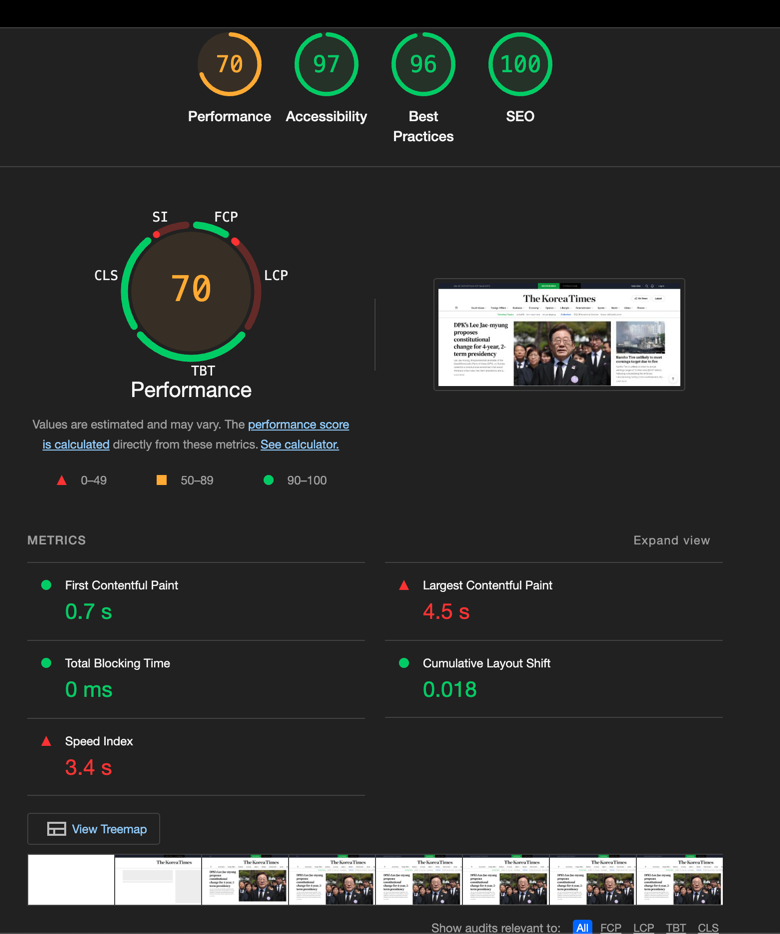

## 들어가며
1부에서 JS 번들 다이어트를 통해 전체 페이지의 무게를 줄이는 작업을 진행했다  
🤔그러나 홈페이지의 성능은 거의 그대로였다.


google Lighthouse 에서 측정 해보면, "왜 느려 보이는지", "어디서 막히는지", "어떻게 개선해야 하는지"를 구체적으로 살펴 볼 수 있다.    
(겁나 친절한데 ..? 👍)

## ⚡ Core Web Vitals

| 지표명 (약어)                           | 설명                       | 일상 비유                             |
| ---------------------------------- | ------------------------ | --------------------------------- |
| **CLS** (Cumulative Layout Shift)  | 화면이 로딩 중 갑자기 밀리거나 이동한 정도 | 버튼을 누르려는데 갑자기 밑으로 밀려서 광고 클릭한 상황 |
| **SI** (Speed Index)               | 화면이 시각적으로 완성되는 속도        | 영화 시작할 때 화면이 빠르게 차오르는 느낌          |
| **FCP** (First Contentful Paint)   | 첫 텍스트나 이미지가 뜨는 시점        | 영화 타이틀이 처음 뜨는 순간                  |
| **LCP** (Largest Contentful Paint) | 메인 이미지나 큰 텍스트가 완전히 보일 때  | 표지부터 다 읽고 본문 읽을 준비 완료             |
| **TBT** (Total Blocking Time)      | JS가 렌더링을 막은 총 시간         | 문 열고 들어가려는데 안에서 JS 처리 중이라 안 열리는 상황 |

## 개선 목표
**✅ CLS (Cumulative Layout Shift)**  
**✅ FCP (First Contentful Paint)**  
**✅ TBT (Total Blocking Time)**  

## 👀 CLS
CLS 의 **핵심** 은 **“보이는 걸 미리 예고하고, 갑자기 바꾸지 않는다”** 이다.

현재 운영중인 사이트에서, CLS 문제는 대부분 이미 알고는 있지만 실전에서 놓치기 쉬운 것들.    
대표적으로 CLS 점수를 깎아 먹는 주요 원인은 Taboola 라는 광고 위젯.  

Taboola는 초기엔 비어 있다가 스크립트 로딩 이후에 콘텐츠가 삽입되는데,  
이때 높이를 미리 잡아두지 않으면 아래 콘텐츠들이 순식간에 밀려나며 CLS가 발생한다.      

> 마치 의자에 앉으려고 했는데, 뒤로 밀려서 엉덩방아 찍은 느낌이다. ( 오늘 일임 )

| 문제 요소                    | 설명                                                                       |
| ------------------------ | ------------------------------------------------------------------------ |
| ❌ 이미지/광고 영역의 크기 미지정      | ``나 광고 `<div>`에 `width`, `height`, 또는 `aspect-ratio`가 없어 로딩 후 밀림 발생 |
| ❌ 비동기 렌더링 컴포넌트           | `dynamic(import(...))`, `<Suspense>` 등을 통해 불쑥 나타나는 컴포넌트로 인해 레이아웃 밀림 발생   |
| ❌ navigation 메뉴/헤더 애니메이션 | fixed 헤더가 transition으로 등장하면서 콘텐츠를 아래로 밀어냄                                |
| ❌ 웹폰트 로딩 지연           | FOIT/FOUT 현상으로 텍스트 표시가 밀려 CLS 유발             |
| ⚠️ 광고/소셜 위젯 로딩 지연        | GPT 광고, Interplay, Taboola 등 외부 위젯이 나중에 등장하면서 전체 구조가 밀림                  |

이런 문제를 해결하는 가장 확실한 방법은, 비동기 렌더링 컴포넌트의 높이를 미리 지정해 콘텐츠의 위치를 예고하는 것이다.

그리고 광고 영역은 Lazy Load로 처리해, 일정 스크롤 이후에 렌더링되도록 하는 것이 핵심 !  

### ❗비동기 렌더링 컴포넌트
비동기 컴포넌트는 렌더링 시점까지 공간을 차지하지 않기 때문에, 아래 콘텐츠가 갑자기 밀려버릴 수 있다.
예를 들어 dynamic(import(...)), <Suspense>로 로딩되는 컴포넌트는 로딩 중에 명확한 높이 또는 placeholder 가 없다면 layout shift 를 유발한다.

외부 컴포넌트(TodayTopStories, 댓글, 추천 콘텐츠 등)는 특히 레벨이 높은 CLS 유발 요인이다. ( 제일 맛도리다. )

```js
import dynamic from "next/dynamic";
import { Skeleton } from "@/components/Skeleton";

// dynamic 컴포넌트 로딩 시 Skeleton 사용
const RelatedStories = dynamic(() => import("./RelatedStories"), {
    ssr: true,
    loading: () => <Skeleton />,
});

// Suspense 사용 시, fallback에 고정 높이 지정
<Suspense fallback={<div style={{ minHeight: 400 }}><Skeleton /></div>}>
    <RelatedStories articleId="abc123" />
</Suspense>

```

> ⚠️ 주의   
> <Skeleton /> 컴포넌트 자체가 min-height 또는 fixed height를 갖지 않는다면 의미가 없다.  
> fallback 은 시각적 장식이 아니라 레이아웃 안정장치라는 점을 명심해야 한다.

## ⏰ Lazy Load
예를 들어 뉴스 기사 하단의 댓글 영역, 추천 콘텐츠, Taboola 광고 등은 반드시 초반에 보여줄 필요가 없다.    

Lazy Load 대상으로 적합하고, 아래는 이를 위한 `LazyShow` 유틸 컴포넌트 예시다.    

```js
"use client";

import { useEffect, useRef, useState } from "react";

interface LazyShowProps {
  children: React.ReactNode;
  rootMargin?: string;
  threshold?: number;
  once?: boolean; // 한번만 보여줄지
}

export const LazyShow = ({ children, rootMargin = "200px", threshold = 0.1, once = true }: LazyShowProps) => {
  const ref = useRef<HTMLDivElement>(null);
  const [isVisible, setIsVisible] = useState(false);

  useEffect(() => {
    if (!ref.current) return;

    if (!("IntersectionObserver" in window)) {
      // Safari 구버전 대비 fallback
      setIsVisible(true);
      return;
    }

    const observer = new IntersectionObserver(
      ([entry]) => {
        if (entry.isIntersecting) {
          setIsVisible(true);
          if (once) {
            observer.disconnect();
          }
        } else if (!once) {
          setIsVisible(false);
        }
      },
      { rootMargin, threshold }
    );

    observer.observe(ref.current);
    return () => observer.disconnect();
  }, [rootMargin, threshold, once]);

  return <div ref={ref}>{isVisible ? children : null}</div>;
};
```

결국 CLS 방지는 “언제 어디서 무엇이 렌더링될지”를 브라우저에게 미리 알려주는 것이다.  
예측 가능한 레이아웃만이 안정적인 사용자 경험을 만든다.  

> **비동기로 로딩되더라도, 언제 어디서 어떤 높이로 들어올지 예고**  
> **중요한 콘텐츠가 아닌경우 Lazy Load !**

## 😶‍🌫️ FCP
FCP는 사용자가 페이지에서 **"첫 번째 콘텐츠(텍스트, 이미지 등)를 보는 순간까지의 시간"** 을 의미한다.  

즉, 페이지가 뜨긴 떴는데 아무것도 안 보이는 상태가 길어질수록 FCP 점수는 나빠진다.    
위쪽 영역(Above the Fold) 콘텐츠를 최대한 빨리 보여주는 것이 핵심 POINT.
( 이미지든 텍스트든, 뭐든간에 첫 화면이 빠르게 보이면 점수가 좋아진다. )

| 문제 요소                   | 설명                                                   |
|-------------------------|------------------------------------------------------|
| ❌ 이미지 용량이 큰 경우          | 상단 이미지를 lazy 처리하면 실제 첫 시각 요소가 늦게 등장함                 |
| ❌ JS 의존형 컴포넌트           | `hydrate` 이후에 렌더링되는 컴포넌트 의 경우, 초기 화면엔 보이지 않음         |
| ❌ 웹폰트 지연 로딩 (FOUT/FOIT) | 커스텀 폰트가 늦게 적용되며 텍스트 위치가 늦게 나타남                       |
| ❌ 초기 데이터 비동기 처리         | `useEffect`에서 데이터 fetch 이후, 첫 화면 렌더링이 지연됨            |
| ❌ 너무 많은 요소 한꺼번에 렌더링     | 초기 화면에서 꼭 보여야 할 핵심 콘텐츠조차 뒤늦게 등장하거나, 렌더링 경쟁에 밀려버리는 문제 |

그런데, CLS 를 처리하면서 FCP 점수도 덩달아 오르는것을 확인할 수 있었다.  
> 많은 요소를 한꺼번에 렌더링하지 않고 사용자가 보는 뷰포트에 맞는 컴포넌트만 랜더링 하기 때문 

FCP 의 경우는 사용자가 처음 보는 콘텐츠가 얼마나 빨리 보이느냐의 문제다.

## 🚫 TBT
BT는 JS가 렌더링을 막고 있는 시간을 말한다.  
코드 스플리팅, 불필요한 JS 제거, 그리고 불필요하게 SSR로 처리되던 인터랙티브한 위젯들 (ex. 댓글, 공유 모듈)

이 문제들을 해결하기 위해, 상단은 SSR 하단은 `LazyShow`, `dynamic(import(...))`을 활용해 랜딩 시점을 뒤로 미루고 나니  

TBT는 **0ms**로 떨어졌다.

## Light House 를 돌려보자



## 추가로 개선 할 부분
이제 남은 성능 요소는 LCP 와 SI 만 남은 상태이다.

