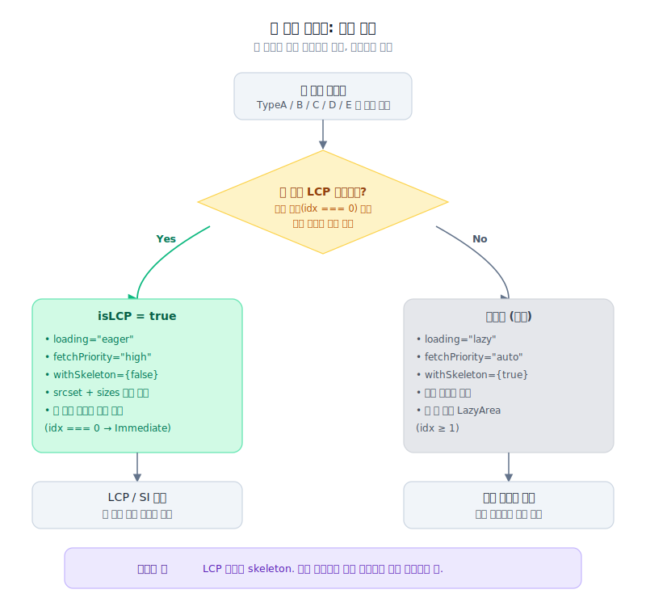

> **TL;DR**
>
> 2부까지 CLS, FCP, TBT는 정리됐습니다.
> 그런데 LCP와 SI는 계속 빨갰어요.
>
> 이미지가 없어서가 아니었습니다.
> 첫 화면에서 가장 중요한 이미지를, 브라우저가 너무 늦게, 너무 평범하게 발견하고 있었습니다.
>
> 그래서 상단을 전부 빠르게 만들지 않았습니다.
> LCP 후보만 `loading="eager"`, `fetchPriority="high"`로 올리고, 나머지는 lazy로 뒤로 보냈어요.
>
> `srcset`만 만든다고 끝나지 않았습니다.
> 브라우저가 실제 레이아웃에 맞는 이미지를 고르도록 `sizes`까지 같이 맞춰야 했어요.

---

## 상단 이미지는 있는데, 왜 LCP가 느릴까요?

뉴스 홈의 LCP 후보는 대부분 상단 기사 이미지입니다.

이미지 lazy loading을 넣었고, 번들도 줄였고, CLS도 잡았습니다.
이쯤 되면 LCP는 자연스럽게 좋아질 거라고 봤어요.

근데 Lighthouse에서는 여전히 LCP와 SI가 빨갰습니다.


이때 질문을 바꿨어요.

> *"이미지를 줄였는가?"가 아니라,*
>
> **"첫 화면에서 제일 중요한 이미지를, 브라우저가 가장 먼저 알고 있는가?"**

홈 상단은 TypeA, TypeB, TypeC, TypeD, TypeE처럼 편집 타입이 계속 바뀝니다.
사람 눈에는 다 "메인 이미지"처럼 보였어요.
코드 안에서는 렌더링 경로가 조금씩 달랐습니다.

어떤 이미지는 skeleton 뒤에 숨어 있었습니다.
어떤 이미지는 lazy 로딩 대상처럼 취급됐고요.
어떤 이미지는 첫 화면 핵심인데도 브라우저 입장에선 그냥 평범한 `` 였습니다.

LCP는 여기서 바로 손해를 봅니다.

브라우저는 사람처럼 "이게 메인 기사구나"라고 판단하지 않아요.
HTML과 속성, 요청 우선순위만 보고 움직이는 거죠.

---

## 그러면 상단 이미지를 전부 eager로 바꾸면 될까요?

처음 떠올릴 수 있는 해결책은 단순합니다.

> "그럼 상단 이미지를 다 eager로 바꾸면 되지 않나?"

실제로 그러면 일부 지표는 좋아집니다.
하지만 뉴스 홈에서는 답이 아니었어요.

상단에는 메인 기사 하나만 있는 게 아닙니다.
옆 기사, 보조 기사, 섹션 카드, 썸네일이 같이 나옵니다.
전부 eager로 바꾸면 초기 네트워크 요청이 한꺼번에 몰리는 거죠.

메인 이미지를 빨리 받으려고 했는데, 주변 이미지까지 같이 뛰어들어서 같은 대역폭을 나눠 쓰게 됩니다.

반대로 전부 lazy로 두면 초기 요청은 줄어듭니다.
대신 LCP 후보까지 같이 늦어져요.

둘 다 틀렸습니다.

그래서 기준을 좁혔어요.



| 구분 | 정책 |
|---|---|
| 홈 상단 메인 기사 이미지 | LCP 후보로 지정 |
| LCP 후보 이미지 | `loading="eager"` |
| LCP 후보 이미지 | `fetchPriority="high"` |
| LCP 후보 skeleton | 끔 |
| 하단/보조 이미지 | `loading="lazy"` |

> 성능 최적화라고 모든 걸 빠르게 만들면 안 됐습니다.
> 처음 보여야 하는 것만 먼저 빠르게 한 거죠.

> **포기한 것**: LCP 후보의 skeleton 표현. 예쁜 대기보다 실제 콘텐츠가 먼저 도착하는 쪽을 택했습니다.

---

## 그러면 이 이미지가 LCP 후보라는 걸 어디서 말해야 할까요?

이미지 컴포넌트에 `isLCP` 옵션을 넣었습니다.

```tsx
<OptimizedImage
  src={article.thumbnail}
  alt={article.pcTitle}
  isLCP={true}
  withSkeleton={false}
/>
```

내부에서 로딩 정책을 갈랐어요.

```tsx

```

이건 속성 두 개를 붙인 작업이 아니었어요.

호출하는 쪽에서 "이 이미지는 첫 화면에서 이겨야 한다"라고 선언하게 만든 겁니다.

이 선언이 없으면 컴포넌트는 항상 애매해집니다.
재사용 가능한 이미지 컴포넌트는 많은 화면에서 쓰여요.
컴포넌트 내부가 혼자서 LCP 후보를 정확히 알 수 없습니다.

> 컴포넌트가 추측하지 못하는 정보를, 호출자가 한 단어로 알려주는 구조.

성능 의도를 props로 드러내야 했어요.

---

## srcset만 넣으면 브라우저가 알아서 잘 고를까요?

처음에는 `srcset`만 만들면 충분하다고 생각했습니다.

```tsx
const srcSet = resolvedWidths
  .map((w) => `${src}?w=${w} ${w}w`)
  .join(", ");
```

하지만 `srcset`은 후보 목록일 뿐이에요.

브라우저가 어떤 후보를 고를지는 `sizes`를 보고 판단합니다.
`sizes`가 실제 레이아웃과 맞지 않으면 너무 큰 이미지를 받기도 하고,
반대로 PC에서 부족한 이미지를 받기도 합니다.

뉴스 홈은 "모바일이면 작게, PC면 크게"가 아니었어요.
상단 모듈이 그리드로 바뀌고, 편집 타입에 따라 이미지 폭이 달라졌습니다.

그래서 viewport별로 예상 렌더 폭을 알려줬어요.

```tsx
const sizes = `
  (max-width: 480px) calc(100vw - 32px),
  (max-width: 768px) calc(100vw - 40px),
  (max-width: 1024px) 768px,
  (max-width: 1440px) 1024px,
  1280px
`;
```

여기서 판단 기준은 화질 하나가 아니었습니다.

너무 작은 이미지를 받으면 다시 큰 이미지를 요청하거나 흐릿하게 보입니다.
너무 큰 이미지를 받으면 LCP 후보가 무거워져요.

> LCP 이미지는 빨리 와야 합니다.
> 단, 틀린 크기로 빨리 오면 다시 손해입니다.

> **포기한 것**: `sizes` 식 자체의 유지보수 부담. 그리드 정책이 바뀔 때마다 같이 손봐야 합니다.

---

## 첫 번째 영역만 즉시 렌더링하면 충분할까요?

홈 상단에는 여러 묶음이 있습니다.
처음 화면에 바로 들어오는 묶음도 있고, 스크롤해야 보는 묶음도 있습니다.

기준을 렌더 순서로 나눴어요.

```tsx
const ImageAreaComponent = idx === 0 ? ImmediateImageArea : LazyImageArea;
```

첫 번째 영역은 즉시 렌더링.
이후 영역은 lazy로 미뤘습니다.

이 결정은 운영 화면에서 더 중요했어요.

뉴스 홈은 편집 상태가 자주 바뀝니다.
오늘은 TypeA가 첫 번째일 수 있고, 내일은 TypeC가 첫 번째일 수 있어요.

그래서 특정 디자인 타입에 성능 규칙을 묶지 않았습니다.
렌더 순서에 묶었어요.

> 첫 번째 영역은 즉시. 이후 영역은 지연.

이렇게 잡아야 편집 타입이 바뀌어도 같은 성능 의도가 유지됩니다.

> **포기한 것**: 첫 번째가 아닌 영역에 정말 중요한 콘텐츠가 들어가는 케이스. 편집상 우연이지만, "렌더 순서 기반" 룰이라 한 박자 늦게 보일 수 있습니다.

---

## SI는 왜 LCP를 따라 움직였을까요?

SI는 화면이 시각적으로 얼마나 빨리 완성되는지를 봅니다.

처음에는 SI를 별도 문제로 봤어요.
애니메이션을 줄이거나, skeleton을 더 자연스럽게 만들면 될 줄 알았습니다.

근데 홈에서는 SI와 LCP가 거의 붙어 있었어요.

상단 이미지가 늦으면 화면이 늦게 완성되어 보입니다.
상단 이미지가 빨리 오면 SI도 같이 움직였어요.

그래서 SI를 빠르게 만드는 일도 결국 렌더 순서 문제로 봤습니다.

1. 상단 기사 텍스트는 먼저 보이게 둔다.
2. LCP 후보 이미지는 lazy 대상에서 제외한다.
3. LCP 후보 이미지는 `fetchPriority="high"`로 올린다.
4. 보조 이미지는 lazy로 뒤로 보낸다.
5. skeleton이 실제 LCP 콘텐츠를 가리지 않게 한다.

여기서 중요한 건 "많이 렌더링"이 아니었어요.

> *사용자가 첫 화면이 완성됐다고 느끼는 요소를 먼저 렌더링하는 일.*

---

## 트레이드오프 정리

| 결정 | 얻은 것 | 포기한 것 |
|---|---|---|
| LCP 후보만 eager + fetchPriority=high | 메인 이미지 우선 수신 | LCP 후보의 skeleton 표현 |
| 나머지 이미지 lazy | 초기 대역폭 보호 | 두 번째 영역 이하 초기 지연 |
| sizes를 viewport별 실측에 맞춤 | 알맞은 해상도 수신 | sizes 식 자체의 유지보수 부담 |
| 정책을 렌더 순서(idx === 0)로 묶음 | 편집 타입 변동에도 안정 | 첫 번째가 아닌 영역의 핵심 콘텐츠는 지연 |

---

## 그런데 기사 본문 이미지는 props로 제어할 수 있을까요?

홈 이미지는 React 컴포넌트라서 `isLCP` 같은 의도를 props로 넘길 수 있었습니다.

기사 상세로 들어가면 얘기가 달라져요.
본문 이미지는 CMS 에디터에서 내려온 HTML 문자열 안에 박혀 있었습니다.

```html
<div class="editor-img-box">
  
  <div class="caption">...</div>
</div>
```

이 이미지는 `OptimizedImage`를 거치지 않습니다.
React props도 없어요.

여기는 다른 방식이 필요했습니다.

HTML 문자열 안의 ``를 읽고,
첫 번째 이미지는 LCP 후보로 올리고,
두 번째 이후 이미지는 lazy로 내리고,
width/height 정보는 CLS 방지에 써야 합니다.

이때부터 작업의 성격이 바뀌었어요.

이미지 컴포넌트를 잘 만드는 문제가 아니라,
CMS에서 내려오는 HTML을 렌더링 전에 성능 친화적인 HTML로 바꾸는 문제가 된 거죠.

> 그런데 그 전에, 더 큰 문제가 보였습니다.

다음 phase에서는 홈 자체를 CSR에서 RSC/SSR 쪽으로 옮기면서
브라우저가 이미지 URL을 더 빨리 알게 만든 과정을 정리합니다.

우선순위를 올리는 것보다, 출발선 자체를 앞으로 옮기는 일이 필요했어요.
