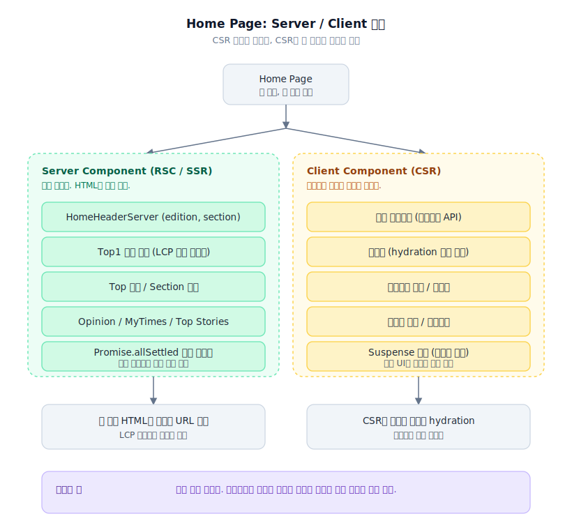

> **TL;DR**
>
> 3부에서 LCP 이미지를 먼저 받게 만들었습니다.
> `loading="eager"`, `fetchPriority="high"`, `srcset`, `sizes`까지 정리했어요.
>
> 그런데 그 정도로는 부족했습니다.
>
> 이미지 URL 자체를 브라우저가 JS 실행 후에야 알게 되면,
> 우선순위를 아무리 줘도 출발선이 늦은 거죠.
>
> 그래서 홈의 첫 화면 공개 콘텐츠를 CSR 조립 구조에서 RSC/SSR 경로로 옮겼습니다.
> 다만 광고, 트래킹, 로그인 처리처럼 브라우저 환경이 필요한 영역은 Client Component로 남겼어요.
>
> CSR을 없애는 게 목표가 아니었습니다.
> CSR이 꼭 필요한 자리만 남기는 일이었어요.

---

## 이미지를 빨리 받게 했는데, 왜 아직 늦을까요?

3부 작업을 끝내고도 찝찝했습니다.

LCP 후보 이미지에 `fetchPriority="high"`를 줬어요.
skeleton도 끄고, 첫 번째 영역도 즉시 렌더링하게 했습니다.

그런데 구조를 다시 보니 더 큰 문제가 있었어요.

브라우저가 그 이미지 URL을 너무 늦게 알고 있었습니다.

CSR 구조에서 순서가 대략 이렇습니다.

1. HTML 받기
2. JS 받기
3. JS 파싱하기
4. React 실행하기
5. API 호출하기
6. 데이터 받아서 화면 만들기
7. 그제야 이미지 요청하기

이러면 `fetchPriority="high"`는 반쪽짜리예요.

브라우저가 아직 어떤 이미지를 받아야 하는지도 모르는데,
"이 이미지는 중요하니까 빨리 받아"라고 말하고 있는 셈입니다.

그래서 질문이 바뀌었어요.

> *"이미지를 어떻게 빨리 요청하게 할까?"가 아니라,*
>
> **"이미지가 포함된 HTML을, 서버에서 먼저 내려줄 수 없을까?"**

알고 보니 이전 작업 대부분은 CSR 위에서 최대한 버티는 작업이었습니다.


---

## 브라우저가 화면을 다 조립하면 무슨 일이 생길까요?

뉴스 홈은 빈 껍데기 위에 카드 몇 개 붙이는 화면이 아니었어요.

헤더, Top1 기사, top 기사 묶음, 섹션 기사, Opinion, MyTimes, Top Stories,
광고, 배너가 한 화면에 들어옵니다.

이걸 전부 브라우저에서 조립하면 비용이 겹칩니다.

JS를 받아야 하고,
React를 실행해야 하고,
데이터를 받아야 하고,
그 뒤에야 이미지 요청이 시작됩니다.

사용자 입장에서는 기다림이 한 번이 아니에요.
화면 껍데기를 기다리고, 데이터 조립을 기다리고, 이미지를 또 기다리는 거죠.

그래서 첫 화면에서 바로 보여야 하는 공개 콘텐츠는 서버에서 먼저 만들기로 했습니다.

```tsx
export const HomePageServer = async ({ mainEdition, searchParams }) => {
  const [topArticlesRes, topStoriesRes] = await Promise.allSettled([
    getTopArticlesServer(mainEdition),
    getTopStoriesServer(),
  ]);

  const topOperatingData =
    topArticlesRes.status === "fulfilled" ? topArticlesRes.value : null;

  return (
    <ServerPageWrapper>
      <h1 className="a11y">The Korea Times</h1>
      <HomeHeaderServer />

      {topOperatingData?.top1 && <Top1Module data={topOperatingData.top1} />}

      {topOperatingData?.top?.map((topArticle) =>
        topArticle.designType === "divider" ? (
          <HomeTopDefault list={topArticle.list} />
        ) : (
          <HomeTopShortForm list={topArticle.list} />
        )
      )}
    </ServerPageWrapper>
  );
};
```

이렇게 하면 브라우저는 빈 HTML을 받고 JS를 기다리는 대신,
처음부터 기사 제목과 이미지가 들어갈 구조를 받습니다.

> LCP 이미지의 출발선이 앞으로 이동한 거죠.

---

## 홈을 전부 Server Component로 바꾸면 될까요?

처음에는 욕심이 났어요.

> "그러면 홈을 전부 서버로 올리면 되는 거 아닌가?"

하지만 홈은 그렇게 단순하지 않았습니다.

광고 스크립트는 브라우저 환경이 필요합니다.
트래킹은 hydration 이후의 사용자 행동과 묶입니다.
로그아웃 처리, 개인화 영역, 일부 인터랙션도 서버에서 밀어붙이면 이상해져요.

그래서 전부 RSC로 바꾸지 않았습니다.



```tsx
<ServerPageWrapper>
  <HomeHeaderServer />
  <Top1Module data={topOperatingData.top1} />

  <ScrollResponsiveContentsServer asideContents={...}>
    <TopAdvertisementClient />
    <HomeTopDefault />
    <HomeSection />
    <BottomAdvertisementClient />
  </ScrollResponsiveContentsServer>

  <ClientTracking />
  <LogoutHandler />
</ServerPageWrapper>
```

서버에서 만들 수 있는 공개 콘텐츠는 서버로 올렸습니다.
브라우저에서만 의미가 있는 부분은 Client Component 경계로 남겼어요.

여기서 트레이드오프가 있었습니다.

서버 렌더링을 늘리면 초기 화면은 빨라질 수 있습니다.
대신 서버가 해야 할 일이 늘어나요.
그리고 클라이언트 상태가 필요한 코드를 잘못 서버로 올리면 운영 버그가 납니다.

> 목표는 "CSR 제거"가 아니었어요.
> CSR이 필요한 자리만 남기는 일이었습니다.

> **포기한 것**: 서버 부담의 증가. 그리고 Client/Server 경계를 잘못 그으면 hydration 이슈가 새로 생깁니다.

---

## Header 하나가 왜 이렇게 중요할까요?

홈 헤더는 로고 하나 있는 영역이 아니었어요.

edition, section menu, trending topic, all section, notice, weather, mobile menu까지 붙어 있었습니다.
그리고 거의 모든 페이지 첫 화면에 나옵니다.

헤더가 클라이언트 실행 이후에야 안정되면,
상단 기사 이미지를 빨리 받아도 화면은 늦게 완성되어 보입니다.

그래서 헤더도 서버에서 만들 수 있는 부분을 분리했어요.

```tsx
<HomeHeaderServer edition={edition} previewMode={previewMode} />
```

모바일 메뉴나 클릭 인터랙션처럼 브라우저 상태가 필요한 부분은 Client Component로 남겼습니다.

이건 화려한 최적화는 아니에요.
하지만 첫 화면에서 브라우저가 조립해야 하는 양을 줄이는 작업이었습니다.

> LCP는 이미지 하나만의 문제가 아니었어요.
> 그 이미지 주변의 레이아웃이 언제 안정되는지도 같이 봐야 했습니다.

---

## API 하나가 실패하면 홈 전체가 죽어도 될까요?

서버에서 데이터를 가져온다고 자동으로 빨라지지는 않습니다.

서버가 API를 순서대로 부르면 병목이 브라우저에서 서버로 옮겨갈 뿐이에요.
그래서 홈 상단에 필요한 데이터는 병렬로 가져왔습니다.

```tsx
const [topArticlesRes, topStoriesRes] = await Promise.allSettled([
  getTopArticlesServer(mainEdition),
  getTopStoriesServer(),
]);
```

여기서 `Promise.all` 대신 `Promise.allSettled`를 쓴 이유가 있었습니다.

Top Stories 하나가 실패했다고 Top1 기사까지 죽으면 안 됩니다.
뉴스 홈에서 가장 중요한 건 첫 화면의 핵심 기사예요.
보조 데이터가 실패해도 핵심 영역은 살아 있어야 합니다.

이건 성능만의 문제가 아니었어요.

> 느린 API 하나가 전체를 늦추면 성능 문제.
> 실패한 API 하나가 전체를 죽이면 운영 문제.

홈에서는 둘 다 같이 봐야 했습니다.

> **포기한 것**: 보조 데이터 실패 시의 UI 처리. fulfilled가 아니면 화면 어디는 비고, 그 빈 자리를 자연스럽게 보이게 하는 작업이 따로 남습니다.

---

## Suspense는 로딩 UI를 예쁘게 만드는 도구일까요?

예전에는 `Suspense`를 로딩 UI 보여주는 도구 정도로 생각했어요.

하지만 RSC로 홈을 나누다 보니,
`Suspense`는 로딩 UI보다 경계에 가까웠습니다.

top 기사, 섹션 기사, 광고, opinion, MyTimes, Top Stories는 같은 속도로 준비되지 않습니다.

전부 한 번에 기다리면 빠른 영역도 늦어집니다.
반대로 너무 잘게 쪼개면 화면이 여기저기서 따로 뜨면서 불안정해 보여요.

그래서 위쪽 영역은 최대한 같이 안정시키고,
스크롤 이후 영역은 늦어도 되는 쪽으로 나눴습니다.

> fallback이 예쁘냐보다 중요한 건,
> 어떤 데이터와 UI를 같은 경계에 둘지였어요.

---

## 트레이드오프 정리

| 결정 | 얻은 것 | 포기한 것 |
|---|---|---|
| 공개 콘텐츠를 RSC/SSR로 이동 | LCP 이미지 출발선 단축 | 서버 부하 증가 |
| 광고/트래킹/로그아웃은 Client 유지 | 브라우저 의존 기능 안정 | Server/Client 경계 설계 비용 |
| `Promise.allSettled` 사용 | 보조 실패가 핵심을 안 죽임 | 부분 실패 UI 별도 처리 |
| Header도 Server 분리 | 첫 화면 안정 시점 앞당김 | 헤더 분리 구조 자체 복잡도 |
| Suspense를 경계로 사용 | 영역별 안정 시점 통제 | 잘못 쪼개면 화면이 튐 |

---

## 서버가 HTML을 만들면, 매번 origin까지 가야 할까요?

CSR에서 RSC/SSR로 옮기면 브라우저가 할 일은 줄어듭니다.

하지만 서버가 매번 HTML을 새로 만들면 문제가 바뀌어요.
브라우저는 편해졌는데 origin이 힘들어집니다.

뉴스 홈과 기사 상세는 반복 조회가 많습니다.
매 요청마다 origin까지 들어오면 RSC/SSR로 얻은 이점이 운영 비용으로 돌아오는 거죠.

그래서 다음 질문이 나왔어요.

> *"서버가 만든 HTML을 CloudFront에 태울 수 없을까?"*

여기서부터는 컴포넌트 최적화가 아니라 캐시 정책 문제가 됩니다.

HTML 요청과 RSC 요청을 구분해야 하고,
로그인/preview 페이지는 캐시하면 안 되고,
redirect를 잘못 캐시하면 사고가 나고,
Next prefetch는 origin 부하를 만들 수 있어요.

다음 phase에서는 이 CloudFront 작업을 정리합니다.
