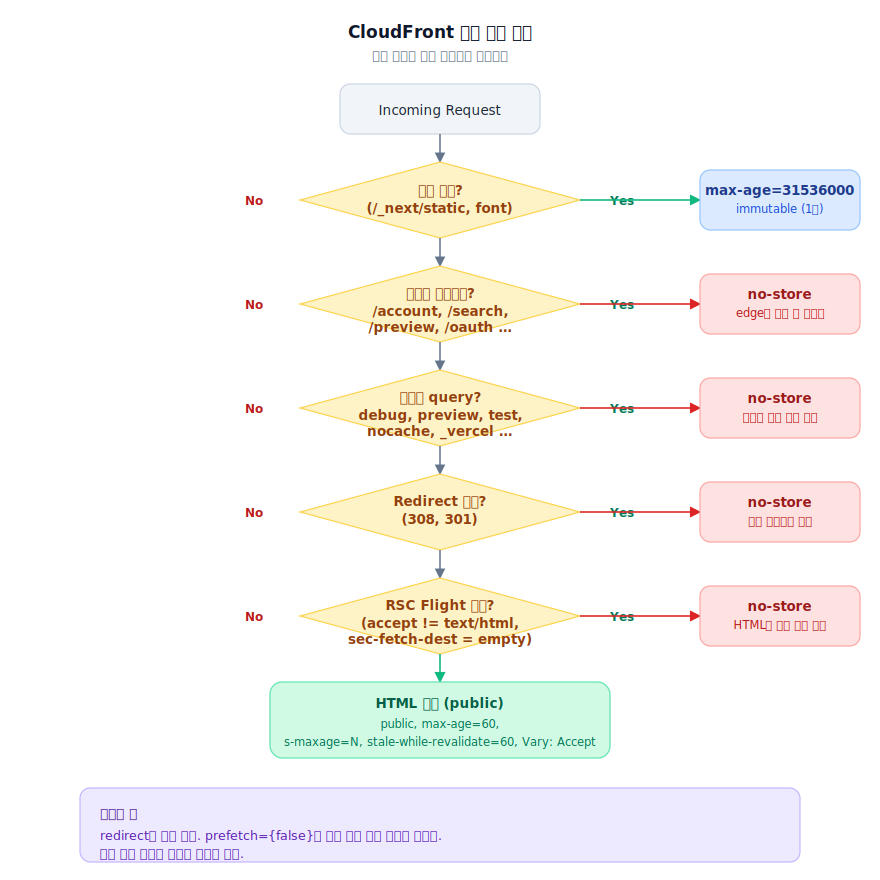

> **TL;DR**
>
> 4부에서 홈을 RSC/SSR로 옮겼습니다.
> 브라우저가 모든 화면을 조립하지 않아도 되게 만들었어요.
>
> 그 다음 문제는 origin이었습니다.
>
> 서버가 만든 HTML을 매번 origin에서 새로 만들면,
> 브라우저 비용을 서버 비용으로 옮긴 셈이 되는 거죠.
>
> 그래서 CloudFront에 공개 HTML을 태웠습니다.
> 다만 cache header만 켠 게 아니었어요.
>
> HTML 요청과 RSC 요청을 나누고,
> `Vary: Accept`를 넣고,
> preview/account/search/redirect/위험한 query는 no-cache로 뺐어요.
> 링크가 많은 뉴스 홈에서는 `prefetch={false}`도 같이 봐야 했습니다.
>
> CloudFront는 빠르게 해주는 장치이면서,
> 틀린 응답을 빠르게 퍼뜨릴 수 있는 장치였어요.

---

## 서버가 만든 HTML, 매번 origin까지 보내야 할까요?

RSC/SSR로 홈을 바꾸고 나면 첫 화면은 빨라질 수 있습니다.
브라우저가 JS를 실행하고 데이터를 조립하기 전에,
서버가 만든 HTML 안에 주요 콘텐츠가 들어오니까요.

그런데 트래픽이 많은 뉴스 홈에서는 바로 다음 문제가 생깁니다.

> *"이 HTML을 매번 origin에서 다시 만들어야 하나?"*

홈, 섹션, 기사 상세는 반복 조회가 많습니다.
한 명이 보는 페이지를 수천 명이 거의 같은 시간에 볼 수 있어요.

RSC/SSR로 브라우저 일을 줄였는데 모든 요청이 origin으로 들어가면,
이번에는 서버가 버티기 어려워집니다.

그래서 CloudFront를 붙이기 시작했습니다.

처음에는 쉽게 봤어요.

정적 파일은 길게 캐시하고,
API는 `no-store`,
HTML은 적당히 `s-maxage` 주면 될 거라고 생각했습니다.

근데 아니었어요.


> CloudFront에서 제일 무서운 건 느린 응답이 아닙니다.
> **틀린 응답이 빠르게 퍼지는 것**이에요.

---

## next.config에 cache header만 넣으면 끝일까요?

정적 파일은 쉽습니다.

```ts
{
  source: "/_next/static/:path*",
  headers: [
    { key: "Cache-Control", value: "public, max-age=31536000, immutable" },
  ],
}
```

빌드 해시가 붙은 파일은 오래 캐시해도 됩니다.
폰트도 성격이 비슷해요.
API는 반대로 `no-store`로 빼면 됩니다.

문제는 HTML이었어요.

Next App Router에서는 같은 URL이라고 해서 항상 같은 성격의 요청이 아닙니다.

주소창에 `/`를 입력해서 들어오는 HTML 요청이 있고,
Next 내부에서 가져가는 RSC Flight 요청이 있고,
prefetch로 생기는 요청도 있습니다.

겉으로는 같은 `/`처럼 보일 수 있어요.
하지만 응답의 의미는 다릅니다.

이걸 CloudFront가 같은 캐시 객체로 보면 사고가 납니다.

그래서 HTML 캐시 정책을 `next.config.mjs`에만 두기 어렵다고 봤어요.
경로와 요청 헤더를 보고 더 세밀하게 나눠야 했습니다.

결국 캐시 판단을 middleware로 내려왔어요.

---

## 같은 URL인데 HTML과 RSC가 섞이면 어떻게 될까요?

처음에는 `_rsc` query를 보면 될 줄 알았습니다.

그런데 Next.js 요청이 middleware까지 들어올 때,
`_rsc` 파라미터만 믿기에는 애매한 케이스가 있었어요.

그래서 query 하나에 기대는 방식은 버렸습니다.
요청 헤더를 같이 봤어요.

```ts
const accept = (request.headers.get("accept") || "").toLowerCase();
const secFetchDest = (request.headers.get("sec-fetch-dest") || "").toLowerCase();

const isRSCRequest =
  !accept.includes("text/html") && secFetchDest === "empty";

if (isRSCRequest) {
  return createNoCacheResponse();
}
```

HTML을 기대하는 요청은 `accept`에 `text/html`이 들어옵니다.
반대로 RSC 쪽 요청은 성격이 달라요.

이 구분을 먼저 한 뒤에야 HTML에 cache header를 줄 수 있었습니다.

```ts
const isHtmlRequest =
  (request.method === "GET" || request.method === "HEAD") &&
  accept.includes("text/html");

if (isHtmlRequest) {
  res.headers.set(
    "Cache-Control",
    `public, max-age=60, s-maxage=${cacheDuration}, stale-while-revalidate=60`
  );
  res.headers.set("Vary", "Accept");
}
```

여기서 `Vary: Accept`도 같이 넣었어요.

같은 URL이라도 `Accept`가 다르면 다른 의미의 응답입니다.
CloudFront가 HTML 요청과 RSC 요청을 같은 것으로 보면 안 됐어요.

이때부터 CloudFront 작업은 "캐시 hit를 높이기"가 아니었습니다.

> 먼저 해야 할 일은,
> 캐시된 응답이 같은 의미의 요청에만 재사용되게 만드는 일이었어요.

---

## 무엇을 캐시하지 말아야 할까요?

처음에는 공개 페이지를 어떻게 캐시할지만 생각했습니다.

홈, 기사 상세, 섹션, 컬렉션.
이런 페이지는 공개 콘텐츠라 CloudFront에 태울 수 있어요.

하지만 실제 운영에서는 반대로 보는 게 더 안전했습니다.

> *"무엇을 캐시하면 안 되지?"*

계정, 검색, preview, 구독, oauth 같은 영역은 사용자 상태나 요청 조건이 섞입니다.
이런 응답이 edge에 들어가면 빠른 게 문제가 아니에요.
틀린 화면이 빠르게 퍼지는 거죠.

그래서 이런 경로는 no-cache로 뺐습니다.

```ts
const NON_CACHE_PREFIXES = [
  "/account",
  "/search",
  "/preview",
  "/subscribe",
  "/login-blocked",
  "/oauth",
];
```

query string도 조심해야 했어요.

`?preview=1`, `?debug=1`, `?test=1`, `?nocache=1`, `?_vercel=...`

이런 요청은 개발, preview, 디버깅, 플랫폼 동작과 엮입니다.
잘못 캐시되면 원인을 찾기 어려워요.

그래서 위험한 query는 아예 no-cache로 돌렸습니다.

```ts
const CACHE_POISON_PARAMS = new Set([
  "debug",
  "preview",
  "test",
  "nocache",
  "cache",
  "admin",
  "dev",
  "_vercel",
]);
```



이건 멋있는 최적화는 아니었습니다.
하지만 운영에서는 이런 판단이 더 중요할 때가 있어요.

> 빠른 오답은 느린 정답보다 위험합니다.

> **포기한 것**: 일부 정상 트래픽까지 no-cache로 묶이는 경우. 정확도를 위해 캐시 히트율을 양보했습니다.

---

## redirect가 캐시되면 왜 무서울까요?

CloudFront 작업에서 제일 찝찝했던 게 redirect였어요.

예를 들어 AMP 경로는 이렇게 보냅니다.

```ts
if (searchParams.get("amp") === "1" && !pathname.startsWith("/amp/")) {
  url.pathname = `/amp${pathname}`;
  searchParams.delete("amp");
  return createNoCacheRedirect(url, 308);
}
```

대문자 path를 소문자로 정규화하는 처리도 있었습니다.

```ts
if (pathname !== pathname.toLowerCase()) {
  url.pathname = pathname.toLowerCase();
  return createNoCacheRedirect(url);
}
```

여기서 301, 308 같은 redirect가 잘못 캐시되면 답이 없어요.

origin 코드를 고쳐도 edge나 브라우저가 예전 redirect를 계속 들고 있을 수 있습니다.
특히 홈이나 기사 상세처럼 트래픽 큰 경로에서 이러면 장애처럼 보입니다.

그래서 redirect는 전부 no-cache로 뺐어요.

```ts
function createNoCacheRedirect(url: URL, status = 308) {
  const res = NextResponse.redirect(url, status);
  res.headers.set("Cache-Control", "no-store, no-cache, must-revalidate");
  return res;
}
```

여기서는 성능을 조금 포기했습니다.

> redirect를 빠르게 캐시하는 이점보다,
> 잘못된 redirect가 퍼졌을 때의 비용이 훨씬 컸어요.

> **포기한 것**: redirect 응답의 캐시 이점. 308/301 모두 매 요청 origin까지 가지만, 사고 위험을 막는 쪽으로 잡았습니다.

---

## prefetch가 왜 origin을 두 번 때릴까요?

Next의 `Link` prefetch는 원래 좋은 기능입니다.

사용자가 클릭하기 전에 미리 받아두니,
클릭했을 때 빠르게 넘어갈 수 있어요.

하지만 뉴스 홈에서는 문제가 됐습니다.

홈에는 링크가 너무 많아요.
기사 링크, 섹션 링크, 컬렉션 링크, Top Stories, Trending Topic, Opinion, Darkroom이 한 화면에 같이 있습니다.

사용자가 클릭하지도 않은 링크들이 prefetch를 만들고,
그 요청이 RSC/Flight 쪽으로 origin을 깨웠어요.

더 문제는 이 요청들이 CloudFront HTML cache hit으로 해결되는 성격이 아니라는 점이었습니다.

사용자가 클릭도 안 했는데 서버를 한 번 치고,
실제로 클릭하면 또 한 번 치는 구조가 나올 수 있었어요.

그래서 주요 링크에는 `prefetch={false}`를 넣었습니다.

```tsx
<Link href={articleUrl} prefetch={false}>
  {title}
</Link>
```

손해도 있었어요.

prefetch를 끄면 실제 클릭 순간에 미리 받아둔 이점은 줄어듭니다.
하지만 이 화면에서는 그 이점보다 origin 부하와 캐시 오염 가능성이 더 컸어요.

> 사용자가 읽지도 않을 수십 개 페이지를 미리 준비하는 게 오히려 손해.

이건 Next 기능을 끈 게 아니라,
CloudFront 캐시 전략에 맞게 링크 동작을 조정한 거죠.

> **포기한 것**: prefetch로 얻는 체감 속도. 링크 밀집 화면에서는 prefetch가 origin을 두 번 때릴 수 있어 끄는 게 더 맞았습니다.

---

## 압축은 Next가 해야 할까요, CloudFront가 해야 할까요?

초반에는 Webpack 쪽에서 CompressionPlugin으로 gzip/brotli를 만들 생각도 했습니다.

하지만 CloudFront가 이미 edge에서 압축을 처리할 수 있었어요.

그러면 애플리케이션 빌드 단계에서 압축 파일을 또 만들 필요가 없습니다.
오히려 빌드 산출물과 배포 경로만 복잡해져요.

그래서 CompressionPlugin은 제거했습니다.

성능 작업을 하다 보면 자꾸 뭔가를 더 붙이고 싶어집니다.
하지만 이 경우에는 빼는 게 맞았어요.

> CloudFront가 잘하는 일은 CloudFront에 맡기고,
> Next build는 화면을 만드는 일에 집중시키는 쪽이 더 단순했어요.

---

## 트레이드오프 정리

| 결정 | 얻은 것 | 포기한 것 |
|---|---|---|
| HTML과 RSC 분리, `Vary: Accept` | 같은 객체 오용 방지 | middleware 분기 복잡도 증가 |
| 위험 경로/query no-cache | 빠른 오답 차단 | 일부 정상 트래픽 캐시 못 함 |
| Redirect no-cache | 잘못된 redirect 전파 방지 | redirect 응답 매번 origin |
| 주요 링크 `prefetch={false}` | origin 부하·캐시 오염 감소 | 클릭 시 미리 받는 이점 줄어듦 |
| CompressionPlugin 제거 | 빌드 단순화 | 빌드 산출물 자체 압축 옵션 잃음 |

---

## 최신성과 캐시 사이에서는 무엇을 포기했을까요?

뉴스 사이트에서 캐시는 항상 애매합니다.

너무 짧게 잡으면 CloudFront를 붙인 의미가 줄어들어요.
너무 길게 잡으면 빠르긴 한데 낡은 뉴스가 보일 수 있습니다.

그래서 모든 HTML에 같은 TTL을 주지 않았어요.

홈, 섹션, 기사 상세는 성격이 다릅니다.
홈과 섹션은 자주 바뀌고,
기사 상세는 상대적으로 덜 바뀌지만 수정 가능성은 있어요.

브라우저에는 짧게,
CloudFront에는 페이지 성격에 맞게,
갱신 중에는 `stale-while-revalidate`로 버티게 했습니다.

```ts
Cache-Control:
  public,
  max-age=60,
  s-maxage=${cacheDuration},
  stale-while-revalidate=60
```

> 이게 모든 뉴스 서비스의 정답이라는 뜻은 아닙니다.

이 서비스에서는 "항상 origin을 치는 구조"와 "오래된 HTML을 너무 오래 들고 있는 구조" 사이에서 이 정도가 현실적인 타협점이었어요.

CloudFront 작업을 끝내고 나니 분명해졌습니다.

> 프론트엔드 성능 최적화는 컴포넌트 코드만의 문제가 아니었어요.
> 브라우저, Next 서버, CloudFront, origin 사이에서
> 어떤 응답을 어디까지 재사용할지 정하는 일이었습니다.

다음 phase에서는 기사 상세 본문으로 넘어갑니다.
홈 이미지는 React 컴포넌트에서 제어할 수 있었지만,
기사 본문 이미지는 CMS HTML 문자열 안에 들어 있었어요.
