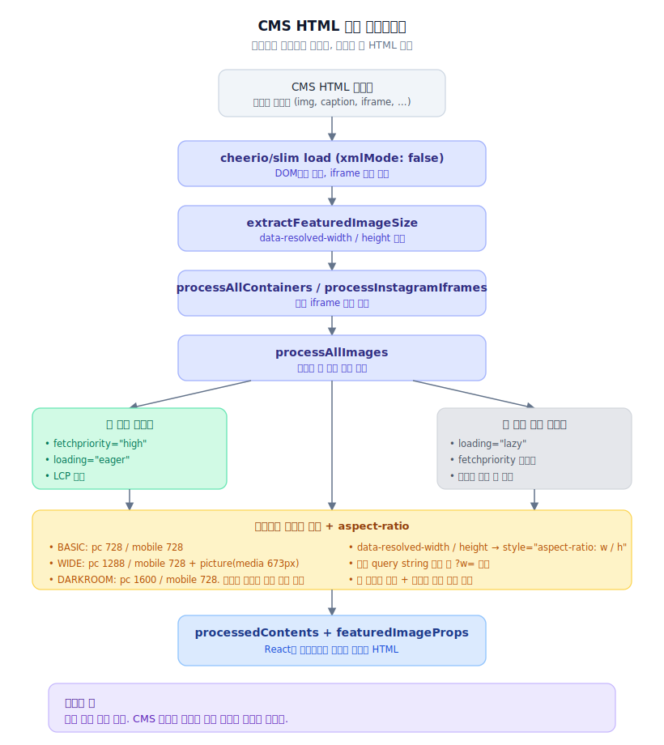

> **TL;DR**
>
> 홈 이미지는 React 컴포넌트라서 `isLCP`, `fetchPriority`, `sizes` 같은 의도를 props로 줄 수 있었습니다.
>
> 기사 상세는 달랐어요.
> 본문 이미지는 CMS 에디터가 만든 HTML 문자열 안에 있었습니다.
>
> 그래서 React 컴포넌트를 고치는 방식으로는 부족했어요.
> 렌더링 전에 CMS HTML을 Cheerio로 읽고,
> 첫 번째 이미지는 LCP 후보로 올리고,
> 두 번째 이후 이미지는 lazy로 내리고,
> `data-resolved-width/height`는 `aspect-ratio`로 바꿨습니다.
>
> 템플릿별로 `BASIC`, `WIDE`, `DARKROOM` 이미지 정책도 나눴어요.
> JSDOM은 무거워서 Cheerio/slim으로 바꿨고,
> iframe 깨짐 때문에 `xmlMode: false`를 명시했습니다.

---

## React 컴포넌트가 아닌 이미지는 어떻게 최적화할까요?

5부까지 오면서 홈 화면은 어느 정도 정리됐습니다.

상단 이미지는 `OptimizedImage`로 제어할 수 있었고,
RSC로 첫 화면 HTML도 더 빨리 내려줄 수 있었고,
CloudFront로 공개 HTML을 edge에 태우는 구조도 잡았어요.

그런데 기사 상세로 들어가면 이야기가 달라집니다.

홈 이미지는 React 컴포넌트였어요.

```tsx
<OptimizedImage isLCP withSkeleton={false} />
```

props를 넘기면 됩니다.

하지만 기사 본문 이미지는 컴포넌트가 아니었어요.
CMS 에디터에서 내려온 HTML 문자열 안에 ``가 박혀 있었습니다.

```html
<div class="editor-img-box">
  
  <div class="caption">...</div>
</div>
```

이걸 보고 바로 알았어요.

> *여기는 컴포넌트 최적화로 안 됩니다.*


---

## CMS HTML을 그대로 렌더링하면 뭐가 터질까요?

기사 본문은 에디터에서 만든 HTML입니다.

이미지, caption, iframe, float 이미지, 이상한 wrapper가 같이 들어옵니다.
그대로 렌더링하면 구현은 편해요.

하지만 성능 관점에서는 문제가 많았어요.

- 첫 번째 본문 이미지가 LCP 후보일 수 있다.
- width/height 정보가 없으면 CLS가 난다.
- 두 번째 이후 이미지는 lazy로 내려야 한다.
- basic, wide, darkroom 템플릿마다 적정 이미지 너비가 다르다.
- 기존 query string이 붙은 이미지 URL은 정리해야 한다.
- Instagram iframe 같은 외부 요소도 높이를 잡아줘야 한다.

즉, CMS HTML은 화면에 넣기 전에 한 번 가공해야 했습니다.

그래서 기사 본문 처리 파이프라인을 만들었어요.



```ts
export function processDefaultContent(props: ProcessContentProps): ProcessContentReturn {
  const { contents, featuredImage, imageSizeData, pageType, templateType } = props;

  const $ = load(contents, { xmlMode: false, decodeEntities: false }, false);

  removeWriterElement($);

  const extractedSize = extractFeaturedImageSize($, featuredImage);
  const finalImageSize = imageSizeData || extractedSize;

  const images = extractImages($);

  processAllContainers($, pageType, templateType);
  processInstagramIframes($);
  processAllImages($, pageType, templateType);

  const featuredImageProps = buildFeaturedImageProps(
    featuredImage,
    finalImageSize,
    pageType,
    templateType
  );

  return {
    processedContents: $.html(),
    images,
    featuredImageProps,
    featuredImageSize: extractedSize,
  };
}
```

여기서 중요한 건 문자열 치환으로 때우지 않았다는 점이에요.

Cheerio로 HTML을 DOM처럼 읽고,
필요한 노드만 바꿨습니다.

---

## 첫 번째 본문 이미지는 왜 따로 봐야 할까요?

기사 상세에서 첫 번째 본문 이미지는 LCP 후보가 될 수 있습니다.

홈에서 이미 겪었어요.
첫 화면 핵심 이미지를 lazy로 밀어버리면 LCP가 바로 손해 봅니다.

그래서 본문 이미지도 첫 번째와 나머지를 나눴어요.

첫 번째 이미지에는 `fetchpriority="high"`와 `loading="eager"`를 줍니다.
두 번째 이후 이미지는 `loading="lazy"`로 내려요.

테스트도 이 기준으로 잡았습니다.

```ts
it("첫 번째 이미지에 fetchpriority=high를 설정해야 한다", () => {
  const result = processDefaultContent({
    contents: ``,
    pageType: ARTICLE_DETAIL_PAGE_TYPE.DEFAULT,
  });

  expect(result.processedContents).toContain('fetchpriority="high"');
  expect(result.processedContents).toContain('loading="eager"');
});

it("두 번째 이후 이미지는 lazy loading을 설정해야 한다", () => {
  const result = processDefaultContent({
    contents: `
      
      
    `,
    pageType: ARTICLE_DETAIL_PAGE_TYPE.DEFAULT,
  });

  expect(result.processedContents).toContain('loading="lazy"');
});
```

이 테스트가 없으면 나중에 누군가 본문 처리 로직을 고치다가
첫 번째 이미지까지 lazy로 밀어버릴 수 있어요.

> 성능 작업에서 무서운 건 한 번 빠르게 만드는 게 아닙니다.
> 빨라진 상태가 리팩터링 한 번에 조용히 깨지는 거죠.

---

## BASIC, WIDE, DARKROOM 이미지는 같은 크기로 받아도 될까요?

기사 상세는 레이아웃이 하나가 아니었습니다.

기본 기사, 와이드 기사, 다크룸 기사에서 이미지가 차지하는 폭이 달랐어요.
그런데 같은 원본 이미지를 같은 width로 요청하면 둘 중 하나가 손해입니다.

모바일에서는 불필요하게 큰 이미지를 받을 수 있어요.
PC에서는 너무 작은 이미지가 흐릿하게 보일 수 있습니다.

그래서 이미지 정책을 따로 뺐어요.

```ts
export const IMAGE_POLICY = {
  BASIC: {
    pc: 728,
    mobile: 728,
    mobileQuery: 673,
  },
  WIDE: {
    pc: 1288,
    mobile: 728,
    mobileQuery: 673,
  },
  DARKROOM: {
    pc: 1600,
    mobile: 728,
    mobileQuery: 673,
  },
} as const;
```

템플릿 타입과 페이지 타입을 보고 정책을 고르게 했습니다.

```ts
export function resolvePolicy(pageType?: ArticleDetailPageType, templateType?: ArticleViewTemplateType): Policy {
  if (pageType && PAGE_TYPE_MAP[pageType]) {
    return IMAGE_POLICY[PAGE_TYPE_MAP[pageType]!];
  }

  if (templateType && TEMPLATE_TYPE_MAP[templateType]) {
    return IMAGE_POLICY[TEMPLATE_TYPE_MAP[templateType]!];
  }

  return IMAGE_POLICY.BASIC;
}
```

여기서도 예외가 있었어요.

원본 이미지가 정책보다 작은데 억지로 1288, 1600을 요청하면 의미가 없습니다.
이미 없는 픽셀을 키워서 받을 뿐이에요.

그래서 원본 크기도 같이 봤습니다.

```ts
export function calculateImageConfig(originalWidth: number | null, policy: Policy): ImageConfig {
  const needsMobileSource = policy.pc !== policy.mobile;

  if (!originalWidth) {
    return {
      pcWidth: policy.pc,
      mobileWidth: policy.mobile,
      isSmall: false,
      needsMobileSource,
    };
  }

  if (originalWidth <= policy.mobile) {
    return {
      pcWidth: originalWidth,
      mobileWidth: originalWidth,
      isSmall: true,
      needsMobileSource: false,
    };
  }

  if (originalWidth <= policy.pc) {
    return {
      pcWidth: originalWidth,
      mobileWidth: policy.mobile,
      isSmall: true,
      needsMobileSource,
    };
  }

  return {
    pcWidth: policy.pc,
    mobileWidth: policy.mobile,
    isSmall: false,
    needsMobileSource,
  };
}
```

이미지 최적화는 무작정 줄이는 일도 아니었어요.
큰 이미지만 주는 일도 아니었습니다.

> 원본 크기, 기사 템플릿, 모바일 분기를 같이 보는 문제.

> **포기한 것**: 정책 매트릭스 관리 비용. 템플릿이 늘어날 때마다 IMAGE_POLICY 표가 같이 늘어납니다.

---

## width와 height가 있으면 어디에 써야 할까요?

본문 이미지에는 `data-resolved-width`, `data-resolved-height`가 들어오는 경우가 있었습니다.

이 값이 있으면 버리면 안 됩니다.
CLS를 막는 데 쓸 수 있어요.

그래서 가공 과정에서 `aspect-ratio`를 넣었습니다.

```ts
it("data-resolved-width와 height가 있으면 aspect-ratio를 설정해야 한다", () => {
  const result = processDefaultContent({
    contents: ``,
    pageType: ARTICLE_DETAIL_PAGE_TYPE.DEFAULT,
  });

  expect(result.processedContents).toContain("aspect-ratio: 800 / 600");
});
```

그리고 wide, darkroom 같은 템플릿은 모바일 source를 따로 둬야 했어요.

```ts
it("WIDE 템플릿은 673px 이하에서 728px source를 가져야 한다", () => {
  const result = processDefaultContent({
    contents: largeImageHTML,
    pageType: ARTICLE_DETAIL_PAGE_TYPE.DEFAULT,
    templateType: ARTICLE_VIEW_TEMPLATE_TYPE.WIDE,
  });

  expect(result.processedContents).toContain('media="(max-width: 673px)"');
  expect(result.processedContents).toContain("srcset=");
  expect(result.processedContents).toContain("?w=728");
});
```

필요한 경우 본문 이미지를 `<picture>` 구조로 감쌌습니다.

코드는 조금 귀찮아졌어요.
하지만 이 귀찮음은 필요했습니다.

CMS 에디터에서 내려오는 HTML은 매번 사람이 손으로 맞출 수 없어요.
렌더링 전에 정리해두지 않으면 기사마다 다른 성능 문제가 계속 튀어나옵니다.

---

## JSDOM이 편한데, 왜 Cheerio로 바꿨을까요?

처음부터 Cheerio로 간 건 아니었습니다.

본문 HTML을 다루려면 JSDOM을 떠올리기 쉽습니다.
브라우저 DOM처럼 다룰 수 있으니까요.

하지만 서버 렌더링 경로에서 매번 기사 본문을 처리해야 한다면 얘기가 다릅니다.

JSDOM은 기능이 많은 만큼 무거워요.
standalone 빌드나 서버 환경에서 불필요한 의존성이 따라붙을 수 있었습니다.

그래서 결국 Cheerio, 그것도 `cheerio/slim` 쪽으로 옮겼어요.

```ts
const $ = load(contents, { xmlMode: false, decodeEntities: false }, false);
```

`xmlMode: false`도 일부러 넣었습니다.

한 번은 iframe이 self-closing처럼 처리되면서 HTML이 깨지는 문제가 있었어요.
HTML의 iframe은 void element가 아니라서 `<iframe />`처럼 닫히면 안 됩니다.

> 성능 최적화라고 하면 거창한 것만 떠올리기 쉽습니다.
> 하지만 실제 렌더링에서는 이런 작은 파서 옵션 하나가 화면 문제로 이어졌어요.

파서는 가볍게 가져가되,
HTML 문서로 해석되게 명시했습니다.

> **포기한 것**: JSDOM이 주는 풍부한 브라우저 API. 일부 헬퍼는 직접 구현해야 합니다.

---

## 테스트를 왜 이렇게 많이 깔았을까요?

이 작업은 눈으로만 확인하면 위험했어요.

기사 본문 HTML은 케이스가 너무 많았습니다.

- 이미지가 하나만 있는 기사
- 이미지가 여러 개인 기사
- 원본 이미지가 정책보다 작은 기사
- wide 템플릿
- darkroom 템플릿
- 기존 query string이 붙은 이미지
- width/height 정보가 없는 이미지
- iframe이 섞인 기사

그래서 테스트를 촘촘히 뒀어요.

`?w=`가 붙는지,
기존 query string이 제거되는지,
BASIC은 728px로 가는지,
WIDE는 1288px로 가는지,
DARKROOM은 원본이 더 작으면 원본 크기를 쓰는지 확인했습니다.

```ts
it("기존 쿼리스트링은 제거되어야 한다", () => {
  const result = processDefaultContent({
    contents: ``,
    pageType: ARTICLE_DETAIL_PAGE_TYPE.DEFAULT,
  });

  expect(result.processedContents).not.toContain("existing=param");
});
```

테스트의 목적은 점수를 올리는 게 아니었어요.

> 누군가 리팩터링하다가 LCP, CLS, 모바일 이미지 정책을 한 번에 깨뜨리지 못하게 막는 일.

퍼포먼스 작업은 한 번 좋아졌다고 끝나지 않습니다.
좋아진 상태를 유지할 장치가 있어야 해요.

---

## 트레이드오프 정리

| 결정 | 얻은 것 | 포기한 것 |
|---|---|---|
| Cheerio로 HTML 가공 파이프라인화 | 케이스 다양성 흡수 | 서버 가공 비용 증가 |
| 첫 이미지 eager / 이후 lazy | LCP 후보 안정 | 첫 이미지 분기 로직 |
| `aspect-ratio` 적용 | CLS 방지 | width/height 누락 본문 케이스 별도 처리 |
| BASIC/WIDE/DARKROOM 정책 분리 | 템플릿별 최적 폭 | 정책 매트릭스 관리 |
| `cheerio/slim` + `xmlMode: false` | 가벼움 + iframe 안전 | JSDOM 헬퍼 직접 구현 |
| 촘촘한 회귀 테스트 | 빨라진 상태가 유지됨 | 테스트 면적 증가 |

---

## 결국 무엇이 달라졌을까요?

홈에서는 이미지 컴포넌트를 고치면 됐어요.

하지만 기사 상세에서는 CMS HTML 문자열을 렌더링 전에 바꿔야 했습니다.

첫 번째 이미지는 LCP 후보로 보고,
두 번째 이후 이미지는 lazy로 내리고,
width/height가 있으면 `aspect-ratio`로 CLS를 막고,
템플릿마다 `BASIC`, `WIDE`, `DARKROOM` 이미지 정책을 다르게 적용했어요.

그리고 JSDOM 대신 Cheerio로 바꿔서 서버 처리 비용도 줄였습니다.

이 단계까지 오니 성능 최적화가 진짜 귀찮은 일이 됐어요.

처음에는 번들 줄이고 이미지 lazy하면 될 줄 알았습니다.
하지만 실제 서비스에서는 홈, 기사 상세, CMS, 광고, CloudFront, RSC, Google 검색 요구사항이 다 엮였어요.

> 하나만 고치면 끝나는 게 아니라,
> 각 영역에서 계속 나눠야 했습니다.

처음 보여야 하는 것.
늦어도 되는 것.
캐시해도 되는 것.
캐시되면 안 되는 것.

프론트엔드 성능 최적화는 Lighthouse 점수를 맞추는 일이 아니었어요.
사용자가 실제로 보는 화면이 언제, 어떤 순서로, 얼마나 안정적으로 완성되는지 계속 쪼개서 보는 일이었습니다.
