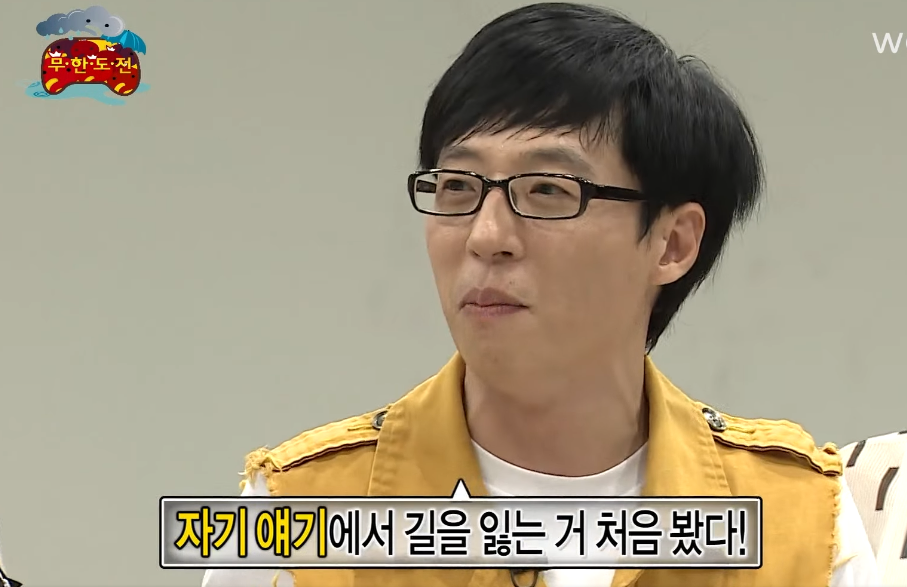

## 배경

처음엔 제공된 구조를 그대로 신뢰했지만,   
E2E 테스트를 진행하며, 인프라가 자동으로 기동되는 문제를 발견했다.  

테스트 실행 제어권이 모듈 경계를 넘어선다는 느낌을 받았고,  
ai 에게 설정을 명시적으로 로딩하도록 수정을 요청했다.

제공된 testFixtures 설정은 다음과 같다.

@Configuration과 companion object init을 사용하여,  
테스트 실행 시 자동으로 컨테이너를 기동하도록 구성하도록.  

그러나 이방식이 테스트 인프라의 제어권을 잃게 만들고,  
명시적 의존성 선언 원칙에 어긋난다고 생각했다.  

@TestConfiguration + @Import 방식으로 변경해  
필요한 테스트에서만 컨테이너를 기동하도록 구조를 개선하려 했으나.

> 점차 뭣이 중헌지를 잃고 미아가 되고 있었다.  
> 즉, 컨텍스트 미아.

## 무엇이 문제였나?

### 환경 문제를 코드 문제로 오해했다.
시작은 단순한 E2E 테스트 실패,  

회원가입 E2E 테스트를 실행했는데 다음과 같은 에러가 발생했다.

`Could not find a valid Docker environment`

Testcontainers가 Docker에 연결하지 못한다는 메시지였다. - 클선생

그런데 이상한 점이 있었다.

`curl --unix-socket /var/run/docker.sock http://localhost/info` - ㅇㅇ 클선생..

이 명령은 정상적으로 응답을 반환했다.  
Docker CLI도 문제없이 동작했다.

> Docker는 정상인데, Testcontainers만 실패한다?  
> 이 지점에서 나는 `관성적으로` “코드 문제” 인가...?

---

## 문제의 범위

처음에는 아래와 부분을 의심했다.

- Testcontainers 설정 문제
- `@Configuration` eager initialization
- `System.setProperty` 타이밍
- 의존성 충돌
    

그래서 멍하니, 운전대를 클선생에게 맡겨버렸다.   
클선생은 아래와 같은 수정을 시도했다.

- `@Configuration` -> `@TestConfiguration`
    
- `companion object eager start()` -> `by lazy`
    
- `System.setProperty` 제거
    
- `@Container + @DynamicPropertySource` 전환
    
- docker-java 버전 강제 업그레이드
    
- Testcontainers 버전 변경

결과는?

> 변경된 파일 : 22 files changed.  
> 현재시각 : AM 5시

이 시점에서 깨달았다.

> “조졌구나. 문제를 해결하고 있는 게 아니라, 문제를 키우고 있구나.”

---

## 환경 문제 vs 코드 문제

진짜 원인은 Docker Desktop 의 버전 문제.

- Docker Desktop 29.1.2
- Engine API 1.52
- docker-java 3.4.x

Testcontainers는 내부적으로 `/info` API를 호출해 Docker 환경을 검증한다.  

그리고 CLI는 정상 동작했지만, docker-java는 API negotiation 과정에서 유효한 응답으로 판단하지 못했다.

> CLI 정상 != 라이브러리 정상

## BOM을 믿자

아직도 정신 못차리고, docker-java를 수동으로 업그레이드했다.

`testImplementation("com.github.docker-java:docker-java-api:3.5.1")`

Spring Boot는 BOM으로 의존성을 관리한다.  
하위 라이브러리를 수동 override하면 의존성 트리가 깨질 수 있다.

> BOM이 관리하는 버전을 신뢰하자.

---

## Testcontainers는 “한 방식”만 써야 한다

우리 `( 빈사 상태의 내 자신과, 클선생 )` 는 이런 상태까지 갔다.
- `@TestConfiguration`
- `@Container`
- `System.setProperty`
- `withReuse(true)`
- testFixtures 방식
    
좋은 취지 인것은 알겠다.   
하지만 좀더 복잡한 문제로 가고 있었다.

Testcontainers는 패턴을 단일화해야 한다.

`@Container + @DynamicPropertySource` 조합만 써야되나 ..?
   
> 머릿속 어딘가에서, "TestContainer 담에 공부하고.  
> 이 길이 아닌것 같다" 라는 생각이 들었다.  
> 
> 이윽고, 새별 6시.   
> 
> 그래. 손절하자.   
> 
> 롤백을 강행했다.
---

## 가장 큰 배움인, AI를 멈추는 타이밍

허무하게도, 조금만 플래닝을 다르게 설정하면.  
Docker DeskTop 버전 문제임을 빠르게 알 수 있었고.  

DownGrade (28v) 를 진행하니 무슨 문제였는지 기억조차 흐려질 정도로 빠르게 해결되었다.  

이번 ai 와 협업 경험에서 제일 큰 교훈은 다음과 같다.

AI는 가능한 모든 해결책을 시도한다.  
그리고 점점 더 많은 파일을 수정한다.

하지만 개발자의 역할은 다르다.

> “이 수정은 과한가?”  
> “문제의 범위를 벗어나고 있지 않은가?”

그 질문을 던지고 멈추는 것이 더 중요했다.

> 잘못된 플래닝으로 부터 시작해서   
> Ai 에게 가스라이팅 을 할게 아니라,   
> 올바른 판단을 할 수 있도록 이끌어야 한다.
> 
> 그렇지 않으면, 파급력을 감당 할 수 없게 된다.

---

## 잘못된, 문제 해결의 순서

이번 삽질(?)을 통해 정리한 순서

1. 환경 확인 (`docker info`)    
2. 네트워크/소켓 직접 테스트
3. 라이브러리 버전 확인
4. 그 다음에 코드 수정

나는 4번부터 시작했다.  

> 플래닝을 1번부터 출발하게끔 통제 할것.  
> `의도와 달리 모호한 답변` 이 나오지 않고, `의도대로 조율` 하게 된다면.  
>
>  통제 성공.

---

## 결론

Docker 버전 이슈 문제가 아니라,  
현대의 개발 시장에서, AI와 협업하며 겪을 수 있는 다양한 이슈를 동시에 경험한 케이스였다.

- Spring 초기화 순서
- Testcontainers 공식 패턴
- Docker API negotiation
- BOM 의존성 관리
- 환경 문제 vs 코드 문제 구분
- AI 통제 능력
    

> 기술 스택보다 더 중요한 건,  
> 문제의 범위를 정확히 정의하는 능력이라는 걸 배웠다.

---

> **TL;DR**  
> Docker 연결 실패처럼 보였던 문제는 코드가 아니라 환경(API negotiation) 이슈였다.  
> 이 과정을 통해 Spring 초기화 순서, Testcontainers 공식 패턴, BOM 의존성 관리,   
>
> 그리고 “AI를 멈추는 판단”의 중요성을 배웠다.

---

### 다음에는

- Integration과 E2E를 어떻게 구조적으로 분리할 것인가?
- Testcontainers 공통 베이스를 만들 것인가?
- CI 환경에서 Docker 전략은 어떻게 가져갈 것인가?
    
를 정리해보고 싶다.